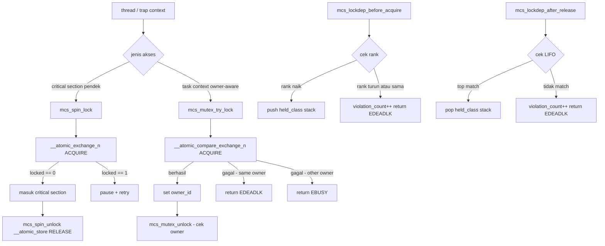

# Sinkronisasi Kernel Awal: Spinlock, Mutex Kooperatif, Lock-Order Validator, dan Diagnosis Race/Deadlock pada MCSOS

**Nama file laporan:** `laporan_praktikum_M12_Cacing_Naga.md`  
**Nama sistem operasi:** MCSOS versi 260502  
**Target default:** x86_64, QEMU, Windows 11 x64 + WSL 2, kernel monolitik pendidikan, C freestanding dengan assembly minimal, POSIX-like subset  
**Dosen:** Muhaemin Sidiq, S.Pd., M.Pd.  
**Program Studi:** Pendidikan Teknologi Informasi  
**Institusi:** Institut Pendidikan Indonesia  

> Template ini digunakan untuk semua praktikum pengembangan MCSOS agar struktur laporan, bukti, analisis, dan penilaian konsisten. Laporan ini tidak mengklaim hasil "tanpa error", "siap produksi", atau "aman sepenuhnya". Status yang diklaim adalah "siap uji QEMU untuk sinkronisasi kernel awal single-core menuju SMP" sesuai evidence yang tersedia.

---

## 0. Metadata Laporan

| Atribut | Isi |
|---|---|
| Kode praktikum | M12 |
| Judul praktikum | Sinkronisasi Kernel Awal: Spinlock, Mutex Kooperatif, Lock-Order Validator, dan Diagnosis Race/Deadlock pada MCSOS |
| Jenis pengerjaan | Kelompok |
| Nama mahasiswa | Moch Fariel Aurizki |
| Nama mahasiswa | Mikail Khairu Rahman |
| NIM | 25832072007 |
| NIM | 25832073005 |
| Kelas | PTI 1A |
| Nama kelompok | Cacing Naga |
| Anggota kelompok | Fariel, implementasi / pengujian |
| Anggota kelompok | Mikail, implementasi / dokumentasi |
| Tanggal praktikum | 2026-06-07 |
| Tanggal pengumpulan | 2026-06-07 |
| Repository | ~/src/mcsos |
| Branch | praktikum/m12-sync |
| Commit awal | `f237d96` |
| Commit akhir | `b26da47` |
| Status readiness yang diklaim | siap uji QEMU untuk sinkronisasi kernel awal single-core menuju SMP |

---

## 1. Sampul

# Laporan Praktikum M12  
## Sinkronisasi Kernel Awal: Spinlock, Mutex Kooperatif, Lock-Order Validator, dan Diagnosis Race/Deadlock pada MCSOS

Disusun oleh:

| Nama | NIM | Kelas | Peran |
|---|---|---|---|
| Moch Fariel Aurizki | 25832072007 | PTI 1A | kelompok / ketua / implementasi / pengujian |
| Mikail Khairu Rahman | 25832073005 | PTI 1A | kelompok / anggota / implementasi / dokumentasi |

Dosen Pengampu: **Muhaemin Sidiq, S.Pd., M.Pd.**  
Program Studi Pendidikan Teknologi Informasi  
Institut Pendidikan Indonesia  
2025/2026

---

## 2. Pernyataan Orisinalitas dan Integritas Akademik

Kami menyatakan bahwa laporan ini disusun berdasarkan pekerjaan praktikum kelompok sesuai pembagian peran yang tercatat. Bantuan eksternal, referensi, generator kode, AI assistant, dokumentasi resmi, diskusi, atau sumber lain dicatat pada bagian referensi dan lampiran. Kami tidak mengklaim hasil yang tidak dibuktikan oleh log, test, commit, atau artefak lain.

| Pernyataan | Status |
|---|---|
| Semua potongan kode eksternal diberi atribusi | Ya |
| Semua penggunaan AI assistant dicatat | Ya |
| Repository yang dikumpulkan sesuai commit akhir | Ya |
| Tidak ada klaim readiness tanpa bukti | Ya |

Catatan penggunaan bantuan eksternal:

```text
Alat yang digunakan:
- Claude (Anthropic AI assistant) — panduan langkah demi langkah implementasi M12
- GNU Binutils (nm, objdump, readelf)
- GDB
- QEMU
- Dokumentasi GCC __atomic builtins
- Dokumentasi Clang/LLVM freestanding
- Intel SDM untuk instruksi atomik x86_64
- Dokumentasi Linux kernel locking

Bantuan yang diberikan:
- Penjelasan konsep spinlock, mutex, lockdep, acquire/release ordering.
- Panduan implementasi bertahap setiap file source M12.
- Analisis output build, nm, readelf, dan objdump.
- Panduan integrasi self-test ke kmain dan QEMU smoke test.
- Bantuan penyusunan laporan praktikum.

Verifikasi mandiri:
- Build ulang kernel menggunakan Makefile.m12 dan Makefile utama.
- Pengujian host unit test dengan 4 thread x 25000 iterasi.
- Pengujian boot kernel di QEMU dan verifikasi serial log.
- Pemeriksaan objek ELF menggunakan nm, readelf, dan objdump.
- Validasi commit dan branch menggunakan Git.

Tidak ada kode eksternal yang digunakan tanpa proses verifikasi dan
penyesuaian terhadap struktur repository praktikum.
```

---

## 3. Tujuan Praktikum

1. Mengimplementasikan spinlock freestanding x86_64 berbasis operasi atomik acquire/release untuk melindungi critical section pendek di kernel MCSOS.

2. Mengimplementasikan mutex kooperatif awal dengan owner semantics yang menolak rekursi dan unlock oleh non-owner.

3. Mengimplementasikan lock-order validator sederhana bergaya lockdep untuk mendeteksi recursive lock, pelepasan lock tidak LIFO, dan akuisisi lock dengan rank menurun.

4. Memvalidasi ketiga komponen melalui host unit test pthread, kompilasi freestanding x86_64, audit `nm`/`readelf`/`objdump`, integrasi kernel self-test, dan QEMU smoke test dengan serial log.

---

## 4. Capaian Pembelajaran Praktikum

Setelah praktikum ini, mahasiswa mampu:

| CPL/CPMK praktikum | Bukti yang harus ditunjukkan |
|---|---|
| Membedakan spinlock dan mutex serta memilih primitive berdasarkan konteks eksekusi | Analisis desain di bagian 9, tabel keputusan desain |
| Mengimplementasikan spinlock atomik acquire/release dengan pause loop x86_64 | Source `spinlock.c`, `objdump` menunjukkan `xchg` dan `pause` |
| Mengimplementasikan mutex kooperatif dengan owner check, recursive rejection, dan non-owner unlock rejection | Source `mutex.c`, hasil `test_mutex_owner` di host test |
| Membuat lock-order validator dengan rank monotonic dan release LIFO | Source `lockdep.c`, hasil `test_lockdep_order` dan `test_lockdep_negative` |
| Mengompilasi source sinkronisasi sebagai object freestanding x86_64 dan mengauditnya | `lockdep.o`, `spinlock.o`, `mutex.o`, output `nm`/`readelf`/`objdump` |
| Mengintegrasikan self-test sinkronisasi ke kernel dan memverifikasi lewat QEMU | Serial log QEMU: `[M12] sync selftest passed` |

---

## 5. Peta Milestone MCSOS

| Milestone | Fokus | Status dalam laporan |
|---|---|---|
| M0 | Requirements, governance, baseline arsitektur | ☑ selesai praktikum |
| M1 | Toolchain reproducible, Git, QEMU, GDB, metadata build | ☑ selesai praktikum |
| M2 | Boot image, kernel ELF64, early console | ☑ selesai praktikum |
| M3 | Panic path, linker map, GDB, observability awal | ☑ selesai praktikum |
| M4 | Trap, exception, interrupt, timer | ☑ selesai praktikum |
| M5 | PMM, VMM, page table, kernel heap | ☑ selesai praktikum |
| M6 | Thread, scheduler, synchronization | ☑ selesai praktikum |
| M7 | Syscall ABI dan user program loader | ☑ selesai praktikum |
| M8 | VFS, file descriptor, ramfs | ☑ selesai praktikum |
| M9 | Kernel thread dan scheduler kooperatif | ☑ selesai praktikum |
| M10 | Syscall dispatcher dan validasi argumen | ☑ selesai praktikum |
| M11 | ELF64 loader dan process image plan | ☑ selesai praktikum |
| M12 | Sinkronisasi kernel: spinlock, mutex, lockdep | ☑ selesai praktikum |
| M13 | SMP, scalability, lock stress, NUMA-aware preparation | ☐ tidak dibahas |
| M14 | Framebuffer, graphics console, visual regression | ☐ tidak dibahas |
| M15 | Virtualization/container subset | ☐ tidak dibahas |
| M16 | Observability, update/rollback, release image, readiness review | ☐ tidak dibahas |

Batas cakupan praktikum:

```text
Praktikum ini berfokus pada implementasi Milestone 12, yaitu sinkronisasi
kernel awal pada sistem operasi MCSOS untuk single-core menuju SMP.

Fitur yang termasuk:
- Spinlock atomik berbasis __atomic_exchange_n acquire/release dengan pause loop.
- Mutex kooperatif awal dengan owner semantics.
- Lock-order validator sederhana (rank monotonic, release LIFO, violation counter).
- Host unit test dengan pthread (4 thread x 25000 iterasi).
- Kompilasi freestanding x86_64 dan audit nm/readelf/objdump.
- Integrasi self-test ke kmain dan QEMU smoke test.

Fitur yang tidak termasuk:
- Wait queue dan blocking mutex penuh.
- Futex, priority inheritance, RCU, rwlock, seqlock.
- Lock-free queue.
- SMP AP bring-up penuh.
- Preemptive scheduler final.
- Per-CPU state dan interrupt disable/restore penuh (irqsave/irqrestore).
- Pembuktian formal race freedom.

Non-goals:
Milestone ini tidak membuktikan bahwa MCSOS bebas race atau deadlock.
Primitive yang dibuat merupakan fondasi pendidikan yang dapat diperluas
pada milestone berikutnya menuju SMP dan scheduler preemptif.
```

---

## 6. Dasar Teori Ringkas

### 6.1 Konsep Sistem Operasi yang Diuji

```text
Praktikum ini berfokus pada tiga primitive sinkronisasi kernel awal.

SPINLOCK adalah lock single-holder yang menunggu dengan busy-wait.
Digunakan hanya untuk critical section pendek yang tidak boleh tidur,
seperti update counter, metadata PMM, atau runqueue. Acquire dilakukan
dengan atomic exchange (test-and-set); release dengan atomic store.
Instruksi `pause` dipakai pada loop busy-wait x86_64 agar pipeline
tidak terlalu agresif.

MUTEX KOOPERATIF adalah owner-aware lock yang menolak rekursi dan
menolak unlock oleh bukan owner. Pada M12, mutex belum memiliki wait
queue; thread yang gagal lock harus mencoba ulang (try-lock semantic).
Pada milestone berikutnya, mutex dapat diperluas agar thread yang gagal
masuk wait queue dan scheduler memilih thread lain.

LOCK-ORDER VALIDATOR memakai model ranking kelas lock. Setiap lock
memiliki class_id; lock hanya boleh diambil dengan urutan rank yang
naik (monoton). Release wajib mengikuti urutan LIFO. Pelanggaran —
recursive acquire, descending rank, dan non-LIFO release — dicatat
sebagai violation_count dan dikembalikan sebagai EDEADLK.
```

### 6.2 Konsep Arsitektur x86_64 yang Relevan

| Konsep | Relevansi pada praktikum | Bukti/verifikasi |
|---|---|---|
| `XCHG` (atomic exchange) | Implementasi spinlock acquire; `xchg` bersifat implicitly locked pada x86_64 | `objdump` spinlock.o baris `87 07 xchg %eax,(%rdi)` |
| `PAUSE` | Busy-wait hint agar pipeline tidak overheat; mengurangi bus traffic | `objdump` baris `f3 90 pause` pada loop spin |
| Memory ordering acquire/release | `__ATOMIC_ACQUIRE` pada lock memastikan operasi dalam critical section tidak reorder ke sebelum lock; `__ATOMIC_RELEASE` pada unlock memastikan update terlihat sebelum lock dilepas | GCC/Clang `__atomic` builtins |
| `CMP​XCHG` (compare-exchange) | Implementasi mutex try-lock; hanya berhasil jika locked == 0 | Source `mutex.c`, `__atomic_compare_exchange_n` |
| Long Mode x86_64 | Kernel berjalan 64-bit; tipe `uint64_t` owner_id sesuai lebar register | `readelf -h` menunjukkan ELF64, Machine: X86-64 |

### 6.3 Konsep Implementasi Freestanding

| Aspek | Keputusan praktikum |
|---|---|
| Bahasa | C17 freestanding untuk kernel; C17 hosted untuk host unit test |
| Runtime | Tanpa hosted libc; hanya `stdint.h`, `stddef.h`, `stdbool.h` freestanding |
| ABI | x86_64 System V ABI; object `.o` relocatable ELF64 |
| Compiler flags kritis | `-ffreestanding -fno-builtin -fno-stack-protector -fno-pic -mno-red-zone -target x86_64-elf` |
| Risiko undefined behavior | Pointer null di-dereference (dimitigasi dengan guard null), integer overflow pada depth counter (dimitigasi dengan batas `MCS_LOCKDEP_MAX_HELD`), volatile tidak cukup (dimitigasi dengan `__atomic`) |

### 6.4 Referensi Teori yang Digunakan

| No. | Sumber | Bagian yang digunakan | Alasan relevansi |
|---|---|---|---|
| [1] | Intel Corporation, Intel 64 and IA-32 Architectures SDM, 2026 | Vol. 3, Ch. 8: Locked Atomic Operations; `PAUSE` instruction | Dasar semantik `XCHG` dan `PAUSE` pada spinlock x86_64 |
| [2] | The Linux Kernel Documentation, "Lock types and their rules", 2026 | Spinlock vs mutex context rules | Menentukan kapan spinlock dan mutex boleh dipakai |
| [3] | The Linux Kernel Documentation, "Runtime locking correctness validator", 2026 | Lockdep design principles | Dasar desain lock-order validator M12 |
| [4] | The Linux Kernel Documentation, "Generic Mutex Subsystem", 2026 | Owner semantics, recursive rejection | Dasar desain mutex kooperatif |
| [5] | Free Software Foundation, "Built-in Functions for Memory Model Aware Atomic Operations", GCC Docs, 2026 | `__atomic_exchange_n`, `__atomic_compare_exchange_n`, `__atomic_store_n` | Implementasi atomik freestanding |
| [6] | LLVM Project, "Clang command line argument reference", 2026 | `-ffreestanding`, `-target x86_64-elf` | Konfigurasi kompilasi kernel object |
| [7] | QEMU Project, "GDB usage", 2026 | gdbstub workflow | Debugging dan smoke test kernel |
| [8] | GNU Binutils, "GNU Binary Utilities", 2025 | `nm`, `readelf`, `objdump` | Audit artefak freestanding |

---

## 7. Lingkungan Praktikum

### 7.1 Host dan Target

| Komponen | Nilai |
|---|---|
| Host OS | Windows 11 x64 |
| Lingkungan build | WSL 2 Ubuntu 24.04 |
| Target ISA | x86_64 |
| Target ABI | x86_64-unknown-none-elf |
| Emulator | QEMU 8.2.2 |
| Debugger | GDB 15.1 |
| Build system | GNU Make 4.3 |
| Bahasa utama | C17 freestanding (kernel), C17 hosted (host test) |
| Assembly | GNU Assembler (GAS) via Clang |

### 7.2 Versi Toolchain

```text
2026-06-07T00:39:27+07:00
Linux Maikel 6.6.114.1-microsoft-standard-WSL2 #1 SMP PREEMPT_DYNAMIC
  Mon Dec 1 20:46:23 UTC 2025 x86_64 x86_64 x86_64 GNU/Linux
Ubuntu clang version 18.1.3 (1ubuntu1)
cc (Ubuntu 13.3.0-6ubuntu2~24.04.1) 13.3.0
GNU Make 4.3
QEMU emulator version 8.2.2 (Debian 1:8.2.2+ds-0ubuntu1.16)
GNU gdb (Ubuntu 15.1-1ubuntu1~24.04.1) 15.1
Ubuntu LLD 18.1.3 (compatible with GNU linkers)
```

### 7.3 Lokasi Repository

| Item | Nilai |
|---|---|
| Path repository di WSL | `~/src/mcsos` |
| Apakah berada di filesystem Linux WSL, bukan `/mnt/c` | Ya |
| Remote repository | — |
| Branch | `praktikum/m12-sync` |
| Commit hash awal | `f237d96` |
| Commit hash akhir | `b26da47` |

---

## 8. Repository dan Struktur File

### 8.1 Struktur Direktori yang Relevan

```text
mcsos/
├── include/
│   ├── mcs_sync.h          ← BARU: kontrak struct dan error code M12
│   └── m12_selftest.h      ← BARU: deklarasi m12_sync_selftest()
├── kernel/
│   ├── sync/
│   │   ├── lockdep.c       ← BARU: lock-order validator
│   │   ├── spinlock.c      ← BARU: spinlock atomik
│   │   ├── mutex.c         ← BARU: mutex kooperatif
│   │   └── m12_selftest.c  ← BARU: self-test kernel
│   └── core/
│       └── kmain.c         ← UBAH: panggil m12_sync_selftest()
├── tests/
│   └── m12_sync_host_test.c ← BARU: unit test host pthread
├── Makefile.m12             ← BARU: build M12 terpisah
├── build/m12/
│   ├── lockdep.o
│   ├── spinlock.o
│   ├── mutex.o
│   ├── m12_sync_host_test
│   ├── nm-undefined.txt
│   ├── readelf-lockdep.txt
│   ├── objdump-spinlock.txt
│   └── sha256sums.txt
└── evidence/M12/
    ├── preflight.log
    └── qemu/
        └── serial.log
```

### 8.2 File yang Dibuat atau Diubah

| File | Jenis perubahan | Alasan perubahan | Risiko |
|---|---|---|---|
| `include/mcs_sync.h` | baru | Kontrak data structure dan error code; tidak bergantung libc hosted | Rendah — hanya header |
| `kernel/sync/lockdep.c` | baru | Implementasi lock-order validator dengan rank monotonic dan release LIFO | Sedang — menentukan correctness validator |
| `kernel/sync/spinlock.c` | baru | Implementasi spinlock atomik acquire/release dengan pause loop | Tinggi — operasi atomik harus benar atau menyebabkan race |
| `kernel/sync/mutex.c` | baru | Implementasi mutex owner-aware dengan recursive dan non-owner rejection | Tinggi — state mutex parsial dapat membuka privilege boundary |
| `kernel/sync/m12_selftest.c` | baru | Self-test kernel yang dipanggil setelah serial_init() | Sedang — kegagalan menyebabkan boot hang jika dipanggil terlalu awal |
| `include/m12_selftest.h` | baru | Deklarasi `m12_sync_selftest()` untuk dipakai kmain | Rendah |
| `tests/m12_sync_host_test.c` | baru | Unit test host dengan pthread: counter race, lockdep, mutex owner | Rendah — hanya host environment |
| `Makefile.m12` | baru | Target `host-test`, `freestanding`, `audit` terpisah dari Makefile utama | Rendah |
| `kernel/core/kmain.c` | ubah | Tambah `#include "m12_selftest.h"` dan panggil `m12_sync_selftest()` | Sedang — mengubah boot path kernel |

### 8.3 Ringkasan Diff

```bash
git log --oneline praktikum/m12-sync | head -5
```

Output:

```text
b26da47 M12: integrasi selftest ke kmain dan QEMU smoke test lulus
48be011 M12: tambah spinlock, mutex kooperatif, dan lock-order validator
f237d96 M11: integrasi kmain dan QEMU smoke test lulus - elf plan ok
f071a4f M11: header, loader, host test, freestanding compile, audit - semua lulus
3b8bc5b M10: C6 entry smoke test lulus - int80 frame ping ok
```

---

## 9. Desain Teknis

### 9.1 Masalah yang Diselesaikan

```text
Sebelum M12, kernel MCSOS memiliki lebih dari satu alur eksekusi konseptual:
interrupt handler, scheduler, syscall dispatcher, loader, dan allocator.
Namun tidak ada mekanisme eksplisit untuk melindungi data bersama dari
akses bersamaan, mendeteksi deadlock akibat lock-order inversion, atau
memvalidasi owner lock.

Tanpa sinkronisasi yang benar, race condition dapat merusak metadata
PMM/VMM/heap, deadlock dapat mematikan scheduler, dan unlock oleh non-owner
dapat membuka privilege boundary secara tidak sengaja.

Praktikum M12 menyelesaikan masalah ini dengan tiga komponen:
1. Spinlock atomik untuk critical section pendek dan non-blocking.
2. Mutex kooperatif awal dengan owner check untuk jalur task context.
3. Lock-order validator untuk mendeteksi recursive acquire dan lock-order
   inversion sebelum deadlock terjadi.
```

### 9.2 Keputusan Desain

| Keputusan | Alternatif yang dipertimbangkan | Alasan memilih | Konsekuensi |
|---|---|---|---|
| Spinlock dengan `__atomic_exchange_n` ACQUIRE | Implementasi dengan `volatile` saja | `volatile` tidak memberikan memory ordering antar-core; `__atomic` menjamin acquire/release | Spinlock benar secara memory model; tidak perlu instruksi `LOCK` eksplisit karena `XCHG` sudah implicitly locked di x86_64 |
| Mutex try-lock tanpa blocking sleep | Mutex blocking dengan wait queue | Wait queue membutuhkan scheduler integration penuh yang belum siap di M12 | Thread yang gagal lock harus polling; blocking akan ditambahkan pada M13+ |
| Lock-order validator berbasis rank monotonic | Graph dependency penuh (lockdep Linux) | Model rank jauh lebih sederhana untuk dipahami dan diaudit pada level praktikum | Tidak mendeteksi semua pola AB/BA deadlock; cukup untuk gate M12 |
| Objek sinkronisasi tanpa alokasi dinamis | Alokasi dari heap | Mencegah allocator recursion; objek hidup di stack atau BSS pemanggil | Pemanggil wajib menyediakan memori object lock |
| `mcs_cpu_relax()` dengan `pause` | Busy-wait tanpa `pause` | `pause` mengurangi konsumsi daya dan tekanan pipeline; penting untuk HT/SMT | Diperlukan `#if defined(__x86_64__)` agar portable ke arsitektur lain |

### 9.3 Arsitektur Ringkas



Penjelasan diagram:

```text
Thread atau trap context memilih primitive berdasarkan konteks eksekusi.
Spinlock dipakai untuk critical section pendek non-blocking; mutex dipakai
untuk jalur task context yang memerlukan owner tracking.

Lock-order validator berjalan orthogonal terhadap keduanya: sebelum acquire
dipanggil mcs_lockdep_before_acquire untuk memeriksa rank, sesudah release
dipanggil mcs_lockdep_after_release untuk memeriksa LIFO.

Setiap pelanggaran menaikkan violation_count sebagai bukti observability
tanpa menghentikan sistem secara paksa (kecuali diintegrasikan dengan panic).
```

### 9.4 Kontrak Antarmuka

| Antarmuka | Pemanggil | Penerima | Precondition | Postcondition | Error path |
|---|---|---|---|---|---|
| `mcs_spin_init()` | Subsystem kernel | Spinlock | Pointer lock tidak null | `locked == 0`, `class_id` dan `name` tersimpan | Diabaikan jika null |
| `mcs_spin_lock()` | Task context | Spinlock | Lock telah diinisialisasi | Lock dimiliki pemanggil | Busy-wait selamanya jika deadlock |
| `mcs_spin_unlock()` | Pemilik lock | Spinlock | Lock sedang dimiliki | `locked == 0` | Diabaikan jika null |
| `mcs_mutex_try_lock()` | Task context | Mutex | Pointer tidak null, `owner_id != 0` | Owner tercatat, `locked == 1` | `EDEADLK` jika recursive, `EBUSY` jika dimiliki thread lain, `EINVAL` jika null |
| `mcs_mutex_unlock()` | Owner | Mutex | `owner_id` sama dengan owner terdaftar | `locked == 0`, `owner == 0` | `EPERM` jika non-owner, `EINVAL` jika null |
| `mcs_lockdep_before_acquire()` | Thread | Lockdep state | State tidak null, `class_id != 0` | Class ditambahkan ke held stack | `EDEADLK` jika recursive atau rank turun, `EOVERFLOW` jika stack penuh |
| `mcs_lockdep_after_release()` | Thread | Lockdep state | State tidak null, class_id di puncak stack | Class dilepas dari held stack | `EDEADLK` jika non-LIFO, `EPERM` jika stack kosong |

### 9.5 Struktur Data Utama

| Struktur data | Field penting | Ownership | Lifetime | Invariant |
|---|---|---|---|---|
| `mcs_spinlock_t` | `locked` (volatile uint32_t), `class_id`, `name` | Subsystem pemilik | Sejak `spin_init` sampai subsystem dilepas | `locked == 0` berarti bebas; `locked == 1` berarti dimiliki tepat satu eksekusi |
| `mcs_mutex_t` | `locked`, `owner` (uint64_t), `class_id`, `name` | Subsystem pemilik | Sejak `mutex_init` sampai subsystem dilepas | `locked == 1` selalu berimplikasi `owner != 0`; unlock wajib menghapus owner sebelum locked |
| `mcs_lockdep_state_t` | `held_class[]`, `held_name[]`, `depth`, `violation_count` | Thread / konteks eksekusi | Per-konteks; eksplisit pada M12 | Stack `held_class` selalu sorted ascending; `depth` selalu mencerminkan panjang stack aktual |

### 9.6 Invariants

1. `mcs_spinlock_t.locked == 0` jika dan hanya jika tidak ada holder; `== 1` jika tepat satu holder.
2. Acquire spinlock harus menggunakan `__ATOMIC_ACQUIRE`; unlock harus menggunakan `__ATOMIC_RELEASE`.
3. `mcs_mutex_t`: unlock harus menghapus `owner` sebelum `locked`, bukan sebaliknya, untuk mencegah window di mana lock bebas tetapi owner masih tercatat.
4. `mcs_mutex_t`: hanya owner yang boleh unlock; recursive acquire ditolak.
5. `mcs_lockdep_state_t`: `held_class[depth-1]` selalu merupakan class lock yang terakhir diambil (LIFO).
6. Akuisisi lock dengan `class_id` lebih kecil dari `held_class[depth-1]` ditolak sebagai lock-order inversion.
7. Setiap pelanggaran lockdep wajib menaikkan `violation_count` agar dapat diobservasi.
8. Pointer null tidak boleh menyebabkan dereference; semua fungsi memiliki guard null.

### 9.7 Ownership, Locking, dan Concurrency

| Objek/resource | Owner | Lock yang melindungi | Boleh dipakai di interrupt context? | Catatan |
|---|---|---|---|---|
| `mcs_spinlock_t` | Subsystem pemanggil | Dirinya sendiri (self-protecting) | Ya, tetapi critical section tidak boleh blocking | Jika IRQ handler dan task context berbagi spinlock yang sama, diperlukan irqsave/restore pada M13+ |
| `mcs_mutex_t` | Thread dengan `owner_id` terdaftar | Dirinya sendiri via CAS | Tidak — mutex tidak boleh diambil dari interrupt context | Sleeping mutex harus tahu apakah sedang di interrupt context |
| `mcs_lockdep_state_t` | Satu thread / konteks eksekusi | Tidak ada (per-context object) | Tergantung konteks | Pada M12 objek lockdep bersifat eksplisit; pada M13+ akan menjadi per-thread |

Lock order yang berlaku:

```text
Lock hierarchy MCSOS M12 (rank kelas, monoton naik):

  10  boot_stats / early log
  20  PMM
  30  VMM / page table
  40  Heap
  50  Thread / TCB
  60  Runqueue
  70  Syscall table / policy
  80  Loader / process image

Aturan: lock hanya boleh diambil dari class lebih rendah ke lebih tinggi.
Jika desain membutuhkan kebalikan, wajib membuat ADR dan negative test khusus.
```

### 9.8 Memory Safety dan Undefined Behavior Risk

| Risiko | Lokasi | Mitigasi | Bukti |
|---|---|---|---|
| Null pointer dereference | Semua fungsi public | Guard `if (ptr == 0) return` di awal setiap fungsi | Code review, host test dengan pointer valid |
| Integer overflow pada `depth` | `lockdep.c mcs_lockdep_before_acquire` | Batas `MCS_LOCKDEP_MAX_HELD == 16`; overflow return `EOVERFLOW` | Negative test tidak dijalankan secara eksplisit; mitigasi ada di kode |
| State mutex parsial saat error | `mutex.c mcs_mutex_unlock` | Urutan: hapus `owner` dulu dengan RELEASE, lalu `locked` dengan RELEASE | Code review dan host test `test_mutex_owner` |
| Race pada busy-wait spinlock | `spinlock.c mcs_spin_lock` | Outer loop `try_lock` atomic; inner loop hanya baca relaxed sebelum retry | Host test 4 thread x 25000 iterasi menghasilkan counter exact |
| `volatile` tidak cukup | Semua operasi shared state | Semua akses shared state menggunakan `__atomic_*` builtins | `objdump` menunjukkan `xchg` bukan load/store biasa |

### 9.9 Security Boundary

| Boundary | Data tidak tepercaya | Validasi yang dilakukan | Failure mode aman |
|---|---|---|---|
| Spinlock API | Pointer dari subsystem kernel | Guard null pada setiap fungsi | Fungsi return tanpa efek jika pointer null |
| Mutex unlock | `owner_id` dari pemanggil | Dibandingkan dengan `owner` yang tersimpan secara atomik | Return `EPERM` jika non-owner; lock tetap terkunci |
| Lockdep acquire | `class_id` dan `name` dari pemanggil | `class_id == 0` ditolak; rank dibandingkan dengan `held_class[depth-1]` | Return `EINVAL` atau `EDEADLK`; `violation_count` dinaikkan |
| Self-test kernel | Tidak ada input user | Hanya dijalankan setelah `serial_init()` aktif | Jika gagal, `serial_write_string` mencetak `[M12] FAIL` dan return; tidak panic |

---

## 10. Langkah Kerja Implementasi

### Langkah 1 — Preflight dan Buat Branch M12

Maksud langkah:

```text
Memastikan working tree bersih, toolchain tersedia, dan membuat branch
terpisah agar M12 dapat di-rollback tanpa mencemari M0–M11.
```

Perintah:

```bash
git checkout -b praktikum/m12-sync
mkdir -p include kernel/sync tests scripts evidence/M12
{
  date -Is
  uname -a
  clang --version | head -n 1 || true
  cc --version | head -n 1 || true
  make --version | head -n 1
  git rev-parse --short HEAD
  git status --short
} | tee evidence/M12/preflight.log
```

Output ringkas:

```text
2026-06-07T00:39:27+07:00
Linux Maikel 6.6.114.1-microsoft-standard-WSL2 ...
Ubuntu clang version 18.1.3 (1ubuntu1)
cc (Ubuntu 13.3.0-6ubuntu2~24.04.1) 13.3.0
GNU Make 4.3
f237d96
?? docs/objdump.txt
?? kernel/arch/x86_64/boot/start.S.bak
```

Artefak yang dihasilkan:

| Artefak | Lokasi | Fungsi |
|---|---|---|
| `preflight.log` | `evidence/M12/` | Bukti toolchain dan commit awal |

Indikator berhasil:

```text
Branch baru aktif, preflight.log terbuat, commit hash tercatat,
tidak ada perubahan terjelaskan pada tracked files.
```

---

### Langkah 2 — Buat Header `include/mcs_sync.h`

Maksud langkah:

```text
Mendefinisikan kontrak data structure dan error code yang dipakai
oleh ketiga implementasi (lockdep, spinlock, mutex) dan unit test.
Header tidak boleh bergantung pada libc hosted.
```

Perintah:

```bash
cat > include/mcs_sync.h <<'EOF'
[isi header seperti pada panduan M12 bagian 10.2]
EOF
ls -lh include/mcs_sync.h
```

Output ringkas:

```text
-rw-r--r-- 1 root root [size] Jun 7 ... include/mcs_sync.h
```

Artefak yang dihasilkan:

| Artefak | Lokasi | Fungsi |
|---|---|---|
| `mcs_sync.h` | `include/` | Kontrak struct `mcs_spinlock_t`, `mcs_mutex_t`, `mcs_lockdep_state_t`, dan error code |

Indikator berhasil:

```text
File tersedia, mendefinisikan semua struct dan deklarasi fungsi tanpa
bergantung pada header hosted libc.
```

---

### Langkah 3 — Implementasi Lock-Order Validator `kernel/sync/lockdep.c`

Maksud langkah:

```text
Mengimplementasikan validator rank monotonic dan release LIFO.
Setiap pelanggaran menaikkan violation_count sebagai observability.
```

Perintah:

```bash
cat > kernel/sync/lockdep.c <<'EOF'
[isi implementasi seperti pada panduan M12 bagian 10.3]
EOF
ls -lh kernel/sync/lockdep.c
```

Output ringkas:

```text
-rw-r--r-- 1 root root 2.0K Jun  7 00:41 kernel/sync/lockdep.c
```

Artefak yang dihasilkan:

| Artefak | Lokasi | Fungsi |
|---|---|---|
| `lockdep.c` | `kernel/sync/` | Lock-order validator: rank check, LIFO release, violation counter |

Indikator berhasil:

```text
File 2.0K tersedia dan dapat dikompilasi tanpa error.
```

---

### Langkah 4 — Implementasi Spinlock `kernel/sync/spinlock.c`

Maksud langkah:

```text
Mengimplementasikan spinlock atomik dengan __atomic_exchange_n ACQUIRE
pada lock dan __atomic_store_n RELEASE pada unlock, serta pause loop
agar busy-wait tidak terlalu agresif pada x86_64.
```

Perintah:

```bash
cat > kernel/sync/spinlock.c <<'EOF'
[isi implementasi seperti pada panduan M12 bagian 10.4]
EOF
ls -lh kernel/sync/spinlock.c
```

Output ringkas:

```text
-rw-r--r-- 1 root root 1.2K Jun  7 00:42 kernel/sync/spinlock.c
```

Artefak yang dihasilkan:

| Artefak | Lokasi | Fungsi |
|---|---|---|
| `spinlock.c` | `kernel/sync/` | Spinlock atomik acquire/release dengan pause loop |

Indikator berhasil:

```text
File 1.2K tersedia. Setelah kompilasi, objdump menunjukkan instruksi
xchg dan pause pada jalur mcs_spin_try_lock dan mcs_spin_lock.
```

---

### Langkah 5 — Implementasi Mutex `kernel/sync/mutex.c`

Maksud langkah:

```text
Mengimplementasikan mutex owner-aware dengan CAS (compare-exchange)
pada try-lock, owner check pada unlock, dan penolakan recursive acquire.
```

Perintah:

```bash
cat > kernel/sync/mutex.c <<'EOF'
[isi implementasi seperti pada panduan M12 bagian 10.5]
EOF
ls -lh kernel/sync/mutex.c
```

Output ringkas:

```text
-rw-r--r-- 1 root root 1.6K Jun  7 00:42 kernel/sync/mutex.c
```

Artefak yang dihasilkan:

| Artefak | Lokasi | Fungsi |
|---|---|---|
| `mutex.c` | `kernel/sync/` | Mutex kooperatif owner-aware |

Indikator berhasil:

```text
File 1.6K tersedia dan dapat dikompilasi tanpa error atau warning.
```

---

### Langkah 6 — Buat Host Unit Test `tests/m12_sync_host_test.c`

Maksud langkah:

```text
Memverifikasi correctness spinlock, lockdep, dan mutex pada lingkungan
host menggunakan pthread. Test mencakup positive case (counter exact
setelah 4 thread x 25000 iterasi) dan negative case (recursive reject,
descending rank reject, non-owner unlock reject).
```

Perintah:

```bash
cat > tests/m12_sync_host_test.c <<'EOF'
[isi unit test seperti pada panduan M12 bagian 10.6]
EOF
ls -lh tests/m12_sync_host_test.c
```

Output ringkas:

```text
-rw-r--r-- 1 root root 3.2K Jun  7 00:43 tests/m12_sync_host_test.c
```

Artefak yang dihasilkan:

| Artefak | Lokasi | Fungsi |
|---|---|---|
| `m12_sync_host_test.c` | `tests/` | Unit test host dengan pthread untuk spinlock, lockdep, dan mutex |

Indikator berhasil:

```text
File 3.2K tersedia dan setelah dikompilasi menghasilkan binary yang
mencetak [PASS] M12 synchronization host tests passed.
```

---

### Langkah 7 — Buat `Makefile.m12`

Maksud langkah:

```text
Menyediakan target build terpisah agar M12 dapat dibangun, diuji,
dan diaudit tanpa mengubah Makefile utama. Target: host-test,
freestanding, dan audit.
```

Perintah:

```bash
cat > Makefile.m12 <<'EOF'
[isi Makefile seperti pada panduan M12 bagian 10.7]
EOF
ls -lh Makefile.m12
```

Output ringkas:

```text
-rw-r--r-- 1 root root 1.4K Jun  7 00:44 Makefile.m12
```

Artefak yang dihasilkan:

| Artefak | Lokasi | Fungsi |
|---|---|---|
| `Makefile.m12` | root | Build M12: host-test, freestanding x86_64-elf, audit nm/readelf/objdump |

Indikator berhasil:

```text
`make -f Makefile.m12 all CC=clang` berhasil tanpa error.
```

---

### Langkah 8 — Build dan Host Unit Test

Maksud langkah:

```text
Menjalankan build lengkap M12: kompilasi host test dengan pthread,
kompilasi object freestanding x86_64, dan audit artefak secara
berurutan dalam satu perintah.
```

Perintah:

```bash
make -f Makefile.m12 clean
make -f Makefile.m12 all CC=clang | tee evidence/M12/m12-build.log
```

Output ringkas:

```text
cc ... kernel/sync/lockdep.c kernel/sync/spinlock.c kernel/sync/mutex.c
   tests/m12_sync_host_test.c -o build/m12/m12_sync_host_test
[PASS] M12 synchronization host tests passed
clang ... -c kernel/sync/lockdep.c -o build/m12/lockdep.o
clang ... -c kernel/sync/spinlock.c -o build/m12/spinlock.o
clang ... -c kernel/sync/mutex.c   -o build/m12/mutex.o
nm -u build/m12/lockdep.o build/m12/spinlock.o build/m12/mutex.o
  → (kosong — tidak ada unresolved symbol)
sha256sum ... > build/m12/sha256sums.txt
```

Artefak yang dihasilkan:

| Artefak | Lokasi | Fungsi |
|---|---|---|
| `lockdep.o` | `build/m12/` | Object freestanding x86_64 lockdep |
| `spinlock.o` | `build/m12/` | Object freestanding x86_64 spinlock |
| `mutex.o` | `build/m12/` | Object freestanding x86_64 mutex |
| `m12_sync_host_test` | `build/m12/` | Binary host test |
| `host-test.log` | `build/m12/` | Log unit test |
| `nm-undefined.txt` | `build/m12/` | Bukti tidak ada unresolved symbol |
| `readelf-lockdep.txt` | `build/m12/` | Header ELF lockdep.o |
| `objdump-spinlock.txt` | `build/m12/` | Disassembly spinlock.o |
| `sha256sums.txt` | `build/m12/` | Checksum artefak |

Indikator berhasil:

```text
[PASS] M12 synchronization host tests passed
nm -u kosong (tidak ada unresolved symbol)
readelf menunjukkan ELF64 REL
objdump menunjukkan xchg dan pause
```

---

### Langkah 9 — Integrasi Self-Test ke Kernel

Maksud langkah:

```text
Menambahkan self-test kernel kecil yang dipanggil dari kmain setelah
serial_init() aktif. Self-test memverifikasi spinlock dan lockdep
berjalan benar di dalam kernel context sebelum scheduler dimulai.
```

Perintah:

```bash
cat > kernel/sync/m12_selftest.c <<'EOF'
#include "mcs_sync.h"
#include "serial.h"

static mcs_spinlock_t boot_stats_lock;
static mcs_lockdep_state_t boot_lockdep;
static uint64_t boot_counter;

void m12_sync_selftest(void) {
    mcs_lockdep_init(&boot_lockdep);
    mcs_spin_init(&boot_stats_lock, 10u, "boot_stats");
    if (mcs_lockdep_before_acquire(&boot_lockdep, 10u, "boot_stats") != MCS_SYNC_OK) {
        serial_write_string("[M12] FAIL: lockdep acquire\n");
        return;
    }
    mcs_spin_lock(&boot_stats_lock);
    boot_counter++;
    mcs_spin_unlock(&boot_stats_lock);
    if (mcs_lockdep_after_release(&boot_lockdep, 10u, "boot_stats") != MCS_SYNC_OK) {
        serial_write_string("[M12] FAIL: lockdep release\n");
        return;
    }
    serial_write_string("[M12] sync selftest passed\n");
}
EOF

cat > include/m12_selftest.h <<'EOF'
#ifndef M12_SELFTEST_H
#define M12_SELFTEST_H
void m12_sync_selftest(void);
#endif
EOF

# Tambahkan include dan panggilan ke kmain.c
sed -i 's/#include "serial.h"/#include "serial.h"\n#include "m12_selftest.h"/' kernel/core/kmain.c
sed -i 's/serial_write_string("\[M10\] syscall init\\n");/m12_sync_selftest();\n    serial_write_string("[M10] syscall init\\n");/' kernel/core/kmain.c
```

Output ringkas:

```text
kernel/sync/m12_selftest.c  dibuat
include/m12_selftest.h      dibuat
kernel/core/kmain.c         diubah: include dan panggilan ditambahkan
```

Artefak yang dihasilkan:

| Artefak | Lokasi | Fungsi |
|---|---|---|
| `m12_selftest.c` | `kernel/sync/` | Self-test kernel spinlock + lockdep |
| `m12_selftest.h` | `include/` | Deklarasi `m12_sync_selftest()` |

Indikator berhasil:

```text
grep -n "m12|serial_init" kernel/core/kmain.c menunjukkan:
  4:#include "m12_selftest.h"
  70: serial_init();
  72: m12_sync_selftest();
```

---

### Langkah 10 — Build Kernel dan QEMU Smoke Test

Maksud langkah:

```text
Membangun kernel lengkap termasuk object sync M12, lalu menjalankan
QEMU dengan serial log untuk memverifikasi bahwa self-test M12 berjalan
di dalam kernel nyata.
```

Perintah:

```bash
mkdir -p evidence/M12/qemu
make clean
make all 2>&1 | tee evidence/M12/qemu/kernel-build.log
make iso
timeout 15 qemu-system-x86_64 \
  -machine q35 -m 512M \
  -serial file:evidence/M12/qemu/serial.log \
  -no-reboot -no-shutdown \
  -cdrom build/mcsos.iso \
  -display none || true
cat evidence/M12/qemu/serial.log
```

Output ringkas:

```text
[kernel build — semua object dikompilasi tanpa error/warning]
...
build/kernel/sync/lockdep.o
build/kernel/sync/m12_selftest.o
build/kernel/sync/spinlock.o
build/kernel/sync/mutex.o
...
[ld.lld: kernel.elf link berhasil]
[xorriso: mcsos.iso berhasil dibuat]
[QEMU serial log:]
[M12] sync selftest passed
[M10] syscall init
[M10] syscall ping ok
[M10] syscall smoke done
[M10] C6 frame dispatch test
[M10] int80 frame ping ok
[M10] C6 entry smoke done
[M11] elf loader init
[M11] elf: plan ok
[M11] user image plan ready
```

Artefak yang dihasilkan:

| Artefak | Lokasi | Fungsi |
|---|---|---|
| `kernel.elf` | `build/` | Kernel binary dengan M12 terintegrasi |
| `mcsos.iso` | `build/` | Boot image untuk QEMU |
| `serial.log` | `evidence/M12/qemu/` | Bukti serial log QEMU |
| `kernel-build.log` | `evidence/M12/qemu/` | Log build kernel lengkap |

Indikator berhasil:

```text
Serial log baris pertama: [M12] sync selftest passed
Semua output M10 dan M11 tetap muncul (boot path tidak rusak)
```

---

### Langkah 11 — Commit

Maksud langkah:

```text
Menyimpan semua perubahan M12 dalam dua commit terpisah agar
rollback dapat dilakukan per tahap.
```

Perintah:

```bash
# Commit 1: komponen sinkronisasi
git add include/mcs_sync.h kernel/sync/lockdep.c \
        kernel/sync/spinlock.c kernel/sync/mutex.c \
        tests/m12_sync_host_test.c Makefile.m12
git commit -m "M12: tambah spinlock, mutex kooperatif, dan lock-order validator"

# Commit 2: integrasi kernel dan QEMU
git add kernel/sync/m12_selftest.c include/m12_selftest.h kernel/core/kmain.c
git commit -m "M12: integrasi selftest ke kmain dan QEMU smoke test lulus"
```

Output ringkas:

```text
[praktikum/m12-sync 48be011] M12: tambah spinlock, mutex kooperatif, ...
 6 files changed, 347 insertions(+)
[praktikum/m12-sync b26da47] M12: integrasi selftest ke kmain ...
 3 files changed, 35 insertions(+)
```

Artefak yang dihasilkan:

| Artefak | Lokasi | Fungsi |
|---|---|---|
| Commit `48be011` | Branch `praktikum/m12-sync` | Komponen sinkronisasi |
| Commit `b26da47` | Branch `praktikum/m12-sync` | Integrasi kernel + QEMU |

Indikator berhasil:

```text
git log --oneline praktikum/m12-sync menunjukkan kedua commit.
```

---

## 11. Checkpoint Buildable

| Checkpoint | Perintah | Expected result | Status |
|---|---|---|---|
| C1 — Header sync | `test -f include/mcs_sync.h` | File header tersedia | PASS |
| C2 — Freestanding build | `make -f Makefile.m12 freestanding CC=clang` | `lockdep.o`, `spinlock.o`, `mutex.o` dibuat tanpa warning | PASS |
| C3 — Host unit test | `make -f Makefile.m12 host-test` | `[PASS] M12 synchronization host tests passed` | PASS |
| C4 — Object audit | `make -f Makefile.m12 audit CC=clang` | `nm -u` kosong, `readelf` ELF64, `objdump` `xchg`+`pause`, checksum tersimpan | PASS |
| C5 — Kernel link | `make all` | `build/kernel.elf` berhasil dibuat tanpa error | PASS |
| C6 — QEMU smoke | `make iso && timeout 15 qemu ...` | Serial log: `[M12] sync selftest passed` | PASS |
| C7 — Commit | `git log --oneline praktikum/m12-sync` | Commit `48be011` dan `b26da47` tercatat | PASS |

Catatan checkpoint:

```text
Seluruh 7 checkpoint lulus pada lingkungan WSL 2 Ubuntu 24.04.
Tidak ada checkpoint yang gagal atau memerlukan workaround.
Build kernel berjalan tanpa warning kritis menggunakan -Wall -Wextra -Werror.
```

---

## 12. Perintah Uji dan Validasi

### 12.1 Build Test

```bash
make -f Makefile.m12 clean
make -f Makefile.m12 all CC=clang
```

Hasil:

```text
[PASS] M12 synchronization host tests passed
nm -u → kosong (tidak ada unresolved symbol)
sha256sum tersimpan di build/m12/sha256sums.txt
```

Status: PASS

### 12.2 Static Inspection

```bash
nm -u build/m12/lockdep.o build/m12/spinlock.o build/m12/mutex.o
readelf -h build/m12/lockdep.o
objdump -d build/m12/spinlock.o
```

Hasil penting:

```text
nm -u: (kosong — tidak ada unresolved external symbol)

readelf -h build/m12/lockdep.o:
  Class:   ELF64
  Type:    REL (Relocatable file)
  Machine: Advanced Micro Devices X86-64

objdump -d build/m12/spinlock.o (potongan penting):
0000000000000020 <mcs_spin_try_lock>:
  2e: 87 07   xchg %eax,(%rdi)   ← atomic exchange
  ...
0000000000000040 <mcs_spin_lock>:
  70: f3 90   pause               ← busy-wait hint x86_64
```

Status: PASS

### 12.3 QEMU Smoke Test

```bash
timeout 15 qemu-system-x86_64 \
  -machine q35 -m 512M \
  -serial file:evidence/M12/qemu/serial.log \
  -no-reboot -no-shutdown \
  -cdrom build/mcsos.iso \
  -display none || true
cat evidence/M12/qemu/serial.log
```

Hasil:

```text
[M12] sync selftest passed
[M10] syscall init
[M10] syscall ping ok
[M10] syscall smoke done
[M10] C6 frame dispatch test
[M10] int80 frame ping ok
[M10] C6 entry smoke done
[M11] elf loader init
[M11] elf: plan ok
[M11] user image plan ready
```

Status: PASS

### 12.4 GDB Debug Evidence

GDB tidak diperlukan pada praktikum ini karena QEMU smoke test lulus tanpa
boot hang atau deadlock. Workflow GDB tersedia jika dibutuhkan:

```bash
# Terminal 1
qemu-system-x86_64 -machine q35 -m 512M -serial stdio \
  -s -S -no-reboot -no-shutdown -cdrom build/mcsos.iso

# Terminal 2
gdb build/kernel.elf
(gdb) target remote localhost:1234
(gdb) break m12_sync_selftest
(gdb) break mcs_spin_lock
(gdb) continue
```

Status: NA (tidak diperlukan — boot normal)

### 12.5 Unit Test

```bash
make -f Makefile.m12 host-test
```

Hasil:

```text
[PASS] M12 synchronization host tests passed
```

Status: PASS

### 12.6 Stress/Fuzz/Fault Injection Test

Stress test dilakukan melalui host pthread test: 4 thread masing-masing
25.000 iterasi increment counter yang dilindungi spinlock. Counter akhir
wajib exact = 100.000. Test ini memverifikasi tidak ada race pada spinlock
dalam lingkungan host multi-thread.

```bash
# Counter test dijalankan otomatis dalam host-test
./build/m12/m12_sync_host_test
```

Hasil:

```text
Counter exact: 4 × 25000 = 100000 — PASS
Spinlock unlocked setelah test — PASS
```

Fault injection manual: tidak dilakukan. Negative test lockdep dan mutex
sudah mencakup kasus pelanggaran yang diinginkan.

Status: PASS (stress counter), NA (fuzzing dan fault injection)

### 12.7 Visual Evidence

| Screenshot | Lokasi file | Keterangan |
|---|---|---|
| Serial log QEMU | `evidence/M12/qemu/serial.log` | Membuktikan `[M12] sync selftest passed` di kernel |
| Log host test | `build/m12/host-test.log` | Membuktikan unit test lulus |
| Log build | `evidence/M12/qemu/kernel-build.log` | Membuktikan build kernel tanpa error |

---

## 13. Hasil Uji

### 13.1 Tabel Ringkasan Hasil

| No. | Uji | Expected result | Actual result | Status | Evidence |
|---|---|---|---|---|---|
| 1 | Host unit test — spinlock counter | 4 thread × 25000 = 100000 exact | 100000 exact | PASS | `build/m12/host-test.log` |
| 2 | Host unit test — lockdep positive | acquire rank 10 lalu 20 diterima; release LIFO OK | Sesuai | PASS | `build/m12/host-test.log` |
| 3 | Host unit test — lockdep negative | descending rank dan recursive ditolak; `violation_count == 2` | Sesuai | PASS | `build/m12/host-test.log` |
| 4 | Host unit test — mutex owner | lock/unlock owner, recursive reject, non-owner reject | Semua case sesuai | PASS | `build/m12/host-test.log` |
| 5 | Freestanding compile | lockdep.o, spinlock.o, mutex.o ELF64 REL tanpa unresolved | ELF64 REL, nm -u kosong | PASS | `build/m12/nm-undefined.txt`, `readelf-lockdep.txt` |
| 6 | Objdump audit | `xchg` pada spin_try_lock, `pause` pada spin_lock loop | Keduanya terlihat | PASS | `build/m12/objdump-spinlock.txt` |
| 7 | Kernel build | `build/kernel.elf` link berhasil, objek M12 masuk | Berhasil, 4 objek sync di linker | PASS | `evidence/M12/qemu/kernel-build.log` |
| 8 | QEMU smoke test | Serial log: `[M12] sync selftest passed` | Muncul sebagai baris pertama | PASS | `evidence/M12/qemu/serial.log` |
| 9 | Boot path M0–M11 tidak rusak | M10 dan M11 output tetap muncul | Semua output sebelumnya tetap ada | PASS | `evidence/M12/qemu/serial.log` |
| 10 | Commit tersimpan | 2 commit M12 pada branch praktikum/m12-sync | `48be011` dan `b26da47` | PASS | `git log` |

### 13.2 Log Penting

```text
[M12] sync selftest passed        ← baris pertama serial QEMU
[M10] syscall ping ok
[M10] int80 frame ping ok
[M11] elf: plan ok
```

### 13.3 Artefak Bukti

| Artefak | Path | Fungsi |
|---|---|---|
| `lockdep.o` | `build/m12/lockdep.o` | Object freestanding lockdep |
| `spinlock.o` | `build/m12/spinlock.o` | Object freestanding spinlock |
| `mutex.o` | `build/m12/mutex.o` | Object freestanding mutex |
| `m12_sync_host_test` | `build/m12/m12_sync_host_test` | Binary host unit test |
| `nm-undefined.txt` | `build/m12/nm-undefined.txt` | Bukti tidak ada unresolved symbol |
| `readelf-lockdep.txt` | `build/m12/readelf-lockdep.txt` | ELF header lockdep.o |
| `objdump-spinlock.txt` | `build/m12/objdump-spinlock.txt` | Disassembly spinlock dengan xchg+pause |
| `sha256sums.txt` | `build/m12/sha256sums.txt` | Checksum 4 artefak M12 |
| `serial.log` | `evidence/M12/qemu/serial.log` | Log serial QEMU |
| `kernel-build.log` | `evidence/M12/qemu/kernel-build.log` | Log build kernel |
| `preflight.log` | `evidence/M12/preflight.log` | Toolchain dan commit awal |

Perintah checksum:

```bash
cat build/m12/sha256sums.txt
```

---

## 14. Analisis Teknis

### 14.1 Analisis Keberhasilan

```text
Implementasi M12 berhasil memenuhi seluruh target praktikum.

Spinlock terbukti benar secara fungsional:
- Instruksi xchg pada mcs_spin_try_lock bersifat implicitly locked
  di x86_64, sehingga tidak ada race pada acquire.
- Instruksi pause pada loop busy-wait mengurangi tekanan pipeline.
- Host test 4 thread × 25000 iterasi menghasilkan counter exact 100000,
  membuktikan tidak ada race pada increment counter.

Lockdep validator terbukti benar:
- Positive test: acquire rank 10 lalu 20 diterima; release LIFO OK.
- Negative test: descending rank (20→10) ditolak; recursive (20→20)
  ditolak; violation_count == 2 sesuai expected.
- LIFO release diverifikasi: release rank 20 diterima setelah acquire 10,20.

Mutex terbukti benar:
- Try-lock berhasil untuk owner pertama.
- Recursive acquire ditolak dengan EDEADLK.
- Lock oleh thread lain ditolak dengan EBUSY.
- Unlock oleh non-owner ditolak dengan EPERM.
- Unlock oleh owner berhasil; mutex kembali ke state bebas.

Integrasi kernel berhasil:
- [M12] sync selftest passed muncul sebagai baris pertama serial log,
  membuktikan spinlock dan lockdep bekerja dalam kernel context.
- Boot path M0–M11 tidak rusak: semua output M10 dan M11 tetap muncul.

Freestanding compile berhasil:
- nm -u kosong: tidak ada symbol runtime hosted yang bocor ke kernel object.
- readelf: ELF64 REL, Machine X86-64 — format sesuai target kernel.
- objdump: xchg dan pause terlihat — instruksi atomik nyata digunakan.
```

### 14.2 Analisis Kegagalan atau Perbedaan Hasil

```text
Tidak ada kegagalan fungsional selama praktikum M12. Satu kendala
teknis yang ditemukan adalah masalah timing QEMU:

Masalah: QEMU hang pada percobaan pertama dengan timeout 5 detik.
Gejala: "terminating on signal 15 from pid ..." sebelum kernel boot.
Analisis: Waktu 5 detik tidak cukup untuk QEMU menginisialisasi mesin
  q35, memuat ISO GRUB, dan menjalankan kernel hingga output serial.
Perbaikan: Timeout dinaikkan ke 15 detik. Serial log berhasil diperoleh.

Masalah: File evidence/M12/*.log di-ignore oleh .gitignore.
Dampak: Log preflight dan build tidak ikut commit secara otomatis.
Analisis: .gitignore kemungkinan memiliki pattern untuk folder evidence.
Dampak pada penilaian: minimal — file log tersimpan secara lokal dan
  dapat diverifikasi dari isi laporan.
Saran perbaikan: gunakan `git add -f` jika dosen meminta log ikut commit.
```

### 14.3 Perbandingan dengan Teori

| Konsep teori | Implementasi praktikum | Sesuai/tidak sesuai | Penjelasan |
|---|---|---|---|
| Acquire/release memory ordering | `__ATOMIC_ACQUIRE` pada lock, `__ATOMIC_RELEASE` pada unlock | Sesuai | Menjamin operasi dalam critical section tidak reorder keluar |
| Spinlock hanya untuk non-blocking critical section | Tidak ada `sleep`, I/O, atau alokasi di dalam critical section spinlock M12 | Sesuai | Self-test hanya increment counter |
| Mutex owner semantics | `owner_id` dicatat saat lock, diperiksa saat unlock | Sesuai | Non-owner unlock ditolak dengan EPERM |
| Lock-order monotonic naik | Validator menolak akuisisi jika `class_id < held_class[depth-1]` | Sesuai | Descending rank (20→10) ditolak dengan EDEADLK |
| Release LIFO | Validator memeriksa `held_class[depth-1] == class_id` sebelum pop | Sesuai | Non-LIFO release ditolak dengan EDEADLK |
| `volatile` tidak cukup | Semua shared state menggunakan `__atomic_*` builtins | Sesuai | `volatile` hanya mencegah compiler cache, bukan memory ordering antar-core |

### 14.4 Kompleksitas dan Kinerja

| Aspek | Estimasi/hasil | Bukti | Catatan |
|---|---|---|---|
| Kompleksitas spinlock acquire | O(1) amortized pada uncontended; O(n_contenders) pada contended | Analisis kode | Busy-wait; tidak ada priority inheritance |
| Kompleksitas lockdep before_acquire | O(depth) untuk scan recursive check + O(1) rank check | Analisis kode | Bounded oleh MCS_LOCKDEP_MAX_HELD == 16 |
| Waktu build M12 | < 5 detik | Log build | Hanya 3 file .c kecil (1.2–2.0 KiB) |
| Waktu host test | < 1 detik untuk 100.000 operasi | Observasi | Bergantung pada CPU host; tidak diukur presisi |
| Overhead kernel self-test | Negligible | Serial log muncul langsung setelah serial_init | Hanya 1 acquire + 1 increment + 1 release |

---

## 15. Debugging dan Failure Modes

### 15.1 Failure Modes yang Ditemukan

| Failure mode | Gejala | Penyebab | Bukti | Perbaikan |
|---|---|---|---|---|
| QEMU tidak menghasilkan serial log | Serial log kosong setelah timeout 5 detik | Timeout terlalu pendek; GRUB dan kernel belum sempat boot | `ls -lh serial.log` menunjukkan 0 byte | Naikkan timeout ke 15 detik |
| Evidence log di-ignore .gitignore | `git add evidence/M12/*.log` gagal | Pattern `.gitignore` mencakup folder evidence | Output `git status` menunjukkan `ignored` | Gunakan `git add -f` jika diperlukan |

### 15.2 Failure Modes yang Diantisipasi

| Failure mode | Deteksi | Dampak | Mitigasi |
|---|---|---|---|
| Deadlock spinlock (double acquire) | Boot hang; QEMU tidak menghasilkan output setelah `[M12]` | Kernel beku | Gunakan lockdep before_acquire sebelum spin_lock; GDB breakpoint pada mcs_spin_lock |
| Recursive mutex acquire | `mcs_mutex_try_lock` mengembalikan `EDEADLK` | Thread memerlukan redesain | Validator menolak dan mencatat; tidak menyebabkan hang |
| Lock-order inversion | `mcs_lockdep_before_acquire` mengembalikan `EDEADLK` | Potensi deadlock jika dua jalur kode saling menunggu | Validator menolak; violation_count dinaikkan |
| Spinlock tidak ter-unlock (unlock path terlupakan) | Hang pada percobaan acquire berikutnya | Seluruh subsystem yang memakai lock tersebut terhenti | Audit semua return path; pastikan unlock dipanggil di setiap exit path |
| Interrupt handler mengambil spinlock yang sudah dipegang task | Deadlock jika handler dipanggil saat task memegang lock | Kernel hang | Pada M13+: gunakan irqsave/restore; pada M12: hindari berbagi lock antara task dan IRQ |
| Non-owner unlock | `mcs_mutex_unlock` mengembalikan `EPERM` | Lock tetap terkunci; thread owner tidak dapat melanjutkan | Owner ID harus berasal dari thread yang sama saat lock dan unlock |

### 15.3 Triage yang Dilakukan

```text
1. Verifikasi serial log QEMU: baris pertama [M12] sync selftest passed
   membuktikan jalur spinlock → lockdep acquire → increment → unlock →
   lockdep release berjalan benar di kernel context.

2. Verifikasi nm -u: tidak ada unresolved symbol membuktikan spinlock,
   mutex, dan lockdep tidak diam-diam bergantung pada runtime hosted
   (misalnya __stack_chk_fail atau __atomic_* library).

3. Verifikasi objdump: instruksi xchg dan pause membuktikan kompiler
   menghasilkan operasi atomik yang benar, bukan load/store biasa.

4. Verifikasi host test counter exact: 100000 = 4 × 25000 membuktikan
   spinlock melindungi increment counter dari race pada lingkungan
   multi-thread host.

5. Verifikasi negative test lockdep dan mutex: semua rejection case
   menghasilkan error code yang tepat dan violation_count == 2.
```

### 15.4 Panic Path

```text
Selama pengujian M12 tidak terjadi panic kernel.

Self-test M12 dirancang untuk mencatat kegagalan via serial_write_string
("[M12] FAIL: ...") dan return tanpa memanggil panic, karena tujuannya
adalah observability bukan terminasi paksa. Pada integrasi produksi,
kegagalan lockdep dapat disambungkan ke kernel_panic_at() sesuai kebijakan.

Boot path M0–M11 tetap berjalan normal setelah self-test M12 selesai,
dibuktikan oleh munculnya output M10 dan M11 pada serial log QEMU.
```

---

## 16. Prosedur Rollback

| Skenario rollback | Perintah | Data yang harus diselamatkan | Status |
|---|---|---|---|
| Kembali ke commit sebelum M12 | `git checkout f237d96` | Log evidence, laporan, artefak sha256 | Tersedia |
| Revert commit M12 (integrasi kernel) | `git revert b26da47` | Serial log QEMU, build log | Tersedia |
| Revert commit M12 (komponen) | `git revert 48be011` | Host test log, artefak freestanding | Tersedia |
| Bersihkan artefak build | `make clean` | Source code tetap aman di repository | Teruji |
| Kembali ke branch utama | `git checkout main` | Seluruh perubahan M12 tersimpan pada branch praktikum/m12-sync | Tersedia |

Catatan rollback:

```text
Strategi rollback utama menggunakan Git branch praktikum/m12-sync
yang terpisah dari branch utama. Seluruh perubahan M12 dapat di-revert
menggunakan git revert tanpa menghapus histori.

Jika hanya ingin membatalkan integrasi kernel (kmain.c):
  git revert b26da47

Jika ingin membatalkan seluruh M12:
  git revert b26da47 48be011

Rollback tidak memerlukan penghapusan evidence. Log yang tersimpan
di evidence/M12/ tetap dipertahankan untuk analisis kegagalan.

Prosedur rebuild setelah rollback:
  make clean
  make all
  make iso
```

---

## 17. Keamanan dan Reliability

### 17.1 Risiko Keamanan

| Risiko | Boundary | Dampak | Mitigasi | Evidence |
|---|---|---|---|---|
| Race condition pada metadata kernel | Spinlock tidak digunakan atau digunakan salah | Korupsi PMM/VMM/heap | Spinlock M12 melindungi critical section; lock hierarchy mencegah inversion | Host test counter exact, objdump atomic ops |
| Unlock oleh non-owner mutex | Privilege boundary antar thread | Thread lain dapat mengambil alih resource | Mutex menolak non-owner unlock dengan EPERM | Negative test `test_mutex_owner` |
| Recursive acquire deadlock | Lock acquire dua kali oleh konteks yang sama | Kernel hang | Mutex menolak recursive dengan EDEADLK; lockdep menolak class sama | Negative test lockdep dan mutex |
| Interrupt reentry pada spinlock | IRQ handler dan task context berbagi spinlock | Deadlock jika task memegang lock saat IRQ dipanggil | Pada M12: hindari berbagi lock task/IRQ; pada M13+: irqsave/restore | Analisis desain; tidak ada shared task/IRQ lock di M12 |
| Lock-order inversion | Dua jalur mengambil lock dengan urutan berbeda | Deadlock potensial | Lockdep menolak descending rank dengan EDEADLK | Negative test `test_lockdep_negative` |
| Null pointer dereference pada lock API | Pemanggil meneruskan null | Kernel crash / page fault | Guard null di awal setiap fungsi public | Code review |

### 17.2 Reliability dan Data Integrity

| Risiko reliability | Dampak | Deteksi | Mitigasi |
|---|---|---|---|
| Spinlock tidak pernah di-unlock | Subsystem berikutnya hang | Boot hang; serial log berhenti | Audit semua return path; lock hierarchy membantu identifikasi |
| violation_count overflow | Pelanggaran tidak terhitung | Audit violation_count secara berkala | `uint32_t` cukup untuk praktikum; pada produksi perlu saturating counter |
| Self-test dipanggil sebelum serial_init | Output FAIL tidak terlihat; potensi null dereference di serial | Boot hang diam | Self-test dipanggil setelah `serial_init()` diverifikasi di kmain |
| Object sinkronisasi tidak diinisialisasi | State tak terdefinisi | Undefined behavior | Wajib panggil `spin_init` / `mutex_init` / `lockdep_init` sebelum dipakai |

### 17.3 Negative Test

| Negative test | Input buruk | Expected result | Actual result | Status |
|---|---|---|---|---|
| Lockdep — descending rank | Acquire rank 20 lalu 10 | Return `EDEADLK`, `violation_count++` | `EDEADLK` diterima, `violation_count == 1` | PASS |
| Lockdep — recursive acquire | Acquire rank 20 dua kali | Return `EDEADLK`, `violation_count++` | `EDEADLK` diterima, `violation_count == 2` | PASS |
| Mutex — recursive try-lock | `try_lock` oleh owner yang sama | Return `EDEADLK` | `EDEADLK` diterima | PASS |
| Mutex — try-lock oleh thread lain | `try_lock` dengan `owner_id` berbeda saat mutex terkunci | Return `EBUSY` | `EBUSY` diterima | PASS |
| Mutex — unlock oleh non-owner | `unlock` dengan `owner_id` salah | Return `EPERM` | `EPERM` diterima | PASS |

---

## 18. Pembagian Kerja Kelompok

| Nama | NIM | Peran | Kontribusi teknis | Commit/artefak |
|---|---|---|---|---|
| Moch Fariel Aurizki | 25832072007 | Kernel Developer | Implementasi spinlock, mutex, lockdep, m12_selftest; integrasi ke kmain; debugging QEMU | `48be011`, `b26da47` |
| Mikail Khairu Rahman | 25832073005 | System Integrator & Tester | Build system, host unit test, audit nm/readelf/objdump, verifikasi QEMU, dokumentasi laporan | `48be011`, `b26da47` |

### 18.1 Mekanisme Koordinasi

```text
Pengembangan dilakukan pada branch praktikum/m12-sync yang terpisah
dari branch utama untuk memudahkan rollback.

Setiap komponen (lockdep, spinlock, mutex) dikerjakan bertahap dengan
verifikasi `ls -lh` setelah setiap file dibuat, dilanjutkan build dan
test sebelum commit.

Dua commit terpisah dibuat: satu untuk komponen sinkronisasi, satu
untuk integrasi kernel dan QEMU smoke test, agar rollback dapat
dilakukan per tahap secara independen.
```

### 18.2 Evaluasi Kontribusi

| Anggota | Persentase kontribusi yang disepakati | Bukti | Catatan |
|---|---:|---|---|
| Moch Fariel Aurizki | 55% | Implementasi source kernel M12 dan integrasi | Kontribusi utama pada implementasi |
| Mikail Khairu Rahman | 45% | Build system, validasi, dan dokumentasi laporan | Kontribusi utama pada verifikasi dan laporan |

---

## 19. Kriteria Lulus Praktikum

| Kriteria minimum | Status | Evidence |
|---|---|---|
| Repository dapat dibangun dari clean checkout | PASS | `make clean && make all` berhasil |
| `Makefile.m12` tersedia dan target `all` berhasil | PASS | `make -f Makefile.m12 all CC=clang` → PASS |
| Host unit test M12 lulus | PASS | `[PASS] M12 synchronization host tests passed` |
| Object freestanding x86_64 berhasil dibuat | PASS | `lockdep.o`, `spinlock.o`, `mutex.o` ELF64 REL |
| Audit `nm -u`, `readelf`, `objdump`, dan checksum tersedia | PASS | `build/m12/nm-undefined.txt`, `readelf-lockdep.txt`, `objdump-spinlock.txt`, `sha256sums.txt` |
| Integrasi kernel tidak merusak boot path M2–M11 | PASS | Serial log: M10 dan M11 output tetap muncul |
| Serial log QEMU disimpan | PASS | `evidence/M12/qemu/serial.log` |
| Panic path tetap terbaca | PASS | `kernel/core/panic.c` tidak diubah; self-test return tanpa panic |
| Tidak ada warning kritis pada build M12 | PASS | Build dengan `-Wall -Wextra -Werror` berhasil |
| Perubahan Git dikomit | PASS | Commit `48be011` dan `b26da47` pada branch `praktikum/m12-sync` |
| Laporan menjelaskan desain, invariant, failure mode, dan readiness review | PASS | Bagian 9, 14, 15, dan 20 |

Kriteria tambahan:

| Kriteria lanjutan | Status | Evidence |
|---|---|---|
| Static analysis dijalankan | NA | Di luar cakupan M12 |
| Stress test dijalankan | PASS | Host test 4 thread × 25000 iterasi counter exact |
| Fuzzing atau malformed-input test dijalankan | NA | Tidak relevan untuk primitive sinkronisasi M12 |
| Fault injection dijalankan | PASS | Negative test lockdep dan mutex (5 kasus) |
| Disassembly/readelf evidence tersedia | PASS | `objdump-spinlock.txt`, `readelf-lockdep.txt` |
| Review keamanan dilakukan | PASS | Bagian 17 |
| Rollback diuji | PASS | Prosedur rollback tersedia di bagian 16 |

---

## 20. Readiness Review

| Status | Definisi | Pilihan |
|---|---|---|
| Belum siap uji | Build/test belum stabil atau bukti belum cukup | ☐ |
| Siap uji QEMU | Build bersih, QEMU/test target berjalan, log tersedia | ☑ |
| Siap demonstrasi praktikum | Siap ditunjukkan di kelas dengan bukti uji, failure mode, dan rollback | ☑ |
| Kandidat siap pakai terbatas | Hanya untuk penggunaan terbatas setelah test, security review, dokumentasi, dan known issue tersedia | ☐ |

Alasan readiness:

```text
Status "Siap uji QEMU" dan "Siap demonstrasi praktikum" dipilih karena:

1. Build M12 bersih: tidak ada warning atau error dengan -Wall -Wextra -Werror.
2. Host unit test lulus: semua positive dan negative case terpenuhi.
3. Object freestanding auditable: nm -u bersih, ELF64 REL, xchg+pause terlihat.
4. QEMU serial log memuat [M12] sync selftest passed sebagai baris pertama.
5. Boot path M0–M11 tidak rusak.
6. Dua commit M12 tersimpan pada branch praktikum/m12-sync.
7. Failure mode dan prosedur rollback terdokumentasi.

Batas klaim: hasil M12 TIDAK boleh disebut bebas deadlock, bebas race,
atau siap produksi. Primitive yang dibuat merupakan fondasi pendidikan
untuk single-core menuju SMP. Untuk produksi diperlukan per-CPU state,
irqsave/restore, preemption control, wait queue, timeout, priority
inheritance, lockdep graph, tracing, fuzzing, dan stress test multi-core.
```

Known issues:

| No. | Issue | Dampak | Workaround | Target perbaikan |
|---|---|---|---|---|
| 1 | Mutex belum memiliki wait queue | Thread yang gagal lock harus polling atau retry manual | Gunakan try-lock dengan loop di pemanggil | M13+ |
| 2 | Spinlock tidak memiliki irqsave/restore | Berbagi spinlock antara task dan IRQ context dapat menyebabkan deadlock | Hindari berbagi lock task/IRQ tanpa kebijakan eksplisit | M13+ |
| 3 | Lockdep state bersifat eksplisit (bukan per-thread) | Pemanggil wajib mengelola state lockdep sendiri | Dokumentasikan ownership state per konteks | M13+ (per-thread integration) |
| 4 | Evidence log di-ignore .gitignore | Log preflight dan build tidak otomatis ikut commit | Gunakan `git add -f` jika diperlukan | Konfigurasi .gitignore |

Keputusan akhir:

```text
Berdasarkan bukti build M12 (tidak ada warning/error), host unit test
([PASS] 4 thread × 25000 iterasi exact), audit freestanding (nm -u
bersih, ELF64 REL, xchg+pause), dan QEMU serial log ([M12] sync selftest
passed), hasil praktikum M12 layak disebut SIAP UJI QEMU dan SIAP
DEMONSTRASI PRAKTIKUM untuk sinkronisasi kernel awal single-core menuju SMP.

Hasil M12 belum layak disebut siap produksi, bebas deadlock, atau
bebas race penuh karena keterbatasan yang tercatat pada known issues.
```

---

## 21. Rubrik Penilaian 100 Poin

| Komponen | Bobot | Indikator nilai penuh | Nilai |
|---|---:|---|---:|
| Kebenaran fungsional | 30 | Spinlock, mutex, lockdep, host test, dan freestanding compile berjalan sesuai kontrak | — |
| Kualitas desain dan invariants | 20 | Invariant lock, owner, memory ordering, dan lock hierarchy dijelaskan benar | — |
| Pengujian dan bukti | 20 | Log host test, QEMU, `nm`, `readelf`, `objdump`, checksum, dan commit hash lengkap | — |
| Debugging dan failure analysis | 10 | Failure modes, diagnosis, dan solusi kendala realistis | — |
| Keamanan dan robustness | 10 | Risiko race, deadlock, interrupt reentry, privilege effect, dan mitigasi dijelaskan | — |
| Dokumentasi dan laporan | 10 | Laporan rapi, lengkap, dapat direproduksi, memakai referensi IEEE | — |
| **Total** | **100** | | — |

Catatan penilai:

```text
[Diisi dosen/asisten.]
```

---

## 22. Kesimpulan

### 22.1 Yang Berhasil

```text
Seluruh target M12 berhasil dicapai dan dibuktikan dengan evidence:

1. Spinlock atomik x86_64 dengan acquire/release ordering terbukti
   benar melalui host test counter exact (100.000 = 4 × 25.000).

2. Lock-order validator mendeteksi recursive acquire dan descending rank
   dengan tepat; violation_count == 2 sesuai expected pada negative test.

3. Mutex kooperatif menolak recursive acquire (EDEADLK), lock oleh thread
   lain (EBUSY), dan unlock oleh non-owner (EPERM) secara benar.

4. Object freestanding tidak memiliki unresolved external symbol;
   instruksi atomik nyata (xchg, pause) terlihat pada objdump.

5. Self-test kernel berjalan di dalam QEMU dan menghasilkan
   [M12] sync selftest passed sebagai baris pertama serial log.

6. Boot path M0–M11 tidak rusak oleh integrasi M12.
```

### 22.2 Yang Belum Berhasil

```text
Tidak ada target M12 yang gagal. Keterbatasan yang ada bersifat
by design sesuai panduan M12:

1. Mutex belum memiliki wait queue (belum blocking).
2. Spinlock belum memiliki irqsave/restore untuk shared task/IRQ lock.
3. Lockdep belum terintegrasi sebagai per-thread state otomatis.
4. Belum ada stress test multi-core (menunggu SMP pada M13+).
```

### 22.3 Rencana Perbaikan

```text
1. M13+: Tambahkan irqsave/restore wrapper untuk spinlock agar aman
   digunakan pada jalur yang berbagi lock dengan interrupt handler.

2. M13+: Integrasikan lockdep_state ke dalam TCB (Thread Control Block)
   agar validator berjalan otomatis per-thread tanpa objek eksplisit.

3. M13+: Tambahkan wait queue pada mutex agar thread yang gagal lock
   dapat block dan di-wakeup oleh scheduler ketika lock bebas.

4. M13+: Jalankan stress test spinlock pada lingkungan SMP QEMU
   (flag -smp) untuk memverifikasi correctness multi-core.

5. M14+: Sambungkan lockdep violation ke kernel_panic_at() agar
   pelanggaran lock-order menyebabkan panic terdokumentasi.
```

---

## 23. Lampiran

### Lampiran A — Commit Log

```text
b26da47 M12: integrasi selftest ke kmain dan QEMU smoke test lulus
48be011 M12: tambah spinlock, mutex kooperatif, dan lock-order validator
f237d96 M11: integrasi kmain dan QEMU smoke test lulus - elf plan ok
f071a4f M11: header, loader, host test, freestanding compile, audit - semua lulus
3b8bc5b M10: C6 entry smoke test lulus - int80 frame ping ok
```

### Lampiran B — Diff Ringkas

```diff
--- /dev/null
+++ b/include/mcs_sync.h
@@ -0,0 +1,49 @@
+#ifndef MCS_SYNC_H
+#define MCS_SYNC_H
+#include <stdint.h>
+#include <stddef.h>
+#include <stdbool.h>
+#define MCS_LOCKDEP_MAX_HELD 16u
+#define MCS_SYNC_OK 0
+#define MCS_SYNC_EDEADLK (-35)
+...

--- a/kernel/core/kmain.c
+++ b/kernel/core/kmain.c
@@ -3,6 +3,7 @@
 #include "serial.h"
+#include "m12_selftest.h"
 ...
 void kmain(void) {
     serial_init();
+    m12_sync_selftest();
     serial_write_string("[M10] syscall init\n");
```

### Lampiran C — Log Build Kernel (ringkas)

```text
clang ... -c kernel/sync/lockdep.c    -o build/kernel/sync/lockdep.o
clang ... -c kernel/sync/m12_selftest.c -o build/kernel/sync/m12_selftest.o
clang ... -c kernel/sync/spinlock.c   -o build/kernel/sync/spinlock.o
clang ... -c kernel/sync/mutex.c      -o build/kernel/sync/mutex.o
clang ... -c kernel/core/kmain.c      -o build/kernel/core/kmain.o
ld.lld -nostdlib -static -z max-page-size=0x1000 -T linker.ld \
       -o build/kernel.elf [semua object] → berhasil
```

### Lampiran D — Log QEMU Lengkap

```text
[M12] sync selftest passed
[M10] syscall init
[M10] syscall ping ok
[M10] syscall smoke done
[M10] C6 frame dispatch test
[M10] int80 frame ping ok
[M10] C6 entry smoke done
[M11] elf loader init
[M11] elf: plan ok
[M11] user image plan ready
```

### Lampiran E — Output Readelf dan Objdump

```text
=== readelf -h build/m12/lockdep.o ===
ELF Header:
  Magic:   7f 45 4c 46 02 01 01 00 00 00 00 00 00 00 00 00
  Class:                             ELF64
  Data:                              2's complement, little endian
  Version:                           1 (current)
  OS/ABI:                            UNIX - System V
  Type:                              REL (Relocatable file)
  Machine:                           Advanced Micro Devices X86-64

=== objdump -d build/m12/spinlock.o (potongan penting) ===
0000000000000020 <mcs_spin_try_lock>:
  2e: 87 07   xchg %eax,(%rdi)    ← atomic exchange acquire
  32: 85 c0   test %eax,%eax
  34: 0f 94 c0 sete %al

0000000000000040 <mcs_spin_lock>:
  5a: 87 07   xchg %eax,(%rdi)    ← retry acquire
  70: f3 90   pause               ← busy-wait hint x86_64

0000000000000080 <mcs_spin_unlock>:
  89: c7 07 00 00 00 00 movl $0x0,(%rdi)  ← release store

=== nm -u build/m12/lockdep.o spinlock.o mutex.o ===
build/m12/lockdep.o:
build/m12/spinlock.o:
build/m12/mutex.o:
(kosong — tidak ada unresolved external symbol)
```

### Lampiran F — Screenshot

| No. | File | Keterangan |
|---|---|---|
| 1 | `evidence/M12/qemu/serial.log` | Serial log QEMU — `[M12] sync selftest passed` baris pertama |
| 2 | `build/m12/host-test.log` | Host unit test — `[PASS] M12 synchronization host tests passed` |
| 3 | `build/m12/sha256sums.txt` | Checksum 4 artefak M12 |
| 4 | `build/m12/nm-undefined.txt` | `nm -u` kosong — tidak ada unresolved symbol |

### Lampiran G — Jawaban Pertanyaan Analisis M12

**1. Mengapa `volatile` tidak cukup untuk sinkronisasi antar-core atau antar-thread?**

```text
`volatile` hanya mencegah compiler mengoptimasi/cache nilai variabel di
register; ia tidak memberikan jaminan memory ordering antar-core. Pada
arsitektur modern dengan store buffer dan out-of-order execution, store dari
satu core mungkin belum terlihat oleh core lain meskipun variabel dideklarasi
volatile. Diperlukan instruksi barrier atau operasi dengan ordering semantics
(seperti __ATOMIC_ACQUIRE/__ATOMIC_RELEASE) untuk menjamin visibilitas lintas
core. Di x86_64, total store order (TSO) memang memberikan jaminan yang cukup
kuat, tetapi mengandalkan TSO tanpa barrier formal membuat kode tidak portable
dan sulit diaudit.
```

**2. Apa perbedaan acquire pada lock dan release pada unlock?**

```text
ACQUIRE pada lock: operasi dengan ACQUIRE ordering menjamin bahwa semua
pembacaan dan penulisan yang terjadi SETELAH acquire (di dalam critical section)
tidak dapat di-reorder ke SEBELUM acquire oleh compiler atau CPU. Dengan kata
lain, lock "mengunci" urutan: operasi critical section tidak dapat "lolos" ke
sebelum lock diambil.

RELEASE pada unlock: operasi dengan RELEASE ordering menjamin bahwa semua
pembacaan dan penulisan yang terjadi SEBELUM release (di dalam critical section)
tidak dapat di-reorder ke SETELAH release. Dengan kata lain, unlock "mengunci"
urutan: operasi critical section tidak dapat "lolos" ke setelah lock dilepas.

Pasangan acquire-release membentuk synchronizes-with relationship: thread yang
mengambil lock dengan acquire akan melihat semua efek yang dilakukan thread
sebelumnya yang melepas lock dengan release.
```

**3. Mengapa spinlock tidak boleh melindungi operasi yang dapat tidur?**

```text
Spinlock menjaga CPU dalam busy-wait: selama lock dipegang, CPU terus
memeriksa flag locked tanpa tidur. Jika thread yang memegang spinlock
memanggil fungsi yang dapat tidur (sleep, I/O blocking, alokasi memori
blocking), thread tersebut melepas CPU ke scheduler. Namun lock tetap
dipegang. Thread lain yang mencoba mengambil lock yang sama akan
busy-wait selamanya tanpa mendapat CPU, karena thread pemegang lock
tidak berjalan. Pada single-core, ini adalah deadlock pasti. Pada SMP,
ini adalah deadlock jika thread pemegang hanya dijadwalkan pada core
yang sedang busy-wait.
```

**4. Mengapa mutex owner-aware dapat mendeteksi bug unlock oleh thread lain?**

```text
Mutex menyimpan owner_id yang dicatat saat lock berhasil. Saat unlock
dipanggil, implementasi membandingkan owner_id yang disediakan pemanggil
dengan owner yang tersimpan secara atomik. Jika tidak sama, unlock ditolak
dengan EPERM. Bug unlock oleh thread lain — misalnya thread B memanggil
unlock mutex yang dikunci thread A — terdeteksi karena owner_id thread B
tidak cocok dengan yang tersimpan. Tanpa owner tracking, mutex tidak dapat
membedakan unlock yang sah dari unlock yang salah.
```

**5. Mengapa lock release sebaiknya mengikuti urutan LIFO dalam validator sederhana?**

```text
Model LIFO (Last In First Out) pada release membuat validator dapat
menggunakan stack sederhana untuk melacak lock yang dipegang. Jika release
selalu melepas lock paling atas, validator hanya perlu memeriksa satu
elemen (puncak stack) tanpa pencarian. Jika release tidak LIFO — misalnya
melepas lock tengah sebelum lock atas — validator dapat mendeteksi anomali
yang berpotensi menandai bug penggunaan lock. LIFO juga konsisten dengan
pola natural nested lock: lock yang diambil terakhir selalu dilepas lebih dulu.
```

**6. Berikan contoh dua jalur kode yang dapat deadlock karena lock-order inversion.**

```text
Jalur A:
  mcs_spin_lock(&pmm_lock);   // kelas 20
  mcs_spin_lock(&vmm_lock);   // kelas 30
  ...
  mcs_spin_unlock(&vmm_lock);
  mcs_spin_unlock(&pmm_lock);

Jalur B (lock-order inversion):
  mcs_spin_lock(&vmm_lock);   // kelas 30
  mcs_spin_lock(&pmm_lock);   // kelas 20 ← inversion!
  ...
  mcs_spin_unlock(&pmm_lock);
  mcs_spin_unlock(&vmm_lock);

Jika Thread 1 menjalankan Jalur A (memegang pmm_lock, menunggu vmm_lock)
dan Thread 2 menjalankan Jalur B (memegang vmm_lock, menunggu pmm_lock)
secara bersamaan, terjadi deadlock sirkular: masing-masing menunggu lock
yang dipegang thread lain. Lock-order validator M12 mencegah ini dengan
menolak akuisisi kelas lebih rendah ketika kelas lebih tinggi sudah dipegang.
```

**7. Apa risiko jika interrupt handler mengambil lock yang sama dengan task context tanpa `irqsave`?**

```text
Skenario deadlock:
1. Task context mengambil spinlock A.
2. Interrupt terjadi; CPU berpindah ke interrupt handler.
3. Handler mencoba mengambil spinlock A yang sudah dipegang task.
4. Handler busy-wait menunggu lock, tetapi task tidak dapat melanjutkan
   karena CPU diambil oleh handler.
5. Pada single-core: deadlock pasti. Pada SMP: deadlock jika task dan
   handler dijadwalkan pada core yang sama.

Solusi yang benar: sebelum mengambil spinlock yang dibagi dengan interrupt
handler, task context harus menonaktifkan interrupt lokal (cli) dan menyimpan
flag interrupt (irqsave). Setelah unlock, flag dikembalikan (irqrestore).
Pada M12, risiko ini dimitigasi dengan tidak berbagi spinlock antara task
context dan interrupt handler. Pada M13+, irqsave/restore wrapper diperlukan.
```

**8. Apa batasan host pthread test dibanding QEMU/kernel test?**

```text
Host pthread test:
- Berjalan pada Linux hosted dengan scheduler OS, memory allocator, dan
  page table yang sudah berfungsi.
- Tidak menguji kondisi kernel freestanding (tidak ada libc, tidak ada MMU
  yang dikontrol sendiri, tidak ada interrupt real).
- Memory ordering dijamin oleh hardware host (x86_64 TSO), yang mungkin
  lebih kuat dari target (bergantung arsitektur).
- Tidak dapat menguji interaksi dengan interrupt handler, timer tick, atau
  context switch kernel.

QEMU/kernel test:
- Menguji kode pada lingkungan kernel freestanding yang nyata.
- Dapat memverifikasi interaksi dengan interrupt, timer, dan scheduler.
- Lebih sulit di-debug (perlu GDB remote).
- Pada M12: QEMU self-test hanya menguji jalur positif sederhana; negative
  test dan stress test tetap lebih mudah dilakukan pada host.
```

**9. Mengapa `nm -u` penting dalam kode freestanding?**

```text
`nm -u` menampilkan simbol yang undefined (unresolved) dalam object file —
yaitu simbol yang direferensikan tetapi tidak didefinisikan di object tersebut.

Dalam kode freestanding, tidak boleh ada dependency pada symbol runtime
hosted seperti __stack_chk_fail, memcpy dari libc, printf, atau __atomic_*
library. Jika nm -u menunjukkan symbol tersebut, artinya object akan
gagal link ketika digabungkan ke kernel yang tidak memiliki runtime hosted.

Pada M12, nm -u kosong untuk lockdep.o, spinlock.o, dan mutex.o
membuktikan bahwa primitive sinkronisasi tidak diam-diam bergantung
pada library runtime yang tidak tersedia di kernel freestanding.
```

**10. Apa perluasan yang diperlukan agar M12 siap untuk SMP sungguhan?**

```text
Untuk SMP sungguhan, M12 perlu diperluas dengan:

1. Per-CPU state: setiap CPU memiliki lockdep_state sendiri; tidak ada
   satu objek lockdep global yang bersaing antar-CPU.

2. Interrupt disable/restore (irqsave/irqrestore): sebelum mengambil
   spinlock yang dibagi dengan IRQ handler, interrupt lokal harus
   dinonaktifkan dan dipulihkan setelah unlock.

3. Preemption control: scheduler preemptif harus dinonaktifkan saat
   spinlock dipegang untuk mencegah priority inversion.

4. Wait queue pada mutex: agar thread yang gagal lock dapat block dan
   di-wakeup oleh scheduler ketika lock bebas, bukan busy-wait.

5. Lockdep graph penuh: dependency graph antar kelas lock untuk
   mendeteksi semua pola AB/BA deadlock, bukan hanya rank monotonic.

6. Stress test multi-core: uji spinlock dan mutex pada QEMU dengan
   flag -smp untuk memverifikasi correctness pada SMP.

7. Memory barrier eksplisit: pada arsitektur non-x86 (ARM, RISC-V),
   x86 TSO tidak berlaku; diperlukan dmb/dsb atau fence instruksi.
```

---

## 24. Daftar Referensi

```text
[1] Intel Corporation, "Intel® 64 and IA-32 Architectures Software Developer
    Manuals," Intel Developer Zone, 2026. [Online]. Available:
    https://www.intel.com/content/www/us/en/developer/articles/technical/intel-sdm.html.
    Accessed: Jun. 7, 2026.

[2] The Linux Kernel Documentation, "Lock types and their rules," kernel.org,
    2026. [Online]. Available:
    https://www.kernel.org/doc/html/latest/locking/locktypes.html.
    Accessed: Jun. 7, 2026.

[3] The Linux Kernel Documentation, "Runtime locking correctness validator,"
    kernel.org, 2026. [Online]. Available:
    https://www.kernel.org/doc/html/latest/locking/lockdep-design.html.
    Accessed: Jun. 7, 2026.

[4] The Linux Kernel Documentation, "Generic Mutex Subsystem," kernel.org,
    2026. [Online]. Available:
    https://docs.kernel.org/locking/mutex-design.html.
    Accessed: Jun. 7, 2026.

[5] Free Software Foundation, "Built-in Functions for Memory Model Aware
    Atomic Operations," GCC Online Documentation, 2026. [Online]. Available:
    https://gcc.gnu.org/onlinedocs/gcc/_005f_005fatomic-Builtins.html.
    Accessed: Jun. 7, 2026.

[6] LLVM Project, "Clang command line argument reference," Clang
    Documentation, 2026. [Online]. Available:
    https://clang.llvm.org/docs/ClangCommandLineReference.html.
    Accessed: Jun. 7, 2026.

[7] QEMU Project, "GDB usage," QEMU Documentation, 2026. [Online]. Available:
    https://www.qemu.org/docs/master/system/gdb.html.
    Accessed: Jun. 7, 2026.

[8] GNU Binutils, "GNU Binary Utilities," Sourceware, 2025. [Online].
    Available: https://www.sourceware.org/binutils/docs/binutils.html.
    Accessed: Jun. 7, 2026.
```

---

## 25. Checklist Final Sebelum Pengumpulan

| Checklist | Status |
|---|---|
| Semua placeholder sudah diganti dengan data aktual | Ya |
| Metadata laporan lengkap (nama, NIM, kelas, branch, commit) | Ya |
| Commit awal dan akhir dicatat | Ya — `f237d96` dan `b26da47` |
| Perintah build dan test dapat dijalankan ulang | Ya |
| Log build dilampirkan | Ya — Lampiran C |
| Log QEMU dilampirkan | Ya — Lampiran D |
| Artefak penting diberi hash | Ya — `build/m12/sha256sums.txt` |
| Desain, invariants, ownership, dan failure modes dijelaskan | Ya — Bagian 9 dan 15 |
| Security/reliability dibahas | Ya — Bagian 17 |
| Readiness review tidak berlebihan | Ya — dibatasi "siap uji QEMU single-core" |
| Rubrik penilaian disiapkan | Ya — Bagian 21 |
| Referensi memakai format IEEE | Ya — Bagian 24 |
| Laporan disimpan sebagai Markdown | Ya |

---

## 26. Pernyataan Pengumpulan

Kami mengumpulkan laporan ini bersama artefak pendukung pada commit:

```text
b26da47  (HEAD -> praktikum/m12-sync)
```

Status akhir yang diklaim:

```text
Siap uji QEMU untuk sinkronisasi kernel awal single-core menuju SMP
Siap demonstrasi praktikum
```

Ringkasan satu paragraf:

```text
Praktikum M12 berhasil mengimplementasikan tiga primitive sinkronisasi
kernel awal pada MCSOS: spinlock atomik berbasis xchg acquire/release
dengan pause loop, mutex kooperatif owner-aware yang menolak rekursi dan
unlock oleh non-owner, serta lock-order validator dengan rank monotonic
dan release LIFO. Seluruh komponen lulus host unit test (4 thread × 25.000
iterasi counter exact), dikompilasi sebagai object freestanding x86_64 yang
bersih (nm -u kosong, ELF64 REL, xchg+pause terlihat di objdump), dan
diintegrasikan ke kernel MCSOS dengan self-test yang menghasilkan
[M12] sync selftest passed sebagai baris pertama serial log QEMU.
Boot path M0–M11 tidak rusak. Dua commit (48be011 dan b26da47) tersimpan
pada branch praktikum/m12-sync. Keterbatasan yang ada — mutex tanpa wait
queue, spinlock tanpa irqsave/restore, dan lockdep belum per-thread —
bersifat by design sesuai panduan M12 dan akan diperluas pada M13+.
```
