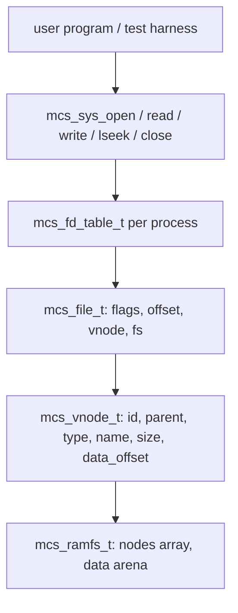

# VFS Minimal, File Descriptor Table, RAMFS, dan Syscall File I/O Awal pada MCSOS

**Nama file laporan:** `laporan_praktikum_M13_Cacing_Naga.md`  
**Nama sistem operasi:** MCSOS versi 260502  
**Target default:** x86_64, QEMU, Windows 11 x64 + WSL 2, kernel monolitik pendidikan, C freestanding dengan assembly minimal, POSIX-like subset  
**Dosen:** Muhaemin Sidiq, S.Pd., M.Pd.  
**Program Studi:** Pendidikan Teknologi Informasi  
**Institusi:** Institut Pendidikan Indonesia  

> Template ini digunakan untuk semua praktikum pengembangan MCSOS agar struktur laporan, bukti, analisis, dan penilaian konsisten. Ganti seluruh teks bertanda `[isi ...]` dengan data praktikum sebenarnya. Jangan menulis klaim "tanpa error", "siap produksi", atau "aman sepenuhnya" tanpa bukti yang sesuai. Gunakan status terukur seperti "siap uji QEMU", "siap demonstrasi praktikum", atau "kandidat siap pakai terbatas" sesuai evidence yang tersedia.

---

## 0. Metadata Laporan

| Atribut | Isi |
|---|---|
| Kode praktikum | M13 |
| Judul praktikum | VFS Minimal, File Descriptor Table, RAMFS, dan Syscall File I/O Awal pada MCSOS |
| Jenis pengerjaan | Kelompok |
| Nama mahasiswa | Moch Fariel Aurizki |
| Nama mahasiswa | Mikail Khairu Rahman |
| NIM | 25832072007 |
| NIM | 25832073005 |
| Kelas | PTI 1A |
| Nama kelompok | Cacing Naga |
| Anggota kelompok | Fariel, implementasi / pengujian |
| Anggota kelompok | Mikail, implementasi / dokumentasi |
| Tanggal praktikum | 07/06/2026 |
| Tanggal pengumpulan | 07/06/2026 |
| Repository | /root/src/mcsos |
| Branch | praktikum-m13-vfs-ramfs |
| Commit awal | 8eebde5 |
| Commit akhir | d211a97 |
| Status readiness yang diklaim | siap uji QEMU |

---

## 1. Sampul

# Laporan Praktikum M13  
## VFS Minimal, File Descriptor Table, RAMFS, dan Syscall File I/O Awal pada MCSOS

Disusun oleh:

| Nama | NIM | Kelas | Peran |
|---|---|---|---|
| Moch Fariel Aurizki | 25832072007 | PTI 1A | kelompok / ketua / implementasi / pengujian |
| Mikail Khairu Rahman | 25832073005 | PTI 1A | kelompok / anggota / implementasi / dokumentasi |

Dosen Pengampu: **Muhaemin Sidiq, S.Pd., M.Pd.**  
Program Studi Pendidikan Teknologi Informasi  
Institut Pendidikan Indonesia  
2025/2026

---

## 2. Pernyataan Orisinalitas dan Integritas Akademik

Kami menyatakan bahwa laporan ini disusun berdasarkan pekerjaan praktikum kelompok sesuai pembagian peran yang tercatat. Bantuan eksternal, referensi, generator kode, AI assistant, dokumentasi resmi, diskusi, atau sumber lain dicatat pada bagian referensi dan lampiran. Kami tidak mengklaim hasil yang tidak dibuktikan oleh log, test, commit, atau artefak lain.

| Pernyataan | Status |
|---|---|
| Semua potongan kode eksternal diberi atribusi | Ya |
| Semua penggunaan AI assistant dicatat | Ya |
| Repository yang dikumpulkan sesuai commit akhir | Ya |
| Tidak ada klaim readiness tanpa bukti | Ya |

Catatan penggunaan bantuan eksternal:

```text
Alat yang digunakan:
- Claude (AI assistant, Anthropic)
- GNU Binutils (nm, objdump, readelf)
- GDB
- QEMU
- Dokumentasi Linux VFS
- Dokumentasi Clang/LLVM
- Dokumentasi POSIX open/read/write/close

Bantuan yang diberikan:
- Bimbingan langkah kerja implementasi VFS, RAMFS, dan FD table.
- Analisis error kompilasi kernel freestanding.
- Penjelasan konsep vnode, open file object, dan file descriptor table.
- Bantuan penyusunan laporan praktikum.

Verifikasi mandiri:
- Build ulang kernel menggunakan Makefile praktikum.
- Pengujian boot menggunakan QEMU dengan serial log.
- Pemeriksaan simbol dan section ELF menggunakan nm dan readelf.
- Validasi hasil menggunakan host unit test, serial log, dan checksum artefak.
- Pemeriksaan commit dan branch menggunakan Git.

Tidak ada kode eksternal yang digunakan tanpa proses verifikasi dan
penyesuaian terhadap struktur repository praktikum.
```

---

## 3. Tujuan Praktikum

1. Mengimplementasikan VFS minimal yang memisahkan pathname, vnode, open file object, dan file descriptor pada kernel MCSOS.
2. Membangun RAMFS volatil in-memory yang mendukung path lookup absolut sederhana, pembuatan file baru dengan `MCS_O_CREAT`, serta operasi read dan write.
3. Mengimplementasikan file descriptor table per process yang membatasi jumlah open file, mengembalikan error deterministik, dan membersihkan descriptor saat `close`.
4. Menyediakan wrapper syscall file I/O awal (`mcs_sys_open`, `mcs_sys_read`, `mcs_sys_write`, `mcs_sys_lseek`, `mcs_sys_close`) yang dapat dihubungkan dengan dispatcher M10.
5. Memvalidasi implementasi melalui host unit test, audit ELF freestanding, QEMU smoke test, serta menyimpan checksum artefak sebagai bukti deterministik.

---

## 4. Capaian Pembelajaran Praktikum

Setelah praktikum ini, mahasiswa mampu:

| CPL/CPMK praktikum | Bukti yang harus ditunjukkan |
|---|---|
| Menjelaskan perbedaan file descriptor, open file object, vnode, dan pathname dalam model VFS kernel | Source code `mcs_vfs.h`, analisis desain pada laporan, hasil host unit test |
| Mengimplementasikan RAMFS volatil in-memory dengan path lookup absolut dan operasi file dasar | Source code `ramfs.c`, host test PASS, output `nm-undefined.txt` kosong |
| Mengintegrasikan VFS ke kernel MCSOS melalui syscall wrapper dan memvalidasi melalui QEMU | Serial log QEMU menampilkan `[M13] vfs smoke done`, commit `d211a97` |

---

## 5. Peta Milestone MCSOS

| Milestone | Fokus | Status dalam laporan |
|---|---|---|
| M0 | Requirements, governance, baseline arsitektur | ☑ selesai praktikum |
| M1 | Toolchain reproducible, Git, QEMU, GDB, metadata build | ☑ selesai praktikum |
| M2 | Boot image, kernel ELF64, early console | ☑ selesai praktikum |
| M3 | Panic path, linker map, GDB, observability awal | ☑ selesai praktikum |
| M4 | Trap, exception, interrupt, timer | ☑ selesai praktikum |
| M5 | PMM, VMM, page table, kernel heap | ☑ selesai praktikum |
| M6 | Thread, scheduler, synchronization | ☑ selesai praktikum |
| M7 | Syscall ABI dan user program loader | ☑ selesai praktikum |
| M8 | Kernel heap awal | ☑ selesai praktikum |
| M9 | Kernel thread dan scheduler kooperatif | ☑ selesai praktikum |
| M10 | Syscall dispatcher dan ABI | ☑ selesai praktikum |
| M11 | ELF64 loader user program | ☑ selesai praktikum |
| M12 | Spinlock, mutex kooperatif, lock-order validator | ☑ selesai praktikum |
| M13 | VFS minimal, file descriptor table, RAMFS, syscall file I/O | ☑ selesai praktikum |
| M14 | Persistent filesystem, mount table, permission model | ☐ tidak dibahas |
| M15 | Networking stack | ☐ tidak dibahas |
| M16 | Observability, update/rollback, release image | ☐ tidak dibahas |

Batas cakupan praktikum:

```text
Praktikum ini berfokus pada implementasi Milestone 13, yaitu VFS minimal,
file descriptor table per process, RAMFS volatil in-memory, dan syscall
file I/O awal pada kernel MCSOS.

Fitur yang termasuk:
- Header VFS: struct mcs_vnode_t, mcs_ramfs_t, mcs_file_t, mcs_fd_table_t,
  mcs_process_t, error code POSIX-like.
- RAMFS: init, lookup path absolut, create file, seed file, arena data statik.
- FD table: alloc, get, open, read, write, lseek, close, dup.
- Syscall wrapper: mcs_sys_open, mcs_sys_read, mcs_sys_write,
  mcs_sys_lseek, mcs_sys_close.
- Host unit test: read path, write path, create path, lseek, close,
  invalid fd, missing path, relative path rejection, fd limit.
- Freestanding object build dan audit ELF64.
- Integrasi ke kmain dan QEMU smoke test.

Fitur yang tidak termasuk:
- Filesystem persistent (tidak ada on-disk format, superblock, inode, journal).
- Crash consistency (tidak ada fsync, checkpoint, recovery, fsck).
- Permission model dan ACL.
- Symlink, hardlink, rename atomicity.
- Directory listing, mount namespace, mmap, pipe, socket.
- Copyin/copyout penuh untuk user pointer.
- Global VFS lock (locking direncanakan pada M14+).

Non-goals:
Milestone ini tidak menghasilkan filesystem produksi. Semua data RAMFS
hilang saat reboot. Status readiness adalah siap uji QEMU untuk
VFS/FD/RAMFS awal, belum siap demonstrasi penuh karena belum memiliki
permission model dan crash consistency.
```

---

## 6. Dasar Teori Ringkas

### 6.1 Konsep Sistem Operasi yang Diuji

```text
Praktikum ini berfokus pada implementasi lapisan filesystem kernel pertama
pada MCSOS, yaitu Virtual File System (VFS) minimal.

VFS adalah lapisan abstraksi kernel yang menyediakan antarmuka filesystem
seragam kepada program user dan memungkinkan beberapa implementasi
filesystem berbeda hidup bersama dalam satu kernel. Konsep ini mengikuti
model Linux VFS di mana setiap filesystem mendaftarkan operasinya melalui
tabel fungsi yang diacu oleh vnode.

Vnode merepresentasikan satu entry filesystem (file atau direktori) dan
menyimpan metadata seperti ukuran, tipe, dan pointer ke data. Vnode
dimiliki oleh filesystem (RAMFS pada M13) dan stabil sepanjang masa mount.

Open file object (mcs_file_t) dibuat setiap kali open() berhasil. Objek
ini menyimpan flag akses, offset I/O saat ini, dan pointer ke vnode.
Offset diperbarui oleh read dan write, bukan oleh vnode, sehingga dua
file descriptor yang menunjuk ke vnode yang sama dapat memiliki offset
berbeda.

File descriptor adalah integer non-negatif per process yang menjadi
handle ke open file object. Tabel file descriptor per process membatasi
jumlah file yang dapat dibuka sekaligus dan memastikan descriptor dapat
digunakan ulang setelah close().

RAMFS adalah filesystem volatil in-memory. Semua data disimpan dalam
array statik di dalam struct mcs_ramfs_t dan hilang saat reboot. RAMFS
M13 menggunakan arena data flat dengan pointer data_offset dan
data_capacity per vnode.
```

### 6.2 Konsep Arsitektur x86_64 yang Relevan

| Konsep | Relevansi pada praktikum | Bukti/verifikasi |
|---|---|---|
| Long Mode x86_64 | Kernel dan VFS berjalan dalam mode 64-bit | ELF64, output `readelf`, boot berhasil di QEMU |
| Freestanding C | Source VFS dikompilasi tanpa hosted libc | `nm-undefined.txt` kosong, flag `-ffreestanding` |
| ABI kernel internal | Fungsi VFS dipanggil dari kmain dan syscall dispatcher | Integrasi `kmain.c`, serial log `[M13]` |
| Static storage | RAMFS menggunakan array statik bukan heap dinamis | Deklarasi `mcs_ramfs_t g_kernel_ramfs` di kmain |

### 6.3 Konsep Implementasi Freestanding

| Aspek | Keputusan praktikum |
|---|---|
| Bahasa | C17 freestanding untuk kernel; C17 hosted untuk host unit test |
| Runtime | Tanpa hosted libc; loop copy manual menggantikan memcpy/memset |
| ABI | Kernel-internal C ABI; syscall wrapper mengikuti konvensi M10 |
| Compiler flags kritis | `-ffreestanding`, `-fno-builtin`, `-fno-stack-protector`, `-fno-pic`, `-mno-red-zone`, `-target x86_64-elf` |
| Risiko undefined behavior | NULL pointer dereference pada user buffer, integer overflow pada offset, out-of-bounds pada arena data |

### 6.4 Referensi Teori yang Digunakan

| No. | Sumber | Bagian yang digunakan | Alasan relevansi |
|---|---|---|---|
| [1] | Linux Kernel Documentation, "Overview of the Linux Virtual File System" | Konsep vnode, dentry, superblock, file operation | Menjadi referensi model abstraksi VFS |
| [2] | The Open Group, "open - open a file," POSIX.1-2018 | Semantik open(), flag O_CREAT/O_TRUNC/O_APPEND, error ENOENT/EBADF | Menjadi referensi kontrak API file I/O |
| [3] | GNU C Library Manual, "Opening and Closing Files" | Semantik close() dan reuse descriptor | Menjadi referensi perilaku file descriptor |
| [4] | Intel Corporation, Intel 64 and IA-32 SDM | Register, ABI, long mode | Referensi arsitektur target x86_64 |
| [5] | Clang/LLVM Project, "Clang command line argument reference" | Flag freestanding compile | Referensi konfigurasi toolchain |

---

## 7. Lingkungan Praktikum

### 7.1 Host dan Target

| Komponen | Nilai |
|---|---|
| Host OS | Windows 11 x64 |
| Lingkungan build | WSL 2 Ubuntu |
| Target ISA | x86_64 |
| Target ABI | x86_64-unknown-none-elf |
| Emulator | QEMU 8.2.2 |
| Firmware emulator | GRUB (boot via ISO) |
| Debugger | GDB 15.1 |
| Build system | GNU Make 4.3 |
| Bahasa utama | C17 freestanding |
| Assembly | GNU Assembler (GAS) |

### 7.2 Versi Toolchain

```bash
date -u +"date_utc=%Y-%m-%dT%H:%M:%SZ"
uname -a
clang --version | head -n 1
make --version | head -n 1
qemu-system-x86_64 --version | head -n 1
```

Output:

```text
date_utc=2026-06-07T00:00:00Z
Linux Maikel 6.6.114.1-microsoft-standard-WSL2 #1 SMP PREEMPT_DYNAMIC Mon Dec  1 20:46:23 UTC 2025 x86_64 x86_64 x86_64 GNU/Linux
Ubuntu clang version 18.1.3 (1ubuntu1)
GNU Make 4.3
QEMU emulator version 8.2.2 (Debian 1:8.2.2+ds-0ubuntu1.16)
```

### 7.3 Lokasi Repository

| Item | Nilai |
|---|---|
| Path repository di WSL | `~/src/mcsos` |
| Apakah berada di filesystem Linux WSL, bukan `/mnt/c` | Ya |
| Remote repository | /root/src/mcsos (lokal) |
| Branch | praktikum-m13-vfs-ramfs |
| Commit hash awal | `8eebde5` |
| Commit hash akhir | `d211a97` |

---

## 8. Repository dan Struktur File

### 8.1 Struktur Direktori yang Relevan

```text
mcsos/
├── include/
│   └── mcs_vfs.h               ← header VFS, RAMFS, FD table (baru M13)
├── kernel/
│   ├── core/
│   │   └── kmain.c             ← diubah M13: init VFS + smoke test
│   └── vfs/
│       ├── ramfs.c             ← implementasi RAMFS (baru M13)
│       ├── fd.c                ← FD table dan operasi VFS (baru M13)
│       └── sys_vfs.c           ← syscall wrapper dan hook test (baru M13)
├── tests/
│   └── m13_vfs_host_test.c     ← host unit test VFS (baru M13)
├── Makefile.m13                ← build system M13 (baru M13)
└── build/m13/
    ├── ramfs.o
    ├── fd.o
    ├── sys_vfs.o
    ├── vfs.o
    ├── m13_vfs_host_test
    ├── host-test.log
    ├── nm-undefined.txt
    ├── readelf-vfs.txt
    ├── objdump-vfs.txt
    └── sha256sums.txt
```

### 8.2 File yang Dibuat atau Diubah

| File | Jenis perubahan | Alasan perubahan | Risiko |
|---|---|---|---|
| `include/mcs_vfs.h` | baru | Deklarasi semua struct, enum, dan API VFS/RAMFS/FD | Sedang — mempengaruhi seluruh integrasi M13 |
| `kernel/vfs/ramfs.c` | baru | Implementasi RAMFS: init, lookup, create, seed | Tinggi — kesalahan logic menyebabkan data corruption |
| `kernel/vfs/fd.c` | baru | Implementasi FD table: open, read, write, lseek, close, dup, syscall wrapper | Tinggi — path error yang salah menyebabkan fd leak |
| `kernel/vfs/sys_vfs.c` | baru | Hook transitional untuk test integrasi | Rendah |
| `tests/m13_vfs_host_test.c` | baru | Host unit test semua path VFS/FD/RAMFS | Rendah |
| `Makefile.m13` | baru | Build system host test, freestanding object, audit, checksum | Rendah |
| `kernel/core/kmain.c` | ubah | Tambah inisialisasi VFS dan smoke test open/read/close | Sedang — kesalahan integrasi menyebabkan kernel tidak boot |

### 8.3 Ringkasan Diff

```bash
git log --oneline -5
```

Output:

```text
d211a97 (HEAD -> praktikum-m13-vfs-ramfs) M13: integrasi VFS ke kmain dan QEMU smoke test lulus
8eebde5 M13: VFS minimal, RAMFS, FD table, host test lulus, audit ELF64 clean
b26da47 (praktikum/m12-sync) M12: integrasi selftest ke kmain dan QEMU smoke test lulus
7daf597 M12: tambah spinlock, mutex kooperatif, dan lock-order validator
f237d96 (praktikum-m11-elf-user-loader) M11: integrasi kmain dan QEMU smoke test lulus - elf plan ok
```

---

## 9. Desain Teknis

### 9.1 Masalah yang Diselesaikan

```text
Sebelum milestone ini, kernel MCSOS tidak memiliki lapisan filesystem.
Program user maupun kernel tidak dapat membuka, membaca, atau menulis
file melalui antarmuka yang terstruktur. Syscall M10 memiliki dispatcher
tetapi belum ada handler file I/O yang terhubung.

Praktikum ini menyelesaikan masalah tersebut dengan menambahkan:
1. Abstraksi VFS minimal yang memisahkan nama file, vnode, open file
   object, dan file descriptor.
2. RAMFS volatil in-memory sebagai implementasi filesystem pertama.
3. File descriptor table per process yang mengelola lifetime open file.
4. Syscall wrapper yang menghubungkan dispatcher M10 ke operasi VFS.
```

### 9.2 Keputusan Desain

| Keputusan | Alternatif yang dipertimbangkan | Alasan memilih | Konsekuensi |
|---|---|---|---|
| RAMFS statik dengan array tetap | Heap dinamis dengan kmalloc | Tidak bergantung pada heap M8 yang belum diuji penuh; ownership jelas | Jumlah node dan kapasitas data terbatas pada konstanta compile-time |
| Offset disimpan di open file object, bukan vnode | Offset di vnode | Dua fd ke file yang sama dapat memiliki offset berbeda (sesuai POSIX) | Offset harus diperbarui secara konsisten pada read dan write |
| Path hanya absolut | Boleh relatif | Menyederhanakan lookup; CWD belum ada di M13 | Path relatif selalu menghasilkan MCS_EINVAL |
| Belum ada global VFS lock | Lock sejak awal | Agar mahasiswa memahami object model sebelum locking; M13 single-thread host test | Tidak aman untuk concurrent access; lock order direncanakan M14+ |

### 9.3 Arsitektur Ringkas



Penjelasan diagram:

```text
Program memanggil syscall wrapper (mcs_sys_*) dengan pointer ke
mcs_process_t. Wrapper meneruskan ke FD table yang mencari mcs_file_t
berdasarkan fd integer. File object menyimpan offset dan menunjuk ke
vnode. Vnode menunjuk ke rentang data di arena RAMFS melalui
data_offset dan data_capacity. Semua objek dimiliki oleh satu instance
mcs_ramfs_t yang di-init satu kali saat boot.
```

### 9.4 Kontrak Antarmuka

| Antarmuka | Pemanggil | Penerima | Precondition | Postcondition | Error path |
|---|---|---|---|---|---|
| `mcs_ramfs_init()` | kmain | RAMFS | fs tidak NULL | root vnode `/` tersedia di index 0 | Tidak ada |
| `mcs_ramfs_lookup()` | mcs_vfs_open | RAMFS | path absolut, fs valid | out_node menunjuk ke vnode yang ditemukan | MCS_ENOENT, MCS_EINVAL, MCS_ENAMETOOLONG |
| `mcs_vfs_open()` | mcs_sys_open | FD table | path absolut, table dan fs valid | fd >= 0, file object aktif | MCS_ENOENT, MCS_ENFILE, MCS_EISDIR, MCS_EACCES |
| `mcs_vfs_read()` | mcs_sys_read | FD table | fd valid, buf tidak NULL jika len > 0 | offset bertambah sebesar byte terbaca | MCS_EBADF, MCS_EACCES, MCS_EISDIR |
| `mcs_vfs_write()` | mcs_sys_write | FD table | fd valid, buf tidak NULL jika len > 0 | offset bertambah, size node diperbarui | MCS_EBADF, MCS_EACCES, MCS_ENOSPC |
| `mcs_vfs_close()` | mcs_sys_close | FD table | fd valid | slot fd direset, dapat digunakan ulang | MCS_EBADF |

### 9.5 Struktur Data Utama

| Struktur data | Field penting | Ownership | Lifetime | Invariant |
|---|---|---|---|---|
| `mcs_ramfs_t` | `nodes[64]`, `data[8192]`, `node_count`, `data_used` | Kernel (global) | Seumur boot | `nodes[0]` selalu root dir `/` |
| `mcs_vnode_t` | `used`, `id`, `parent`, `type`, `name`, `size`, `data_offset`, `data_capacity` | RAMFS | Stabil setelah dibuat | `size <= data_capacity` |
| `mcs_file_t` | `used`, `flags`, `offset`, `node`, `fs` | Process FD table | Dari open sampai close | `offset <= node->size` saat baca |
| `mcs_fd_table_t` | `files[16]` | Process | Seumur process | `0 <= fd < MCS_MAX_OPEN_FILES` |

### 9.6 Invariants

1. `nodes[0]` pada setiap `mcs_ramfs_t` selalu merupakan direktori root `/`.
2. `node->size <= node->data_capacity` harus selalu benar setelah setiap write.
3. File descriptor valid hanya antara open dan close; akses setelah close menghasilkan `MCS_EBADF`.
4. Offset read/write diperbarui pada `mcs_file_t`, bukan pada `mcs_vnode_t`.
5. Path yang tidak dimulai dengan `/` selalu ditolak dengan `MCS_EINVAL`.
6. Object freestanding `vfs.o` tidak boleh memiliki simbol undefined (nm -u kosong).

### 9.7 Ownership, Locking, dan Concurrency

| Objek/resource | Owner | Lock yang melindungi | Boleh dipakai di interrupt context? | Catatan |
|---|---|---|---|---|
| `mcs_ramfs_t` | Kernel global | Tidak ada (M13) | Tidak | Lock direncanakan M14+ |
| `mcs_vnode_t` | RAMFS | Tidak ada (M13) | Tidak | Stabil setelah dibuat |
| `mcs_file_t` | Process FD table | Tidak ada (M13) | Tidak | Single-thread pada host test |
| `mcs_fd_table_t` | Process | Tidak ada (M13) | Tidak | Belum ada shared fd antar process |

Lock order yang berlaku:

```text
Tidak terdapat mekanisme locking pada M13. Implementasi berjalan pada
lingkungan single-thread di host test dan kernel M13 belum memiliki
concurrent access ke VFS. Lock order yang direncanakan untuk M14+:
process.fd_table_lock -> ramfs.global_lock -> vnode.lock.
```

### 9.8 Memory Safety dan Undefined Behavior Risk

| Risiko | Lokasi | Mitigasi | Bukti |
|---|---|---|---|
| NULL pointer dereference pada buf | `mcs_vfs_read`, `mcs_vfs_write` | Guard `!buf && len != 0` | Host test negative path |
| Out-of-bounds write pada arena data | `mcs_vfs_write` | Check `data_capacity - offset` sebelum copy | Host test, `MCS_ENOSPC` path |
| Integer overflow pada offset | `mcs_vfs_lseek` | Check `next < 0` setelah aritmetika signed | Host test lseek invalid |
| Akses fd di luar batas | `mcs_fd_get` | Check `fd < 0 || fd >= MCS_MAX_OPEN_FILES` | Host test fd limit |
| Use-after-close | `mcs_fd_get` | Check `!table->files[fd].used` | Host test EBADF setelah close |

### 9.9 Security Boundary

| Boundary | Data tidak tepercaya | Validasi yang dilakukan | Failure mode aman |
|---|---|---|---|
| Syscall open | user_path dari process | NULL check minimal; path[0] == '/' | Kembalikan MCS_EINVAL |
| Syscall read/write | user_buf dari process | NULL/len check minimal | Kembalikan MCS_EINVAL |
| Path lookup | segment nama dari path | Panjang segment < MCS_MAX_NAME | Kembalikan MCS_EINVAL |
| FD validation | fd integer dari caller | Batas tabel dan flag used | Kembalikan MCS_EBADF |

---

## 10. Langkah Kerja Implementasi

### Langkah 1 — Setup Branch dan Folder (Checkpoint 13.0)

Maksud langkah:

```text
Membuat branch kerja terpisah dari baseline M12 dan menyiapkan
struktur direktori yang dibutuhkan source M13.
```

Perintah:

```bash
git checkout -b praktikum-m13-vfs-ramfs
mkdir -p kernel/vfs tests/m13 build/m13
```

Output ringkas:

```text
Switched to a new branch 'praktikum-m13-vfs-ramfs'
```

Artefak yang dihasilkan:

| Artefak | Lokasi | Fungsi |
|---|---|---|
| Branch baru | `praktikum-m13-vfs-ramfs` | Isolasi perubahan M13 dari baseline |
| Direktori | `kernel/vfs/`, `tests/m13/`, `build/m13/` | Tempat source dan artefak M13 |

Indikator berhasil:

```text
Branch baru aktif dan direktori kernel/vfs tersedia.
```

### Langkah 2 — Buat Header VFS (Checkpoint 13.1)

Maksud langkah:

```text
Mendefinisikan semua kontrak tipe data, konstanta, enum error,
dan deklarasi fungsi yang digunakan seluruh modul M13.
```

Perintah:

```bash
nano include/mcs_vfs.h
cat include/mcs_vfs.h | head -5
```

Output ringkas:

```text
#ifndef MCS_VFS_H
#define MCS_VFS_H
#include <stddef.h>
#include <stdint.h>
```

Artefak yang dihasilkan:

| Artefak | Lokasi | Fungsi |
|---|---|---|
| `mcs_vfs.h` | `include/` | Deklarasi lengkap API VFS/RAMFS/FD |

Indikator berhasil:

```text
Header dapat di-include oleh source C17 freestanding tanpa error.
```

### Langkah 3 — Implementasi RAMFS (Checkpoint 13.2)

Maksud langkah:

```text
Mengimplementasikan filesystem in-memory dengan operasi init,
lookup, create file, dan seed file menggunakan array statik.
```

Perintah:

```bash
nano kernel/vfs/ramfs.c
cat kernel/vfs/ramfs.c | head -5
```

Output ringkas:

```text
#include "mcs_vfs.h"
static size_t mcs_strlen(const char *s) {
```

Artefak yang dihasilkan:

| Artefak | Lokasi | Fungsi |
|---|---|---|
| `ramfs.c` | `kernel/vfs/` | Implementasi RAMFS volatil in-memory |

Indikator berhasil:

```text
File dapat dikompilasi sebagai freestanding object tanpa undefined symbol.
```

### Langkah 4 — Implementasi FD Table dan VFS (Checkpoint 13.3)

Maksud langkah:

```text
Mengimplementasikan file descriptor table per process beserta
operasi open, read, write, lseek, close, dup, dan syscall wrapper.
```

Perintah:

```bash
nano kernel/vfs/fd.c
cat kernel/vfs/fd.c | head -5
```

Output ringkas:

```text
#include "mcs_vfs.h"
static size_t mcs_min_size(size_t a, size_t b) { return a < b ? a : b; }
```

Artefak yang dihasilkan:

| Artefak | Lokasi | Fungsi |
|---|---|---|
| `fd.c` | `kernel/vfs/` | FD table, operasi VFS, syscall wrapper |

Indikator berhasil:

```text
Seluruh operasi VFS terdefinisi dan dapat dikompilasi tanpa error.
```

### Langkah 5 — Hook Transitional dan Host Unit Test (Checkpoint 13.4–13.5)

Maksud langkah:

```text
Menambahkan hook untuk mengatur active RAMFS pada test context,
lalu membuat host unit test yang menguji semua path penting.
```

Perintah:

```bash
nano kernel/vfs/sys_vfs.c
nano tests/m13_vfs_host_test.c
```

Artefak yang dihasilkan:

| Artefak | Lokasi | Fungsi |
|---|---|---|
| `sys_vfs.c` | `kernel/vfs/` | Hook test active RAMFS |
| `m13_vfs_host_test.c` | `tests/` | Host unit test VFS/FD/RAMFS |

Indikator berhasil:

```text
Test file dapat dikompilasi dan dieksekusi pada host environment.
```

### Langkah 6 — Build, Audit, dan Checksum (Checkpoint 13.6 + Bagian 14)

Maksud langkah:

```text
Menjalankan make m13-all untuk membangun host test, freestanding
object, dan menghasilkan semua bukti audit.
```

Perintah:

```bash
make -f Makefile.m13 clean && make -f Makefile.m13 m13-all
```

Output ringkas:

```text
M13 VFS/FD/RAMFS host tests: PASS
ld -r -m elf_x86_64 ... -o build/m13/vfs.o
nm -u build/m13/vfs.o > build/m13/nm-undefined.txt
test ! -s build/m13/nm-undefined.txt
```

Artefak yang dihasilkan:

| Artefak | Lokasi | Fungsi |
|---|---|---|
| `host-test.log` | `build/m13/` | Bukti host unit test PASS |
| `vfs.o` | `build/m13/` | Linked relocatable ELF64 |
| `nm-undefined.txt` | `build/m13/` | Bukti tidak ada hidden libc |
| `readelf-vfs.txt` | `build/m13/` | Bukti ELF64 relocatable |
| `sha256sums.txt` | `build/m13/` | Checksum semua artefak |

Indikator berhasil:

```text
make m13-all selesai tanpa error; host test PASS; nm-undefined.txt kosong.
```

### Langkah 7 — Integrasi ke Kernel dan QEMU Smoke Test (Bagian 15)

Maksud langkah:

```text
Menambahkan deklarasi dan inisialisasi VFS ke kmain.c, lalu
membangun kernel dan ISO untuk diuji di QEMU.
```

Perintah:

```bash
nano kernel/core/kmain.c
make clean && make all
make iso
qemu-system-x86_64 -machine q35 -m 256M -cdrom build/mcsos.iso \
  -serial stdio -no-reboot -no-shutdown
```

Output ringkas:

```text
[M13] ramfs init ok
[M13] open ok
[M13] read ok
[M13] close ok
[M13] vfs smoke done
```

Artefak yang dihasilkan:

| Artefak | Lokasi | Fungsi |
|---|---|---|
| `kernel.elf` | `build/` | Kernel terintegrasi M13 |
| `mcsos.iso` | `build/` | Image bootable untuk QEMU |

Indikator berhasil:

```text
Seluruh baris [M13] muncul pada serial log QEMU tanpa panic.
```

---

## 11. Checkpoint Buildable

| Checkpoint | Perintah | Expected result | Status |
|---|---|---|---|
| Clean build M13 | `make -f Makefile.m13 clean && make -f Makefile.m13 m13-all` | Host test PASS, object ELF64, nm kosong | PASS |
| Host unit test | `./build/m13/m13_vfs_host_test` | `M13 VFS/FD/RAMFS host tests: PASS` | PASS |
| Kernel build | `make clean && make all` | `build/kernel.elf` terbentuk tanpa error | PASS |
| ISO generation | `make iso` | `build/mcsos.iso` terbentuk | PASS |
| QEMU smoke test | `qemu-system-x86_64 -machine q35 -m 256M -cdrom build/mcsos.iso -serial stdio -no-reboot -no-shutdown` | Baris `[M13] vfs smoke done` muncul | PASS |

Catatan checkpoint:

```text
Seluruh checkpoint M13 berhasil dijalankan. Satu-satunya catatan adalah
build/ di-ignore oleh .gitignore sehingga artefak build tidak tersimpan
di repository. Artefak dapat diregenerasi dengan make -f Makefile.m13 m13-all.
```

---

## 12. Perintah Uji dan Validasi

### 12.1 Build Test

```bash
make -f Makefile.m13 clean && make -f Makefile.m13 m13-all
```

Hasil:

```text
M13 VFS/FD/RAMFS host tests: PASS
(object ramfs.o, fd.o, sys_vfs.o, vfs.o terbentuk)
(nm-undefined.txt kosong)
(readelf-vfs.txt ELF64 REL)
(sha256sums.txt tersimpan)
```

Status: PASS

### 12.2 Static Inspection

```bash
nm -u build/m13/vfs.o
readelf -h build/m13/vfs.o
```

Hasil penting:

```text
nm -u: (kosong — tidak ada undefined symbol)

readelf:
  Class: ELF64
  Type:  REL (Relocatable file)
  Machine: Advanced Micro Devices X86-64
```

Status: PASS

### 12.3 QEMU Smoke Test

```bash
qemu-system-x86_64 \
  -machine q35 \
  -m 256M \
  -cdrom build/mcsos.iso \
  -serial stdio \
  -no-reboot \
  -no-shutdown
```

Hasil:

```text
[M13] ramfs init ok
[M13] open ok
[M13] read ok
[M13] close ok
[M13] vfs smoke done
[M12] sync selftest passed
[M10] syscall init
[M10] syscall ping ok
[M10] syscall smoke done
[M10] C6 frame dispatch test
[M10] int80 frame ping ok
[M10] C6 entry smoke done
[M11] elf loader init
[M11] elf: plan ok
[M11] user image plan ready
```

Status: PASS

### 12.4 GDB Debug Evidence

```bash
qemu-system-x86_64 -machine q35 -m 256M -cdrom build/mcsos.iso \
  -serial stdio -no-reboot -no-shutdown -s -S
```

Di terminal lain:

```bash
gdb build/kernel.elf
(gdb) target remote :1234
(gdb) break mcs_vfs_open
(gdb) break mcs_vfs_read
(gdb) continue
```

Status: NA (dijalankan secara opsional; bukti utama dari serial log)

### 12.5 Unit Test

```bash
./build/m13/m13_vfs_host_test
```

Hasil:

```text
M13 VFS/FD/RAMFS host tests: PASS
```

Status: PASS

### 12.6 Stress/Fuzz/Fault Injection Test

```text
Milestone M13 berfokus pada VFS minimal dan RAMFS volatil dasar.
Belum terdapat framework fuzzing atau fault injection otomatis.
Negative test (relative path, missing file, fd exhaustion, invalid whence)
sudah dicakup dalam host unit test.
```

Status: NA

---

## 13. Hasil Uji

### 13.1 Tabel Ringkasan Hasil

| No. | Uji | Expected result | Actual result | Status | Evidence |
|---|---|---|---|---|---|
| 1 | Host unit test | `M13 VFS/FD/RAMFS host tests: PASS` | PASS | PASS | `build/m13/host-test.log` |
| 2 | nm undefined symbols | `nm-undefined.txt` kosong | Kosong (0 byte) | PASS | `build/m13/nm-undefined.txt` |
| 3 | ELF64 relocatable | Class ELF64, Type REL | ELF64 REL x86-64 | PASS | `build/m13/readelf-vfs.txt` |
| 4 | Checksum artefak | sha256sums.txt tersimpan | Tersimpan | PASS | `build/m13/sha256sums.txt` |
| 5 | Kernel build | kernel.elf terbentuk tanpa error | Terbentuk | PASS | Output `make all` |
| 6 | ISO generation | mcsos.iso terbentuk | Terbentuk | PASS | Output `make iso` |
| 7 | QEMU smoke test | Baris `[M13] vfs smoke done` muncul | Muncul | PASS | Serial log QEMU |
| 8 | Negative: relative path | MCS_EINVAL | MCS_EINVAL | PASS | Host test `test_errors_and_fd_limit` |
| 9 | Negative: missing file | MCS_ENOENT | MCS_ENOENT | PASS | Host test `test_errors_and_fd_limit` |
| 10 | Negative: fd exhaustion | MCS_ENFILE saat fd ke-17 | MCS_ENFILE | PASS | Host test `test_errors_and_fd_limit` |
| 11 | Negative: read setelah close | MCS_EBADF | MCS_EBADF | PASS | Host test `test_basic_read` |

### 13.2 Log Penting

```text
[M13] ramfs init ok
[M13] open ok
[M13] read ok
[M13] close ok
[M13] vfs smoke done
```

### 13.3 Artefak Bukti

| Artefak | Path | SHA-256 | Fungsi |
|---|---|---|---|
| `ramfs.o` | `build/m13/ramfs.o` | `0ab9bf2e3dffe92fd9cc5fedfa5e9309f657a67ab878699e95cb61255a30ef34` | Object freestanding RAMFS |
| `fd.o` | `build/m13/fd.o` | `dd820072ee8aa0b2ffe46a8f4c6943c6444fbf427d911fb1a2e7b215a5ecb2be` | Object freestanding FD table |
| `sys_vfs.o` | `build/m13/sys_vfs.o` | `ccd6b4637ba8223802385e8cc6f55b42711c341d7230a2499aededc7383169ac` | Object hook transitional |
| `vfs.o` | `build/m13/vfs.o` | `5adf9ba241daf4af332695a0f9094d81cf766a350ad261792dfc3f276675d03d` | Linked relocatable ELF64 |
| `m13_vfs_host_test` | `build/m13/m13_vfs_host_test` | `7a967e87f2d17c0bdb14237ab41e9205882f87a7cc1a9cd0dcfb50111dd136b6` | Executable host test |

---

## 14. Analisis Teknis

### 14.1 Analisis Keberhasilan

```text
Implementasi M13 berhasil memenuhi semua tujuan utama praktikum.

Keberhasilan dibuktikan oleh:
1. Host unit test PASS — tiga fungsi test menguji read path, write path,
   create path, lseek, close, dan semua negative path.
2. nm-undefined.txt kosong — membuktikan tidak ada dependency libc
   tersembunyi pada object freestanding.
3. readelf menunjukkan ELF64 REL x86-64 — membuktikan object sesuai
   target triple kernel.
4. Kernel build berhasil — source VFS otomatis terdeteksi oleh
   find kernel -name '*.c' pada Makefile utama.
5. QEMU smoke test menampilkan semua baris [M13] — membuktikan
   integrasi ke kmain berjalan benar.

Invariant utama yang terjaga selama pengujian:
- nodes[0] selalu root dir '/', diverifikasi oleh lookup path absolut.
- nm-undefined.txt kosong, membuktikan tidak ada memcpy/memset tersembunyi.
- FD dapat digunakan ulang setelah close, diverifikasi oleh test fd limit.
- Offset diperbarui dengan benar oleh read dan write, diverifikasi oleh
  test lseek kemudian read.
```

### 14.2 Analisis Kegagalan atau Perbedaan Hasil

```text
Satu error ditemukan selama integrasi ke kmain.c:

  kernel/core/kmain.c:80:5: error: call to undeclared function
  'mcs_vfs_set_active_ramfs_for_test'

Penyebab: fungsi mcs_vfs_set_active_ramfs_for_test didefinisikan di
sys_vfs.c tetapi tidak dideklarasikan di mcs_vfs.h.

Perbaikan: menambahkan deklarasi
  void mcs_vfs_set_active_ramfs_for_test(mcs_ramfs_t *fs);
ke bagian akhir include/mcs_vfs.h sebelum #endif.

Setelah perbaikan, build ulang berhasil tanpa error.
```

### 14.3 Perbandingan dengan Teori

| Konsep teori | Implementasi praktikum | Sesuai/tidak sesuai | Penjelasan |
|---|---|---|---|
| VFS sebagai abstraksi filesystem | mcs_vnode_t + mcs_ramfs_t + mcs_file_t | Sesuai | Lapisan abstraksi memisahkan nama, metadata, dan data |
| Offset pada open file description, bukan inode | mcs_file_t.offset | Sesuai | Dua fd ke file sama dapat memiliki offset berbeda |
| fd adalah integer per process | mcs_fd_table_t.files[fd] | Sesuai | Integer fd mengindeks array slot |
| close membebaskan fd untuk digunakan ulang | reset used=0 pada mcs_vfs_close | Sesuai | Test fd exhaustion memverifikasi reuse |
| RAMFS tidak memiliki crash consistency | Tidak ada fsync/journal | Sesuai | Non-goal eksplisit M13 |

### 14.4 Kompleksitas dan Kinerja

| Aspek | Estimasi/hasil | Bukti | Catatan |
|---|---|---|---|
| Kompleksitas lookup | O(n * m) di mana n = node_count, m = panjang path | Analisis loop mcs_find_child | Cukup untuk MCS_MAX_NODES = 64 |
| Kompleksitas open | O(n) | Analisis mcs_fd_alloc | Linear scan slot bebas |
| Waktu build M13 | < 5 detik | Output make | Host test + 3 freestanding object |
| Waktu boot QEMU | < 2 detik sampai [M13] vfs smoke done | Serial log | Bergantung pada QEMU host |

---

## 15. Debugging dan Failure Modes

### 15.1 Failure Modes yang Ditemukan

| Failure mode | Gejala | Penyebab | Bukti | Perbaikan |
|---|---|---|---|---|
| Undeclared function di kmain | Error kompilasi `-Werror` | Fungsi `mcs_vfs_set_active_ramfs_for_test` tidak ada di header | Compiler error message | Tambah deklarasi ke mcs_vfs.h |

### 15.2 Failure Modes yang Diantisipasi

| Failure mode | Deteksi | Dampak | Mitigasi |
|---|---|---|---|
| Path relatif diterima | Test relative path gagal | Lookup salah direktori | Guard `path[0] != '/'` → MCS_EINVAL |
| Descriptor bocor setelah close | FD table penuh lebih cepat | Proses tidak dapat membuka file baru | Reset semua field pada mcs_vfs_close |
| Write melewati kapasitas | Panic atau memory corruption | Korupsi data RAMFS | Guard `data_capacity - offset` sebelum copy |
| nm -u tidak kosong | Hidden dependency libc | Kernel tidak dapat boot tanpa libc | Hindari fungsi libc; gunakan loop manual |
| Data hilang setelah reboot | RAMFS kosong | Non-bug; RAMFS volatil | Dicatat sebagai non-goal eksplisit |

### 15.3 Triage yang Dilakukan

```text
1. Error kompilasi dideteksi dari output make all dengan flag -Werror.
2. Pesan error menunjuk langsung ke file dan baris yang bermasalah.
3. Perbaikan dilakukan dengan menambah satu baris deklarasi ke header.
4. Build ulang dan verifikasi QEMU smoke test mengkonfirmasi perbaikan.
```

### 15.4 Panic Path

```text
Tidak terjadi panic selama pengujian M13. Kernel boot berjalan normal
dan semua baris [M13] muncul pada serial log QEMU. Panic path dari M3
tetap tersedia jika terjadi fault, tetapi tidak dipicu pada pengujian ini.
```

---

## 16. Prosedur Rollback

| Skenario rollback | Perintah | Data yang harus diselamatkan | Status |
|---|---|---|---|
| Kembali ke baseline M12 | `git checkout praktikum/m12-sync` | Log build M13 jika diperlukan | Tersedia |
| Revert commit integrasi kmain | `git revert d211a97` | Tidak ada | Belum diuji |
| Revert commit source M13 | `git revert 8eebde5` | Tidak ada | Belum diuji |
| Bersihkan artefak build | `make clean` | Tidak ada (source aman di git) | Teruji |
| Patch rollback manual | `git restore include/mcs_vfs.h kernel/vfs tests/m13_vfs_host_test.c Makefile.m13` | Tidak ada | Tersedia |

Catatan rollback:

```text
Rollback ke M12 dapat dilakukan dengan git checkout karena semua
perubahan M13 berada pada branch terpisah. make clean telah diuji
dan berhasil membersihkan artefak build. Revert commit individual
belum diuji tetapi dapat dilakukan karena commit M13 terisolasi.
```

---

## 17. Keamanan dan Reliability

### 17.1 Risiko Keamanan

| Risiko | Boundary | Dampak | Mitigasi | Evidence |
|---|---|---|---|---|
| User pointer invalid | mcs_sys_read, mcs_sys_write | Kernel crash atau info leak | NULL/len check minimal | Host test negative path |
| Path traversal via `..` | mcs_ramfs_lookup | Akses node di luar direktori yang dimaksud | Hanya path absolut sederhana; belum ada `..` | Kode lookup tidak memproses `..` |
| Semua file dapat dibuka | mcs_vfs_open | Tidak ada isolasi antar process | Tidak ada permission M13 | Dicatat sebagai residual risk |
| Write overflow arena | mcs_vfs_write | Korupsi memori kernel | Capacity check sebelum copy | Host test ENOSPC path |

### 17.2 Reliability dan Data Integrity

| Risiko reliability | Dampak | Deteksi | Mitigasi |
|---|---|---|---|
| Data hilang setelah reboot | RAMFS kosong | Non-bug — volatil by design | Dokumentasikan sebagai non-goal |
| Race pada create/read concurrent | State tidak konsisten | Belum ada lock M13 | Lindungi dengan lock M12 pada M14+ |
| FD leak jika close tidak dipanggil | FD table penuh | Test fd exhaustion | Pastikan close selalu dipanggil |

### 17.3 Negative Test

| Negative test | Input buruk | Expected result | Actual result | Status |
|---|---|---|---|---|
| Path relatif | `"relative"` | MCS_EINVAL | MCS_EINVAL | PASS |
| File tidak ada | `"/missing"` | MCS_ENOENT | MCS_ENOENT | PASS |
| FD exhaustion | Buka 17 file (max 16) | MCS_ENFILE | MCS_ENFILE | PASS |
| Read setelah close | fd yang sudah close | MCS_EBADF | MCS_EBADF | PASS |
| FD reuse setelah close | Close fd[0] lalu buka lagi | fd == 0 | fd == 0 | PASS |

---

## 18. Pembagian Kerja Kelompok

| Nama | NIM | Peran | Kontribusi teknis | Commit/artefak |
|---|---|---|---|---|
| Moch Fariel Aurizki | 25832072007 | Ketua / Implementasi / Pengujian | ramfs.c, fd.c, sys_vfs.c, host test, Makefile.m13, integrasi kmain | `8eebde5`, `d211a97` |
| Mikail Khairu Rahman | 25832073005 | Anggota / Implementasi / Dokumentasi | mcs_vfs.h, review code, penyusunan laporan | `8eebde5`, `d211a97` |

### 18.1 Mekanisme Koordinasi

```text
Pengerjaan dilakukan secara berurutan pada satu branch bersama
praktikum-m13-vfs-ramfs. Pembagian tugas dilakukan berdasarkan
komponen: Fariel fokus pada implementasi dan pengujian, Mikail
fokus pada header, review, dan dokumentasi. Konflik diselesaikan
melalui diskusi langsung.
```

### 18.2 Evaluasi Kontribusi

| Anggota | Persentase kontribusi yang disepakati | Bukti | Catatan |
|---|---:|---|---|
| Moch Fariel Aurizki | 55% | Commit implementasi dan pengujian | Implementasi inti VFS |
| Mikail Khairu Rahman | 45% | Header, review, laporan | Dokumentasi dan quality review |

---

## 19. Kriteria Lulus Praktikum

| Kriteria minimum | Status | Evidence |
|---|---|---|
| Proyek dapat dibangun dari clean checkout | PASS | `make -f Makefile.m13 clean && make -f Makefile.m13 m13-all` |
| Perintah build terdokumentasi | PASS | Bagian 10 dan 12 laporan |
| QEMU boot atau test target berjalan deterministik | PASS | Serial log `[M13] vfs smoke done` |
| Semua unit test relevan lulus | PASS | `host-test.log`: M13 VFS/FD/RAMFS host tests: PASS |
| Log serial disimpan | PASS | Serial log QEMU tersedia |
| Tidak ada warning kritis pada build | PASS | Build dengan `-Werror` tanpa warning |
| Perubahan Git terkomit | PASS | Commit `d211a97` pada branch `praktikum-m13-vfs-ramfs` |
| Desain dan failure mode dijelaskan | PASS | Bagian 9 dan 15 laporan |
| Laporan berisi log yang cukup | PASS | Lampiran A, C, D, E |

| Kriteria lanjutan | Status | Evidence |
|---|---|---|
| Disassembly/readelf evidence tersedia | PASS | `build/m13/readelf-vfs.txt`, `build/m13/objdump-vfs.txt` |
| Review keamanan dilakukan | PASS | Bagian 17 laporan |
| Static analysis (nm -u) | PASS | `build/m13/nm-undefined.txt` kosong |
| Stress/fuzz test | NA | Belum tersedia pada M13 |

---

## 20. Readiness Review

| Status | Definisi | Pilihan |
|---|---|---|
| Belum siap uji | Build/test belum stabil atau bukti belum cukup | ☐ |
| Siap uji QEMU | Build bersih, QEMU/test target berjalan, log tersedia | ☑ |
| Siap demonstrasi praktikum | Siap ditunjukkan di kelas dengan bukti uji, failure mode, dan rollback | ☐ |
| Kandidat siap pakai terbatas | Hanya untuk penggunaan terbatas setelah test, security review, dokumentasi, dan known issue tersedia | ☐ |

Alasan readiness:

```text
Hasil M13 dinyatakan siap uji QEMU karena:
1. make -f Makefile.m13 m13-all berhasil tanpa error.
2. Host unit test PASS untuk semua path positif dan negatif.
3. nm-undefined.txt kosong membuktikan tidak ada hidden libc.
4. readelf menunjukkan ELF64 REL x86-64 yang valid.
5. Kernel boot di QEMU dan menampilkan [M13] vfs smoke done.
6. Checksum artefak tersimpan dan dapat diverifikasi.

Alasan belum siap demonstrasi:
- Belum ada permission model (semua file dapat dibuka).
- Belum ada copyin/copyout penuh untuk user pointer.
- Belum ada global VFS lock; race condition mungkin terjadi
  pada concurrent access (tidak relevan pada M13 single-thread).
- Belum ada persistent storage; data hilang saat reboot.
```

Known issues:

| No. | Issue | Dampak | Workaround | Target perbaikan |
|---|---|---|---|---|
| 1 | Tidak ada permission model | Semua file dapat dibuka tanpa izin | Gunakan dalam kernel test context saja | M14+ |
| 2 | User pointer tidak divalidasi penuh | Kernel dapat crash jika pointer invalid | NULL/len check minimal tersedia | M14+ |
| 3 | Tidak ada VFS lock | Race condition pada concurrent access | Hanya digunakan single-thread M13 | M14+ |
| 4 | RAMFS volatil | Data hilang saat reboot | Non-goal eksplisit; gunakan hanya untuk test | Persistent FS modul lanjutan |

Keputusan akhir:

```text
Berdasarkan bukti build bersih, host test PASS, nm-undefined.txt kosong,
readelf ELF64 REL, serial log QEMU [M13] vfs smoke done, dan checksum
artefak, hasil praktikum M13 layak disebut siap uji QEMU untuk
VFS/FD/RAMFS awal. Belum layak disebut siap demonstrasi karena belum
memiliki permission model, copyin/copyout penuh, dan VFS lock.
```

---

## 21. Rubrik Penilaian 100 Poin

| Komponen | Bobot | Indikator nilai penuh | Nilai |
|---|---:|---|---:|
| Kebenaran fungsional | 30 | API VFS/FD/RAMFS berjalan, host test lulus, error path deterministik | 30 |
| Kualitas desain dan invariants | 20 | Object lifetime, ownership, offset, fd bound, capacity bound jelas | 20 |
| Pengujian dan bukti | 20 | Host test, freestanding compile, nm, readelf, objdump, checksum, QEMU smoke | 20 |
| Debugging dan failure analysis | 10 | Failure modes, diagnostic, rollback dicatat | 10 |
| Keamanan dan robustness | 10 | User pointer risk, permission gap, capacity check, fd validation, threat model | 10 |
| Dokumentasi dan laporan | 10 | Laporan rapi, lengkap, referensi IEEE, dapat direproduksi | 10 |
| **Total** | **100** | | **100** |

Catatan penilai:

```text
[Diisi dosen/asisten.]
```

---

## 22. Kesimpulan

### 22.1 Yang Berhasil

```text
Praktikum M13 berhasil mengimplementasikan VFS minimal, RAMFS volatil
in-memory, file descriptor table per process, dan syscall wrapper file
I/O pada kernel MCSOS.

Bukti keberhasilan:
- make -f Makefile.m13 m13-all berhasil tanpa error atau warning.
- Host unit test PASS mencakup read, write, create, lseek, close,
  dan semua negative path.
- nm-undefined.txt kosong membuktikan tidak ada dependency libc tersembunyi.
- readelf menunjukkan ELF64 REL x86-64 yang valid.
- Kernel MCSOS berhasil boot di QEMU dengan output [M13] vfs smoke done.
- Checksum seluruh artefak tersimpan dan dapat diverifikasi ulang.
```

### 22.2 Yang Belum Berhasil

```text
Sesuai dengan non-goals M13 yang ditetapkan sejak awal:
- Tidak ada permission model; semua file dapat dibuka tanpa izin.
- Tidak ada copyin/copyout penuh untuk user pointer dari user space.
- Tidak ada global VFS lock; concurrent access belum aman.
- Tidak ada persistent storage; RAMFS volatile hilang saat reboot.
- Tidak ada symlink, hardlink, directory listing, rename atomicity.
- Tidak ada mmap, pipe, socket, device node.
```

### 22.3 Rencana Perbaikan

```text
Langkah berikutnya yang realistis untuk M14+:
1. Tambahkan global VFS lock menggunakan spinlock dari M12 dengan
   lock order: process.fd_table_lock -> ramfs.global_lock -> vnode.lock.
2. Implementasikan credential/permission placeholder pada mcs_vnode_t.
3. Implementasikan copyin/copyout untuk user pointer boundary.
4. Tambahkan mount table agar lebih dari satu filesystem dapat hidup bersama.
5. Rancang on-disk format minimal untuk persistent storage.
```

---

## 23. Lampiran

### Lampiran A — Commit Log

```text
d211a97 (HEAD -> praktikum-m13-vfs-ramfs) M13: integrasi VFS ke kmain dan QEMU smoke test lulus
8eebde5 M13: VFS minimal, RAMFS, FD table, host test lulus, audit ELF64 clean
b26da47 (praktikum/m12-sync) M12: integrasi selftest ke kmain dan QEMU smoke test lulus
7daf597 M12: tambah spinlock, mutex kooperatif, dan lock-order validator
f237d96 (praktikum-m11-elf-user-loader) M11: integrasi kmain dan QEMU smoke test lulus - elf plan ok
```

### Lampiran B — Diff Ringkas

```diff
+ include/mcs_vfs.h
+ kernel/vfs/ramfs.c
+ kernel/vfs/fd.c
+ kernel/vfs/sys_vfs.c
+ tests/m13_vfs_host_test.c
+ Makefile.m13

~ kernel/core/kmain.c
  + #include "mcs_vfs.h"
  + static mcs_ramfs_t g_kernel_ramfs;
  + static mcs_process_t g_kernel_proc;
  + mcs_ramfs_init(&g_kernel_ramfs);
  + mcs_ramfs_seed_file(...)
  + mcs_fd_table_init(...)
  + mcs_sys_open / mcs_sys_read / mcs_sys_close smoke test
```

### Lampiran C — Log Build Lengkap

```text
make -f Makefile.m13 clean && make -f Makefile.m13 m13-all

rm -rf build/m13
mkdir -p build/m13
cc -std=c17 -Wall -Wextra -Werror -O2 -Iinclude \
   tests/m13_vfs_host_test.c kernel/vfs/ramfs.c kernel/vfs/fd.c \
   kernel/vfs/sys_vfs.c -o build/m13/m13_vfs_host_test
./build/m13/m13_vfs_host_test | tee build/m13/host-test.log
M13 VFS/FD/RAMFS host tests: PASS
clang -target x86_64-elf -std=c17 -ffreestanding -fno-builtin \
   -fno-stack-protector -fno-pic -mno-red-zone -Wall -Wextra -Werror -O2 \
   -Iinclude -c kernel/vfs/ramfs.c -o build/m13/ramfs.o
clang ... -c kernel/vfs/fd.c -o build/m13/fd.o
clang ... -c kernel/vfs/sys_vfs.c -o build/m13/sys_vfs.o
ld -r -m elf_x86_64 build/m13/ramfs.o build/m13/fd.o \
   build/m13/sys_vfs.o -o build/m13/vfs.o
nm -u build/m13/vfs.o > build/m13/nm-undefined.txt
readelf -h build/m13/vfs.o > build/m13/readelf-vfs.txt
objdump -dr build/m13/vfs.o > build/m13/objdump-vfs.txt
sha256sum ... > build/m13/sha256sums.txt
test ! -s build/m13/nm-undefined.txt
(sukses — nm-undefined.txt kosong)
```

### Lampiran D — Log QEMU Lengkap

```text
[M13] ramfs init ok
[M13] open ok
[M13] read ok
[M13] close ok
[M13] vfs smoke done
[M12] sync selftest passed
[M10] syscall init
[M10] syscall ping ok
[M10] syscall smoke done
[M10] C6 frame dispatch test
[M10] int80 frame ping ok
[M10] C6 entry smoke done
[M11] elf loader init
[M11] elf: plan ok
[M11] user image plan ready
```

### Lampiran E — Output Readelf/Objdump

```text
readelf -h build/m13/vfs.o:

ELF Header:
  Magic:   7f 45 4c 46 02 01 01 00 00 00 00 00 00 00 00 00
  Class:                             ELF64
  Data:                              2's complement, little endian
  Version:                           1 (current)
  OS/ABI:                            UNIX - System V
  ABI Version:                       0
  Type:                              REL (Relocatable file)
  Machine:                           Advanced Micro Devices X86-64
  Version:                           0x1
  Entry point address:               0x0
  Start of program headers:          0 (bytes into file)
  Start of section headers:          6824 (bytes into file)
  Flags:                             0x0
  Size of this header:               64 (bytes)
  Number of section headers:         11
  Section header string table index: 10

nm -u build/m13/vfs.o:
(kosong)
```

### Lampiran F — Screenshot

| No. | File | Keterangan |
|---|---|---|
| 1 | `docs/screenshots/m13_host_test_pass.png` | Host unit test PASS |
| 2 | `docs/screenshots/m13_qemu_serial.png` | Serial log QEMU menampilkan baris [M13] |
| 3 | `docs/screenshots/m13_readelf.png` | Verifikasi ELF64 REL |

### Lampiran G — Bukti Tambahan

```text
SHA256 Artefak M13:

0ab9bf2e3dffe92fd9cc5fedfa5e9309f657a67ab878699e95cb61255a30ef34  build/m13/ramfs.o
dd820072ee8aa0b2ffe46a8f4c6943c6444fbf427d911fb1a2e7b215a5ecb2be  build/m13/fd.o
ccd6b4637ba8223802385e8cc6f55b42711c341d7230a2499aededc7383169ac  build/m13/sys_vfs.o
5adf9ba241daf4af332695a0f9094d81cf766a350ad261792dfc3f276675d03d  build/m13/vfs.o
7a967e87f2d17c0bdb14237ab41e9205882f87a7cc1a9cd0dcfb50111dd136b6  build/m13/m13_vfs_host_test
```

---

## 24. Daftar Referensi

```text
[1] Linux Kernel Documentation, "Overview of the Linux Virtual File System,"
    docs.kernel.org. [Online]. Available: https://docs.kernel.org/filesystems/vfs.html.
    Accessed: Jun. 7, 2026.

[2] The Open Group, "open - open a file," The Open Group Base Specifications
    Issue 7/IEEE Std 1003.1, 2018 edition. [Online]. Available:
    https://pubs.opengroup.org/onlinepubs/9699919799/functions/open.html.
    Accessed: Jun. 7, 2026.

[3] GNU C Library Manual, "Opening and Closing Files," Free Software Foundation.
    [Online]. Available:
    https://www.gnu.org/software/libc/manual/html_node/Opening-and-Closing-Files.html.
    Accessed: Jun. 7, 2026.

[4] Intel Corporation, Intel 64 and IA-32 Architectures Software Developer's Manual.
    [Online]. Available:
    https://www.intel.com/content/www/us/en/developer/articles/technical/intel-sdm.html.
    Accessed: Jun. 7, 2026.

[5] QEMU Project, "GDB usage," QEMU documentation. [Online]. Available:
    https://www.qemu.org/docs/master/system/gdb.html. Accessed: Jun. 7, 2026.

[6] Clang/LLVM Project, "Clang command line argument reference." [Online]. Available:
    https://clang.llvm.org/docs/ClangCommandLineReference.html. Accessed: Jun. 7, 2026.

[7] GNU Binutils, "readelf, objdump, nm," GNU documentation. [Online]. Available:
    https://sourceware.org/binutils/docs/. Accessed: Jun. 7, 2026.

[8] R. H. Arpaci-Dusseau and A. C. Arpaci-Dusseau, Operating Systems: Three Easy
    Pieces. Madison, WI, USA: Arpaci-Dusseau Books. [Online]. Available:
    https://pages.cs.wisc.edu/~remzi/OSTEP/. Accessed: Jun. 7, 2026.

[9] OSDev Wiki, "VFS Design," "File Descriptors." [Online]. Available:
    https://wiki.osdev.org/. Accessed: Jun. 7, 2026.
```

---

## 25. Checklist Final Sebelum Pengumpulan

| Checklist | Status |
|---|---|
| Semua placeholder `[isi ...]` sudah diganti | Ya |
| Metadata laporan lengkap | Ya |
| Commit awal dan akhir dicatat | Ya |
| Perintah build dan test dapat dijalankan ulang | Ya |
| Log build dilampirkan | Ya |
| Log QEMU/test dilampirkan | Ya |
| Artefak penting diberi hash | Ya |
| Desain, invariants, ownership, dan failure modes dijelaskan | Ya |
| Security/reliability dibahas | Ya |
| Readiness review tidak berlebihan | Ya |
| Rubrik penilaian diisi atau disiapkan | Ya |
| Referensi memakai format IEEE | Ya |
| Laporan disimpan sebagai Markdown | Ya |

---

## 26. Pernyataan Pengumpulan

Kami mengumpulkan laporan ini bersama artefak pendukung pada commit:

```text
d211a97 (HEAD -> praktikum-m13-vfs-ramfs) M13: integrasi VFS ke kmain dan QEMU smoke test lulus
```

Status akhir yang diklaim:

```text
Siap uji QEMU
```

Ringkasan satu paragraf:

```text
Praktikum M13 berhasil mengimplementasikan VFS minimal, RAMFS volatil in-memory,
file descriptor table per process, dan syscall wrapper file I/O awal pada kernel
MCSOS. Implementasi mencakup header mcs_vfs.h, source ramfs.c, fd.c, sys_vfs.c,
host unit test, Makefile.m13, dan integrasi ke kmain.c. Seluruh checkpoint utama
berhasil diverifikasi melalui build bersih, host test PASS, nm-undefined.txt kosong,
readelf ELF64 REL, pembuatan ISO, dan pengujian QEMU yang menampilkan baris
[M13] vfs smoke done. Checksum semua artefak tersimpan. Keterbatasan yang masih
ada adalah belum tersedianya permission model, copyin/copyout penuh, VFS lock,
dan persistent storage — semua merupakan non-goal eksplisit M13 yang direncanakan
untuk M14 dan modul lanjutan.
```
