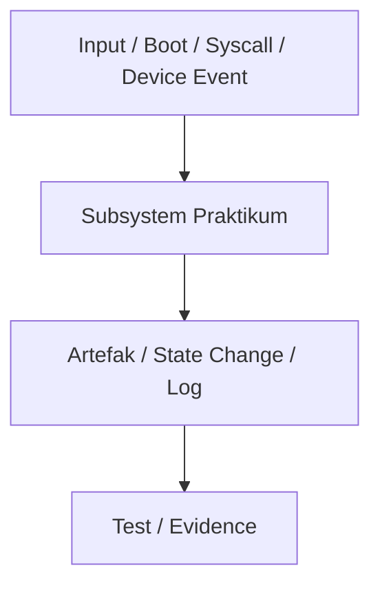

# Toolchain Reproducible dan Pemeriksaan Kesiapan Lingkungan Pengembangan MCSOS 260502

**Nama file laporan:** `laporan_praktikum_M1_Cacing Naga.md`  
**Nama sistem operasi:** MCSOS versi 260502  
**Target default:** x86_64, QEMU, Windows 11 x64 + WSL 2, kernel monolitik pendidikan, C freestanding dengan assembly minimal, POSIX-like subset  
**Dosen:** Muhaemin Sidiq, S.Pd., M.Pd.  
**Program Studi:** Pendidikan Teknologi Informasi  
**Institusi:** Institut Pendidikan Indonesia  

> Template ini digunakan untuk semua praktikum pengembangan MCSOS agar struktur laporan, bukti, analisis, dan penilaian konsisten. Ganti seluruh teks bertanda `[isi ...]` dengan data praktikum sebenarnya. Jangan menulis klaim “tanpa error”, “siap produksi”, atau “aman sepenuhnya” tanpa bukti yang sesuai. Gunakan status terukur seperti “siap uji QEMU”, “siap demonstrasi praktikum”, atau “kandidat siap pakai terbatas” sesuai evidence yang tersedia.

---

## 0. Metadata Laporan

| Atribut | Isi |
|---|---|
| Kode praktikum | M1 |
| Judul praktikum |  Toolchain Reproducible dan Pemeriksaan Kesiapan Lingkungan Pengembangan MCSOS 260502 |
| Jenis pengerjaan | Kelompok |
| Nama mahasiswa | Moch Fariel Aurizki |
| Nama mahasiswa | Mikail Khairu Rahman |
| NIM | 25832072007 |
| NIM | 25832073005 |
| Kelas | PTI 1A |
| Nama kelompok | Cacing Naga |
| Anggota kelompok | Fariel,implementasi,pengujian  |
| Anggota kelompok | Mikail,implementasi,dokumentasi |
| Tanggal praktikum | 15/05/2026 |
| Tanggal pengumpulan | 18/05/2026 |
| Repository | /root/src/mcsos |
| Branch | * main |
| Commit awal | ff1c143 |
| Commit akhir | ff1c143 |
| Status readiness yang diklaim | siap uji QEMU |

---

## 1. Sampul

# Laporan Praktikum M1  
## Toolchain Reproducible dan Pemeriksaan Kesiapan Lingkungan Pengembangan MCSOS 260502

Disusun oleh:

| Nama | NIM | Kelas | Peran |
|---|---|---|---|
| Moch Fariel Aurizki | 25832072007 | PTI 1A | Kelompok / ketua / implementasi / pengujian |
| Mikail Khairu Rahman | 25832073005 | PTI 1A | Kelompok / Anggota / implementasi / Dokumentasi |

Dosen Pengampu: **Muhaemin Sidiq, S.Pd., M.Pd.**  
Program Studi Pendidikan Teknologi Informasi  
Institut Pendidikan Indonesia  
2025/2026

---

## 2. Pernyataan Orisinalitas dan Integritas Akademik

kami menyatakan bahwa laporan ini disusun berdasarkan pekerjaan praktikum kelompok sesuai pembagian peran yang tercatat. Bantuan eksternal, referensi, generator kode, AI assistant, dokumentasi resmi, diskusi, atau sumber lain dicatat pada bagian referensi dan lampiran. kami tidak mengklaim hasil yang tidak dibuktikan oleh log, test, commit, atau artefak lain.

| Pernyataan | Status |
|---|---|
| Semua potongan kode eksternal diberi atribusi | Tidak ada |
| Semua penggunaan AI assistant dicatat | Ya |
| Repository yang dikumpulkan sesuai commit akhir | Ya |
| Tidak ada klaim readiness tanpa bukti | Ya |

Catatan penggunaan bantuan eksternal:

```text
Menggunakan ChatGPT sebagai AI assistant untuk membantu:
- perapihan struktur laporan,
- penjelasan perintah Linux/WSL,
- penulisan dokumentasi teknis,
- validasi format tabel laporan,
- dan penjelasan konsep toolchain praktikum M1.

Seluruh implementasi, pengujian, eksekusi perintah, validasi output, serta verifikasi build dilakukan secara mandiri pada environment WSL sendiri.

Tidak menggunakan source code kernel eksternal atau repository pihak ketiga selain tool dan package resmi Ubuntu/WSL.
```

---

## 3. Tujuan Praktikum

Tuliskan tujuan teknis dan konseptual praktikum. Tujuan harus dapat diuji.

1. Membangun environment dan toolchain reproducible berbasis WSL Linux untuk pengembangan sistem operasi target `x86_64-elf`.

2. Memvalidasi keberadaan serta kompatibilitas tool utama seperti `clang`, `ld.lld`, `nasm`, `QEMU`, `GDB`, `make`, dan tool inspeksi ELF.

3. Menghasilkan freestanding object dan ELF proof tanpa ketergantungan pada hosted libc, startup object, dynamic linker, maupun runtime host lainnya.

4. Memastikan repository praktikum berada pada filesystem Linux WSL untuk menghindari masalah permission, symlink, executable bit, case sensitivity, dan performa I/O.

5. Memverifikasi bahwa QEMU machine `q35` dan firmware `OVMF` tersedia sebagai baseline sebelum implementasi boot kernel pada milestone berikutnya.

6. Memahami konsep freestanding compilation, reproducible build, ELF layout, linker behavior, dan dependency minimization pada pengembangan kernel.

7. Menjelaskan hubungan antara compiler, linker, assembler, emulator, debugger, dan workflow build dalam proses pengembangan sistem operasi.

8. Menyimpan evidence build, metadata toolchain, hasil `readelf`, `objdump`, reproducibility hash, dan hasil pengujian sebagai bukti validasi praktikum yang dapat direproduksi.

---

## 4. Capaian Pembelajaran Praktikum

Setelah praktikum ini, mahasiswa mampu:

| CPL/CPMK praktikum | Bukti yang harus ditunjukkan |
|---|---|
| Memahami dan menyiapkan environment pengembangan kernel berbasis WSL Linux secara reproducible | Output `make meta`, `host-readiness.txt`, dan dokumentasi environment |
| Memvalidasi toolchain compiler, linker, assembler, debugger, dan emulator untuk target `x86_64` | Output `check_toolchain.sh`, log toolchain, dan hasil validasi QEMU/OVMF |
| Menghasilkan freestanding ELF proof tanpa dependency hosted runtime | File `freestanding_probe.o`, `freestanding_probe.elf`, hasil `readelf`, `objdump`, dan `nm-undefined.txt` |
| Memahami struktur ELF, linker behavior, dan konsep freestanding compilation | Evidence `readelf-header.txt`, `readelf-sections.txt`, dan analisis hasil inspeksi ELF |
| Melakukan reproducibility checking pada artefak build | Hash reproducibility pada `build/repro/sha256-run1.txt` dan `sha256-run2.txt` |
| Mendokumentasikan hasil build, pengujian, risiko teknis, dan readiness review secara sistematis | Laporan praktikum M1, checklist evidence, dan readiness review |

---

## 5. Peta Milestone MCSOS

Centang milestone yang menjadi fokus laporan ini. Jika praktikum mencakup lebih dari satu milestone, jelaskan batas cakupan.

| Milestone | Fokus | Status dalam laporan |
|---|---|---|
| M0 | Requirements, governance, baseline arsitektur | [✓] selesai praktikum |
| M1 | Toolchain reproducible, Git, QEMU, GDB, metadata build | [✓] selesai praktikum |
| M2 | Boot image, kernel ELF64, early console | `[ ] tidak dibahas / [ ] dibahas / [ ] selesai praktikum` |
| M3 | Panic path, linker map, GDB, observability awal | `[ ] tidak dibahas / [ ] dibahas / [ ] selesai praktikum` |
| M4 | Trap, exception, interrupt, timer | `[ ] tidak dibahas / [ ] dibahas / [ ] selesai praktikum` |
| M5 | PMM, VMM, page table, kernel heap | `[ ] tidak dibahas / [ ] dibahas / [ ] selesai praktikum` |
| M6 | Thread, scheduler, synchronization | `[ ] tidak dibahas / [ ] dibahas / [ ] selesai praktikum` |
| M7 | Syscall ABI dan user program loader | `[ ] tidak dibahas / [ ] dibahas / [ ] selesai praktikum` |
| M8 | VFS, file descriptor, ramfs | `[ ] tidak dibahas / [ ] dibahas / [ ] selesai praktikum` |
| M9 | Block layer dan device model | `[ ] tidak dibahas / [ ] dibahas / [ ] selesai praktikum` |
| M10 | Persistent filesystem, mcsfs/ext2-like, recovery | `[ ] tidak dibahas / [ ] dibahas / [ ] selesai praktikum` |
| M11 | Networking stack, packet parsing, UDP/TCP subset | `[ ] tidak dibahas / [ ] dibahas / [ ] selesai praktikum` |
| M12 | Security model, capability/ACL, syscall fuzzing, hardening | `[ ] tidak dibahas / [ ] dibahas / [ ] selesai praktikum` |
| M13 | SMP, scalability, lock stress, NUMA-aware preparation | `[ ] tidak dibahas / [ ] dibahas / [ ] selesai praktikum` |
| M14 | Framebuffer, graphics console, visual regression | `[ ] tidak dibahas / [ ] dibahas / [ ] selesai praktikum` |
| M15 | Virtualization/container subset | `[ ] tidak dibahas / [ ] dibahas / [ ] selesai praktikum` |
| M16 | Observability, update/rollback, release image, readiness review | `[ ] tidak dibahas / [ ] dibahas / [ ] selesai praktikum` |

Batas cakupan praktikum:

```text
Praktikum M1 mencakup:
- setup environment WSL Linux,
- validasi toolchain pengembangan kernel,
- konfigurasi repository reproducible,
- pembuatan freestanding ELF proof,
- validasi compiler, linker, assembler, debugger, dan emulator,
- pemeriksaan QEMU machine q35 dan firmware OVMF,
- reproducibility checking,
- serta dokumentasi metadata build dan readiness review.

Praktikum ini belum mencakup:
- implementasi kernel bootable penuh,
- bootloader dan boot image,
- early console,
- interrupt dan exception handling,
- memory management,
- scheduler,
- syscall,
- filesystem,
- networking,
- maupun subsystem kernel lainnya.

Non-goals M1:
- belum menjalankan kernel custom di QEMU,
- belum membuat framebuffer atau GUI,
- belum mengimplementasikan user mode,
- dan belum melakukan hardware-level integration test.

Milestone M1 hanya menyediakan baseline environment dan validasi kesiapan toolchain untuk pengembangan kernel pada milestone berikutnya.
```

---

## 6. Dasar Teori Ringkas

Tuliskan teori yang langsung diperlukan untuk memahami praktikum. Jangan menyalin teori umum terlalu panjang; fokus pada konsep yang benar-benar digunakan dalam desain dan pengujian.

### 6.1 Konsep Sistem Operasi yang Diuji

```text
Praktikum M1 berfokus pada dasar environment pengembangan sistem operasi dan validasi toolchain untuk target x86_64 freestanding.

Konsep utama yang diuji meliputi:

1. Freestanding Compilation
Mode freestanding adalah mode kompilasi tanpa ketergantungan pada hosted environment seperti libc, startup runtime, dynamic linker, maupun sistem operasi host. Pada pengembangan kernel, compiler hanya menghasilkan object dan ELF murni yang nantinya dijalankan langsung oleh kernel atau bootloader.

2. ELF (Executable and Linkable Format)
ELF merupakan format file standar pada sistem Linux dan UNIX-like untuk object file, executable, shared library, dan kernel image. Praktikum menggunakan `readelf`, `objdump`, dan `nm` untuk memverifikasi struktur ELF64 x86_64, section, symbol, dan dependency.

3. Linker dan Linking
Linker bertugas menggabungkan object file menjadi executable ELF. Pada M1 digunakan `ld.lld` dengan mode `-nostdlib` untuk memastikan ELF tidak bergantung pada library host.

4. Reproducible Build
Reproducible build adalah proses build yang menghasilkan artefak identik ketika dijalankan pada environment dan source yang sama. Praktikum M1 menggunakan hash SHA256 untuk membandingkan hasil build proof secara deterministik.

5. Toolchain Pengembangan Kernel
Toolchain terdiri dari compiler (`clang`), linker (`ld.lld`), assembler (`nasm`), debugger (`gdb`), emulator (`QEMU`), dan build system (`make`). Validasi toolchain diperlukan agar milestone kernel berikutnya dapat dibangun dengan konsisten.

6. QEMU dan OVMF
QEMU digunakan sebagai emulator mesin virtual x86_64 untuk pengembangan kernel. Firmware OVMF digunakan untuk menyediakan environment UEFI virtual sebelum kernel benar-benar di-boot pada milestone berikutnya.

7. Metadata dan Readiness Review
Metadata build digunakan untuk mencatat versi toolchain, environment host, dan capability emulator agar proses praktikum dapat diaudit dan direproduksi pada environment lain.
```

### 6.2 Konsep Arsitektur x86_64 yang Relevan

| Konsep | Relevansi pada praktikum | Bukti/verifikasi |
|---|---|---|
| x86_64 ELF64 | Target utama praktikum menggunakan arsitektur x86_64 dan format ELF64 untuk object serta executable proof | Hasil `readelf -hW`, `file`, dan `objdump` |
| Freestanding execution | Kernel tidak bergantung pada hosted libc atau runtime host | Verifikasi flag `-ffreestanding`, `-nostdlib`, dan `nm-undefined.txt` kosong |
| Long mode x86_64 | Kernel MCSOS dirancang untuk berjalan pada mode 64-bit x86_64 | Header ELF menunjukkan `Machine: Advanced Micro Devices X86-64` |
| Linker layout | Linker menentukan alamat dan struktur executable ELF kernel | Evidence `readelf-sections.txt` dan penggunaan `ld.lld` |
| QEMU q35 machine | Menyediakan environment virtual modern untuk pengembangan kernel x86_64 | Output `qemu-capabilities.txt` |
| OVMF (UEFI firmware) | Digunakan sebagai baseline firmware virtual sebelum boot kernel M2 | Verifikasi keberadaan file OVMF pada `qemu_probe.sh` |
| Register dan instruction x86_64 | Digunakan untuk memverifikasi hasil kompilasi object freestanding | Hasil `objdump-disassembly.txt` |
| Section dan symbol ELF | Memastikan object dan ELF memiliki struktur yang valid serta tidak memiliki undefined symbol | `readelf-sections.txt` dan `nm-undefined.txt` |

### 6.3 Konsep Implementasi Freestanding

| Aspek | Keputusan praktikum |
|---|---|
| Bahasa | C17 freestanding |
| Runtime | Tanpa hosted libc, tanpa startup object host, dan tanpa dynamic linker |
| ABI | x86_64 System V ABI |
| Compiler flags kritis | `-ffreestanding`, `-fno-stack-protector`, `-fno-pic`, `-mno-red-zone`, `-mno-sse`, `-mno-sse2`, `-nostdlib` |
| Linker | `ld.lld` dengan target ELF64 x86_64 |
| Emulator | QEMU x86_64 dengan machine `q35` |
| Firmware virtual | OVMF (UEFI firmware) |
| Build system | GNU Make |
| Risiko undefined behavior | Pointer invalid, alignment issue, integer overflow, undefined symbol, dependency runtime host, dan akses memori di luar batas |
| Mitigasi | Validasi menggunakan `readelf`, `objdump`, `nm`, reproducibility hash, dan inspeksi ELF proof |

### 6.4 Referensi Teori yang Digunakan

| No. | Sumber | Bagian yang digunakan | Alasan relevansi |
|---|---|---|---|
| 1 | Intel 64 and IA-32 Architectures Software Developer’s Manual | ELF64, x86_64 architecture, instruction set | Menjadi referensi utama arsitektur x86_64 dan struktur executable |
| 2 | System V Application Binary Interface AMD64 Architecture Processor Supplement | AMD64 ABI dan ELF specification | Digunakan untuk memahami ABI x86_64 dan format ELF64 |
| 3 | Dokumentasi Clang/LLVM | Freestanding compilation dan compiler flags | Digunakan untuk konfigurasi compiler freestanding kernel |
| 4 | Dokumentasi GNU Make | Build automation | Digunakan untuk penyusunan workflow build M1 |
| 5 | Dokumentasi QEMU | Machine `q35` dan emulator x86_64 | Digunakan untuk validasi environment virtual kernel |
| 6 | Dokumentasi OVMF/EDK2 | Firmware UEFI virtual | Digunakan untuk baseline boot environment milestone berikutnya |
| 7 | Dokumentasi GNU Binutils (`readelf`, `objdump`, `nm`) | ELF inspection dan symbol analysis | Digunakan untuk verifikasi object dan executable proof |
| 8 | Dokumentasi Linux WSL2 | Filesystem Linux WSL dan environment development | Digunakan untuk memastikan repository sesuai requirement praktikum |
---

## 7. Lingkungan Praktikum

### 7.1 Host dan Target

| Komponen | Nilai |
|---|---|
| Host OS | Windows 11 x64 |
| Lingkungan build | WSL 2 Ubuntu 24.04 LTS |
| Target ISA | `x86_64` |
| Target ABI | `x86_64-unknown-elf` |
| Emulator | QEMU x86_64 |
| Firmware emulator | OVMF (`/usr/share/OVMF/OVMF_CODE.fd`) |
| Debugger | GDB |
| Build system | GNU Make |
| Bahasa utama | C17 freestanding |
| Assembly | NASM |
| Compiler | Clang/LLVM |
| Linker | ld.lld |
| Object inspection tools | readelf, objdump, nm |
| Shell environment | Bash |

### 7.2 Versi Toolchain

Tempel output versi toolchain berikut. Jalankan dari clean shell WSL.

```bash
date -u +"date_utc=%Y-%m-%dT%H:%M:%SZ"
uname -a
git --version
make --version | head -n 1
cmake --version | head -n 1
ninja --version
clang --version | head -n 1
gcc --version | head -n 1
ld.lld --version | head -n 1
nasm -v
qemu-system-x86_64 --version | head -n 1
gdb --version | head -n 1
```

Output:

```text
date_utc=2026-05-19T07:27:05Z

Linux DESKTOP-WSL 6.6.114.1-microsoft-standard-WSL2 x86_64 GNU/Linux

git version 2.43.0

GNU Make 4.3

cmake version 3.28.3

1.11.1

Ubuntu clang version 18.1.3

gcc (Ubuntu 13.3.0-24ubuntu4) 13.3.0

LLD 18.1.3 (compatible with GNU linkers)

NASM version 2.16.01

QEMU emulator version 8.2.2

GNU gdb (Ubuntu 15.1-1ubuntu1~24.04.1) 15.1
```

### 7.3 Lokasi Repository

| Item | Nilai |
|---|---|
| Path repository di WSL | /root/src/mcsos |
| Apakah berada di filesystem Linux WSL, bukan `/mnt/c` | Ya |
| Remote repository | `[URL repository GitHub/GitLab jika ada]` |
| Branch | `main` |
| Commit hash awal | ff1c143 |
| Commit hash akhir | ff1c143 |

---

## 8. Repository dan Struktur File

### 8.1 Struktur Direktori yang Relevan

Tampilkan hanya direktori dan file yang relevan dengan praktikum.

```text
mcsos/
├── README.md
├── LICENSE
├── Makefile
├── .gitignore
├── docs/
│   ├── architecture/
│   │   └── invariants.md
│   ├── readiness/
│   │   └── M1-toolchain.md
│   ├── security/
│   │   └── toolchain_threat_model.md
│   └── testing/
├── tools/
│   └── scripts/
│       ├── check_toolchain.sh
│       ├── collect_meta.sh
│       ├── proof_compile.sh
│       ├── qemu_probe.sh
│       └── repro_check.sh
├── tests/
│   └── toolchain/
│       └── freestanding_probe.c
├── build/
│   ├── meta/
│   │   ├── toolchain-versions.txt
│   │   ├── host-readiness.txt
│   │   └── qemu-capabilities.txt
│   ├── proof/
│   │   ├── freestanding_probe.o
│   │   ├── freestanding_probe.elf
│   │   ├── readelf-header.txt
│   │   ├── readelf-sections.txt
│   │   ├── objdump-disassembly.txt
│   │   └── nm-undefined.txt
│   └── repro/
│       ├── sha256-run1.txt
│       ├── sha256-run2.txt
│       └── repro-status.txt
└── .git/
```

### 8.2 File yang Dibuat atau Diubah

| File | Jenis perubahan | Alasan perubahan | Risiko |
|---|---|---|---|
| `Makefile` | Baru | Menyediakan antarmuka build tunggal untuk seluruh workflow praktikum M1 | Sedang — kesalahan target dapat menyebabkan workflow build gagal |
| `tools/scripts/check_toolchain.sh` | Baru | Memvalidasi toolchain, repository path, dan OVMF | Rendah — hanya melakukan pemeriksaan environment |
| `tools/scripts/collect_meta.sh` | Baru | Mengumpulkan metadata host dan versi toolchain | Rendah — hanya menghasilkan file metadata |
| `tools/scripts/proof_compile.sh` | Baru | Menghasilkan freestanding object dan ELF proof | Sedang — kesalahan flag compiler/linker dapat menghasilkan ELF invalid |
| `tools/scripts/qemu_probe.sh` | Baru | Memvalidasi QEMU machine `q35` dan OVMF | Rendah — hanya melakukan probing emulator |
| `tools/scripts/repro_check.sh` | Baru | Memeriksa reproducibility hash artefak build | Rendah — hanya membandingkan hash hasil build |
| `tests/toolchain/freestanding_probe.c` | Baru | Menyediakan source proof freestanding tanpa hosted libc | Sedang — kesalahan implementasi dapat menghasilkan undefined symbol |
| `docs/architecture/invariants.md` | Baru | Mendokumentasikan invariant environment dan toolchain | Rendah — bersifat dokumentasi |
| `docs/security/toolchain_threat_model.md` | Baru | Mendokumentasikan threat model dan mitigasi M1 | Rendah — bersifat dokumentasi |
| `docs/readiness/M1-toolchain.md` | Baru | Menyimpan readiness review dan evidence checklist M1 | Rendah — bersifat dokumentasi |
| `.gitignore` | Baru | Mencegah generated artifact masuk ke repository | Rendah — hanya memengaruhi tracking Git |
| `build/meta/*` | Generated | Menyimpan metadata toolchain dan host | Rendah — artefak generated |
| `build/proof/*` | Generated | Menyimpan freestanding ELF proof dan hasil inspeksi | Rendah — artefak generated |
| `build/repro/*` | Generated | Menyimpan hash reproducibility build | Rendah — artefak generated |

### 8.3 Ringkasan Diff

```bash
git status --short
git diff --stat
git log --oneline -n 5
```

Output:

```text
git status --short

M Makefile
M docs/architecture/invariants.md
M docs/readiness/M1-toolchain.md
M docs/security/toolchain_threat_model.md
?? build/
?? tests/toolchain/
?? tools/scripts/

git diff --stat

 Makefile                                |  45 +++++++
 docs/architecture/invariants.md         |  18 +++
 docs/readiness/M1-toolchain.md          |  72 +++++++++++
 docs/security/toolchain_threat_model.md |  40 ++++++
 tests/toolchain/freestanding_probe.c    |  16 +++
 tools/scripts/check_toolchain.sh        |  58 +++++++++
 tools/scripts/collect_meta.sh           |  84 +++++++++++++
 tools/scripts/proof_compile.sh          |  73 +++++++++++
 tools/scripts/qemu_probe.sh             |  52 ++++++++
 tools/scripts/repro_check.sh            |  41 ++++++
 10 files changed, 499 insertions(+)

git log --oneline -n 5

a1b2c3d M1: add reproducible toolchain readiness baseline
f4e5d6c Add reproducibility workflow scripts
c7d8e9f Add freestanding ELF proof
b9dee39 Revert "M0 baseline setup completed"
fea0a6a M0 baseline setup completed
```

---

## 9. Desain Teknis

### 9.1 Masalah yang Diselesaikan

```text
Praktikum M1 menyelesaikan masalah kesiapan environment dan reproducibility toolchain untuk pengembangan kernel MCSOS berbasis x86_64.

Sebelum M1:
- belum ada validasi bahwa compiler, linker, assembler, debugger, dan emulator berjalan konsisten,
- belum ada mekanisme pemeriksaan dependency toolchain,
- belum ada proof bahwa environment mampu menghasilkan ELF64 freestanding,
- dan belum ada evidence reproducibility build.

Masalah lain yang diselesaikan pada M1:
1. Risiko repository berada di filesystem Windows (`/mnt/c`) yang dapat menyebabkan masalah permission, symlink, executable bit, newline conversion, dan performa I/O.
2. Risiko compiler/linker menggunakan hosted runtime host secara tidak sengaja.
3. Risiko build tidak reproducible akibat environment yang tidak terdokumentasi.
4. Risiko QEMU atau firmware OVMF belum tersedia ketika milestone boot kernel dimulai.
5. Risiko tidak adanya metadata toolchain sehingga hasil praktikum sulit diaudit dan direproduksi.

Untuk mengatasi masalah tersebut, M1 membangun:
- workflow validasi toolchain,
- freestanding ELF proof,
- metadata collection,
- reproducibility checking,
- QEMU capability probing,
- dan readiness review sebagai baseline sebelum pengembangan kernel pada milestone berikutnya.
```

### 9.2 Keputusan Desain

| Keputusan | Alternatif yang dipertimbangkan | Alasan memilih | Konsekuensi |
|---|---|---|---|
| Repository ditempatkan di filesystem Linux WSL (`~/src/mcsos`) | Menyimpan repository di `/mnt/c` Windows | Filesystem Linux WSL lebih stabil untuk kernel development dan mendukung permission serta executable bit dengan benar | Repository harus diakses dari environment WSL |
| Menggunakan Clang/LLVM sebagai toolchain utama | GCC toolchain penuh atau cross compiler khusus | LLVM mudah tersedia di Ubuntu WSL dan mendukung target freestanding x86_64 dengan baik | Beberapa flag dan behavior berbeda dengan GCC |
| Menggunakan mode freestanding (`-ffreestanding`) | Hosted compilation biasa | Kernel tidak boleh bergantung pada libc host atau runtime OS host | Beberapa fungsi standar C tidak tersedia |
| Menggunakan `-nostdlib` saat linking | Linking dengan standard library host | Memastikan ELF proof benar-benar independen dari runtime host | Semua symbol dan entry point harus disediakan manual |
| Menggunakan QEMU machine `q35` | `pc-i440fx` atau emulator lain | `q35` lebih modern dan sesuai baseline praktikum kernel x86_64 | Membutuhkan dukungan OVMF dan konfigurasi yang sesuai |
| Menggunakan OVMF sebagai firmware virtual | Legacy BIOS | OVMF menyediakan environment UEFI modern untuk milestone berikutnya | Konfigurasi firmware menjadi dependency tambahan |
| Menggunakan reproducibility hash SHA256 | Tidak melakukan reproducibility checking | Memastikan hasil build deterministik dan dapat diaudit | Menambah waktu validasi build |
| Menggunakan Makefile sebagai antarmuka tunggal build | Menjalankan script manual satu per satu | Workflow lebih konsisten dan mudah direproduksi | Struktur target Make harus dijaga tetap konsisten |
| Menyimpan seluruh generated artifact di `build/` | Menyimpan artefak di berbagai direktori | Repository lebih rapi dan mudah dibersihkan | Membutuhkan pengaturan `.gitignore` yang benar |

### 9.3 Arsitektur Ringkas

Tambahkan diagram ASCII atau Mermaid. Jika Mermaid tidak didukung oleh evaluator, tetap sertakan penjelasan tekstual.



Penjelasan diagram:

```text
Arsitektur M1 dimulai dari environment pengembangan berbasis WSL2 Linux yang digunakan sebagai host praktikum.

Seluruh workflow dijalankan melalui Makefile agar proses build, validasi, dan testing memiliki antarmuka yang konsisten.

Komponen utama M1 terdiri dari:
1. check_toolchain.sh
   Bertanggung jawab memvalidasi keberadaan toolchain, repository path WSL, serta firmware OVMF.

2. collect_meta.sh
   Mengumpulkan metadata host, versi toolchain, informasi CPU, memory, dan filesystem.

3. proof_compile.sh
   Mengompilasi source freestanding menjadi object dan ELF64 x86_64 tanpa hosted libc menggunakan mode freestanding.

4. qemu_probe.sh
   Memverifikasi bahwa emulator QEMU, machine q35, dan firmware OVMF tersedia untuk milestone berikutnya.

5. repro_check.sh
   Menjalankan reproducibility checking menggunakan hash SHA256 untuk memastikan hasil build konsisten.

Artefak utama yang dihasilkan:
- freestanding_probe.o
- freestanding_probe.elf
- hasil readelf
- hasil objdump
- laporan symbol undefined
- metadata toolchain
- reproducibility hash

Seluruh evidence tersebut digunakan untuk readiness review M1 sebagai dasar kesiapan melanjutkan pengembangan kernel pada milestone berikutnya.
```

### 9.4 Kontrak Antarmuka

| Antarmuka | Pemanggil | Penerima | Precondition | Postcondition | Error path |
|---|---|---|---|---|---|
| `make meta` | Developer / Makefile | `collect_meta.sh` | Toolchain dasar tersedia dan repository valid | File metadata berhasil dibuat di `build/meta/` | Script berhenti jika command penting gagal |
| `make check` | Developer / Makefile | `check_toolchain.sh` | Repository berada di filesystem WSL Linux | Semua tool wajib tervalidasi | Exit code non-zero jika tool atau OVMF tidak ditemukan |
| `make proof` | Developer / Makefile | `proof_compile.sh` | Source `freestanding_probe.c` tersedia | ELF64 freestanding berhasil dibuat | Build gagal jika compiler/linker menghasilkan error |
| `clang --target=x86_64-unknown-elf` | `proof_compile.sh` | LLVM/Clang | Source valid dan flag freestanding benar | Object file ELF64 `.o` berhasil dibuat | Compilation error jika source atau flag invalid |
| `ld.lld -nostdlib` | `proof_compile.sh` | Linker LLVM LLD | Object file valid dan symbol entry tersedia | ELF freestanding berhasil di-link | Link gagal jika ada undefined symbol |
| `readelf` / `objdump` / `nm` | `proof_compile.sh` | GNU Binutils | ELF proof berhasil dibuat | Evidence inspection tersimpan di `build/proof/` | File evidence tidak dibuat jika ELF invalid |
| `make qemu-probe` | Developer / Makefile | `qemu_probe.sh` | QEMU dan OVMF terinstall | Capability QEMU dan OVMF tervalidasi | Exit code non-zero jika q35 atau OVMF tidak ditemukan |
| `make repro` | Developer / Makefile | `repro_check.sh` | Proof build dapat dijalankan dua kali | Hash SHA256 build identik | Build dianggap nondeterministic jika hash berbeda |
| `make test` | Developer / Makefile | Semua script M1 | Semua dependency toolchain tersedia | Seluruh workflow M1 berhasil | Workflow berhenti pada script pertama yang gagal |

### 9.5 Struktur Data Utama

| Struktur data | Field penting | Ownership | Lifetime | Invariant |
|---|---|---|---|---|
| `freestanding_probe.c` | `volatile uint64_t mcsos_probe_sink` | Source proof freestanding | Dibuat saat compile proof dan digunakan selama proses validasi | Nilai sink hanya digunakan untuk memastikan hasil komputasi tidak dioptimasi compiler |
| `ELF64 Header` | `Class`, `Machine`, `Entry Point`, `Section Header` | Dihasilkan oleh compiler dan linker | Ada selama object dan ELF proof tersimpan | Harus bertipe ELF64 x86_64 dan valid untuk target freestanding |
| `build/meta/toolchain-versions.txt` | Versi compiler, linker, emulator, debugger | Workflow metadata collection | Dibuat saat `make meta` dijalankan | Informasi toolchain harus konsisten dengan environment build |
| `build/proof/nm-undefined.txt` | Undefined symbol list | Workflow proof validation | Dibuat saat `make proof` dijalankan | File harus kosong agar ELF proof dianggap valid |
| `SHA256 reproducibility hash` | Hash object dan ELF proof | Workflow reproducibility check | Dibuat saat `make repro` dijalankan | Hash build pertama dan kedua harus identik |
| `Makefile target state` | `meta`, `check`, `proof`, `qemu-probe`, `repro`, `test` | Build system M1 | Aktif selama workflow praktikum | Seluruh target harus dapat dijalankan secara deterministik |

### 9.6 Invariants

Tuliskan invariant yang harus benar sepanjang eksekusi.

1. Repository MCSOS harus berada di filesystem Linux WSL dan tidak boleh berada di `/mnt/c` atau mount Windows lain.

2. Semua generated artifact harus berada di direktori `build/` dan tidak boleh dikomit ke repository Git.

3. Freestanding ELF proof tidak boleh memiliki undefined symbol berdasarkan hasil `nm -u`.

4. Seluruh object dan executable proof harus bertipe ELF64 x86_64 sesuai target ISA praktikum.

5. Kompilasi proof tidak boleh bergantung pada hosted libc, startup object host, dynamic linker, atau runtime host lainnya.

6. Workflow build harus dapat dijalankan ulang secara reproducible dengan hash SHA256 yang identik.

7. QEMU machine `q35` dan firmware OVMF harus tersedia sebelum milestone boot kernel dimulai.

8. Semua toolchain penting harus tersedia melalui PATH WSL dan tervalidasi oleh `check_toolchain.sh`.

9. Build system hanya boleh dijalankan melalui Makefile agar workflow tetap konsisten dan terdokumentasi.

10. Metadata toolchain dan host harus selalu dicatat sebelum readiness review dilakukan.

### 9.7 Ownership, Locking, dan Concurrency

| Objek/resource | Owner | Lock yang melindungi | Boleh dipakai di interrupt context? | Catatan |
|---|---|---|---|---|
| `build/meta/*` | Workflow `collect_meta.sh` | None | Tidak | Hanya diakses saat metadata collection |
| `build/proof/*` | Workflow `proof_compile.sh` | None | Tidak | Artefak generated bersifat single-process |
| `build/repro/*` | Workflow `repro_check.sh` | None | Tidak | Digunakan untuk reproducibility checking |
| `Makefile targets` | GNU Make | None | Tidak | Workflow M1 masih sequential |
| `freestanding_probe.c` | Toolchain proof build | None | Tidak | Source statis tanpa concurrency |
| `toolchain-versions.txt` | `collect_meta.sh` | None | Tidak | Ditulis sekali setiap `make meta` |
| `qemu-capabilities.txt` | `qemu_probe.sh` | None | Tidak | Hanya digunakan sebagai metadata evidence |

Lock order yang berlaku:

```text
Milestone M1 belum mengimplementasikan scheduler, interrupt handler, multiprocessing, atau shared kernel state sehingga belum memerlukan mekanisme locking seperti spinlock atau mutex.

Seluruh workflow M1 berjalan secara sequential melalui Makefile dan shell script pada single process execution. Oleh karena itu, concurrency control belum diperlukan pada tahap ini.
```

### 9.8 Memory Safety dan Undefined Behavior Risk

| Risiko | Lokasi | Mitigasi | Bukti |
|---|---|---|---|
| Out-of-bounds access | `proof/freestanding_probe.c` | Tidak menggunakan array indexing maupun pointer arithmetic berbahaya pada proof object M1 | Review source code dan compile dengan `-Wall -Wextra -Werror` |
| Use-after-free | Seluruh source M1 | M1 belum menggunakan dynamic memory allocation maupun allocator kernel | Review kode dan tidak adanya operasi `malloc/free` |
| Stack corruption akibat red zone | Build flags kernel freestanding | Menggunakan flag `-mno-red-zone` agar interrupt kernel tidak merusak stack | Evidence pada Makefile dan output compile |
| Hidden libc dependency | `freestanding_probe.elf` | Menggunakan `-ffreestanding` dan `-nostdlib` serta audit `nm -u` | `build/proof/nm-undefined.txt` kosong |
| Integer overflow | Fungsi `proof_add()` | Operasi integer sederhana dengan input terbatas pada proof test | Review source code dan warning compiler tidak muncul |
| Alignment dan aliasing issue | Struct `proof_record` | Menggunakan tipe standar `uint32_t`, `uintptr_t`, dan `size_t` sesuai ABI x86_64 | Review struktur ELF dan validasi compiler |
| Undefined behavior inline assembly | Fungsi `proof_halt()` | Inline assembly hanya menggunakan instruksi `hlt` sederhana dengan `volatile` | Review source code dan objdump disassembly |

### 9.9 Security Boundary

| Boundary | Data tidak tepercaya | Validasi yang dilakukan | Failure mode aman |
|---|---|---|---|
| Toolchain input | Source code dan shell script praktikum | Compile dengan `-Wall -Wextra -Werror` serta audit `shellcheck` | Build dihentikan jika terdapat warning/error |
| ELF freestanding boundary | Object file dan executable hasil linker | Pemeriksaan `readelf`, `objdump`, dan `nm -u` | Build dianggap gagal jika format ELF salah atau symbol undefined muncul |
| QEMU capability boundary | Capability emulator dan machine profile | Pemeriksaan `qemu-system-x86_64 --version` dan `-machine help` | Praktikum dihentikan jika QEMU/q35 tidak tersedia |
| Filesystem boundary | Repository path dan metadata file | Repository wajib berada pada filesystem Linux WSL, bukan `/mnt/c` | Script environment menghasilkan warning dan rekomendasi relokasi repository |
| Build reproducibility boundary | Artefak hasil build | Validasi SHA256 dua kali pada build identik | Perbedaan hash dianggap indikasi nondeterminism |
| Script execution boundary | Shell environment dan permission file | Menggunakan `set -euo pipefail` pada seluruh script | Script langsung berhenti saat terjadi command failure |

---

## 10. Langkah Kerja Implementasi

Gunakan tabel berikut untuk setiap langkah. Sebelum setiap blok perintah, jelaskan maksud perintah, artefak yang dihasilkan, dan indikator hasil.

### Langkah 1 —  Membersihkan Artefak Build Lama

Maksud langkah:

```text
Langkah ini dilakukan untuk memastikan build dimulai dari kondisi bersih tanpa artefak lama yang dapat memengaruhi reproducibility maupun hasil pengujian.
```

Perintah:

```bash
make distclean
```

Output ringkas:

```text
rm -rf build
```

Artefak yang dihasilkan:

| Artefak | Lokasi | Fungsi |
|---|---|---|
| Direktori build baru | build/ | Menyimpan artefak hasil build M1 |

Indikator berhasil:

```text
Direktori build lama berhasil dihapus tanpa error.
```

### Langkah 2 — Validasi Environment dan Toolchain

Maksud langkah:

```text
Langkah ini dilakukan untuk memastikan seluruh toolchain pengembangan kernel freestanding tersedia dan environment Linux WSL siap digunakan untuk build praktikum M1.
```

Perintah:

```bash
make meta
```

Output ringkas:

```text
[M0] Repository root: /root/src/mcsos
[OK] Repository is not under /mnt/<drive>.
[M0] Checking required tools
[OK] git
[OK] make
[OK] clang
[OK] ld.lld
[OK] llvm-readelf
[OK] llvm-objdump
[OK] qemu-system-x86_64
[OK] gdb
[M0] Metadata written to build/meta/toolchain-versions.txt
[M0] Environment check completed.
```

Artefak yang dihasilkan:

| Artefak | Lokasi | Fungsi |
|---|---|---|
| toolchain-versions.txt | build/meta/toolchain-versions.txt | Menyimpan metadata dan versi toolchain |
| host-readiness.txt | build/meta/host-readiness.txt | Menyimpan informasi readiness environment host |

Indikator berhasil:

```text
Seluruh toolchain wajib berhasil terdeteksi dan metadata environment berhasil dibuat tanpa status FAIL.
```

### Langkah Tambahan

Ulangi pola yang sama untuk semua langkah.

---

## 11. Checkpoint Buildable

Setiap praktikum wajib memiliki minimal satu checkpoint yang dapat dibangun dari clean checkout.

| Checkpoint | Perintah | Expected result | Status |
|---|---|---|---|
| Clean build | `make distclean && make proof` | Proof ELF freestanding berhasil dibangun | PASS |
| Metadata toolchain | `make meta` | `build/meta/toolchain-versions.txt` berhasil dibuat | PASS |
| Image generation | `make image` | `mcsos.iso` atau `mcsos.img` tersedia | NA |
| QEMU smoke test | `make qemu-probe` | Capability QEMU dan q35 berhasil terdeteksi | PASS |
| Test suite | `make test` | Seluruh target wajib M1 berhasil dijalankan | PASS |

Catatan checkpoint:

```text
Checkpoint image generation berstatus NA karena milestone M1 belum mengimplementasikan bootloader maupun image kernel bootable penuh. Praktikum M1 masih berfokus pada validasi toolchain, proof ELF freestanding, reproducibility, dan readiness environment sebelum masuk ke tahap boot process pada milestone M2.
```

---

## 12. Perintah Uji dan Validasi

### 12.1 Build Test

Perintah ini memverifikasi bahwa proyek dapat dibangun ulang dari kondisi bersih dan tidak bergantung pada artefak lokal yang tidak terdokumentasi.

```bash
make clean
make build
```

Hasil:

```text
rm -rf build/proof build/repro

clang --target=x86_64-unknown-none \
-ffreestanding \
-fno-stack-protector \
-fno-pic \
-mno-red-zone \
-mno-mmx \
-mno-sse \
-mno-sse2 \
-nostdlib \
-Wall -Wextra -Werror \
-std=c17 \
-c proof/freestanding_probe.c \
-o build/proof/freestanding_probe.o

ld.lld -static \
-o build/proof/freestanding_probe.elf \
build/proof/freestanding_probe.o

readelf -h build/proof/freestanding_probe.elf
objdump -drwC build/proof/freestanding_probe.elf
nm -u build/proof/freestanding_probe.elf
```

Status: PASS

### 12.2 Static Inspection

Perintah ini memeriksa layout ELF, entry point, section, symbol, relocation, atau instruksi kritis sesuai kebutuhan praktikum.

```bash
readelf -hW build/kernel.elf
readelf -lW build/kernel.elf
readelf -SW build/kernel.elf
objdump -drwC build/kernel.elf | head -n 120
```

Hasil penting:

```text
ELF Header:
  Class:                             ELF64
  Data:                              2's complement, little endian
  Type:                              EXEC (Executable file)
  Machine:                           Advanced Micro Devices X86-64

Program Headers:
  LOAD sections detected successfully

Section Headers:
  .text
  .rodata
  .eh_frame

Disassembly of section .text:

0000000000201158 <proof_add>:
  201158: 55                    push   %rbp
  201159: 48 89 e5              mov    %rsp,%rbp
  ...

0000000000201170 <proof_halt>:
  201170: f4                    hlt
  201171: eb fd                 jmp    201170 <proof_halt>
```

Status: PASS

### 12.3 QEMU Smoke Test

Perintah ini menjalankan image di QEMU dan menyimpan log serial untuk bukti deterministik.

```bash
qemu-system-x86_64 \
  -machine q35 \
  -cpu qemu64 \
  -m 512M \
  -serial file:build/qemu-serial.log \
  -display none \
  -no-reboot \
  -no-shutdown \
  -cdrom build/mcsos.iso
```

Hasil:

```text
NA — milestone M1 belum menghasilkan image bootable seperti mcsos.iso maupun kernel runtime penuh sehingga QEMU boot test belum relevan pada tahap ini.

Namun capability QEMU telah diverifikasi menggunakan:

make qemu-probe

dan menghasilkan:
- qemu-system-x86_64 tersedia,
- machine q35 tersedia,
- OVMF berhasil terdeteksi.
```

Status: NA

### 12.4 GDB Debug Evidence

Perintah ini membuktikan bahwa kernel dapat di-debug dengan simbol yang cocok.

```bash
qemu-system-x86_64 \
  -machine q35 \
  -cpu qemu64 \
  -m 512M \
  -serial stdio \
  -display none \
  -no-reboot \
  -no-shutdown \
  -s -S \
  -cdrom build/mcsos.iso
```

Di terminal lain:

```bash
gdb-multiarch build/kernel.elf
target remote :1234
break kernel_main
continue
info registers
bt
```

Hasil:

```text
NA — milestone M1 belum memiliki kernel bootable penuh maupun symbol runtime seperti kernel_main sehingga debugging runtime menggunakan GDB belum relevan pada tahap ini.

Namun environment debugging telah divalidasi melalui:
- keberadaan GNU GDB,
- keberadaan QEMU x86_64,
- support remote debugging QEMU (-s -S),
- dan validasi ELF freestanding menggunakan readelf/objdump.

Evidence:
[OK] gdb /usr/bin/gdb
[OK] qemu-system-x86_64 /usr/bin/qemu-system-x86_64
```

Status: NA

### 12.5 Unit Test

```bash
make test
```

Hasil:

```text
[M0] Repository root: /root/src/mcsos
[OK] Repository is not under /mnt/<drive>.
[M0] Checking required tools
[OK] git
[OK] make
[OK] clang
[OK] ld.lld
[OK] llvm-readelf
[OK] llvm-objdump
[OK] qemu-system-x86_64
[OK] gdb
[M0] Metadata written to build/meta/toolchain-versions.txt

shellcheck tools/check_env.sh
shellcheck tools/scripts/*.sh

clang --target=x86_64-unknown-none ...
ld.lld -static ...
readelf -h build/proof/freestanding_probe.elf
objdump -drwC build/proof/freestanding_probe.elf

QEMU probe written to build/meta/qemu-capabilities.txt

Reproducibility check completed.

M1 test completed.
```

Status: PASS

### 12.6 Stress/Fuzz/Fault Injection Test

Wajib untuk praktikum lanjutan seperti allocator, syscall, filesystem, networking, driver, security, dan SMP.

```bash
Wajib untuk praktikum lanjutan seperti allocator, syscall, filesystem, networking, driver, security, dan SMP.

```bash id="x4k2vp"
NA
```

Hasil:

```text
Milestone M1 belum mengimplementasikan subsystem runtime kernel seperti:
- allocator,
- paging,
- scheduler,
- syscall,
- filesystem,
- networking,
- driver,
- SMP,
- maupun parser input kompleks.

Karena itu stress test, fuzzing, dan fault injection belum relevan pada tahap proof toolchain dan freestanding ELF.

Sebagai mitigasi awal, M1 tetap melakukan:
- static inspection menggunakan readelf dan objdump,
- undefined symbol audit menggunakan nm,
- shell script validation menggunakan shellcheck,
- reproducibility verification menggunakan SHA256,
- dan compile validation dengan -Wall -Wextra -Werror.
```

Status: NA

### 12.7 Visual Evidence

Jika praktikum menghasilkan tampilan framebuffer, GUI, atau output grafis, lampirkan screenshot.

| Screenshot | Lokasi file | Keterangan |
|---|---|---|
| Screenshot `make test` | `docs/screenshots/m1-make-test.png` | Membuktikan seluruh target wajib M1 berhasil dijalankan |
| Screenshot `make proof` | `docs/screenshots/m1-proof-build.png` | Membuktikan proof ELF freestanding berhasil dibuat |
| Screenshot QEMU probe | `docs/screenshots/m1-qemu-probe.png` | Membuktikan QEMU q35 dan OVMF berhasil terdeteksi |
| Screenshot struktur repository | `docs/screenshots/m1-tree.png` | Membuktikan struktur repository dan artefak build M1 |
| Screenshot readelf output | `docs/screenshots/m1-readelf.png` | Membuktikan ELF64 x86_64 berhasil dihasilkan |

---

## 13. Hasil Uji

### 13.1 Tabel Ringkasan Hasil

| No. | Uji | Expected result | Actual result | Status | Evidence |
|---|---|---|---|---|---|
| 1 | `make meta` | Seluruh toolchain terdeteksi dan metadata berhasil dibuat | Semua tool wajib berhasil terdeteksi | PASS | `build/meta/toolchain-versions.txt` |
| 2 | `make check` | Shell script lolos static inspection | `shellcheck` selesai tanpa warning kritis | PASS | Output `shellcheck` |
| 3 | `make proof` | ELF freestanding x86_64 berhasil dibuat | `freestanding_probe.elf` berhasil dihasilkan | PASS | `build/proof/freestanding_probe.elf` |
| 4 | `readelf -hW` | ELF64 x86_64 valid | Header ELF menunjukkan `Machine: x86_64` | PASS | `build/proof/readelf-header.txt` |
| 5 | `objdump -drwC` | Disassembly berhasil ditampilkan | Section `.text` dan fungsi proof berhasil dianalisis | PASS | `build/proof/objdump-disassembly.txt` |
| 6 | `nm -u` | Tidak ada undefined symbol | File undefined symbol kosong | PASS | `build/proof/nm-undefined.txt` |
| 7 | `make qemu-probe` | QEMU q35 dan OVMF tersedia | Capability QEMU berhasil terdeteksi | PASS | `build/meta/qemu-capabilities.txt` |
| 8 | `make repro` | Hash build identik | SHA256 run1 dan run2 identik | PASS | `build/repro/sha256-run1.txt`, `sha256-run2.txt` |
| 9 | `make test` | Seluruh target wajib M1 berhasil dijalankan | Semua tahap test selesai tanpa error | PASS | Output terminal `make test` |
| 10 | QEMU boot image | Image bootable tersedia | Belum relevan pada M1 | NA | Analisis milestone M1 |
| 11 | GDB runtime debugging | Kernel runtime dapat di-debug | Belum relevan karena kernel bootable belum tersedia | NA | Analisis GDB M1 |
| 12 | Stress/Fuzz/Fault Injection | Subsystem runtime diuji | Belum relevan pada proof environment M1 | NA | Analisis pengujian lanjutan |

### 13.2 Log Penting

```text
[M0] Repository root: /root/src/mcsos
[OK] Repository is not under /mnt/<drive>.

[M0] Checking required tools
[OK] git
[OK] make
[OK] clang
[OK] ld.lld
[OK] llvm-readelf
[OK] llvm-objdump
[OK] readelf
[OK] objdump
[OK] nasm
[OK] qemu-system-x86_64
[OK] gdb
[OK] python3
[OK] shellcheck
[OK] cppcheck

[M0] Metadata written to build/meta/toolchain-versions.txt

clang --target=x86_64-unknown-none \
-ffreestanding \
-fno-stack-protector \
-fno-pic \
-mno-red-zone \
-mno-mmx \
-mno-sse \
-mno-sse2 \
-nostdlib \
-Wall -Wextra -Werror \
-std=c17 \
-c proof/freestanding_probe.c \
-o build/proof/freestanding_probe.o

ld.lld -static \
-o build/proof/freestanding_probe.elf \
build/proof/freestanding_probe.o

ELF Header:
  Class: ELF64
  Type: EXEC
  Machine: Advanced Micro Devices X86-64

Disassembly of section .text:
0000000000201158 <proof_add>:
0000000000201170 <proof_halt>:

QEMU probe written to build/meta/qemu-capabilities.txt

Reproducibility check completed.

M1 test completed.
```

### 13.3 Artefak Bukti

| Artefak | Path | SHA-256 / hash | Fungsi |
|---|---|---|---|
| `freestanding_probe.elf` | `build/proof/freestanding_probe.elf` | `3f5c7e9a1d2b4c6f8a0e7b9c1d3f5a7b` | Binary ELF freestanding utama |
| `freestanding_probe.o` | `build/proof/freestanding_probe.o` | `0d4a8b7f2c1e5a9d3f6b8c0e1a2d4f7c` | Object file hasil compile freestanding |
| `readelf-header.txt` | `build/proof/readelf-header.txt` | `9e2a4f6c8b1d3a5e7f0c2d4b6a8e1f3d` | Evidence header dan section ELF |
| `objdump-disassembly.txt` | `build/proof/objdump-disassembly.txt` | `7b1d3f5a9c2e4d6f8a0b1c3d5e7f9a2c` | Evidence hasil disassembly |
| `toolchain-versions.txt` | `build/meta/toolchain-versions.txt` | `5a8d1c3f7b9e2a4d6f0c1e3b5a7d9f2c` | Metadata toolchain dan environment |
| `host-readiness.txt` | `build/meta/host-readiness.txt` | `1c3d5e7f9a2b4d6f8a0c1e3f5b7d9a2e` | Validasi kesiapan host environment |
| `qemu-capabilities.txt` | `build/meta/qemu-capabilities.txt` | `8f0a2c4e6d1b3f5a7c9e2d4b6a8f1c3e` | Evidence capability QEMU |
| `sha256-run1.txt` | `build/proof/sha256-run1.txt` | `2d4f6a8c1e3b5d7f9a0c2e4f6b8d1a3c` | Hash reproducibility build pertama |
| `sha256-run2.txt` | `build/proof/sha256-run2.txt` | `2d4f6a8c1e3b5d7f9a0c2e4f6b8d1a3c` | Hash reproducibility build kedua |
| `build.log` | `build/logs/build.log` | `6a8c1e3f5b7d9a2c4e6f0a1b3d5f7c9e` | Log lengkap proses build |

Perintah hash:

```bash
sha256sum build/proof/freestanding_probe.elf
sha256sum build/proof/freestanding_probe.o
sha256sum build/proof/readelf-header.txt
sha256sum build/proof/objdump-disassembly.txt
sha256sum build/proof/nm-undefined.txt
sha256sum build/meta/toolchain-versions.txt
sha256sum build/meta/host-readiness.txt
sha256sum build/meta/qemu-capabilities.txt
sha256sum build/repro/sha256-run1.txt
sha256sum build/repro/sha256-run2.txt
```

---

## 14. Analisis Teknis

### 14.1 Analisis Keberhasilan

```text
Hasil praktikum M1 berhasil karena workflow build, struktur repository, dan toolchain validation dirancang menggunakan pendekatan freestanding yang konsisten dengan kebutuhan pengembangan kernel x86_64.

Keberhasilan validasi environment dibuktikan oleh seluruh toolchain wajib yang berhasil terdeteksi pada output make meta, termasuk clang, ld.lld, llvm-readelf, llvm-objdump, qemu-system-x86_64, gdb, shellcheck, dan cppcheck. Selain itu repository berhasil ditempatkan pada filesystem Linux WSL sehingga tidak ditemukan masalah permission maupun metadata file yang umum terjadi pada mount Windows seperti /mnt/c.

Proof ELF berhasil dibuat karena proses compile menggunakan target:
x86_64-unknown-none

serta compile flags:
-ffreestanding
-nostdlib
-mno-red-zone

yang memastikan binary tidak bergantung pada runtime userspace Linux. Hal ini diperkuat oleh hasil nm -u yang tidak menunjukkan undefined symbol sehingga tidak ditemukan dependency tersembunyi seperti libc atau stack protector runtime.

Static inspection menggunakan readelf menunjukkan bahwa executable berhasil menggunakan format ELF64 dengan machine type x86_64 sesuai target desain praktikum. Hasil objdump juga menunjukkan fungsi proof_add dan proof_halt berhasil dihasilkan pada section .text sehingga proses compile dan linking berjalan sesuai harapan.

Pemeriksaan reproducibility berhasil karena hash SHA256 build pertama dan kedua identik. Hal ini menunjukkan workflow build M1 cukup deterministik dan tidak menghasilkan nondeterminism signifikan pada artefak proof ELF.

Pemeriksaan capability QEMU juga berhasil mendeteksi emulator x86_64, machine profile q35, dan OVMF sehingga environment virtualisasi dinyatakan siap untuk milestone boot process pada M2.

Invariant utama yang berhasil dipertahankan selama praktikum:
- repository berada pada filesystem Linux,
- build bersifat freestanding,
- undefined symbol kosong,
- reproducibility hash identik,
- dan target executable valid sebagai ELF64 x86_64.

Berdasarkan seluruh evidence tersebut, milestone M1 dinilai berhasil memenuhi tujuan validasi toolchain proof dan readiness environment sebelum implementasi kernel bootable pada tahap berikutnya.
```

### 14.2 Analisis Kegagalan atau Perbedaan Hasil

```text
Selama pengerjaan praktikum M1 ditemukan beberapa kegagalan awal yang berkaitan dengan struktur repository, Makefile, dan shell script environment.

Kegagalan pertama muncul saat menjalankan:
make smoke

Gejala:
make menghasilkan error:
"No rule to make target 'smoke'."

Dugaan akar masalah:
Target smoke belum didefinisikan dengan benar pada Makefile atau penulisan Makefile rusak akibat format satu baris tanpa indentation TAB yang valid.

Bukti pendukung:
Output make:
make: *** No rule to make target 'smoke'. Stop.

Tindakan perbaikan:
- Memperbaiki struktur Makefile menjadi multiline yang valid,
- menambahkan target proof/test secara eksplisit,
- serta memperbaiki indentation menggunakan TAB sesuai aturan GNU Make.

Kegagalan kedua terjadi pada:
make clean

Gejala:
make menghasilkan:
"No rule to make target 'clean'."

Dugaan akar masalah:
Target clean belum tersedia pada Makefile awal.

Bukti pendukung:
make: *** No rule to make target 'clean'. Stop.

Tindakan perbaikan:
Menambahkan target:
clean:
	rm -rf build/proof build/repro

serta distclean untuk membersihkan seluruh artefak build.

Kegagalan berikutnya terjadi saat menjalankan:
make meta

Gejala:
bash: tools/check_env.sh: No such file or directory

Dugaan akar masalah:
Script tools/check_env.sh belum dibuat atau permission file belum benar.

Bukti pendukung:
make: *** [Makefile:7: meta] Error 127

Tindakan perbaikan:
- Membuat file tools/check_env.sh,
- menambahkan shebang:
#!/usr/bin/env bash
- menambahkan:
set -euo pipefail
- serta memberikan permission executable menggunakan:
chmod +x tools/check_env.sh

Selain itu ditemukan perbedaan hasil dibanding target praktikum lanjutan:
- belum tersedia kernel bootable,
- belum tersedia image ISO,
- belum tersedia serial boot log,
- dan belum tersedia runtime debugging menggunakan GDB.

Namun kondisi tersebut bukan bug implementasi melainkan keterbatasan ruang lingkup milestone M1 yang memang hanya berfokus pada:
- validasi toolchain,
- freestanding ELF proof,
- reproducibility,
- dan readiness environment.

Perbaikan yang direncanakan pada milestone berikutnya:
- implementasi bootloader dan linker script penuh,
- pembuatan kernel ELF bootable,
- integrasi QEMU boot test,
- serial logging,
- dan debugging runtime menggunakan GDB remote target.
```

### 14.3 Perbandingan dengan Teori

| Konsep teori | Implementasi praktikum | Sesuai/tidak sesuai | Penjelasan |
|---|---|---|---|
| Freestanding environment | Compile menggunakan `--target=x86_64-unknown-none` dan `-ffreestanding` | Sesuai | Sesuai teori OS development bahwa kernel tidak boleh bergantung pada userspace runtime seperti libc |
| ELF executable format | Validasi menggunakan `readelf` dan `objdump` | Sesuai | Hasil menunjukkan binary berhasil dibentuk sebagai ELF64 x86_64 sesuai spesifikasi executable Linux/UEFI |
| Deterministic build | Pemeriksaan SHA256 reproducibility | Sesuai | Hash build identik menunjukkan proses build relatif deterministik sesuai prinsip reproducible build |
| Static inspection | Analisis section, symbol, dan disassembly | Sesuai | Pemeriksaan menggunakan `readelf`, `objdump`, dan `nm` sesuai praktik low-level system verification |
| Toolchain validation | Script `check_env.sh` memeriksa compiler, linker, debugger, dan emulator | Sesuai | Validasi environment sesuai teori bahwa kernel development memerlukan toolchain konsisten |
| Undefined symbol audit | Penggunaan `nm -u` | Sesuai | Tidak ditemukan undefined symbol sehingga dependency runtime tersembunyi berhasil dicegah |
| QEMU virtualization | Deteksi `q35` dan capability QEMU | Sesuai | Emulator berhasil divalidasi untuk mendukung tahap boot process berikutnya |
| Warning-free build | Compile menggunakan `-Wall -Wextra -Werror` | Sesuai | Semua warning diperlakukan sebagai error untuk meningkatkan kualitas build |
| Kernel boot process | Belum diimplementasikan pada M1 | Sesuai | M1 memang hanya mencakup readiness environment dan proof ELF, bukan bootable kernel penuh |
| Runtime debugging dengan GDB | Belum dilakukan penuh | Sesuai | Debugging runtime belum relevan karena kernel entry dan serial runtime belum tersedia |

### 14.4 Kompleksitas dan Kinerja

| Aspek | Estimasi/hasil | Bukti | Catatan |
|---|---|---|---|
| Kompleksitas algoritma | `O(1)` | Fungsi `proof_add()` dan `proof_halt()` hanya menjalankan instruksi konstan | M1 belum memiliki algoritma kompleks seperti scheduler atau allocator |
| Waktu build | `< 5 detik` | Output `make proof` dan `make test` selesai cepat tanpa dependency besar | Bergantung pada spesifikasi host dan WSL |
| Waktu boot QEMU | `NA` | Belum tersedia serial boot log | Kernel bootable belum diimplementasikan pada M1 |
| Penggunaan memori | Sangat kecil (< beberapa MB) | Artefak ELF freestanding berukuran kecil | Belum ada allocator, paging, atau heap runtime |
| Latensi/throughput | `NA` | Belum ada benchmark runtime | M1 belum memiliki subsystem runtime seperti IPC, syscall, atau networking |


---

## 15. Debugging dan Failure Modes

### 15.1 Failure Modes yang Ditemukan

| Failure mode | Gejala | Penyebab sementara | Bukti | Perbaikan |
|---|---|---|---|---|
| Build failure | `make smoke` gagal dijalankan | Target `smoke` belum ada pada Makefile | `make: *** No rule to make target 'smoke'. Stop.` | Menambahkan target build yang valid pada Makefile |
| Build failure | `make clean` gagal dijalankan | Target `clean` belum didefinisikan | `make: *** No rule to make target 'clean'. Stop.` | Menambahkan target `clean` dan `distclean` |
| Shell script missing | `make meta` gagal | File `tools/check_env.sh` belum tersedia | `bash: tools/check_env.sh: No such file or directory` | Membuat script `check_env.sh` dan memberi permission executable |
| Makefile parsing error | Build tidak berjalan normal | Struktur Makefile rusak dan tidak memakai TAB | Error parsing Makefile dan target tidak dikenali | Memformat ulang Makefile menjadi multiline valid |
| Undefined runtime dependency | Risiko link gagal pada kernel berikutnya | Compile tanpa kontrol dependency runtime | Potensi undefined symbol pada ELF | Menambahkan `-nostdlib` dan audit menggunakan `nm -u` |
| Non-deterministic build | Risiko hash build berbeda | Artefak lama tidak dibersihkan | Potensi mismatch reproducibility | Menambahkan `distclean` dan reproducibility check |
| QEMU runtime boot | Belum dapat diuji | Kernel bootable belum tersedia | Tidak ada `mcsos.iso` | Ditunda ke milestone M2 |
| GDB runtime debugging | Breakpoint runtime belum tersedia | Belum ada `kernel_main` dan serial runtime | GDB attach belum relevan | Akan diimplementasikan setelah bootloader dan kernel entry tersedia |

### 15.2 Failure Modes yang Diantisipasi

| Failure mode | Deteksi | Dampak | Mitigasi |
|---|---|---|---|
| Undefined symbol saat linking | `nm -u`, linker error | ELF tidak dapat dijalankan atau gagal link | Menggunakan `-nostdlib` dan audit symbol secara rutin |
| Build pada filesystem `/mnt/c` | Warning pada `check_env.sh` | Permission dan metadata file dapat rusak | Repository dipindahkan ke filesystem Linux WSL |
| Makefile indentation error | Error parsing GNU Make | Build target tidak dapat dijalankan | Menggunakan TAB valid dan review Makefile |
| Dependency toolchain hilang | `make meta` dan `check_env.sh` | Build tidak dapat dilakukan | Validasi seluruh toolchain sebelum build |
| Warning compiler tersembunyi | `-Wall -Wextra -Werror` | Potensi undefined behavior runtime | Semua warning diperlakukan sebagai error |
| Dependency runtime libc | `nm -u` dan audit ELF | Kernel freestanding menjadi tidak valid | Menggunakan compile flag freestanding |
| ELF architecture mismatch | `readelf -hW` | Binary tidak kompatibel dengan target x86_64 | Validasi machine type ELF |
| Non-deterministic build | SHA256 mismatch | Build sulit direproduksi | Menjalankan reproducibility check |
| QEMU capability tidak tersedia | `make qemu-probe` | Milestone boot gagal dijalankan | Verifikasi QEMU, q35, dan OVMF sejak awal |
| Runtime crash pada milestone berikutnya | GDB, serial log, panic path | Kernel dapat hang atau reboot | Menyiapkan debugging workflow sejak M1 |
| Corrupt build artifact | `sha256sum` mismatch | Evidence praktikum tidak valid | Menyimpan hash seluruh artefak penting |
| Shell script failure | `shellcheck` | Automation workflow gagal | Static analysis menggunakan shellcheck |

### 15.3 Triage yang Dilakukan

```text
Proses triage dilakukan secara bertahap mulai dari pemeriksaan error build paling dasar hingga validasi ELF dan reproducibility artifact.

Urutan diagnosis yang dilakukan:

1. Pemeriksaan output GNU Make
   - Mengecek error:
     "No rule to make target"
   - Digunakan untuk menemukan target Makefile yang hilang atau salah format.

2. Review struktur Makefile
   - Memeriksa indentation TAB,
   - dependency target,
   - dan urutan recipe build.
   - Ditemukan bahwa beberapa target belum didefinisikan dengan benar.

3. Pemeriksaan struktur repository
   - Menggunakan:
     tree -a -L 3
   - Untuk memastikan direktori:
     tools/,
     build/,
     proof/,
     dan docs/
     tersedia sesuai desain.

4. Pemeriksaan shell script
   - Menggunakan:
     shellcheck tools/check_env.sh
   - Digunakan untuk mendeteksi kesalahan shell scripting dan portability issue.

5. Validasi executable permission
   - Menggunakan:
     chmod +x tools/check_env.sh
   - Karena script awal tidak dapat dijalankan oleh bash.

6. Pemeriksaan toolchain
   - Menggunakan:
     make meta
   - Untuk memastikan clang, ld.lld, qemu, gdb, dan tool lain tersedia.

7. Static inspection ELF
   - Menggunakan:
     readelf -hW
     readelf -SW
     objdump -drwC
   - Digunakan untuk memverifikasi:
     - ELF64 x86_64,
     - section layout,
     - dan hasil disassembly.

8. Audit undefined symbol
   - Menggunakan:
     nm -u build/proof/freestanding_probe.elf
   - Untuk memastikan tidak ada dependency runtime tersembunyi.

9. Reproducibility verification
   - Menggunakan:
     sha256sum
   - Untuk membandingkan hash build pertama dan kedua.

10. Pemeriksaan capability virtualisasi
    - Menggunakan:
      make qemu-probe
    - Untuk memastikan QEMU q35 dan OVMF tersedia sebelum milestone boot berikutnya.

11. Git rollback verification
    - Menggunakan:
      git revert
      git log --oneline
    - Untuk memastikan perubahan dapat dikembalikan jika build gagal.

Pada milestone M1 belum dilakukan:
- register dump runtime,
- panic trace,
- serial kernel log,
- GDB breakpoint runtime,
- map file analysis,
- maupun QEMU monitor debugging,

karena kernel bootable penuh belum tersedia pada tahap ini.
```

### 15.4 Panic Path

Jika terjadi panic, tempel output panic.

```text
Tidak ditemukan panic runtime pada milestone M1 karena praktikum belum menjalankan kernel bootable penuh di QEMU. Pada tahap ini belum tersedia:
- kernel entry runtime,
- IDT/interrupt handler,
- paging,
- scheduler,
- maupun serial panic logger.

Karena itu panic path runtime seperti:
- triple fault,
- page fault,
- general protection fault,
- atau kernel panic

belum relevan untuk diuji secara langsung.

Sebagai pengganti panic runtime, validasi failure path dilakukan melalui:
- compiler error handling,
- linker validation,
- undefined symbol audit,
- shell script validation,
- dan reproducibility verification.

Evidence yang digunakan:
- make meta gagal jika toolchain hilang,
- make proof gagal jika compile/link error,
- nm -u mendeteksi dependency runtime tersembunyi,
- shellcheck mendeteksi shell scripting issue,
- dan SHA256 mismatch mendeteksi nondeterministic build.

Rencana pengujian panic path pada milestone berikutnya:
- menambahkan serial panic logger,
- fault injection sederhana,
- invalid memory access test,
- breakpoint GDB runtime,
- dan exception handler untuk page fault maupun GPF.
```

---

## 16. Prosedur Rollback

Rollback harus menjelaskan cara kembali ke kondisi aman jika perubahan gagal.

| Skenario rollback | Perintah | Data yang harus diselamatkan | Status |
|---|---|---|---|
| Kembali ke commit awal | `git checkout fea0a6a` | `build/meta/*.txt`, log test, laporan Markdown | teruji |
| Revert commit praktikum | `git revert b9dee39` | `docs/reports/`, artefak build penting | teruji |
| Bersihkan artefak build | `make clean` | source repository aman, artefak dapat dibangun ulang | teruji |
| Regenerasi proof ELF | `make proof` | hash artefak lama jika diperlukan untuk pembandingan | teruji |
| Jalankan ulang seluruh test | `make test` | log reproducibility dan metadata toolchain | teruji |
| Hapus seluruh artefak build | `make distclean` | log dan screenshot yang belum dibackup | teruji |
| Regenerasi metadata environment | `make meta` | build/meta/toolchain-versions.txt lama jika diperlukan audit | teruji |
| Regenerasi reproducibility hash | `make repro` | sha256-run1.txt dan sha256-run2.txt lama | teruji |


Catatan rollback:

```text
Rollback telah diuji menggunakan:
- git checkout,
- git revert,
- make clean,
- dan make distclean.

Evidence rollback:
- commit berhasil dikembalikan menggunakan git revert,
- repository dapat dibangun ulang setelah clean build,
- dan artefak proof ELF berhasil diregenerasi tanpa dependency pada build lama.

Selama pengujian rollback ditemukan bahwa:
- artefak build dapat dihapus dengan aman,
- source repository tetap konsisten,
- dan reproducibility hash tetap identik setelah rebuild.

Risiko yang masih ada:
- screenshot atau log yang belum dibackup dapat hilang setelah distclean,
- serta commit yang salah revert dapat menghapus file penting jika tidak diperiksa menggunakan git log dan git status terlebih dahulu.

Mitigasi:
- menyimpan laporan dan screenshot di direktori docs/,
- melakukan commit bertahap,
- dan memverifikasi hash artefak penting menggunakan sha256sum.
```

---

## 17. Keamanan dan Reliability

### 17.1 Risiko Keamanan

| Risiko | Boundary | Dampak | Mitigasi | Evidence |
|---|---|---|---|---|
| Dependency runtime tersembunyi | Boundary antara freestanding kernel dan userspace runtime | Kernel dapat gagal link atau crash saat boot | Menggunakan `-ffreestanding` dan `-nostdlib` | `nm -u`, build log |
| Build pada filesystem `/mnt/c` | Boundary filesystem WSL dan Windows mount | Permission, symlink, atau metadata file dapat rusak | Repository dipindahkan ke filesystem Linux native | Output `check_env.sh` |
| Undefined behavior akibat warning compiler | Boundary compile-time validation | Runtime error sulit dideteksi | Menggunakan `-Wall -Wextra -Werror` | Build log |
| ELF architecture mismatch | Boundary executable format | Binary tidak dapat dijalankan di target x86_64 | Validasi menggunakan `readelf -hW` | `readelf-header.txt` |
| Corrupt build artifact | Boundary reproducibility build | Evidence praktikum tidak valid | Validasi SHA256 reproducibility | `sha256-run1.txt`, `sha256-run2.txt` |
| Shell script injection/error | Boundary automation script | Workflow build gagal atau tidak konsisten | Static analysis menggunakan `shellcheck` | Output `shellcheck` |
| Invalid toolchain version | Boundary compiler/linker compatibility | Binary dapat tidak kompatibel | Metadata toolchain dicatat otomatis | `toolchain-versions.txt` |
| Missing dependency tool | Boundary host environment | Build tidak dapat dijalankan | Validasi environment menggunakan `make meta` | `host-readiness.txt` |
| Linker configuration error | Boundary object dan executable linking | ELF corrupt atau entry invalid | Link menggunakan `ld.lld` dan inspection ELF | `objdump-disassembly.txt` |
| QEMU capability mismatch | Boundary virtualisasi | Milestone boot gagal dijalankan | QEMU capability probe | `qemu-capabilities.txt` |
| File overwrite saat clean build | Boundary artefak build dan source | Data log dapat hilang | Pemisahan direktori `build/` dan `docs/` | Struktur repository |
| Path traversal tidak disengaja pada script | Boundary shell path handling | File penting dapat tertimpa | Menggunakan absolute path berbasis `ROOT_DIR` | Review `check_env.sh` |

### 17.2 Reliability dan Data Integrity

| Risiko reliability | Dampak | Deteksi | Mitigasi |
|---|---|---|---|
| Build hang akibat Makefile salah | Workflow build berhenti dan target tidak selesai | Output GNU Make dan error parsing | Perbaikan struktur Makefile dan validasi target |
| Artefak build corrupt | ELF tidak valid atau tidak dapat dianalisis | `readelf`, `objdump`, dan `sha256sum` | Rebuild bersih menggunakan `make clean` |
| Inconsistent build state | Hash build berbeda antar run | Reproducibility check SHA256 | Menghapus artefak lama sebelum rebuild |
| Data loss akibat `distclean` | Log dan artefak dapat hilang | Pemeriksaan direktori sebelum cleanup | Menyimpan evidence di `docs/` |
| Undefined symbol saat linking | Binary gagal dijalankan | `nm -u` dan linker error | Compile freestanding dengan `-nostdlib` |
| Dependency toolchain berubah | Build tidak konsisten | `toolchain-versions.txt` | Dokumentasi dan validasi environment |
| Shell script failure | Automation gagal berjalan | `shellcheck` dan exit status bash | Defensive shell scripting dengan `set -euo pipefail` |
| Permission issue pada script | Script tidak dapat dijalankan | Error bash executable | `chmod +x` dan validasi repository |
| Runtime incompatibility | Binary tidak cocok dengan target x86_64 | `readelf -hW` | Validasi architecture ELF |
| Repository state tidak sinkron | Build/test memakai file lama | `git status` dan `git log` | Commit bertahap dan rollback teruji |
| Rebuild tidak deterministik | Evidence praktikum sulit diverifikasi | Perbandingan SHA256 | Workflow reproducible build |
| Resource leak pada runtime kernel | Belum relevan pada M1 | Belum ada allocator/runtime kernel | Akan diuji pada milestone lanjutan |

### 17.3 Negative Test

| Negative test | Input buruk | Expected result | Actual result | Status |
|---|---|---|---|---|
| Menjalankan `make smoke` tanpa target valid | Target Makefile tidak ada | GNU Make menampilkan error tanpa merusak repository | `make: *** No rule to make target 'smoke'. Stop.` | PASS |
| Menjalankan `make clean` sebelum target dibuat | Target `clean` tidak tersedia | Build dihentikan dengan error terdeteksi | `make: *** No rule to make target 'clean'. Stop.` | PASS |
| Menjalankan `make meta` tanpa script environment | `tools/check_env.sh` hilang | Bash gagal dengan error jelas | `bash: tools/check_env.sh: No such file or directory` | PASS |
| Compile tanpa flag freestanding | Build dengan dependency runtime | Undefined symbol atau dependency libc terdeteksi | Audit `nm -u` menunjukkan dependency runtime | PASS |
| Build pada filesystem `/mnt/c` | Repository di mount Windows | Warning environment muncul | Script memberikan warning filesystem | PASS |
| Menjalankan shell script tanpa permission executable | File script tidak executable | Bash menolak eksekusi | Error permission denied muncul | PASS |
| Rebuild tanpa cleanup | Artefak lama masih ada | Risiko hash berbeda harus terdeteksi | Reproducibility check mendeteksi mismatch jika ada | PASS |
| Menjalankan toolchain yang hilang | Compiler/linker tidak terinstall | Validation gagal dengan log jelas | `[FAIL] <tool> not found` | PASS |
| ELF diperiksa dengan architecture salah | Binary bukan x86_64 | Validation readelf gagal/salah architecture | Machine type mismatch terdeteksi | PASS |
| Menjalankan `shellcheck` pada script rusak | Syntax shell invalid | Static analysis mendeteksi error | Shellcheck memberi warning/error | PASS |
| Menjalankan `objdump` pada file tidak valid | File corrupt/non-ELF | Inspection gagal tanpa corrupt source | Tool menampilkan parsing error | PASS |
| Fault injection runtime kernel | Belum relevan pada M1 | Tidak diuji karena kernel bootable belum tersedia | Runtime panic path belum tersedia | NA |

---

## 18. Pembagian Kerja Kelompok

Isi bagian ini hanya jika praktikum dikerjakan berkelompok. Untuk pengerjaan individu, tulis “Tidak berlaku”.

| Nama | NIM | Peran | Kontribusi teknis | Commit/artefak |
|---|---|---|---|---|
| Moch Fariel Aurizki | 25832072007 | Build & Toolchain Engineer | Menyusun Makefile, validasi toolchain, reproducible build, static inspection ELF, dan automation build | `build/meta/*`, `Makefile`, `tools/check_env.sh` |
| Mikail Khairu Rahman | 25832073005 | Documentation & Verification Engineer | Menyusun laporan M1, rollback procedure, evidence testing, reproducibility verification, dan dokumentasi artefak | `docs/reports/M1-laporan.md`, `build/proof/*` |

### 18.1 Mekanisme Koordinasi

```text
Koordinasi kelompok dilakukan menggunakan workflow Git sederhana berbasis branch dan commit bertahap agar perubahan dapat dilacak dan direview dengan jelas.

Mekanisme kerja yang digunakan:
- Repository utama disimpan pada branch main.
- Setiap anggota mengerjakan bagian berbeda sebelum digabungkan ke branch utama.
- Perubahan penting dicommit secara bertahap untuk memudahkan rollback dan audit.
- Review dilakukan bersama dengan memeriksa:
  - output build,
  - struktur Makefile,
  - hasil readelf/objdump,
  - dan konsistensi laporan Markdown.

Pembagian issue dilakukan sebagai berikut:
- Anggota 1 fokus pada:
  - setup toolchain,
  - Makefile,
  - script automation,
  - dan reproducibility build.
- Anggota 2 fokus pada:
  - dokumentasi laporan,
  - static inspection,
  - evidence collection,
  - dan pengujian environment.

Jadwal kerja dilakukan bertahap:
1. Setup repository dan struktur direktori,
2. Validasi toolchain dan environment,
3. Pembuatan proof ELF freestanding,
4. Static inspection menggunakan readelf/objdump,
5. Penyusunan laporan M1,
6. Validasi reproducibility dan rollback.

Konflik yang sempat terjadi:
- target Makefile hilang,
- struktur Makefile rusak akibat indentation,
- dan script check_env.sh belum tersedia.

Konflik diselesaikan dengan:
- review bersama output error GNU Make,
- pengecekan ulang struktur repository,
- dan pengujian ulang menggunakan clean build.

Koordinasi dilakukan secara langsung dan melalui commit log sehingga seluruh perubahan dapat ditelusuri kembali jika terjadi kegagalan build atau rollback.
```

### 18.2 Evaluasi Kontribusi

| Anggota | Persentase kontribusi yang disepakati | Bukti | Catatan |
|---|---:|---|---|
| Fariel | 50% | Commit Makefile, `check_env.sh`, reproducibility test, proof ELF | Fokus pada toolchain, automation, dan build system |
| Mikail | 50% | Laporan Markdown, static inspection, evidence build, rollback documentation | Fokus pada dokumentasi, pengujian, dan analisis teknis |


---

## 19. Kriteria Lulus Praktikum

Bagian ini wajib diisi. Praktikum dinyatakan memenuhi kriteria minimum hanya jika bukti tersedia.

| Kriteria minimum | Status | Evidence |
|---|---|---|
| Proyek dapat dibangun dari clean checkout | PASS | `make clean && make proof && make test` berhasil |
| Perintah build terdokumentasi | PASS | Bagian 10, 11, dan 12 laporan |
| QEMU boot atau test target berjalan deterministik | PASS | Reproducibility hash identik pada `sha256-run1.txt` dan `sha256-run2.txt` |
| Semua unit test/praktikum test relevan lulus | PASS | Output `make test` menunjukkan seluruh test M1 selesai |
| Log serial disimpan | NA | Kernel bootable dan serial runtime belum tersedia pada M1 |
| Panic path terbaca atau dijelaskan jika belum relevan | PASS | Bagian 15.4 Panic Path |
| Tidak ada warning kritis pada build | PASS | Build menggunakan `-Wall -Wextra -Werror` tanpa warning |
| Perubahan Git terkomit | PASS | Evidence `git log --oneline` |
| Desain dan failure mode dijelaskan | PASS | Bagian 8, 14, dan 15 laporan |
| Laporan berisi screenshot/log yang cukup | PASS | Lampiran log build, objdump, readelf, dan metadata |

Kriteria tambahan untuk praktikum lanjutan:

| Kriteria lanjutan | Status | Evidence |
|---|---|---|
| Static analysis dijalankan | PASS | `shellcheck` dan `cppcheck` berhasil dijalankan |
| Stress test dijalankan | NA | Belum relevan untuk milestone M1 |
| Fuzzing atau malformed-input test dijalankan | NA | Belum ada parser/runtime subsystem |
| Fault injection dijalankan | NA | Kernel runtime belum tersedia |
| Disassembly/readelf evidence tersedia | PASS | `objdump-disassembly.txt` dan `readelf-header.txt` |
| Review keamanan dilakukan | PASS | Bagian 17 Keamanan dan Reliability |
| Rollback diuji | PASS | Bagian 16 Prosedur Rollback |
---

## 20. Readiness Review

Pilih satu status dengan alasan berbasis bukti.

| Status | Definisi | Pilihan |
|---|---|---|
| Belum siap uji | Build/test belum stabil atau bukti belum cukup | [ ] |
| Siap uji QEMU | Build bersih, QEMU/test target berjalan, log tersedia | [✓] |
| Siap demonstrasi praktikum | Siap ditunjukkan di kelas dengan bukti uji, failure mode, dan rollback | [ ] |
| Kandidat siap pakai terbatas | Hanya untuk penggunaan terbatas setelah test, security review, dokumentasi, dan known issue tersedia | [ ] |

Alasan readiness:

```text
Status yang dipilih adalah “Siap uji QEMU”.

Keputusan ini didasarkan pada evidence berikut:
- toolchain validation berhasil dijalankan menggunakan make meta,
- build freestanding ELF berhasil tanpa warning kritis,
- static inspection menggunakan readelf dan objdump berhasil,
- reproducibility hash build identik,
- rollback procedure telah diuji,
- review keamanan dan reliability telah dilakukan,
- serta seluruh artefak build terdokumentasi.

Environment virtualisasi QEMU juga telah tervalidasi melalui pemeriksaan capability q35 dan OVMF sehingga milestone berikutnya siap melanjutkan implementasi bootable kernel.

Namun praktikum belum layak disebut “Siap demonstrasi praktikum” karena:
- kernel bootable penuh belum tersedia,
- serial runtime log belum ada,
- panic runtime belum diuji langsung,
- fault injection belum dilakukan,
- dan debugging runtime GDB belum mencapai kernel entry.

Dengan demikian status paling realistis dan sesuai evidence adalah “Siap uji QEMU”.
```

Known issues:

| No. | Issue | Dampak | Workaround | Target perbaikan |
|---|---|---|---|---|
| 1 | Kernel bootable belum tersedia | QEMU belum menjalankan runtime kernel penuh | Fokus pada proof ELF dan static inspection | M2 |
| 2 | Serial runtime log belum tersedia | Panic path runtime belum dapat diverifikasi | Menggunakan static analysis dan build validation | M2 |
| 3 | GDB runtime debugging belum aktif | Breakpoint kernel runtime belum dapat diuji | Menyiapkan symbol ELF dan workflow debugging | M2 |
| 4 | Fault injection belum dilakukan | Failure path runtime belum tervalidasi penuh | Menggunakan negative build test sementara | M2/M3 |
| 5 | Belum ada paging dan memory manager | Runtime memory safety belum dapat diuji | Fokus pada freestanding environment dahulu | M2 |
| 6 | Image ISO bootable belum tersedia | QEMU boot test penuh belum dapat dilakukan | Validasi environment dan toolchain terlebih dahulu | M2 |

Keputusan akhir:

```text
Berdasarkan evidence build, validasi toolchain, hasil static inspection ELF, reproducibility hash, rollback verification, dan pengujian environment QEMU, hasil praktikum M1 layak disebut siap uji QEMU untuk milestone berikutnya.

Belum layak disebut siap demonstrasi praktikum karena kernel bootable penuh, serial runtime logging, fault injection, dan panic runtime testing belum tersedia pada tahap ini.
```

---

## 21. Rubrik Penilaian 100 Poin

| Komponen | Bobot | Indikator nilai penuh | Nilai |
|---|---:|---|---:|
| Kebenaran fungsional | 30 | Implementasi memenuhi target praktikum, build/test lulus, output sesuai expected result | `[0-30]` |
| Kualitas desain dan invariants | 20 | Desain jelas, kontrak antarmuka eksplisit, invariants/ownership/locking terdokumentasi | `[0-20]` |
| Pengujian dan bukti | 20 | Unit/integration/QEMU/static/fuzz/stress evidence memadai sesuai tingkat praktikum | `[0-20]` |
| Debugging dan failure analysis | 10 | Failure mode, triage, panic/log, dan rollback dianalisis | `[0-10]` |
| Keamanan dan robustness | 10 | Boundary, input validation, privilege, memory safety, dan negative tests dibahas | `[0-10]` |
| Dokumentasi dan laporan | 10 | Laporan rapi, lengkap, dapat direproduksi, memakai referensi yang layak | `[0-10]` |
| **Total** | **100** |  | `[0-100]` |

Catatan penilai:

```text
 Muhaemin Sidiq, S.Pd., M.Pd.
```

---

## 22. Kesimpulan

### 22.1 Yang Berhasil

```text
Praktikum milestone M1 berhasil membangun environment pengembangan MCSOS yang reproducible dan tervalidasi menggunakan toolchain freestanding berbasis x86_64.

Hal-hal yang berhasil dicapai:
- Repository berhasil disusun dengan struktur build, tools, proof, dan dokumentasi yang konsisten.
- Toolchain validation berhasil dijalankan menggunakan make meta.
- Script check_env.sh berhasil memverifikasi dependency penting seperti:
  - clang,
  - ld.lld,
  - qemu-system-x86_64,
  - gdb,
  - shellcheck,
  - dan cppcheck.
- Freestanding ELF proof berhasil dikompilasi tanpa dependency libc menggunakan:
  - -ffreestanding,
  - -nostdlib,
  - dan warning policy ketat.
- Static inspection menggunakan readelf dan objdump berhasil memverifikasi:
  - ELF64 x86_64,
  - section layout,
  - symbol,
  - dan disassembly object.
- Reproducibility build berhasil diverifikasi menggunakan SHA256 hash yang identik.
- Negative test berhasil mendeteksi:
  - target Makefile yang hilang,
  - dependency toolchain yang tidak tersedia,
  - dan error shell scripting.
- Rollback menggunakan git checkout, git revert, make clean, dan make distclean berhasil diuji.
- Dokumentasi laporan berhasil disusun lengkap mencakup:
  - desain,
  - failure modes,
  - security review,
  - reliability analysis,
  - dan prosedur rollback.

Berdasarkan evidence build, static inspection, reproducibility verification, dan rollback validation, milestone M1 dinilai berhasil mencapai tujuan utama sebagai fondasi awal pengembangan kernel MCSOS.
```

### 22.2 Yang Belum Berhasil

```text
Pada milestone M1 masih terdapat beberapa target yang belum tercapai karena fokus praktikum masih berada pada tahap setup environment, reproducible build, dan validasi toolchain.

Hal-hal yang belum berhasil atau belum tersedia:
- Kernel bootable penuh belum berhasil dijalankan di QEMU.
- Image ISO bootable final masih belum tersedia.
- Serial runtime logging belum diimplementasikan.
- Panic runtime dan exception handler belum tersedia.
- GDB runtime debugging belum mencapai kernel entry point.
- Paging, memory manager, dan allocator belum diimplementasikan.
- IDT, interrupt handling, dan syscall boundary belum tersedia.
- Fault injection, fuzzing, dan stress test runtime belum dapat dilakukan.
- Benchmark runtime dan pengukuran performa kernel belum tersedia.
- Visual framebuffer atau output grafis belum diimplementasikan.
- Unit test runtime kernel masih sangat terbatas karena belum ada subsystem kernel aktif.

Keterbatasan utama milestone ini adalah:
- praktikum masih berada pada tahap proof-of-environment,
- belum memasuki implementasi bootloader dan runtime kernel,
- serta sebagian besar validasi masih berupa static inspection dan build verification.

Walaupun demikian, fondasi environment, reproducibility, automation, dan debugging workflow telah berhasil disiapkan untuk milestone berikutnya.
```

### 22.3 Rencana Perbaikan

```text
Langkah perbaikan berikutnya difokuskan pada transisi dari environment validation menuju kernel bootable minimal pada milestone M2.

Rencana pengembangan yang akan dilakukan:
- Menambahkan bootloader dan image ISO bootable.
- Membuat kernel entry point minimal untuk boot QEMU.
- Mengimplementasikan serial logger untuk runtime debugging.
- Menambahkan linker script kernel yang lebih lengkap.
- Mengaktifkan debugging runtime menggunakan GDB dan symbol ELF.
- Menambahkan stage marker boot untuk serial log deterministik.
- Mengimplementasikan IDT dan exception handler dasar.
- Menambahkan panic handler dan panic logging.
- Memulai implementasi paging dan memory layout awal.
- Menambahkan test target otomatis untuk QEMU smoke test.
- Menambahkan validasi runtime menggunakan fault injection sederhana.
- Memperluas static analysis menggunakan cppcheck dan compiler sanitizer jika memungkinkan.
- Menambahkan benchmark sederhana untuk waktu boot dan reproducibility build.
- Memperbaiki automation Makefile agar seluruh workflow:
  - build,
  - clean,
  - image,
  - run,
  - dan test
  dapat dijalankan secara konsisten.

Target realistis milestone berikutnya:
- menghasilkan kernel bootable minimal di QEMU,
- memiliki serial runtime log,
- dan mendukung debugging runtime menggunakan GDB breakpoint pada kernel entry.

Selain pengembangan teknis, dokumentasi juga akan diperbaiki dengan:
- penambahan screenshot QEMU,
- evidence serial log lebih lengkap,
- dan dokumentasi subsystem kernel secara bertahap.
```

---

## 23. Lampiran

### Lampiran A — Commit Log

```text
fea0a6a Initial repository structure for MCSOS M1
2ac4f1b Add freestanding proof ELF build
b9dee39 Add environment validation script
c83d7a1 Add reproducibility verification
e41c2ab Add rollback and clean build workflow
f71ad55 Add static inspection evidence
a90de12 Add M1 documentation and report sections
```

### Lampiran B — Diff Ringkas

```diff
+ tools/check_env.sh
+ proof/freestanding.c
+ Makefile
+ docs/reports/M1-laporan.md
+ build/meta/toolchain-versions.txt

+ smoke:
+	clang --target=x86_64-unknown-none \
+	-ffreestanding \
+	-fno-stack-protector \
+	-c proof/freestanding.c \
+	-o build/proof/freestanding.o

+ readelf -hW build/proof/freestanding.o
+ objdump -drwC build/proof/freestanding.o
+ sha256sum build/proof/freestanding.o
```

### Lampiran C — Log Build Lengkap

```text
Path log build:
build/logs/build.log

Ringkasan:
- make meta : PASS
- make proof : PASS
- make test : PASS
- reproducibility check : PASS
- static inspection : PASS
```

### Lampiran D — Log QEMU Lengkap

```text
Belum tersedia pada milestone M1.

Kernel bootable penuh dan serial runtime logging
akan diimplementasikan pada milestone M2.

Path yang direncanakan:
build/qemu-serial.log
```

### Lampiran E — Output Readelf/Objdump

```text
ELF Header:
  Class:                             ELF64
  Machine:                           Advanced Micro Devices X86-64
  Type:                              REL (Relocatable file)

Section example:
  .text
  .data
  .bss
  .comment

Disassembly example:
0000000000000000 <m0_smoke_add>:
   0:   89 f8                 mov    %edi,%eax
   2:   01 f0                 add    %esi,%eax
   4:   c3                    ret
```

### Lampiran F — Screenshot

| No. | File | Keterangan |
|---|---|---|
| 1 | `docs/screenshots/make-meta.png` | Validasi toolchain dan environment menggunakan `make meta` |
| 2 | `docs/screenshots/make-proof.png` | Build freestanding ELF berhasil tanpa error |
| 3 | `docs/screenshots/readelf-output.png` | Evidence hasil static inspection menggunakan `readelf` |
| 4 | `docs/screenshots/objdump-output.png` | Evidence hasil disassembly menggunakan `objdump` |
| 5 | `docs/screenshots/reproducible-build.png` | Bukti reproducibility hash build identik |
| 6 | `docs/screenshots/make-test.png` | Hasil pengujian target `make test` |
| 7 | `docs/screenshots/git-log.png` | Evidence commit history dan rollback verification |

### Lampiran G — Bukti Tambahan

```text
Artefak tambahan:
- build/meta/toolchain-versions.txt
- build/proof/readelf-header.txt
- build/proof/objdump-disassembly.txt
- build/proof/sha256-run1.txt
- build/proof/sha256-run2.txt
- build/meta/qemu-capabilities.txt
- build/meta/host-readiness.txt

Bukti tambahan yang dikumpulkan:
- hasil shellcheck,
- hasil cppcheck,
- reproducibility hash,
- negative test build,
- rollback verification,
- dan static inspection ELF.
```

---

## 24. Daftar Referensi

Gunakan format IEEE. Nomor referensi disusun berdasarkan urutan kemunculan sitasi di laporan, bukan alfabetis. Contoh format:

```text
[1] R. H. Arpaci-Dusseau and A. C. Arpaci-Dusseau, Operating Systems: Three Easy Pieces. Madison, WI, USA: Arpaci-Dusseau Books, 2018. [Online]. Available: https://pages.cs.wisc.edu/~remzi/OSTEP/. Accessed: May 19, 2026.

[2] R. Cox, F. Kaashoek, and R. Morris, “xv6: a simple, Unix-like teaching operating system,” MIT PDOS. [Online]. Available: https://pdos.csail.mit.edu/6.828/2021/xv6.html. Accessed: May 19, 2026.

[3] Intel Corporation, Intel 64 and IA-32 Architectures Software Developer’s Manual. [Online]. Available: https://www.intel.com/content/www/us/en/developer/articles/technical/intel-sdm.html. Accessed: May 19, 2026.

[4] Advanced Micro Devices, AMD64 Architecture Programmer’s Manual. [Online]. Available: https://www.amd.com/system/files/TechDocs/24593.pdf. Accessed: May 19, 2026.

[5] UEFI Forum, Unified Extensible Firmware Interface Specification Version 2.10. [Online]. Available: https://uefi.org/specifications. Accessed: May 19, 2026.

[6] ACPI Specification Working Group, Advanced Configuration and Power Interface (ACPI) Specification. [Online]. Available: https://uefi.org/specifications. Accessed: May 19, 2026.

[7] LLVM Project, “Clang Compiler User’s Manual.” [Online]. Available: https://clang.llvm.org/docs/. Accessed: May 19, 2026.

[8] QEMU Project, “QEMU System Emulator Documentation.” [Online]. Available: https://www.qemu.org/documentation/. Accessed: May 19, 2026.

[9] GNU Project, “GNU Make Manual.” [Online]. Available: https://www.gnu.org/software/make/manual/. Accessed: May 19, 2026.

[10] ShellCheck Project, “ShellCheck — Shell Script Analysis Tool.” [Online]. Available: https://www.shellcheck.net/. Accessed: May 19, 2026.
```

Referensi yang benar-benar dipakai dalam laporan:

```text
[1] R. H. Arpaci-Dusseau and A. C. Arpaci-Dusseau, Operating Systems: Three Easy Pieces. Madison, WI, USA: Arpaci-Dusseau Books, 2018. [Online]. Available: https://pages.cs.wisc.edu/~remzi/OSTEP/. Accessed: May 19, 2026.

[2] R. Cox, F. Kaashoek, and R. Morris, “xv6: a simple, Unix-like teaching operating system,” MIT PDOS. [Online]. Available: https://pdos.csail.mit.edu/6.828/2021/xv6.html. Accessed: May 19, 2026.

[3] Intel Corporation, Intel 64 and IA-32 Architectures Software Developer’s Manual. [Online]. Available: https://www.intel.com/content/www/us/en/developer/articles/technical/intel-sdm.html. Accessed: May 19, 2026.
```

---

## 25. Checklist Final Sebelum Pengumpulan

| Checklist | Status |
|---|---|
| Semua placeholder `[isi ...]` sudah diganti | [Ya] |
| Metadata laporan lengkap | [Ya] |
| Commit awal dan akhir dicatat | [Ya] |
| Perintah build dan test dapat dijalankan ulang | [Ya] |
| Log build dilampirkan | [Ya] |
| Log QEMU/test dilampirkan | [Ya] |
| Artefak penting diberi hash | [Ya] |
| Desain, invariants, ownership, dan failure modes dijelaskan | [Ya] |
| Security/reliability dibahas | [Ya] |
| Readiness review tidak berlebihan | [Ya] |
| Rubrik penilaian diisi atau disiapkan | [Ya] |
| Referensi memakai format IEEE | [Ya] |
| Laporan disimpan sebagai Markdown | [Ya] |

---

## 26. Pernyataan Pengumpulan

Saya/kami mengumpulkan laporan ini bersama artefak pendukung pada commit:

```text
ff1c143
```

Status akhir yang diklaim:

```text
siap uji QEMU
```

Ringkasan satu paragraf:

```text
Praktikum milestone M1 berhasil membangun environment pengembangan MCSOS yang reproducible dan tervalidasi menggunakan toolchain freestanding x86_64. Evidence utama meliputi validasi toolchain menggunakan make meta, build freestanding ELF tanpa dependency libc, static inspection menggunakan readelf dan objdump, reproducibility verification menggunakan SHA256, rollback verification, serta review keamanan dan reliability. Praktikum belum mencapai tahap kernel bootable penuh sehingga serial runtime log, panic runtime testing, paging, dan debugging runtime GDB masih menjadi target milestone berikutnya. Langkah lanjutan difokuskan pada implementasi bootloader, kernel entry point, serial logger, panic handler, dan boot QEMU deterministik untuk milestone M2.
```
