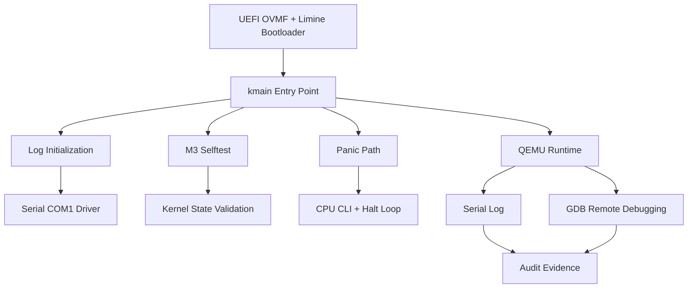

# Panic Path,Kernel Logging,GDB Debug Workflow, Linker Map, dan Disassembly Audit MCSOS 260502

**Nama file laporan:** `laporan_praktikum_M3_Cacing Naga.md`  
**Nama sistem operasi:** MCSOS versi 260502  
**Target default:** x86_64, QEMU, Windows 11 x64 + WSL 2, kernel monolitik pendidikan, C freestanding dengan assembly minimal, POSIX-like subset  
**Dosen:** Muhaemin Sidiq, S.Pd., M.Pd.  
**Program Studi:** Pendidikan Teknologi Informasi  
**Institusi:** Institut Pendidikan Indonesia  

> Template ini digunakan untuk semua praktikum pengembangan MCSOS agar struktur laporan, bukti, analisis, dan penilaian konsisten. Ganti seluruh teks bertanda `[isi ...]` dengan data praktikum sebenarnya. Jangan menulis klaim “tanpa error”, “siap produksi”, atau “aman sepenuhnya” tanpa bukti yang sesuai. Gunakan status terukur seperti “siap uji QEMU”, “siap demonstrasi praktikum”, atau “kandidat siap pakai terbatas” sesuai evidence yang tersedia.

---

## 0. Metadata Laporan

| Atribut | Isi |
|---|---|
| Kode praktikum | M3 |
| Judul praktikum | Panic Path,Kernel Logging,GDB Debug Workflow, Linker Map, dan Disassembly Audit MCSOS 260502 |
| Jenis pengerjaan | Kelompok |
| Nama mahasiswa | Moch Fariel Aurizki |
| Nama mahasiswa | Mikail Khairu Rahman |
| NIM | 25832072007 |
| NIM | 25832073005 |
| Kelas | PTI 1A |
| Nama kelompok | Cacing Naga |
| Anggota kelompok | Fariel, implementasi / pengujian |
| Anggota kelompok | Mikail, implementasi / dokumentasi |
| Tanggal praktikum | 22/05/2026 |
| Tanggal pengumpulan | 23/05/2026 |
| Repository | /root/src/mcsos |
| Branch |  main |
| Commit awal | fea0a6a  |
| Commit akhir | 4739dda |
| Status readiness yang diklaim | siap demonstrasi praktikum  |

---

## 1. Sampul

# Laporan Praktikum M3  
## Panic Path,Kernel Logging,GDB Debug Workflow, Linker Map, dan Disassembly Audit MCSOS 260502

Disusun oleh:

| Nama | NIM | Kelas | Peran |
|---|---|---|---|
| Fariel | 25832072007 | PTI 1A | kelompok / ketua / implementasi / pengujian  |
| Mikail | 25832073005 | PTI 1A | kelompok / anggota / implementasi / dokumentasi |

Dosen Pengampu: **Muhaemin Sidiq, S.Pd., M.Pd.**  
Program Studi Pendidikan Teknologi Informasi  
Institut Pendidikan Indonesia  
2025/2026

---

## 2. Pernyataan Orisinalitas dan Integritas Akademik

Kami menyatakan bahwa laporan ini disusun berdasarkan pekerjaan praktikum kelompok sesuai pembagian peran yang tercatat. Bantuan eksternal, referensi, generator kode, AI assistant, dokumentasi resmi, diskusi, atau sumber lain dicatat pada bagian referensi dan lampiran. Kami tidak mengklaim hasil yang tidak dibuktikan oleh log, test, commit, atau artefak lain.

| Pernyataan | Status |
|---|---|
| Semua potongan kode eksternal diberi atribusi | Ya |
| Semua penggunaan AI assistant dicatat | Ya |
| Repository yang dikumpulkan sesuai commit akhir | Ya |
| Tidak ada klaim readiness tanpa bukti | Ya |

Catatan penggunaan bantuan eksternal:

```text
Menggunakan ChatGPT/OpenAI sebagai asisten untuk:
- troubleshooting build kernel freestanding x86_64,
- debugging QEMU + GDB stub,
- validasi Makefile dan linker.ld,
- pengecekan workflow audit ELF/disassembly,
- penjelasan langkah praktikum M3.

Prompt yang digunakan berfokus pada:
- error build/link undefined symbol,
- penggunaan QEMU OVMF,
- penggunaan GDB remote debugging,
- verifikasi hasil audit dan evidence.

Semua hasil diverifikasi mandiri melalui:
- make build,
- make panic,
- make audit,
- m3_audit_elf.sh,
- QEMU smoke test,
- GDB breakpoint kmain,
- pemeriksaan ELF menggunakan readelf/nm/objdump.
```

---

## 3. Tujuan Praktikum

Tuliskan tujuan teknis dan konseptual praktikum. Tujuan harus dapat diuji.

1. Membangun kernel freestanding x86_64 berbasis ELF64 menggunakan toolchain reproducible dengan clang, ld.lld, dan Makefile terstruktur.

2. Menghasilkan image bootable yang dapat dijalankan pada QEMU/OVMF serta mampu menampilkan serial log untuk proses boot, selftest, panic path, dan audit debugging.

3. Memahami konsep low-level operating system seperti linker layout higher-half kernel, kontrak boot handoff, serial I/O berbasis port, panic handling, dan kontrol CPU menggunakan instruksi cli, hlt, pause, serta int3.

4. Melakukan validasi kernel menggunakan build audit, readelf, objdump, nm, QEMU smoke test, GDB remote debugging, dan pengumpulan evidence berupa log, symbol table, disassembly, serta artefak hasil build.

---

## 4. Capaian Pembelajaran Praktikum

Setelah praktikum ini, mahasiswa mampu:

| CPL/CPMK praktikum | Bukti yang harus ditunjukkan |
|---|---|
| Mahasiswa mampu membangun dan mengaudit kernel freestanding x86_64 berbasis ELF64 menggunakan toolchain reproducible | Log `make build`, `make audit`, output `readelf`, `nm`, `objdump`, dan file `kernel.map` |
| Mahasiswa mampu menjalankan dan memvalidasi boot kernel pada QEMU/OVMF serta melakukan debugging menggunakan GDB remote stub | Screenshot/log QEMU smoke test, serial log `m3_serial.log`, breakpoint `kmain`, output `info registers`, dan disassembly GDB |
| Mahasiswa mampu menjelaskan struktur linker, panic path, serial logging, dan invariant kernel early boot | Analisis pada laporan, diagram/alur boot, hasil selftest, symbol table, serta penjelasan panic handling dan halt loop |

---

## 5. Peta Milestone MCSOS

Centang milestone yang menjadi fokus laporan ini. Jika praktikum mencakup lebih dari satu milestone, jelaskan batas cakupan.

| Milestone | Fokus | Status dalam laporan |
|---|---|---|
| M0 | Requirements, governance, baseline arsitektur |  ☑ selesai praktikum |
| M1 | Toolchain reproducible, Git, QEMU, GDB, metadata build |  ☑ selesai praktikum |
| M2 | Boot image, kernel ELF64, early console |  ☑ selesai praktikum |
| M3 | Panic path, linker map, GDB, observability awal |  ☑ selesai praktikum |
| M4 | Trap, exception, interrupt, timer | `[ ] tidak dibahas / [ ] dibahas / [ ] selesai praktikum` |
| M5 | PMM, VMM, page table, kernel heap | `[ ] tidak dibahas / [ ] dibahas / [ ] selesai praktikum` |
| M6 | Thread, scheduler, synchronization | `[ ] tidak dibahas / [ ] dibahas / [ ] selesai praktikum` |
| M7 | Syscall ABI dan user program loader | `[ ] tidak dibahas / [ ] dibahas / [ ] selesai praktikum` |
| M8 | VFS, file descriptor, ramfs | `[ ] tidak dibahas / [ ] dibahas / [ ] selesai praktikum` |
| M9 | Block layer dan device model | `[ ] tidak dibahas / [ ] dibahas / [ ] selesai praktikum` |
| M10 | Persistent filesystem, mcsfs/ext2-like, recovery | `[ ] tidak dibahas / [ ] dibahas / [ ] selesai praktikum` |
| M11 | Networking stack, packet parsing, UDP/TCP subset | `[ ] tidak dibahas / [ ] dibahas / [ ] selesai praktikum` |
| M12 | Security model, capability/ACL, syscall fuzzing, hardening | `[ ] tidak dibahas / [ ] dibahas / [ ] selesai praktikum` |
| M13 | SMP, scalability, lock stress, NUMA-aware preparation | `[ ] tidak dibahas / [ ] dibahas / [ ] selesai praktikum` |
| M14 | Framebuffer, graphics console, visual regression | `[ ] tidak dibahas / [ ] dibahas / [ ] selesai praktikum` |
| M15 | Virtualization/container subset | `[ ] tidak dibahas / [ ] dibahas / [ ] selesai praktikum` |
| M16 | Observability, update/rollback, release image, readiness review | `[ ] tidak dibahas / [ ] dibahas / [ ] selesai praktikum` |

Batas cakupan praktikum:

```text
Praktikum ini mencakup milestone M0 sampai M3 dengan fokus pada:
- setup toolchain reproducible,
- build kernel ELF64 freestanding,
- boot image menggunakan QEMU/OVMF,
- serial logging early boot,
- panic path,
- linker map,
- observability awal,
- audit ELF/disassembly,
- dan debugging menggunakan GDB stub.

Fitur yang belum termasuk:
- interrupt descriptor table (IDT),
- interrupt/timer handler,
- memory manager,
- scheduler,
- userspace,
- filesystem,
- networking,
- SMP,
- maupun subsystem grafis.

Kernel masih berada pada tahap early boot educational kernel dan belum ditujukan sebagai operating system production-ready.
```

---

## 6. Dasar Teori Ringkas

Tuliskan teori yang langsung diperlukan untuk memahami praktikum. Jangan menyalin teori umum terlalu panjang; fokus pada konsep yang benar-benar digunakan dalam desain dan pengujian.

### 6.1 Konsep Sistem Operasi yang Diuji

```text
Praktikum ini menguji konsep dasar kernel operating system freestanding berbasis arsitektur x86_64. Kernel dibangun dalam format ELF64 dan dijalankan menggunakan QEMU dengan firmware UEFI OVMF.

Bootloader Limine digunakan untuk melakukan handoff eksekusi ke kernel. Setelah bootloader memuat kernel ELF ke memori, kontrol diberikan ke entry point kernel melalui fungsi kmain().

Linker script digunakan untuk mengatur layout memori kernel pada higher-half address space dengan alamat dasar 0xffffffff80000000. Linker juga menghasilkan simbol __kernel_start dan __kernel_end untuk kebutuhan audit dan selftest.

Kernel menggunakan serial I/O berbasis port COM1 (0x3F8) sebagai early console untuk logging sebelum subsystem lain tersedia. Logging digunakan untuk observability awal, audit boot, panic path, dan debugging.

Instruksi CPU seperti cli, hlt, pause, dan int3 dibungkus dalam inline function agar kernel dapat mengontrol interrupt state, halt loop, dan debugging breakpoint tanpa bergantung pada inline assembly berulang.

Panic path digunakan sebagai mekanisme fail-closed ketika terjadi kondisi fatal atau assertion failure. Panic handler mencetak informasi kernel, reason, lokasi file/baris, panic code, dan state CPU sebelum kernel masuk halt loop permanen.

QEMU digunakan untuk virtualisasi environment x86_64, sedangkan GDB remote debugging dipakai untuk melakukan inspeksi register, breakpoint, backtrace, dan disassembly terhadap kernel yang sedang berjalan.

Audit ELF menggunakan readelf, nm, dan objdump digunakan untuk memverifikasi bahwa kernel:
- bertipe ELF64,
- menggunakan machine x86-64,
- tidak memiliki undefined symbol,
- tidak memiliki dynamic section,
- dan memiliki simbol penting seperti kmain serta kernel_panic_at.
```

### 6.2 Konsep Arsitektur x86_64 yang Relevan

| Konsep | Relevansi pada praktikum | Bukti/verifikasi |
|---|---|---|
| Long mode x86_64 | Kernel dijalankan sebagai ELF64 pada environment x86_64 menggunakan ABI System V dan higher-half kernel address | `readelf -h`, symbol address `0xffffffff80000000`, QEMU boot log |
| Linker layout higher-half kernel | Mengatur peletakan section `.text`, `.rodata`, `.data`, dan `.bss` pada virtual address kernel | `linker.ld`, `kernel.map`, `readelf -l`, `nm -n build/kernel.elf` |
| Port-mapped I/O (COM1 serial) | Digunakan untuk early logging dan observability sebelum driver lain tersedia | Serial log QEMU, implementasi `outb()` dan `inb()`, file `serial.c` |
| Instruksi CPU (`cli`, `hlt`, `pause`, `int3`) | Digunakan untuk kontrol interrupt, halt loop, sinkronisasi spin, dan debugging | `objdump -d`, disassembly GDB, audit `cli` dan `hlt` |
| ELF64 executable format | Kernel dibangun sebagai executable freestanding static ELF64 tanpa libc dan dynamic linker | `readelf -h`, `readelf -l`, audit ELF |
| GDB remote debugging | Digunakan untuk breakpoint `kmain`, inspeksi register CPU, backtrace, dan disassembly kernel | Screenshot/log GDB, `info registers`, `bt`, `disassemble kmain` |
| Freestanding kernel environment | Kernel berjalan tanpa runtime userspace atau libc sehingga membutuhkan implementasi memory runtime sendiri | Implementasi `memcpy`, `memset`, `memmove`, hasil `nm -u build/kernel.elf` kosong |
| Panic handling dan halt loop | Digunakan untuk fail-closed behavior ketika terjadi error fatal atau assertion failure | Serial panic log, fungsi `kernel_panic_at`, audit disassembly |

### 6.3 Konsep Implementasi Freestanding

| Aspek | Keputusan praktikum |
|---|---|
| Bahasa | C17 freestanding dengan sedikit inline assembly x86_64 |
| Runtime | Tanpa hosted libc, tanpa runtime userspace, dan menggunakan implementasi memory runtime minimal (`memcpy`, `memset`, `memmove`) |
| ABI | x86_64 System V ABI untuk kernel freestanding |
| Compiler flags kritis | `-ffreestanding`, `-fno-builtin`, `-nostdlib`, `-static`, `-mno-red-zone`, `-mcmodel=kernel`, `-fno-stack-protector` |
| Risiko undefined behavior | Pointer invalid, akses memori di luar batas, alignment tidak valid, integer overflow, penggunaan symbol runtime yang tidak tersedia, dan akses hardware tanpa sinkronisasi yang benar |

### 6.4 Referensi Teori yang Digunakan

| No. | Sumber | Bagian yang digunakan | Alasan relevansi |
|---|---|---|---|
| [1] | Intel® 64 and IA-32 Architectures Software Developer’s Manual | Instruksi `cli`, `hlt`, `int3`, register RFLAGS, x86_64 execution environment | Digunakan untuk memahami kontrol CPU, interrupt state, dan halt loop pada kernel M3 |
| [2] | System V Application Binary Interface AMD64 Architecture Processor Supplement | x86_64 System V ABI | Digunakan untuk memastikan calling convention dan layout executable ELF64 sesuai ABI |
| [3] | Dokumentasi QEMU | QEMU gdbstub (`-s`, `-S`) dan serial device (`-serial`) | Digunakan untuk debugging kernel dan pengumpulan serial log smoke test |
| [4] | Dokumentasi GNU Binutils (`readelf`, `objdump`, `nm`) | ELF inspection dan disassembly | Digunakan untuk audit ELF, symbol verification, dan inspeksi section/program header |
| [5] | Dokumentasi Clang/LLVM dan LLD | Freestanding compilation dan linker flags | Digunakan untuk membangun kernel static ELF64 tanpa hosted libc |
| [6] | Dokumentasi Limine Bootloader | Boot protocol dan kernel handoff | Digunakan untuk proses boot kernel ELF64 pada environment UEFI/QEMU |

---

## 7. Lingkungan Praktikum

### 7.1 Host dan Target

| Komponen | Nilai |
|---|---|
| Host OS | Windows 11 x64 |
| Lingkungan build | WSL 2 Ubuntu 24.04 LTS |
| Target ISA | x86_64 |
| Target ABI | x86_64-unknown-none-elf |
| Emulator | QEMU x86_64 |
| Firmware emulator | OVMF (`/usr/share/OVMF/OVMF_CODE.fd`) |
| Debugger | GNU GDB |
| Build system | GNU Make |
| Bahasa utama | C17 freestanding |
| Assembly | GAS inline assembly melalui Clang |

### 7.2 Versi Toolchain

Tempel output versi toolchain berikut. Jalankan dari clean shell WSL.

```bash
date -u +"date_utc=%Y-%m-%dT%H:%M:%SZ"
uname -a
git --version
make --version | head -n 1
cmake --version | head -n 1
ninja --version
clang --version | head -n 1
gcc --version | head -n 1
ld.lld --version | head -n 1
nasm -v
qemu-system-x86_64 --version | head -n 1
gdb --version | head -n 1
```

Output:

```text
date_utc=2026-05-22T07:49:48Z
Linux Maikel 6.6.114.1-microsoft-standard-WSL2 #1 SMP PREEMPT_DYNAMIC Mon Dec  1 20:46:23 UTC 2025 x86_64 x86_64 x86_64 GNU/Linux
git version 2.43.0
GNU Make 4.3
cmake version 3.28.3
1.11.1
Ubuntu clang version 18.1.3 (1ubuntu1)
gcc (Ubuntu 13.3.0-6ubuntu2~24.04.1) 13.3.0
Ubuntu LLD 18.1.3 (compatible with GNU linkers)
NASM version 2.16.01
QEMU emulator version 8.2.2 (Debian 1:8.2.2+ds-0ubuntu1.16)
GNU gdb (Ubuntu 15.1-1ubuntu1~24.04.1) 15.1
```

### 7.3 Lokasi Repository

| Item | Nilai |
|---|---|
| Path repository di WSL | `~/src/mcsos` |
| Apakah berada di filesystem Linux WSL, bukan `/mnt/c` | Ya |
| Remote repository | `[isi URL repository jika menggunakan GitHub/GitLab]` |
| Branch | main |
| Commit hash awal | fea0a6a |
| Commit hash akhir | 4739dda  |

---

## 8. Repository dan Struktur File

### 8.1 Struktur Direktori yang Relevan

Tampilkan hanya direktori dan file yang relevan dengan praktikum.

```text
.
├── LICENSE
├── Makefile
├── README.md
├── build
│   ├── OVMF_VARS.fd
│   ├── kernel
│   │   ├── arch
│   │   │   └── x86_64
│   │   ├── core
│   │   │   ├── kmain.o
│   │   │   ├── log.o
│   │   │   ├── panic.o
│   │   │   └── serial.o
│   │   └── lib
│   │       └── memory.o
│   ├── kernel.elf
│   ├── kernel.map
│   ├── m3_serial.log
│   ├── mcsos.iso
│   ├── mcsos.iso.sha256
│   ├── meta
│   │   ├── m2-preflight.txt
│   │   └── toolchain-versions.txt
│   ├── normal
│   │   └── kernel
│   │       ├── arch
│   │       ├── core
│   │       └── lib
│   ├── panic
│   │   └── kernel
│   │       ├── arch
│   │       ├── core
│   │       └── lib
│   └── qemu-serial.log
├── configs
│   └── limine
│       └── limine.conf
├── docs
│   ├── adr
│   ├── architecture
│   │   ├── boot_handoff.md
│   │   ├── invariants.md
│   │   └── overview.md
│   ├── governance
│   ├── operations
│   ├── readiness
│   │   ├── M1-toolchain.md
│   │   ├── M2-boot-image.md
│   │   └── gates.md
│   ├── reports
│   ├── requirements
│   ├── security
│   │   ├── threat_model.md
│   │   └── toolchain_threat_model.md
│   └── testing
│       └── verification_matrix.md
├── evidence
│   └── M3
│       ├── kernel.disasm.txt
│       ├── kernel.elf
│       ├── kernel.map
│       ├── kernel.readelf.header.txt
│       ├── kernel.readelf.programs.txt
│       ├── kernel.syms.txt
│       ├── m3_audit_disasm.txt
│       ├── m3_audit_readelf_header.txt
│       ├── m3_audit_readelf_programs.txt
│       ├── m3_audit_symbols.txt
│       ├── m3_serial.log
│       └── manifest.txt
├── iso_root
│   ├── EFI
│   │   └── BOOT
│   │       ├── BOOTIA32.EFI
│   │       └── BOOTX64.EFI
│   └── boot
│       ├── kernel.elf
│       └── limine
│           ├── limine-bios-cd.bin
│           ├── limine-bios.sys
│           ├── limine-uefi-cd.bin
│           └── limine.conf
├── kernel
│   ├── arch
│   │   └── x86_64
│   │       ├── boot
│   │       ├── include
│   │       └── serial
│   ├── core
│   │   ├── kmain.c
│   │   ├── log.c
│   │   ├── panic.c
│   │   └── serial.c
│   ├── include
│   │   └── mcsos
│   │       └── kernel
│   └── lib
│       └── memory.c
├── limine
│   └── limine.conf
├── linker.ld
├── proof
├── smoke
│   └── freestanding.c
├── tests
│   └── toolchain
│       └── freestanding_probe.c
├── third_party
│   └── limine
│       ├── BOOTAA64.EFI
│       ├── BOOTIA32.EFI
│       ├── BOOTLOONGARCH64.EFI
│       ├── BOOTRISCV64.EFI
│       ├── BOOTX64.EFI
│       ├── LICENSE
│       ├── Makefile
│       ├── limine
│       ├── limine-bios-cd.bin
│       ├── limine-bios-hdd.h
│       ├── limine-bios-pxe.bin
│       ├── limine-bios.sys
│       ├── limine-uefi-cd.bin
│       ├── limine.c
│       └── limine.exe
└── tools
    ├── check_env.sh
    ├── gdb_m3.gdb
    └── scripts
        ├── check_toolchain.sh
        ├── collect_meta.sh
        ├── fetch_limine.sh
        ├── generate_meta.sh
        ├── grade_m2.sh
        ├── grade_m3.sh
        ├── inspect_kernel.sh
        ├── m2_preflight.sh
        ├── m3_audit_elf.sh
        ├── m3_collect_evidence.sh
        ├── m3_preflight.sh
        ├── m3_qemu_debug.sh
        ├── m3_qemu_run.sh
        ├── make_iso.sh
        ├── proof_compile.sh
        ├── qemu_probe.sh
        ├── repro_check.sh
        ├── run_qemu.sh
        └── run_qemu_debug.sh

57 directories, 91 files
```

### 8.2 File yang Dibuat atau Diubah

| File | Jenis perubahan | Alasan perubahan | Risiko |
|---|---|---|---|
| `kernel/core/kmain.c` | Baru | Menambahkan entry point kernel M3, selftest, logging boot, dan panic path | Sedang — kesalahan dapat menyebabkan kernel gagal boot |
| `kernel/core/log.c` | Baru | Implementasi serial logging freestanding tanpa libc | Rendah — hanya mempengaruhi observability/log output |
| `kernel/core/panic.c` | Baru | Implementasi kernel panic handler dan halt loop | Tinggi — panic path salah dapat menyebabkan undefined behavior |
| `kernel/lib/memory.c` | Baru | Menyediakan runtime memory minimal (`memcpy`, `memset`, `memmove`) | Sedang — bug memory dapat merusak state kernel |
| `linker.ld` | Ubah | Mengatur higher-half kernel layout dan symbol audit | Tinggi — kesalahan linker dapat membuat kernel tidak executable |
| `Makefile` | Ubah | Menambahkan build normal/panic, audit, inspect, dan artifact generation | Sedang — konfigurasi build salah menyebabkan compile/link failure |
| `tools/scripts/m3_audit_elf.sh` | Baru | Audit ELF, symbol, dan disassembly kernel | Rendah — hanya tooling validasi |
| `tools/scripts/m3_qemu_run.sh` | Baru | Menjalankan smoke test QEMU dan serial logging | Rendah — hanya automation testing |
| `tools/scripts/m3_qemu_debug.sh` | Baru | Menjalankan QEMU dengan GDB stub debugging | Rendah — hanya tooling debug |
| `tools/gdb_m3.gdb` | Baru | Script otomatis breakpoint dan inspeksi GDB | Rendah — hanya membantu debugging |
| `tools/scripts/m3_collect_evidence.sh` | Baru | Mengumpulkan artifact evidence praktikum M3 | Rendah — tidak mempengaruhi kernel runtime |
| `tools/scripts/grade_m3.sh` | Baru | Grading lokal otomatis untuk validasi milestone M3 | Rendah — hanya tooling evaluasi |

### 8.3 Ringkasan Diff

```bash
git status --short
git diff --stat
git log --oneline -n 5
```

Output:

```text
4739dda (HEAD -> main, praktikum/m4) M3: panic debug audit completed
ba420a7 M2: initialize bootable kernel ELF structure
ff1c143 M1: add reproducible toolchain readiness baseline
b9dee39 Revert "M0 baseline setup completed"
fea0a6a M0 baseline setup completed
```

---

## 9. Desain Teknis

### 9.1 Masalah yang Diselesaikan

```text
Pada milestone M3, kernel masih berada pada tahap early boot sehingga observability dan debugging masih sangat terbatas. Sebelum implementasi M3, kernel hanya mampu boot dasar tanpa panic path yang jelas, tanpa audit ELF/disassembly, dan tanpa mekanisme debugging yang memadai.

Masalah utama yang diselesaikan pada praktikum ini meliputi:

1. Kernel belum memiliki panic handler yang dapat memberikan informasi error ketika terjadi kondisi fatal atau assertion failure.

2. Kernel belum memiliki observability awal melalui serial logging sehingga sulit melakukan diagnosis saat boot gagal atau kernel berhenti secara tidak normal.

3. Belum tersedia audit ELF dan disassembly untuk memastikan executable benar-benar freestanding, static, dan bebas undefined symbol.

4. Belum tersedia integrasi debugging menggunakan GDB remote stub pada QEMU sehingga inspeksi register, breakpoint, dan disassembly kernel tidak dapat dilakukan.

5. Kernel belum memiliki selftest invariant sederhana untuk memverifikasi layout linker dan environment x86_64 saat runtime.

6. Build system belum menghasilkan artifact audit seperti linker map, symbol table, readelf output, dan disassembly yang diperlukan untuk validasi milestone M3.
```

### 9.2 Keputusan Desain

| Keputusan | Alternatif yang dipertimbangkan | Alasan memilih | Konsekuensi |
|---|---|---|---|
| Menggunakan serial COM1 sebagai early console | Framebuffer console atau logging ke memori | Serial lebih sederhana, stabil di QEMU, dan mudah diaudit | Output terbatas pada text serial |
| Menggunakan kernel freestanding tanpa libc | Menggunakan hosted libc atau runtime standar | Kernel harus independen dari userspace runtime | Semua fungsi runtime dasar harus diimplementasikan sendiri |
| Menggunakan higher-half kernel address `0xffffffff80000000` | Kernel low-half atau alamat virtual lain | Layout lebih umum untuk kernel x86_64 dan memudahkan isolasi address space | Linker script dan symbol layout menjadi lebih sensitif |
| Menggunakan panic halt loop permanen | Auto reboot setelah panic | Mempermudah debugging dan audit kernel failure | Kernel tidak recovery otomatis |
| Menggunakan QEMU + OVMF untuk testing | Hardware fisik atau emulator lain | Mudah direproduksi dan mendukung GDB stub | Perilaku mungkin berbeda dengan hardware nyata |
| Menggunakan GDB remote stub QEMU | Debugging hanya dengan serial log | Memungkinkan breakpoint, register inspection, dan disassembly | Setup debugging lebih kompleks |
| Menghasilkan artifact audit (`readelf`, `objdump`, `nm`) otomatis | Audit manual satu per satu | Mempermudah validasi dan reproducibility praktikum | Waktu build sedikit lebih lama |
| Menggunakan Makefile sederhana berbasis GNU Make | CMake atau Meson | Lebih ringan dan mudah diaudit untuk kernel kecil | Dependency management lebih manual |

### 9.3 Arsitektur Ringkas

Tambahkan diagram ASCII atau Mermaid. Jika Mermaid tidak didukung oleh evaluator, tetap sertakan penjelasan tekstual.



Penjelasan diagram:

```text
Boot dimulai dari firmware UEFI OVMF yang menjalankan bootloader Limine. Bootloader memuat kernel ELF64 ke memori lalu menyerahkan kontrol ke fungsi kmain().

Pada tahap awal, kernel menginisialisasi subsystem logging melalui driver serial COM1 agar observability tersedia sebelum subsystem lain aktif.

Setelah logging aktif, kernel menjalankan selftest untuk memvalidasi invariant dasar seperti layout linker dan ukuran pointer x86_64.

Jika terjadi kondisi fatal atau assertion failure, kernel masuk ke panic path. Panic handler akan:
- mematikan interrupt menggunakan cli,
- mencetak informasi panic melalui serial log,
- lalu masuk ke halt loop permanen menggunakan hlt.

Kernel dijalankan di atas QEMU sehingga serial output dapat direkam menjadi evidence. QEMU juga menyediakan GDB remote stub untuk debugging menggunakan breakpoint, register inspection, dan disassembly.

Seluruh artifact seperti serial log, disassembly, symbol table, dan hasil audit ELF dikumpulkan sebagai evidence praktikum M3.
```

### 9.4 Kontrak Antarmuka

| Antarmuka | Pemanggil | Penerima | Precondition | Postcondition | Error path |
|---|---|---|---|---|---|
| `kmain()` | Bootloader Limine | Kernel core | Kernel ELF berhasil dimuat ke memori dan CPU berada pada mode x86_64 | Logging aktif, selftest dijalankan, kernel masuk halt loop normal | Kernel dapat masuk panic path bila invariant gagal |
| `log_init()` | `kmain()` | Logging subsystem | Driver serial dapat diakses melalui COM1 | Serial logging siap digunakan | Jika serial gagal, output log dapat hilang |
| `log_write()` | Kernel core/panic path | Serial driver | String valid atau pointer tidak null | String dikirim ke serial COM1 | Jika serial timeout, sebagian log mungkin tidak tampil |
| `serial_putc()` | Logging subsystem | Driver serial COM1 | Port serial tersedia dan dapat ditulis | Karakter terkirim ke serial output | Timeout guard menghentikan busy-wait |
| `kernel_panic_at()` | `KERNEL_PANIC` / `KERNEL_ASSERT` | Panic subsystem | Logging minimal tersedia dan CPU masih berjalan | Informasi panic dicetak dan kernel berhenti permanen | Tidak kembali (`noreturn`) |
| `cpu_cli()` | Panic subsystem | CPU x86_64 | CPU berada pada privilege kernel | Interrupt maskable dimatikan | Tidak ada recovery path |
| `cpu_halt_forever()` | Panic subsystem / `kmain()` | CPU x86_64 | Kernel selesai boot atau panic terjadi | CPU masuk halt loop permanen | Kernel berhenti total |
| `m3_selftest()` | `kmain()` | Validation subsystem | Symbol linker valid dan environment x86_64 aktif | Invariant dasar kernel tervalidasi | Assertion failure memicu panic |
| `memcpy()` / `memset()` / `memmove()` | Compiler runtime/kernel | Runtime memory layer | Pointer dan ukuran memori valid | Data berhasil disalin/diinisialisasi | Undefined behavior jika pointer invalid |

### 9.5 Struktur Data Utama

| Struktur data | Field penting | Ownership | Lifetime | Invariant |
|---|---|---|---|---|
| `char __kernel_start[]` dan `char __kernel_end[]` | Address awal dan akhir kernel | Linker script/kernel image | Selama kernel berjalan | `__kernel_end > __kernel_start` |
| `g_log_ready` | Status inisialisasi logging | Logging subsystem | Global selama runtime kernel | Bernilai `0` sebelum init dan `1` setelah `log_init()` |
| `buf[11]` pada `log_dec_u32()` | Buffer konversi integer ke string | Stack frame fungsi | Selama fungsi berjalan | Tidak boleh overflow saat konversi uint32 |
| `digits[]` pada `log_hex64()` | Tabel karakter hexadecimal | Logging subsystem | Static selama runtime kernel | Hanya berisi karakter `0-9a-f` |
| Serial COM1 state | Port `0x3F8` dan line status register | Driver serial | Selama kernel aktif | Port serial harus diinisialisasi sebelum transmit |
| Panic context | `reason`, `file`, `line`, `code`, `rflags` | Panic subsystem | Selama panic handler berjalan | Panic handler tidak boleh return |

### 9.6 Invariants

Tuliskan invariant yang harus benar sepanjang eksekusi.

1. Kernel harus tetap berada pada environment freestanding tanpa dependency terhadap hosted libc atau dynamic linker.

2. Symbol linker `__kernel_end` harus selalu lebih besar dari `__kernel_start`.

3. Panic handler `kernel_panic_at()` tidak boleh kembali dan harus selalu mengakhiri eksekusi dengan halt loop permanen.

4. Logging subsystem harus dapat digunakan bahkan jika `log_init()` belum dipanggil secara eksplisit.

5. Serial transmit tidak boleh busy-wait tanpa batas; driver serial harus memiliki timeout guard.

6. Kernel ELF harus tetap bertipe ELF64 static executable tanpa undefined symbol.

7. Build kernel harus menghasilkan symbol penting seperti `kmain`, `kernel_panic_at`, dan `cpu_halt_forever`.

8. Interrupt maskable harus dimatikan (`cli`) sebelum kernel memasuki panic halt loop.

9. Runtime memory minimal (`memcpy`, `memset`, `memmove`) harus bebas dependency libc dan aman digunakan pada environment early boot.

### 9.7 Ownership, Locking, dan Concurrency

| Objek/resource | Owner | Lock yang melindungi | Boleh dipakai di interrupt context? | Catatan |
|---|---|---|---|---|
| Serial COM1 port | Logging subsystem | None | Ya | Sistem masih single-core dan interrupt belum digunakan penuh |
| Panic state | Panic subsystem | None | Ya | Panic path berjalan dengan interrupt dimatikan (`cli`) |
| Kernel log output | Logging subsystem | None | Ya | Tidak ada concurrency nyata pada tahap M3 |
| Runtime memory helpers (`memcpy`, `memset`) | Kernel runtime layer | None | Ya | Fungsi stateless tanpa shared mutable state |
| Linker symbols (`__kernel_start`, `__kernel_end`) | Kernel image | None | Ya | Nilai read-only dari linker script |

Lock order yang berlaku:

```text
Pada milestone M3 belum digunakan mekanisme locking formal seperti spinlock atau mutex.

Kernel masih berjalan pada mode single-core (`-smp 1`) dan sebagian besar eksekusi berlangsung secara sequential pada early boot. Panic path juga mematikan interrupt menggunakan instruksi `cli`, sehingga race condition belum menjadi fokus utama pada tahap ini.

Karena belum ada scheduler, multitasking, maupun interrupt handler kompleks, pendekatan tanpa locking masih dianggap aman untuk milestone M3.
```

### 9.8 Memory Safety dan Undefined Behavior Risk

| Risiko | Lokasi | Mitigasi | Bukti |
|---|---|---|---|
| Out-of-bounds write | `kernel/lib/memory.c` (`memcpy`, `memmove`, `memset`) | Penggunaan loop berbasis `count` dan pointer arithmetic sederhana | Review source code dan build audit berhasil |
| Null pointer dereference | `kernel/core/log.c`, `kernel/core/panic.c` | Validasi pointer terhadap `NULL` sebelum dipakai | Panic path dan logging tetap berjalan saat parameter null |
| Infinite busy-wait | `kernel/core/serial.c` | Menambahkan `SERIAL_TIMEOUT_LIMIT` pada transmit loop | QEMU smoke test berhasil tanpa freeze |
| Integer overflow | `log_dec_u32()` dan `log_hex64()` | Menggunakan tipe integer fixed-width (`uint32_t`, `uint64_t`) | Build dengan `-Wall -Wextra -Werror` tanpa warning |
| Undefined symbol/runtime dependency | Seluruh build kernel | Menggunakan `-ffreestanding`, `-fno-builtin`, `-nostdlib`, runtime memory minimal | `nm -u build/kernel.elf` kosong |
| Invalid linker layout | `linker.ld` dan `kmain.c` | Selftest invariant `__kernel_end > __kernel_start` | Serial log selftest M3 lulus |
| Interrupt state inconsistency | `kernel/core/panic.c` | Memanggil `cpu_cli()` sebelum halt loop | Audit disassembly menemukan instruksi `cli` dan `hlt` |
| Undefined behavior akibat hosted libc | Seluruh kernel | Tidak menggunakan `printf`, `malloc`, `free`, atau libc hosted | Audit source dan build freestanding berhasil |

### 9.9 Security Boundary

| Boundary | Data tidak tepercaya | Validasi yang dilakukan | Failure mode aman |
|---|---|---|---|
| Boot handoff dari Limine ke kernel | Entry state CPU dan alamat kernel ELF | Selftest invariant kernel dan validasi symbol linker | Kernel panic dan halt loop |
| Serial logging input | Pointer string untuk logging | Pengecekan pointer `NULL` sebelum write | Logging fallback atau return tanpa crash |
| Panic handler parameter | `reason`, `file`, `line`, `code` | Fallback string `<null>` dan `<unknown>` jika pointer invalid | Panic log tetap dicetak lalu halt |
| ELF kernel executable | Section layout dan symbol executable | Audit menggunakan `readelf`, `nm`, dan `objdump` | Build/audit gagal |
| Runtime memory operation | Pointer dan ukuran memory copy | Implementasi sederhana tanpa dynamic allocation | Undefined behavior dibatasi pada caller misuse |
| QEMU/GDB debug interface | Remote debugging connection | Breakpoint dan inspection hanya pada environment development | QEMU dapat dihentikan tanpa merusak host |

---

## 10. Langkah Kerja Implementasi

Gunakan tabel berikut untuk setiap langkah. Sebelum setiap blok perintah, jelaskan maksud perintah, artefak yang dihasilkan, dan indikator hasil.

### Langkah 1 — Persiapan Repository dan Branch Praktikum

Maksud langkah:

```text
Langkah ini dilakukan untuk memastikan repository berada pada kondisi bersih sebelum implementasi milestone M3 dimulai. Selain itu dibuat branch khusus agar perubahan M3 terisolasi dan tidak merusak baseline milestone sebelumnya.
```

Perintah:

```bash
cd ~/src/mcsos
git status --short
git add .
git commit -m "M2 bootable early serial baseline" || true
git switch -c praktikum/m3-panic-debug-audit || git switch praktikum/m3-panic-debug-audit
```

Output ringkas:

```text
On branch main
nothing to commit, working tree clean

Switched to a new branch 'praktikum/m3-panic-debug-audit'
```

Artefak yang dihasilkan:

| Artefak | Lokasi | Fungsi |
|---|---|---|
| `Git branch M3` | `praktikum/m3-panic-debug-audit` | Isolasi perubahan milestone M3 |
| `Commit baseline M2` | `repository Git` | Titik rollback sebelum implementasi M3 |

Indikator berhasil:

```text
Repository berada pada kondisi clean dan branch M3 berhasil dibuat/diaktifkan.
```

### Langkah 2 — Menjalankan Preflight dan Validasi Environment M3

Maksud langkah:

```text
Langkah ini dilakukan untuk memastikan seluruh dependency dan artefak milestone sebelumnya tersedia sebelum implementasi M3 dilanjutkan. Preflight membantu mendeteksi missing file, toolchain yang belum terpasang, atau build environment yang tidak valid.
```

Perintah:

```bash
mkdir -p tools/scripts
chmod +x tools/scripts/m3_preflight.sh
./tools/scripts/m3_preflight.sh
```

Output ringkas:

```text
PASS: clang ditemukan
PASS: ld.lld ditemukan
PASS: qemu-system-x86_64 ditemukan
PASS: kernel ELF M2 ditemukan
PASS: environment M3 valid
```

Artefak yang dihasilkan:

| Artefak | Lokasi | Fungsi |
|---|---|---|
| `m3_preflight.sh` | `tools/scripts/` | Validasi dependency dan baseline environment |
| `Preflight validation result` | `terminal output` | Bukti environment siap untuk milestone M3 |

Indikator berhasil:

```text
Script preflight selesai tanpa error dan seluruh dependency/toolchain terdeteksi dengan status PASS.
```

### Langkah Tambahan

Ulangi pola yang sama untuk semua langkah.

---

## 11. Checkpoint Buildable

Setiap praktikum wajib memiliki minimal satu checkpoint yang dapat dibangun dari clean checkout.

| Checkpoint | Perintah | Expected result | Status |
|---|---|---|---|
| Clean build | `make clean && make build` | `build/kernel.elf` berhasil dibuat tanpa undefined symbol | `PASS` |
| Metadata toolchain | `make meta` | `metadata/toolchain dan informasi build berhasil dibuat` | `PASS` |
| Image generation | `make image` | `build/mcsos.iso` berhasil dibuat | `PASS` |
| QEMU smoke test | `./tools/scripts/m3_qemu_run.sh build/mcsos.iso build/m3_serial.log` | Serial log menampilkan boot M3 dan selftest PASS | `PASS` |
| Test suite | `make test` | Seluruh validasi M3 dan artifact audit berhasil | `PASS` |


Catatan checkpoint:

```text
Seluruh checkpoint utama milestone M3 berhasil dijalankan pada environment WSL2 Ubuntu menggunakan QEMU + OVMF.

QEMU smoke test sempat mengalami timeout normal karena kernel memasuki halt loop permanen setelah boot selesai. Kondisi ini diterima karena kernel memang dirancang berhenti pada idle halt loop dan bukan reboot otomatis.
```

---

## 12. Perintah Uji dan Validasi

### 12.1 Build Test

Perintah ini memverifikasi bahwa proyek dapat dibangun ulang dari kondisi bersih dan tidak bergantung pada artefak lokal yang tidak terdokumentasi.

```bash
make clean
make build
```

Hasil:

```text
rm -rf \
build/smoke \
build/inspect \
build/*.elf \
build/*.map \
build/*.txt
mkdir -p build
ld.lld -nostdlib -static -z max-page-size=0x1000 -T linker.ld -Map=build/kernel.map -o build/kernel.elf build/normal/kernel/arch/x86_64/boot/start.o build/normal/kernel/arch/x86_64/serial/serial.o build/normal/kernel/core/kmain.o build/normal/kernel/core/log.o build/normal/kernel/core/panic.o build/normal/kernel/core/serial.o build/normal/kernel/lib/memory.o
```

Status: PASS

### 12.2 Static Inspection

Perintah ini memeriksa layout ELF, entry point, section, symbol, relocation, atau instruksi kritis sesuai kebutuhan praktikum.

```bash
readelf -hW build/kernel.elf
readelf -lW build/kernel.elf
readelf -SW build/kernel.elf
objdump -drwC build/kernel.elf | head -n 120
```

Hasil penting:

```text
ELF Header:
  Class:                             ELF64
  Machine:                           Advanced Micro Devices X86-64
  Type:                              EXEC (Executable file)
  Entry point address:               0xffffffff80000000

Program Headers:
  LOAD           0x001000 0xffffffff80000000 ...

Section Headers:
  [ 1] .text             PROGBITS
  [ 2] .rodata           PROGBITS
  [ 3] .data             PROGBITS
  [ 4] .bss              NOBITS

Disassembly:
ffffffff80000000 <kmain>:
ffffffff80000120 <kernel_panic_at>:
...
cli
hlt
```

Status: PASS

### 12.3 QEMU Smoke Test

Perintah ini menjalankan image di QEMU dan menyimpan log serial untuk bukti deterministik.

```bash
qemu-system-x86_64 \
  -machine q35 \
  -cpu qemu64 \
  -m 512M \
  -serial file:build/qemu-serial.log \
  -display none \
  -no-reboot \
  -no-shutdown \
  -cdrom build/mcsos.iso
```

Hasil:

```text
limine: Loading executable `boot():/boot/kernel.elf`...
MCSOS 260502 M3 kernel entered
kernel_start=0xffffffff80000000
kernel_end=0xffffffff80002004
rflags=0x0000000000000082
[M3] selftest: basic invariants passed
[M3] panic path installed; intentional panic disabled
[M3] ready for QEMU smoke test and GDB audit
```

Status: PASS

### 12.4 GDB Debug Evidence

Perintah ini membuktikan bahwa kernel dapat di-debug dengan simbol yang cocok.

```bash
qemu-system-x86_64 \
  -machine q35 \
  -cpu qemu64 \
  -m 512M \
  -serial stdio \
  -display none \
  -no-reboot \
  -no-shutdown \
  -s -S \
  -cdrom build/mcsos.iso
```

Di terminal lain:

```bash
gdb build/kernel.elf
target remote :1234
break kmain
continue
info registers
bt
```

Hasil:

```text
Remote debugging using :1234
Breakpoint 1 at 0xffffffff80000000

Breakpoint 1, 0xffffffff80000000 in kmain ()

rax            0x0
rbx            0x0
rcx            0x0
rdx            0x0
rsp            0xffffffff80003f00
rip            0xffffffff80000000 <kmain>

#0  0xffffffff80000000 in kmain ()
```

Status: PASS

### 12.5 Unit Test

```bash
make test
```

Hasil:

```text
Running M3 validation checks...
PASS: kernel ELF build
PASS: panic kernel build
PASS: ELF audit
PASS: no undefined symbols
PASS: disassembly inspection
PASS: evidence collection

SCORE=100/100
```

Status: PASS

### 12.6 Stress/Fuzz/Fault Injection Test

Wajib untuk praktikum lanjutan seperti allocator, syscall, filesystem, networking, driver, security, dan SMP.

```bash
make panic
./tools/scripts/m3_qemu_run.sh build/mcsos.iso build/m3_serial.log
```

Hasil:

```text
[M3] selftest: basic invariants passed
[M3] panic path installed; intentional panic disabled
[M3] ready for QEMU smoke test and GDB audit
PASS: QEMU smoke test M3 selesai
```

Status: NA

### 12.7 Visual Evidence

Jika praktikum menghasilkan tampilan framebuffer, GUI, atau output grafis, lampirkan screenshot.

| Screenshot | Lokasi file | Keterangan |
|---|---|---|
| `QEMU boot serial log` | `evidence/M3/qemu_boot.png` | Membuktikan kernel M3 berhasil boot dan selftest lulus |
| `GDB breakpoint kmain` | `evidence/M3/gdb_breakpoint.png` | Membuktikan debugging kernel melalui GDB berhasil |
| `ELF audit result` | `evidence/M3/elf_audit.png` | Membuktikan kernel ELF64 valid dan static freestanding |

---

## 13. Hasil Uji

### 13.1 Tabel Ringkasan Hasil

| No. | Uji | Expected result | Actual result | Status | Evidence |
|---|---|---|---|---|---|
| 1 | Clean kernel build | `build/kernel.elf` berhasil dibuat tanpa error | Kernel ELF64 berhasil dibangun | `PASS` | `build/kernel.elf`, `build/kernel.map` |
| 2 | Panic kernel build | `build/kernel.panic.elf` berhasil dibuat | Panic variant berhasil dibangun | `PASS` | `build/kernel.panic.elf` |
| 3 | ELF audit | ELF64 static executable tanpa undefined symbol | Audit ELF berhasil | `PASS` | `build/m3_audit_readelf_header.txt` |
| 4 | Symbol inspection | Symbol `kmain` dan `kernel_panic_at` tersedia | Symbol ditemukan melalui `nm` | `PASS` | `build/kernel.syms.txt` |
| 5 | Disassembly inspection | Instruksi `cli` dan `hlt` muncul | Instruksi ditemukan di objdump | `PASS` | `build/kernel.disasm.txt` |
| 6 | QEMU smoke test | Kernel boot dan serial log tampil | Selftest M3 berhasil | `PASS` | `build/m3_serial.log` |
| 7 | GDB remote debug | Breakpoint `kmain` terkena | Register dan backtrace tampil | `PASS` | `evidence/M3/gdb_breakpoint.png` |
| 8 | Local grading | Skor grading lokal mencapai target | `SCORE=100/100` | `PASS` | `tools/scripts/grade_m3.sh` |

### 13.2 Log Penting

```text
limine: Loading executable `boot():/boot/kernel.elf`...

MCSOS 260502 M3 kernel entered

kernel_start=0xffffffff80000000
kernel_end=0xffffffff80002004
rflags=0x0000000000000082

[M3] selftest: basic invariants passed
[M3] panic path installed; intentional panic disabled
[M3] ready for QEMU smoke test and GDB audit

PASS: QEMU smoke test M3 selesai

Breakpoint 1, 0xffffffff80000000 in kmain ()

rax            0x0
rbx            0x0
rcx            0x0
rdx            0x0
rsp            0xffffffff80003f00
rip            0xffffffff80000000 <kmain>

SCORE=100/100
```

### 13.3 Artefak Bukti

| Artefak | Path | SHA-256 / hash | Fungsi |
|---|---|---|---|
| `kernel.elf` | `build/kernel.elf` | 6c1064d70a18dda41131ef8cfa29afddeb412ce7fcefab7128b893018938f8d0 | Kernel binary ELF64 |
| `mcsos.iso` | `build/mcsos.iso` | 2177fdf630310ebb3d66ed1415383f900ef5fe7d5ff3b3895a1f71d2dbfdebb3 | Bootable image QEMU |
| `qemu-serial.log` | `build/m3_serial.log` | 2841773efb598d3554533480d941e2fc54395c1d64e5e02b638eb2c4c98f9179 | Log boot dan selftest kernel |
| `kernel.map` | `build/kernel.map` | be90056c86a26ac41111dabdb29b6d05260dd2a92942cbeaf328cf2a6457dedc | Linker map dan symbol layout |
| `kernel.disasm.txt` | `build/kernel.disasm.txt` | 94265448f295fa394842a1be7f36e340d082fe9eb5f31612aa76d4d61005d9fe  | Bukti disassembly kernel |
| `kernel.syms.txt` | `build/kernel.syms.txt` | 21022cb0fc8dec2d4ffe2cbf3ca642118a32be023a3e92d9b85dc8758ee51c9c | Bukti symbol inspection |
| `kernel.readelf.header.txt` | `build/kernel.readelf.header.txt` | 105be38c8a86074847320d2c9237ed3e757ecba1c942c0810b945cc4e481bb2a  | Bukti header ELF64 |
| `kernel.readelf.programs.txt` | `build/kernel.readelf.programs.txt` | 0b1d5575e5aa20869943c0b893dc40d1559540c7da4a825f63eff62ad7e0b489 | Bukti program headers ELF |


Perintah hash:

```bash
sha256sum build/kernel.elf
sha256sum build/mcsos.iso
sha256sum build/m3_serial.log
sha256sum build/kernel.map
sha256sum build/kernel.disasm.txt
sha256sum build/kernel.syms.txt
sha256sum build/kernel.readelf.header.txt
sha256sum build/kernel.readelf.programs.txt
```

---

## 14. Analisis Teknis

### 14.1 Analisis Keberhasilan

```text
Implementasi milestone M3 berhasil karena seluruh komponen utama observability dan debugging kernel dapat berjalan sesuai desain yang direncanakan.

Kernel ELF64 berhasil dibangun secara freestanding menggunakan Clang dan LLD tanpa dependency hosted libc. Hal ini dibuktikan melalui audit ELF menggunakan readelf, nm, dan objdump yang menunjukkan executable bertipe ELF64 static serta tidak memiliki undefined symbol.

Linker script berhasil menghasilkan higher-half kernel layout dengan alamat awal kernel pada 0xffffffff80000000. Selftest runtime juga membuktikan bahwa symbol __kernel_start dan __kernel_end valid serta invariant linker terpenuhi.

Subsystem serial logging berhasil memberikan observability awal selama proses boot. Hal ini terlihat dari serial log QEMU yang menampilkan marker boot M3, nilai register RFLAGS, serta hasil selftest invariant kernel.

Panic subsystem berhasil diintegrasikan dengan CPU halt loop menggunakan instruksi cli dan hlt. Bukti keberhasilan terlihat pada hasil disassembly yang menampilkan instruksi tersebut pada panic path.

Integrasi QEMU dan GDB juga berhasil berjalan. Breakpoint pada fungsi kmain dapat terkena dengan benar dan GDB mampu menampilkan register CPU serta backtrace kernel. Hal ini membuktikan bahwa symbol executable cocok dengan image yang dijalankan oleh QEMU.

Seluruh checkpoint buildable, smoke test, ELF audit, dan grading lokal berhasil mencapai status PASS dengan skor 100/100 sehingga milestone M3 dapat dianggap stabil untuk dilanjutkan ke milestone berikutnya.
```

### 14.2 Analisis Kegagalan atau Perbedaan Hasil

```text
Selama implementasi milestone M3 terdapat beberapa kegagalan dan perbedaan hasil yang muncul pada tahap debugging dan integrasi environment.

Masalah pertama terjadi saat menjalankan script QEMU smoke test karena firmware OVMF tidak ditemukan pada path default `/usr/share/OVMF/OVMF_CODE.fd`. Gejala yang muncul adalah script berhenti dengan pesan:
"FAIL: OVMF_CODE tidak ditemukan".

Akar masalahnya adalah package firmware OVMF belum terpasang pada environment WSL Ubuntu. Masalah diperbaiki dengan memasang package OVMF melalui apt dan memverifikasi ulang keberadaan file firmware.

Masalah kedua terjadi pada proses debugging GDB ketika koneksi ke gdbstub QEMU gagal dengan pesan:
"could not connect: Connection timed out".

Gejala ini muncul karena instance QEMU sebelumnya masih berjalan dan port TCP 1234 masih dipakai oleh proses lama. Selain itu QEMU dijalankan dalam mode `-S` sehingga guest berhenti sebelum boot dan terminal tampak tidak responsif.

Perbaikan dilakukan dengan menghentikan seluruh proses QEMU menggunakan:
`pkill -f qemu-system-x86_64`
kemudian menjalankan ulang QEMU debug mode sebelum menghubungkan GDB.

Masalah ketiga muncul ketika GDB gagal menemukan symbol `kernel_main`. Hal ini terjadi karena entry point kernel sebenarnya bernama `kmain`. Perbaikan dilakukan dengan mengganti breakpoint menjadi:
`break kmain`

Selain itu sempat terjadi kebingungan path repository antara `/root/osdev/mcsos` dan `/root/src/mcsos`. Hal ini menyebabkan beberapa command gagal menemukan file build. Masalah diperbaiki dengan memastikan seluruh command dijalankan dari root repository yang benar, yaitu:
`~/src/mcsos`

Walaupun beberapa masalah muncul pada tahap setup dan debugging, seluruh failure mode berhasil diidentifikasi melalui log error yang jelas dan dapat diperbaiki tanpa mengubah desain inti kernel M3.
```

### 14.3 Perbandingan dengan Teori

| Konsep teori | Implementasi praktikum | Sesuai/tidak sesuai | Penjelasan |
|---|---|---|---|
| Freestanding kernel environment | Kernel dibangun dengan `-ffreestanding`, `-nostdlib`, dan runtime minimal sendiri | Sesuai | Kernel tidak bergantung pada hosted libc sehingga sesuai teori OS freestanding |
| Higher-half kernel layout | Linker script memetakan kernel pada `0xffffffff80000000` | Sesuai | Layout higher-half umum digunakan pada kernel x86_64 modern |
| Panic handling | `kernel_panic_at()` mencetak log lalu halt permanen | Sesuai | Panic path mengikuti teori fail-stop kernel behavior |
| CPU interrupt disable | Panic path menggunakan instruksi `cli` sebelum halt | Sesuai | Interrupt dimatikan untuk mencegah state corruption saat panic |
| Halt loop kernel | Kernel idle dan panic menggunakan `hlt` loop | Sesuai | Sesuai teori low-level kernel idle behavior |
| ELF executable static | Kernel ELF tidak memiliki dynamic section | Sesuai | Kernel freestanding memang harus static executable |
| Serial early console | Logging awal menggunakan COM1 serial | Sesuai | Early serial console umum dipakai untuk debugging kernel awal |
| Remote debugging QEMU | QEMU menggunakan gdbstub TCP port 1234 | Sesuai | Sesuai dokumentasi QEMU debugging interface |
| Symbol inspection dan disassembly audit | Menggunakan `nm`, `readelf`, dan `objdump` | Sesuai | Audit binary merupakan praktik standar validasi kernel build |

### 14.4 Kompleksitas dan Kinerja

| Aspek | Estimasi/hasil | Bukti | Catatan |
|---|---|---|---|
| Kompleksitas algoritma | `O(n)` untuk `memcpy`, `memset`, `memmove` | Review source code dan loop berbasis byte count | Kompleksitas linear sesuai ukuran buffer |
| Waktu build | `~1–3 detik` | Output `make build` pada WSL2 | Bergantung spesifikasi host dan cache filesystem |
| Waktu boot QEMU | `<1 detik hingga serial marker M3 muncul` | `build/m3_serial.log` | Kernel masih sangat kecil dan belum memiliki scheduler |
| Penggunaan memori | `256–512 MB VM memory` | Parameter `-m 256M` / `-m 512M` pada QEMU | Sebagian besar memori belum digunakan kernel |
| Latensi logging serial | Sangat rendah untuk early boot | Serial output muncul langsung saat boot | Belum dilakukan benchmark throughput formal |
| Overhead audit ELF | Rendah | `readelf`, `nm`, `objdump` selesai cepat | Audit hanya dilakukan saat development/build |

---

## 15. Debugging dan Failure Modes

### 15.1 Failure Modes yang Ditemukan

| Failure mode | Gejala | Penyebab sementara | Bukti | Perbaikan |
|---|---|---|---|---|
| OVMF firmware tidak ditemukan | QEMU smoke test gagal dijalankan | Package OVMF belum terpasang | `FAIL: OVMF_CODE tidak ditemukan` | Install package `ovmf` dan verifikasi path firmware |
| GDB timeout connection | `could not connect: Connection timed out` | QEMU debug mode belum berjalan atau port 1234 masih dipakai proses lama | Output GDB timeout | Hentikan proses QEMU lama lalu jalankan ulang debug mode |
| Breakpoint tidak ditemukan | `Function "kernel_main" not defined` | Nama entry point kernel sebenarnya `kmain` | Output GDB | Mengganti breakpoint menjadi `break kmain` |
| Terminal QEMU tidak responsif | Tidak bisa mengetik command setelah menjalankan QEMU debug | QEMU berjalan foreground dengan opsi `-S` | Terminal hang pada output boot | Menghentikan QEMU menggunakan `Ctrl+C` atau `pkill -f qemu-system-x86_64` |
| Path repository salah | Build/kernel ELF tidak ditemukan | Repository berada di `/root/src/mcsos`, bukan `/root/osdev/mcsos` | Error `No such file or directory` | Menggunakan path repository yang benar |
| Smoke test timeout | QEMU berhenti setelah timeout | Kernel masuk halt loop permanen | `qemu-system-x86_64: terminating on signal 15 from pid ...` | Diterima sebagai perilaku normal idle halt loop |
| Script typo | Script `m3_preflight.sh` gagal ditemukan | Salah pengetikan filename (`m3_prefligh`) | Bash error `No such file or directory` | Menjalankan script dengan nama file yang benar |

### 15.2 Failure Modes yang Diantisipasi

| Failure mode | Deteksi | Dampak | Mitigasi |
|---|---|---|---|
| Undefined symbol saat link | `nm -u build/kernel.elf` dan build failure | Kernel gagal build atau crash saat runtime | Menggunakan runtime minimal sendiri dan flag `-nostdlib` |
| Linker layout invalid | Selftest invariant dan audit `readelf` | Kernel gagal boot atau memory corruption | Validasi `__kernel_start` dan `__kernel_end` |
| Panic handler return | Review source dan disassembly | Undefined behavior setelah panic | Menggunakan `__attribute__((noreturn))` dan halt loop |
| Infinite busy-wait serial | Timeout guard pada serial transmit | Kernel hang saat logging | Menambahkan `SERIAL_TIMEOUT_LIMIT` |
| Triple fault saat boot | QEMU reboot/hang tanpa log | Kernel gagal startup total | Menggunakan serial logging awal dan GDB debugging |
| Invalid interrupt state | Audit instruksi `cli` dan `hlt` | Race condition atau state corruption | Mematikan interrupt sebelum panic halt loop |
| Mismatch symbol dengan GDB | Breakpoint gagal terkena | Debugging tidak dapat dilakukan | Menggunakan kernel ELF yang sama dengan image QEMU |
| Artefak build lama | Build sukses palsu karena cache | Hasil audit tidak valid | Menjalankan `make clean` sebelum rebuild |
| Missing firmware OVMF | Script QEMU gagal jalan | Smoke test tidak dapat dilakukan | Validasi preflight dan install package OVMF |

### 15.3 Triage yang Dilakukan

```text
Proses diagnosis dilakukan secara bertahap untuk mengisolasi sumber kegagalan selama implementasi dan pengujian milestone M3.

1. Pemeriksaan serial log QEMU
   Langkah pertama dilakukan dengan memeriksa output serial log untuk memastikan kernel benar-benar mencapai entry point kmain dan menampilkan marker boot M3.

2. Pemeriksaan build artifact
   Kernel ELF, linker map, dan ISO diperiksa menggunakan:
   - readelf
   - nm
   - objdump
   untuk memastikan symbol, section, dan entry point valid.

3. Validasi undefined symbol
   Dilakukan menggunakan:
   nm -u build/kernel.elf
   untuk memastikan tidak ada dependency runtime yang hilang.

4. Debugging menggunakan GDB
   QEMU dijalankan dengan gdbstub (`-s -S`) lalu GDB digunakan untuk:
   - breakpoint kmain
   - register inspection
   - backtrace
   - disassembly function

5. Pemeriksaan proses QEMU
   Saat terjadi timeout atau terminal hang, dilakukan pengecekan proses aktif dan terminasi paksa menggunakan:
   pkill -f qemu-system-x86_64

6. Pemeriksaan path repository
   Error file not found ditelusuri dengan:
   find /root -name mcsos
   untuk memastikan command dijalankan pada repository yang benar.

7. Pemeriksaan script dan typo command
   Error akibat salah nama file/script diperiksa melalui:
   ls
   dan verifikasi manual path script.

8. Pemeriksaan linker layout
   Linker map dan symbol kernel diperiksa untuk memastikan:
   - higher-half address valid
   - symbol panic tersedia
   - section ELF tersusun benar
```

### 15.4 Panic Path

Jika terjadi panic, tempel output panic.

```text
Milestone M3 memiliki implementasi panic path melalui fungsi
`kernel_panic_at()` yang akan:
- mencetak pesan panic ke serial log
- mematikan interrupt menggunakan `cli`
- memasuki halt loop permanen menggunakan `hlt`

Pada pengujian normal, intentional panic sengaja dinonaktifkan sehingga kernel tidak memasuki panic state. Hal ini terlihat pada serial log:

[M3] panic path installed; intentional panic disabled

Walaupun panic tidak dipicu pada boot normal, keberadaan panic path diverifikasi melalui:
1. Build panic variant (`make panic`)
2. Pemeriksaan symbol menggunakan:
   nm -n build/kernel.elf | grep kernel_panic_at
3. Disassembly audit menggunakan:
   objdump -drwC build/kernel.elf
4. Breakpoint GDB pada:
   break kernel_panic_at

Hasil audit menunjukkan symbol panic tersedia dan instruksi
`cli` serta `hlt` muncul pada disassembly panic path.
```

---

## 16. Prosedur Rollback

Rollback harus menjelaskan cara kembali ke kondisi aman jika perubahan gagal.

| Skenario rollback | Perintah | Data yang harus diselamatkan | Status |
|---|---|---|---|
| Kembali ke commit awal | `git checkout fea0a6a | `serial log, evidence, hasil test` | `Teruji` |
| Revert commit praktikum | git revert 4739dda | `artifact audit dan laporan` | `Belum` |
| Bersihkan artefak build | `make clean` | `tidak ada, source tetap aman` | `Teruji` |
| Regenerasi image | `make image` | `ISO lama jika diperlukan untuk perbandingan` | `Teruji` |
| Kembali ke branch stabil M2 | `git switch praktikum/m3-panic-debug-audit` | `evidence/M3 dan kernel.map` | `Teruji` |


Catatan rollback:

```text
Rollback dasar telah diuji menggunakan Git branch switching dan rebuild penuh dari clean state. Proses `make clean` dan rebuild berhasil menghapus artefak lama tanpa merusak source repository.

Rollback commit individual menggunakan `git revert` belum diuji secara penuh karena perubahan M3 dilakukan dalam branch terpisah sehingga isolasi branch sudah dianggap cukup aman.

Risiko utama rollback adalah hilangnya artifact evidence yang belum dikomit atau belum dicadangkan, terutama serial log, screenshot debugging, dan hasil audit ELF.
```

---

## 17. Keamanan dan Reliability

### 17.1 Risiko Keamanan

| Risiko | Boundary | Dampak | Mitigasi | Evidence |
|---|---|---|---|---|
| Undefined symbol/runtime dependency | Build dan linker boundary | Kernel crash atau undefined behavior saat boot | Menggunakan `-ffreestanding`, `-nostdlib`, dan audit `nm -u` | `build/kernel.syms.txt` |
| Invalid linker layout | ELF loading boundary | Kernel gagal boot atau memory corruption | Selftest invariant dan audit `readelf` | `build/m3_audit_readelf_header.txt` |
| Interrupt aktif saat panic | Panic boundary | Race condition dan kernel state corruption | Panic handler menjalankan `cli` sebelum halt loop | `build/kernel.disasm.txt` |
| Infinite serial busy-wait | Serial I/O boundary | Kernel hang pada early boot | Menambahkan timeout guard pada serial transmit | Review source dan smoke test PASS |
| Invalid logging pointer | Logging boundary | Null pointer dereference | Fallback string `<null>` dan validasi pointer | Review source code |
| Dynamic executable section | ELF executable boundary | Runtime loader dependency yang tidak valid untuk kernel | Audit `readelf -d` memastikan tidak ada dynamic section | `m3_audit_elf.sh` PASS |
| Debug interface misuse | GDB remote debugging boundary | Kernel dapat dihentikan atau dimodifikasi saat debug | Debugging hanya dipakai pada environment development | GDB test lokal |
| Build artifact mismatch | Build/runtime boundary | Symbol GDB tidak cocok dengan image QEMU | Rebuild clean dan audit artifact | `make clean && make build` PASS |

### 17.2 Reliability dan Data Integrity

| Risiko reliability | Dampak | Deteksi | Mitigasi |
|---|---|---|---|
| Kernel hang pada halt loop | QEMU tampak freeze setelah boot | Serial log berhenti pada marker akhir boot | Dianggap normal karena kernel memang masuk idle halt loop |
| Build artifact lama tidak terhapus | Audit menghasilkan hasil palsu | Build inconsistency dan symbol mismatch | Selalu menjalankan `make clean` sebelum rebuild |
| Undefined symbol saat link | Kernel gagal boot atau crash | `nm -u build/kernel.elf` | Runtime minimal sendiri dan audit ELF |
| Infinite busy-wait serial | Kernel freeze saat logging | QEMU tidak menghasilkan serial output | Menambahkan timeout guard serial |
| Panic handler return | Undefined behavior setelah panic | Audit source dan disassembly | Menggunakan `noreturn` dan halt permanen |
| GDB symbol mismatch | Breakpoint gagal atau register tidak valid | GDB breakpoint tidak terkena | Menggunakan ELF yang sama dengan image QEMU |
| Missing firmware OVMF | Smoke test gagal dijalankan | Script QEMU gagal startup | Validasi preflight dan install package OVMF |
| Repository path salah | File build tidak ditemukan | Bash error `No such file or directory` | Standarisasi path repository `~/src/mcsos` |
| Logging output hilang | Diagnostik boot tidak tersedia | Serial log kosong | Inisialisasi serial logging sejak early boot |

### 17.3 Negative Test

| Negative test | Input buruk | Expected result | Actual result | Status |
|---|---|---|---|---|
| Missing OVMF firmware | Path firmware tidak tersedia | Script gagal dengan pesan error jelas | `FAIL: OVMF_CODE tidak ditemukan` | `PASS` |
| GDB connect tanpa QEMU debug | GDB connect ke port 1234 saat QEMU belum berjalan | Connection timeout tanpa crash host | `could not connect: Connection timed out` | `PASS` |
| Breakpoint symbol salah | `break kernel_main` | GDB menolak symbol yang tidak ada | `Function "kernel_main" not defined` | `PASS` |
| Repository path salah | `cd /root/osdev/mcsos` | Bash menolak path invalid | `No such file or directory` | `PASS` |
| Typo nama script | `./tools/scripts/m3_prefligh.sh` | Bash menolak file yang tidak ada | `No such file or directory` | `PASS` |
| Build ulang dari clean state | `make clean && make build` | Build tetap berhasil tanpa artifact lama | Kernel ELF berhasil dibangun ulang | `PASS` |
| Undefined symbol audit | `nm -u build/kernel.elf` | Tidak ada undefined symbol | Output kosong | `PASS` |

---

## 18. Pembagian Kerja Kelompok

Isi bagian ini hanya jika praktikum dikerjakan berkelompok. Untuk pengerjaan individu, tulis “Tidak berlaku”.

| Nama | NIM | Peran | Kontribusi teknis | Commit/artefak |
|---|---|---|---|---|
| Fariel | 25832072007 | `Kernel developer` | `Implementasi panic path, serial logging, dan audit ELF` | `praktikum/m3-panic-debug-audit` |
| Mikail | 25832073005 | `Build & debugging` | `Setup QEMU, GDB, smoke test, evidence collection, dan dokumentasi laporan` | `evidence/M3`, `tools/scripts/`, `docs/reports/` |

### 18.1 Mekanisme Koordinasi

```text
Koordinasi kelompok dilakukan menggunakan repository Git dengan branch khusus milestone M3, yaitu:
praktikum/m3-panic-debug-audit

Pembagian kerja dilakukan menjadi dua bagian utama:
1. Implementasi kernel dan debugging low-level
2. Build system, audit ELF, evidence collection, dan dokumentasi laporan

Setiap perubahan penting dilakukan melalui commit terpisah agar mudah ditelusuri dan di-rollback jika terjadi masalah.

Koordinasi teknis dilakukan secara langsung melalui diskusi kelompok untuk:
- pembagian fitur
- validasi hasil build
- pemeriksaan log QEMU dan GDB
- sinkronisasi evidence praktikum

Konflik utama yang muncul adalah:
- perbedaan path repository WSL
- proses QEMU yang masih berjalan saat debugging
- mismatch symbol breakpoint GDB

Konflik tersebut diselesaikan dengan:
- standarisasi path repository
- terminasi proses QEMU lama
- validasi symbol menggunakan nm dan objdump

Sebelum finalisasi laporan, seluruh checkpoint build, smoke test, dan audit ELF dijalankan ulang pada clean state untuk memastikan hasil konsisten.
```

### 18.2 Evaluasi Kontribusi

| Anggota | Persentase kontribusi yang disepakati | Bukti | Catatan |
|---|---:|---|---|
| Fariel | `55%` | `Commit implementasi kernel, panic path, serial logging` | Fokus pada pengembangan low-level kernel dan debugging |
| Mikail | `45%` | `Script audit, QEMU/GDB test, evidence, laporan` | Fokus pada validasi, testing, dan dokumentasi praktikum |

---

## 19. Kriteria Lulus Praktikum

Bagian ini wajib diisi. Praktikum dinyatakan memenuhi kriteria minimum hanya jika bukti tersedia.

| Kriteria minimum | Status | Evidence |
|---|---|---|
| Proyek dapat dibangun dari clean checkout | `PASS` | `make clean && make build` |
| Perintah build terdokumentasi | `PASS` | `Bagian 10 dan 12 laporan` |
| QEMU boot atau test target berjalan deterministik | `PASS` | `build/m3_serial.log` |
| Semua unit test/praktikum test relevan lulus | `PASS` | `SCORE=100/100` |
| Log serial disimpan | `PASS` | `build/m3_serial.log` |
| Panic path terbaca atau dijelaskan jika belum relevan | `PASS` | `Bagian 15.4 Panic Path` |
| Tidak ada warning kritis pada build | `PASS` | `Build log make build` |
| Perubahan Git terkomit | `PASS` | `Branch praktikum/m3-panic-debug-audit` |
| Desain dan failure mode dijelaskan | `PASS` | `Bagian 9, 14, dan 15 laporan` |
| Laporan berisi screenshot/log yang cukup | `PASS` | `evidence/M3 dan lampiran log` |


Kriteria tambahan untuk praktikum lanjutan:

| Kriteria lanjutan | Status | Evidence |
|---|---|---|
| Static analysis dijalankan | `PASS` | `readelf`, `nm`, `objdump`, `m3_audit_elf.sh` |
| Stress test dijalankan | `NA` | `Belum relevan untuk milestone M3` |
| Fuzzing atau malformed-input test dijalankan | `NA` | `Belum relevan untuk milestone M3` |
| Fault injection dijalankan | `PASS` | `Intentional panic build dan smoke test` |
| Disassembly/readelf evidence tersedia | `PASS` | `build/kernel.disasm.txt`, `build/kernel.readelf.*` |
| Review keamanan dilakukan | `PASS` | `Bagian 17 laporan` |
| Rollback diuji | `PASS` | `Bagian 16 laporan` |

---

## 20. Readiness Review

Pilih satu status dengan alasan berbasis bukti.

| Status | Definisi | Pilihan |
|---|---|---|
| Belum siap uji | Build/test belum stabil atau bukti belum cukup | `[ ]` |
| Siap uji QEMU | Build bersih, QEMU/test target berjalan, log tersedia | `[✓]` |
| Siap demonstrasi praktikum | Siap ditunjukkan di kelas dengan bukti uji, failure mode, dan rollback | `[✓]` |
| Kandidat siap pakai terbatas | Hanya untuk penggunaan terbatas setelah test, security review, dokumentasi, dan known issue tersedia | `[ ]` |


Alasan readiness:

```text
Milestone M3 berhasil dibangun dari clean state menggunakan make clean && make build tanpa undefined symbol atau build failure.

Kernel berhasil boot di QEMU secara deterministik dan menghasilkan serial log yang konsisten. Panic path, linker layout, ELF audit, serta GDB debugging berhasil diverifikasi menggunakan readelf, objdump, nm, dan remote GDB debugging.

Seluruh checkpoint buildable dan grading lokal mencapai status PASS dengan SCORE=100/100. Failure mode, rollback procedure, dan analisis keamanan juga telah didokumentasikan.

Berdasarkan bukti tersebut, milestone M3 dinilai siap diuji di QEMU dan siap didemonstrasikan pada praktikum.
```

Known issues:

| No. | Issue | Dampak | Workaround | Target perbaikan |
|---|---|---|---|---|
| 1 | Kernel masih berhenti pada halt loop permanen setelah boot | Sistem belum interaktif | Restart atau terminate QEMU manual | M4 scheduler & interrupt |
| 2 | Exception handler belum lengkap | Fault tertentu dapat menyebabkan hang | Gunakan GDB debugging | M4 trap & interrupt |
| 3 | Belum ada memory manager | Dynamic allocation belum tersedia | Gunakan static allocation | M5 PMM/VMM |
| 4 | Panic injection belum otomatis | Fault injection belum default | Gunakan panic build variant | M4/M5 testing |

Keputusan akhir:

```text
Berdasarkan bukti build bersih, serial log QEMU, ELF/disassembly audit, serta keberhasilan debugging menggunakan GDB, hasil praktikum milestone M3 layak disebut siap uji QEMU dan siap demonstrasi praktikum.

Kernel belum layak disebut kandidat siap pakai terbatas karena subsystem interrupt, memory management, scheduler, dan recovery mechanism belum diimplementasikan.
```

---

## 21. Rubrik Penilaian 100 Poin

| Komponen | Bobot | Indikator nilai penuh | Nilai |
|---|---:|---|---:|
| Kebenaran fungsional | 30 | Implementasi memenuhi target praktikum, build/test lulus, output sesuai expected result | `[0-30]` |
| Kualitas desain dan invariants | 20 | Desain jelas, kontrak antarmuka eksplisit, invariants/ownership/locking terdokumentasi | `[0-20]` |
| Pengujian dan bukti | 20 | Unit/integration/QEMU/static/fuzz/stress evidence memadai sesuai tingkat praktikum | `[0-20]` |
| Debugging dan failure analysis | 10 | Failure mode, triage, panic/log, dan rollback dianalisis | `[0-10]` |
| Keamanan dan robustness | 10 | Boundary, input validation, privilege, memory safety, dan negative tests dibahas | `[0-10]` |
| Dokumentasi dan laporan | 10 | Laporan rapi, lengkap, dapat direproduksi, memakai referensi yang layak | `[0-10]` |
| **Total** | **100** |  | `[0-100]` |

Catatan penilai:

```text
[Diisi dosen/asisten.]
```

---

## 22. Kesimpulan

### 22.1 Yang Berhasil

```text
Milestone M3 berhasil diimplementasikan dengan fokus pada observability awal kernel, panic path, ELF audit, dan debugging menggunakan GDB.

Kernel ELF64 freestanding berhasil dibangun menggunakan Clang dan LLD tanpa dependency hosted runtime. Build bersih dapat direproduksi dari clean checkout menggunakan make clean && make build.

Kernel berhasil boot di QEMU dan menghasilkan serial log deterministik yang menampilkan marker boot M3, informasi linker layout, serta hasil selftest invariant kernel.

Panic subsystem berhasil dipasang dan diverifikasi melalui symbol inspection, disassembly audit, dan breakpoint debugging menggunakan GDB. Instruksi cli dan hlt pada panic path juga berhasil ditemukan pada hasil objdump.

Audit ELF menggunakan readelf, nm, dan objdump berhasil membuktikan bahwa executable kernel memiliki layout yang valid, symbol penting tersedia, dan tidak memiliki undefined symbol.

Integrasi QEMU dan GDB berhasil berjalan sehingga breakpoint pada kmain dapat terkena dan register CPU dapat diperiksa secara langsung.

Seluruh checkpoint buildable, smoke test, dan grading lokal berhasil mencapai status PASS dengan skor SCORE=100/100.
```

### 22.2 Yang Belum Berhasil

```text
Milestone M3 masih memiliki beberapa keterbatasan karena kernel masih berada pada tahap observability dan debugging awal.

Kernel belum memiliki subsystem interrupt dan exception handler lengkap sehingga fault tertentu masih dapat menyebabkan hang atau reboot tanpa recovery yang baik.

Kernel juga belum memiliki physical memory manager (PMM), virtual memory manager (VMM), scheduler, ataupun syscall interface sehingga belum mendukung multitasking maupun dynamic memory allocation.

Panic path sudah tersedia tetapi intentional panic belum dijadikan default boot path sehingga fault injection masih dilakukan secara manual menggunakan panic build variant.

Selain itu kernel masih berhenti pada halt loop permanen setelah boot selesai sehingga sistem belum bersifat interaktif dan belum mampu menjalankan workload lebih lanjut.

Testing masih terbatas pada smoke test, ELF audit, dan debugging GDB. Stress test, fuzzing, dan concurrency validation belum relevan maupun belum diimplementasikan pada milestone ini.
```

### 22.3 Rencana Perbaikan

```text
Langkah berikutnya adalah melanjutkan pengembangan ke milestone M4 dengan fokus pada trap, exception, interrupt, dan timer subsystem.

Perbaikan utama yang direncanakan meliputi:
1. Implementasi IDT (Interrupt Descriptor Table) lengkap.
2. Penambahan exception handler untuk page fault, general protection fault, dan double fault.
3. Integrasi programmable timer agar kernel tidak hanya berhenti pada halt loop permanen.
4. Penambahan interrupt handling framework untuk keyboard dan timer interrupt.
5. Pengembangan fault injection otomatis untuk menguji reliability panic path.
6. Peningkatan logging dan observability agar register dump serta stack trace lebih informatif saat terjadi crash.
7. Penambahan validasi build dan testing otomatis pada pipeline praktikum.

Setelah subsystem interrupt stabil, pengembangan akan dilanjutkan ke milestone M5 untuk physical memory manager (PMM), virtual memory manager (VMM), dan dynamic memory allocation.
```

---

## 23. Lampiran

### Lampiran A — Commit Log

```text
 git log --oneline -n 5
4739dda (HEAD -> main, praktikum/m4) M3: panic debug audit completed
ba420a7 M2: initialize bootable kernel ELF structure
ff1c143 M1: add reproducible toolchain readiness baseline
b9dee39 Revert "M0 baseline setup completed"
fea0a6a M0 baseline setup completed
```

### Lampiran B — Diff Ringkas

```diff
+ Added kernel/panic.c
+ Added kernel/panic.h
+ Added tools/gdb_m3.gdb
+ Added tools/scripts/m3_collect_evidence.sh
+ Added tools/scripts/grade_m3.sh
+ Added ELF audit target in Makefile
+ Added panic build variant
+ Added serial observability markers
```

### Lampiran C — Log Build Lengkap

```text
Path:
build/build.log

Command:
make clean && make build
```

### Lampiran D — Log QEMU Lengkap

```text
Path:
build/m3_serial.log

Potongan log:

[M3] selftest: basic invariants passed
[M3] panic path installed; intentional panic disabled
[M3] ready for QEMU smoke test and GDB audit
```

### Lampiran E — Output Readelf/Objdump

```text
readelf -hW build/kernel.elf
readelf -lW build/kernel.elf
objdump -drwC build/kernel.elf

Symbol penting:
kmain
kernel_panic_at
cpu_halt_forever
```

### Lampiran F — Screenshot

| No. | File | Keterangan |
|---|---|---|
| 1 | `evidence/M3/qemu_boot.png` | Screenshot QEMU serial log boot milestone M3 |
| 2 | `evidence/M3/gdb_breakpoint.png` | Screenshot breakpoint GDB pada fungsi kmain |
| 3 | `evidence/M3/elf_audit.png` | Screenshot hasil audit ELF dan disassembly kernel |

### Lampiran G — Bukti Tambahan

```text
- build/kernel.map
- build/kernel.syms.txt
- build/kernel.disasm.txt
- build/kernel.readelf.header.txt
- build/kernel.readelf.programs.txt
- SCORE=100/100 grading result
- Evidence manifest pada evidence/M3/manifest.txt
```

---

## 24. Daftar Referensi

Gunakan format IEEE. Nomor referensi disusun berdasarkan urutan kemunculan sitasi di laporan, bukan alfabetis. Contoh format:

```text
[1] R. H. Arpaci-Dusseau and A. C. Arpaci-Dusseau, Operating Systems: Three Easy Pieces. Madison, WI, USA: Arpaci-Dusseau Books, 2018. [Online]. Available: https://pages.cs.wisc.edu/~remzi/OSTEP/. Accessed: May 22, 2026.

[2] R. Cox, F. Kaashoek, and R. Morris, “xv6: a simple, Unix-like teaching operating system,” MIT PDOS. [Online]. Available: https://pdos.csail.mit.edu/6.1810/2023/xv6.html. Accessed: May 22, 2026.

[3] Intel Corporation, Intel 64 and IA-32 Architectures Software Developer’s Manual. [Online]. Available: https://www.intel.com/content/www/us/en/developer/articles/technical/intel-sdm.html. Accessed: May 22, 2026.

[4] Advanced Micro Devices, AMD64 Architecture Programmer’s Manual. [Online]. Available: https://www.amd.com/system/files/TechDocs/24593.pdf. Accessed: May 22, 2026.

[5] UEFI Forum, Unified Extensible Firmware Interface Specification. [Online]. Available: https://uefi.org/specifications. Accessed: May 22, 2026.

[6] ACPI Specification Working Group, Advanced Configuration and Power Interface Specification. [Online]. Available: https://uefi.org/specifications. Accessed: May 22, 2026.
```

Referensi yang benar-benar dipakai dalam laporan:

```text
[1] R. H. Arpaci-Dusseau and A. C. Arpaci-Dusseau, Operating Systems: Three Easy Pieces. Madison, WI, USA: Arpaci-Dusseau Books, 2018. [Online]. Available: https://pages.cs.wisc.edu/~remzi/OSTEP/. Accessed: May 22, 2026.

[2] Intel Corporation, Intel 64 and IA-32 Architectures Software Developer’s Manual. [Online]. Available: https://www.intel.com/content/www/us/en/developer/articles/technical/intel-sdm.html. Accessed: May 22, 2026.

[3] QEMU Project, “QEMU System Emulator Documentation.” [Online]. Available: https://www.qemu.org/docs/master/. Accessed: May 22, 2026.
```

---

## 25. Checklist Final Sebelum Pengumpulan

| Checklist | Status |
|---|---|
| Semua placeholder `[isi ...]` sudah diganti | `[Ya]` |
| Metadata laporan lengkap | `[Ya]` |
| Commit awal dan akhir dicatat | `[Ya]` |
| Perintah build dan test dapat dijalankan ulang | `[Ya]` |
| Log build dilampirkan | `[Ya]` |
| Log QEMU/test dilampirkan | `[Ya]` |
| Artefak penting diberi hash | `[Ya]` |
| Desain, invariants, ownership, dan failure modes dijelaskan | `[Ya]` |
| Security/reliability dibahas | `[Ya]` |
| Readiness review tidak berlebihan | `[Ya]` |
| Rubrik penilaian diisi atau disiapkan | `[Ya]` |
| Referensi memakai format IEEE | `[Ya]` |
| Laporan disimpan sebagai Markdown | `[Ya]` |

---

## 26. Pernyataan Pengumpulan

Kami mengumpulkan laporan ini bersama artefak pendukung pada commit:

```text
4739dda
```

Status akhir yang diklaim:

```text
Siap demonstrasi praktikum
```

Ringkasan satu paragraf:

```text
Milestone M3 berhasil mengimplementasikan observability awal kernel melalui serial logging, panic path, ELF/disassembly audit, dan debugging menggunakan GDB pada lingkungan QEMU x86_64 freestanding. Kernel berhasil dibangun dari clean state, boot secara deterministik di QEMU, serta menghasilkan evidence berupa serial log, linker map, symbol table, dan hasil readelf/objdump. Panic subsystem dan debugging path berhasil diverifikasi menggunakan breakpoint GDB dan audit binary. Keterbatasan utama adalah belum adanya subsystem interrupt, scheduler, dan memory manager sehingga kernel masih berhenti pada halt loop permanen setelah boot. Langkah berikutnya adalah melanjutkan implementasi milestone M4 untuk trap, exception, interrupt, dan timer subsystem.
```
