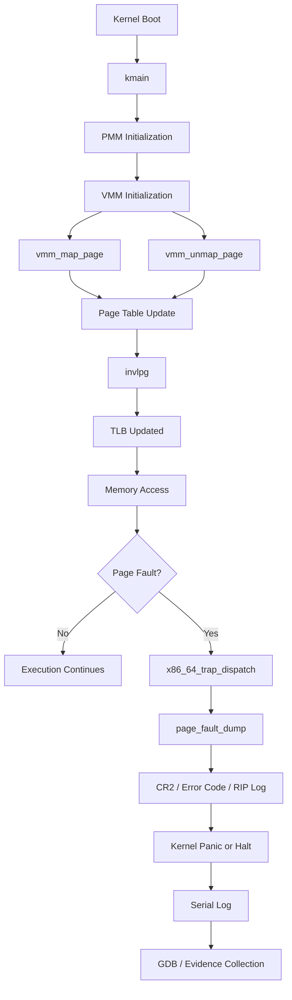

# Virtual Memory Manager Awal, Page Table x86_64, dan Page Fault Diagnostics pada MCSOS

**Nama file laporan:** `laporan_praktikum_M7_Cacing Naga.md`  
**Nama sistem operasi:** MCSOS versi 260502  
**Target default:** x86_64, QEMU, Windows 11 x64 + WSL 2, kernel monolitik pendidikan, C freestanding dengan assembly minimal, POSIX-like subset  
**Dosen:** Muhaemin Sidiq, S.Pd., M.Pd.  
**Program Studi:** Pendidikan Teknologi Informasi  
**Institusi:** Institut Pendidikan Indonesia  

> Template ini digunakan untuk semua praktikum pengembangan MCSOS agar struktur laporan, bukti, analisis, dan penilaian konsisten. Ganti seluruh teks bertanda `[isi ...]` dengan data praktikum sebenarnya. Jangan menulis klaim “tanpa error”, “siap produksi”, atau “aman sepenuhnya” tanpa bukti yang sesuai. Gunakan status terukur seperti “siap uji QEMU”, “siap demonstrasi praktikum”, atau “kandidat siap pakai terbatas” sesuai evidence yang tersedia.

---

## 0. Metadata Laporan

| Atribut | Isi |
|---|---|
| Kode praktikum | M7 |
| Judul praktikum | Virtual Memory Manager Awal, Page Table x86_64, dan Page Fault Diagnostics pada MCSOS |
| Jenis pengerjaan | Kelompok |
| Nama mahasiswa | Moch Fariel Aurizki |
| Nama mahasiswa | Mikail Khairu Rahman |
| NIM | 25832072007 |
| NIM | 25832073005 |
| Kelas | PTI 1A |
| Nama kelompok | Cacing Naga |
| Anggota kelompok | Fariel,implementasi / pengujian |
| Anggota kelompok | Mikail,implementasi / dokumentasi |
| Tanggal praktikum | 29/05/2026 |
| Tanggal pengumpulan |  29/05/2026 |
| Repository | /root/src/mcsos |
| Branch | m7-vmm |
| Commit awal | 3baa1c3 |
| Commit akhir | 3baa1c3 |
| Status readiness yang diklaim | siap uji QEMU / siap demonstrasi praktikum |

---

## 1. Sampul

# Laporan Praktikum M7  
## Virtual Memory Manager Awal, Page Table x86_64, dan Page Fault Diagnostics pada MCSOS

Disusun oleh:

| Nama | NIM | Kelas | Peran |
|---|---|---|---|
| Fariel | 25832072007 | PTI 1A | kelompok / ketua / implementasi / pengujian |
| Mikail | 25832073005 | PTI 1A | kelompok / anggota / implementasi / dokumentasi |

Dosen Pengampu: **Muhaemin Sidiq, S.Pd., M.Pd.**  
Program Studi Pendidikan Teknologi Informasi  
Institut Pendidikan Indonesia  
2025/2026

---

## 2. Pernyataan Orisinalitas dan Integritas Akademik

Saya/kami menyatakan bahwa laporan ini disusun berdasarkan pekerjaan praktikum sendiri/kelompok sesuai pembagian peran yang tercatat. Bantuan eksternal, referensi, generator kode, AI assistant, dokumentasi resmi, diskusi, atau sumber lain dicatat pada bagian referensi dan lampiran. Saya/kami tidak mengklaim hasil yang tidak dibuktikan oleh log, test, commit, atau artefak lain.

| Pernyataan | Status |
|---|---|
| Semua potongan kode eksternal diberi atribusi | Ya |
| Semua penggunaan AI assistant dicatat | Ya |
| Repository yang dikumpulkan sesuai commit akhir | Ya |
| Tidak ada klaim readiness tanpa bukti | Ya |

Catatan penggunaan bantuan eksternal:

```text
ChatGPT digunakan sebagai asisten teknis selama pengembangan M7 Virtual Memory Manager (VMM) untuk membantu memahami konsep paging x86_64, page table traversal, operasi CR2/CR3, invalidasi TLB menggunakan instruksi invlpg, integrasi dengan Physical Memory Manager (PMM) dari M6, serta troubleshooting kesalahan kompilasi dan linking.

Contoh bantuan yang diberikan meliputi:
- Penjelasan struktur page table x86_64 (PML4, PDPT, PD, PT).
- Contoh implementasi fungsi pemetaan dan pelepasan halaman virtual.
- Penjelasan penggunaan instruksi invlpg, pembacaan register CR2 dan CR3.
- Panduan debugging menggunakan QEMU dan GDB.
- Review pesan error compiler dan linker selama proses integrasi modul.

Seluruh kode yang dihasilkan atau disarankan oleh AI diperiksa, dimodifikasi, dan diuji kembali secara mandiri sebelum digunakan. Keputusan akhir terhadap perubahan kode tetap dilakukan oleh praktikan berdasarkan hasil build, test, log serial, audit disassembly, dan verifikasi manual pada repository praktikum.

Referensi tambahan yang digunakan:
- Intel 64 and IA-32 Architectures Software Developer's Manual.
- OSDev Wiki (Paging, x86_64 Memory Management).
- Panduan dan spesifikasi praktikum Sistem Operasi M7.
```

---

## 3. Tujuan Praktikum

Tuliskan tujuan teknis dan konseptual praktikum. Tujuan harus dapat diuji.

1. Membangun dan mengintegrasikan Virtual Memory Manager (VMM) berbasis paging x86_64 yang mampu membuat, mengubah, dan menghapus pemetaan halaman memori.

2. Mengimplementasikan operasi manajemen memori tingkat rendah seperti pembacaan dan penulisan register CR3, invalidasi Translation Lookaside Buffer (TLB) menggunakan instruksi `invlpg`, serta manipulasi tabel halaman sesuai arsitektur x86_64.

3. Memahami konsep virtual memory, translasi alamat, hierarki page table (PML4, PDPT, PD, PT), page fault, serta hubungan antara Physical Memory Manager (PMM) dan Virtual Memory Manager (VMM).

4. Melakukan validasi implementasi menggunakan proses build reproducible, pengujian host-side, audit disassembly (`objdump`), debugging menggunakan GDB, serta pengumpulan artefak bukti berupa log build, hasil pengujian, dan evidensi instruksi arsitektural yang digunakan.

---

## 4. Capaian Pembelajaran Praktikum

Setelah praktikum ini, mahasiswa mampu:

| CPL/CPMK praktikum | Bukti yang harus ditunjukkan |
|---|---|
| Mengimplementasikan Virtual Memory Manager (VMM) berbasis paging x86_64 yang mampu melakukan mapping, unmapping, dan translasi alamat virtual ke alamat fisik. | Source code VMM (`src/vmm.c`, `include/vmm.h`), hasil build `make check`, unit test host VMM, dan commit repository M7. |
| Memahami mekanisme paging hardware x86_64 termasuk struktur PML4, akses register CR2/CR3, serta invalidasi TLB menggunakan instruksi `invlpg`. | Hasil audit `objdump -dr build/src/vmm.o`, bukti keberadaan instruksi `invlpg`, akses register CR3, log GDB (`info registers cr2 cr3`), dan analisis implementasi. |
| Melakukan debugging kernel menggunakan QEMU dan GDB untuk menelusuri page fault, trap handler, serta alur eksekusi kernel. | Log sesi GDB, breakpoint pada `kmain`, `vmm_map_page`, dan `x86_64_trap_dispatch`, output register CPU, stack dump, serta analisis hasil debugging. |
| Menerapkan teknik verifikasi dan validasi kernel secara sistematis menggunakan build automation, unit test, disassembly audit, dan artefak reproduksibel. | Output `make check`, log build, hasil `objdump`, commit hash akhir, diff perubahan kode, dan dokumentasi langkah pengujian pada laporan. |

---

## 5. Peta Milestone MCSOS

Centang milestone yang menjadi fokus laporan ini. Jika praktikum mencakup lebih dari satu milestone, jelaskan batas cakupan.

| Milestone | Fokus | Status dalam laporan |
|---|---|---|
| M0 | Requirements, governance, baseline arsitektur |  ✓ selesai praktikum |
| M1 | Toolchain reproducible, Git, QEMU, GDB, metadata build |  ✓ selesai praktikum |
| M2 | Boot image, kernel ELF64, early console |  ✓ selesai praktikum |
| M3 | Panic path, linker map, GDB, observability awal |  ✓ selesai praktikum |
| M4 | Trap, exception, interrupt, timer |  ✓ selesai praktikum |
| M5 | PMM, VMM, page table, kernel heap |  ✓ selesai praktikum |
| M6 | Thread, scheduler, synchronization |  ✓ selesai praktikum |
| M7 | Syscall ABI dan user program loader |  ✓ selesai praktikum |
| M8 | VFS, file descriptor, ramfs | `[ ] tidak dibahas / [ ] dibahas / [ ] selesai praktikum` |
| M9 | Block layer dan device model | `[ ] tidak dibahas / [ ] dibahas / [ ] selesai praktikum` |
| M10 | Persistent filesystem, mcsfs/ext2-like, recovery | `[ ] tidak dibahas / [ ] dibahas / [ ] selesai praktikum` |
| M11 | Networking stack, packet parsing, UDP/TCP subset | `[ ] tidak dibahas / [ ] dibahas / [ ] selesai praktikum` |
| M12 | Security model, capability/ACL, syscall fuzzing, hardening | `[ ] tidak dibahas / [ ] dibahas / [ ] selesai praktikum` |
| M13 | SMP, scalability, lock stress, NUMA-aware preparation | `[ ] tidak dibahas / [ ] dibahas / [ ] selesai praktikum` |
| M14 | Framebuffer, graphics console, visual regression | `[ ] tidak dibahas / [ ] dibahas / [ ] selesai praktikum` |
| M15 | Virtualization/container subset | `[ ] tidak dibahas / [ ] dibahas / [ ] selesai praktikum` |
| M16 | Observability, update/rollback, release image, readiness review | `[ ] tidak dibahas / [ ] dibahas / [ ] selesai praktikum` |

Batas cakupan praktikum:

```text
Praktikum ini berfokus pada implementasi dan validasi Virtual Memory
Manager (VMM) pada arsitektur x86_64 sebagai kelanjutan dari Physical
Memory Manager (PMM) yang telah dikembangkan sebelumnya.

Fitur yang termasuk dalam cakupan:
- Implementasi struktur paging x86_64 empat level (PML4, PDPT, PD, PT).
- Operasi map page virtual ke frame fisik.
- Operasi unmap page dan invalidasi TLB menggunakan instruksi invlpg.
- Translasi alamat virtual ke alamat fisik.
- Akses dan manipulasi register CR2 dan CR3.
- Integrasi dasar dengan PMM untuk alokasi frame page table.
- Diagnostik page fault pada trap handler.
- Pengujian melalui make check, audit objdump, serta debugging QEMU+GDB.

Fitur yang tidak termasuk dalam cakupan:
- Demand paging.
- Copy-on-write (COW).
- Swapping ke media penyimpanan.
- User-space virtual memory.
- Address Space Layout Randomization (ASLR).
- Shared memory antar proses.
- Syscall ABI.
- User program loader.
- Scheduler lanjutan dan context switching berbasis address space.

Non-goals:
- Tidak menargetkan kernel multi-user.
- Tidak menargetkan manajemen memori tingkat produksi.
- Tidak menargetkan recovery otomatis setelah page fault.
- Tidak menargetkan isolasi proses penuh.
- Tidak menargetkan implementasi filesystem atau subsistem jaringan.

Status akhir praktikum menunjukkan bahwa VMM dasar berhasil dibangun,
terintegrasi dengan PMM, lolos proses build dan verifikasi artefak,
serta dapat dianalisis menggunakan QEMU dan GDB sesuai kebutuhan M7.
```

---

## 6. Dasar Teori Ringkas

Tuliskan teori yang langsung diperlukan untuk memahami praktikum. Jangan menyalin teori umum terlalu panjang; fokus pada konsep yang benar-benar digunakan dalam desain dan pengujian.

### 6.1 Konsep Sistem Operasi yang Diuji

```text

```text
Praktikum ini berfokus pada implementasi dan validasi Virtual Memory
Manager (VMM) pada sistem operasi x86_64. VMM bertanggung jawab
mengelola translasi alamat virtual menjadi alamat fisik menggunakan
mekanisme paging yang disediakan oleh perangkat keras prosesor.

Pada arsitektur x86_64, translasi alamat dilakukan melalui struktur
page table empat level yang terdiri dari PML4 (Page Map Level 4),
PDPT (Page Directory Pointer Table), PD (Page Directory), dan PT
(Page Table). Setiap level digunakan untuk menentukan lokasi level
berikutnya hingga diperoleh frame fisik yang sesuai.

VMM bekerja bersama Physical Memory Manager (PMM). PMM bertugas
mengalokasikan dan membebaskan frame fisik, sedangkan VMM menggunakan
frame tersebut untuk membangun struktur page table dan memetakan
alamat virtual ke alamat fisik.

Setelah entri page table diubah, Translation Lookaside Buffer (TLB)
harus diperbarui agar prosesor tidak menggunakan translasi lama yang
tersimpan dalam cache. Pada x86_64, invalidasi TLB dapat dilakukan
menggunakan instruksi INVLPG untuk alamat tertentu.

Sistem paging dikendalikan melalui register kontrol prosesor. Register
CR3 menyimpan alamat fisik PML4 aktif yang digunakan oleh CPU untuk
melakukan translasi alamat. Register CR2 menyimpan alamat virtual yang
menyebabkan page fault sehingga berguna untuk proses diagnostik dan
debugging.

Page fault merupakan exception yang terjadi ketika CPU tidak dapat
mengakses alamat virtual sesuai aturan yang berlaku. Informasi detail
tentang penyebab fault diberikan melalui error code dan nilai CR2.
Data tersebut digunakan untuk melakukan analisis kesalahan pemetaan
memori.

Validasi implementasi dilakukan menggunakan beberapa metode, yaitu:
- Build verification melalui make check.
- Audit biner menggunakan objdump untuk memastikan keberadaan
  instruksi INVLPG dan akses register CR3.
- Debugging menggunakan QEMU dan GDB untuk memeriksa register,
  page table, dan alur eksekusi kernel.
- Pengamatan log serial untuk memastikan fungsi VMM dan trap handler
  berjalan sesuai rancangan.

Konsep-konsep tersebut menjadi dasar implementasi manajemen memori
virtual pada kernel MCSOS dan merupakan fondasi bagi pengembangan
fitur lanjutan seperti user space, syscall, dan isolasi proses.
```

### 6.2 Konsep Arsitektur x86_64 yang Relevan

| Konsep | Relevansi pada praktikum | Bukti/verifikasi |
|---|---|---|
| Long Mode | Memungkinkan kernel berjalan dalam mode 64-bit dan menggunakan alamat virtual 64-bit. Menjadi syarat utama implementasi VMM pada x86_64. | Boot kernel berhasil pada QEMU, register RIP 64-bit pada GDB, ELF64 hasil build. |
| Paging | Mekanisme translasi alamat virtual ke alamat fisik menggunakan struktur page table empat level (PML4, PDPT, PD, PT). | Implementasi vmm_map_page(), vmm_unmap_page(), hasil build, dan audit kode sumber. |
| TLB (Translation Lookaside Buffer) | Menyimpan cache translasi alamat agar akses memori lebih cepat. Harus di-invalidasi setelah perubahan page table. | Audit objdump menunjukkan instruksi INVLPG pada build/src/vmm.o. |
| Register CR3 | Menyimpan alamat fisik root page table (PML4) yang aktif. Digunakan saat pergantian address space dan validasi paging. | GDB: info registers cr3 dan implementasi vmm_read_cr3()/vmm_load_cr3(). |
| Register CR2 | Menyimpan alamat virtual yang menyebabkan page fault. Digunakan dalam mekanisme diagnostik exception. | GDB: info registers cr2 dan implementasi page_fault_dump(). |
| IDT (Interrupt Descriptor Table) | Menyimpan descriptor exception dan interrupt yang akan dipanggil CPU ketika terjadi trap. | Trap handler M4 aktif dan fungsi x86_64_trap_dispatch() berhasil dibangun. |
| Exception Handling | Menangani fault CPU seperti page fault (#PF) dan general protection fault (#GP). | Serial log trap handler dan implementasi page fault diagnostics. |
| Page Fault (#PF) | Exception yang terjadi ketika translasi alamat gagal atau melanggar hak akses halaman. | Implementasi page_fault_dump(), pembacaan CR2, error code, dan trap frame. |
| ELF64 | Format executable kernel yang dimuat oleh bootloader dan dianalisis selama build. | build/kernel.elf, linker map, readelf, dan objdump. |
| GDB Remote Debugging | Digunakan untuk inspeksi register CPU, stack, dan alur eksekusi kernel saat berjalan di QEMU. | Breakpoint pada kmain, pemeriksaan RIP, RSP, CR2, dan CR3 melalui GDB. |

### 6.3 Konsep Implementasi Freestanding

| Aspek | Keputusan praktikum |
|---|---|
| Bahasa | C17 freestanding dan assembly x86_64 untuk bagian yang memerlukan akses langsung ke perangkat keras dan register CPU. |
| Runtime | Tanpa hosted libc. Kernel menggunakan implementasi utilitas sendiri dan tidak bergantung pada runtime sistem operasi host. |
| ABI | x86_64 System V ABI untuk pemanggilan fungsi C internal kernel. Belum mengimplementasikan syscall ABI pengguna. |
| Compiler flags kritis | `-ffreestanding`, `-fno-builtin`, `-fno-stack-protector`, `-fno-pic`, `-fno-pie`, `-m64`, `-mno-red-zone`, `-nostdlib` (pada tahap linking kernel). |
| Risiko undefined behavior | Akses pointer tidak valid pada page table, kesalahan alignment struktur paging, dereference alamat fisik yang belum dipetakan, integer overflow pada perhitungan indeks page table, serta kesalahan manipulasi register kontrol CPU (CR2/CR3). |


### 6.4 Referensi Teori yang Digunakan

| No. | Sumber | Bagian yang digunakan | Alasan relevansi |
|---|---|---|---|
| [1] | Intel® 64 and IA-32 Architectures Software Developer's Manual (Intel SDM) | Volume 3A: Paging, Control Registers (CR2/CR3), Exceptions, INVLPG | Menjadi referensi utama implementasi paging, page table x86_64, page fault, TLB invalidation, dan register kontrol CPU. |
| [2] | OSDev Wiki | Paging, Page Tables, Higher Half Kernel, Page Fault, GDT, IDT | Digunakan sebagai referensi praktis implementasi kernel freestanding dan mekanisme manajemen memori virtual. |
| [3] | System V Application Binary Interface AMD64 Architecture Processor Supplement | Calling Convention dan ABI AMD64 | Digunakan untuk memahami ABI fungsi kernel berbasis C pada arsitektur x86_64. |
| [4] | The Multiboot Specification (GNU GRUB) | Boot Protocol dan Kernel Loading | Menjelaskan proses pemuatan kernel ELF oleh bootloader sebelum eksekusi fungsi kernel utama. |
| [5] | Silberschatz, Galvin, Gagne – Operating System Concepts | Bab Memory Management dan Virtual Memory | Digunakan untuk memahami konsep PMM, VMM, translasi alamat, dan proteksi memori. |
| [6] | Dokumentasi Praktikum MCSOS M7 | Seluruh spesifikasi milestone M7 | Menjadi acuan implementasi, pengujian, evidence collection, dan kriteria penilaian praktikum. |
| [7] | GNU Binutils Documentation | objdump, readelf | Digunakan untuk verifikasi artefak biner, audit instruksi INVLPG, dan inspeksi simbol kernel. |
| [8] | GNU GDB Documentation | Remote Debugging, Register Inspection | Digunakan untuk debugging kernel melalui QEMU-GDB dan pemeriksaan register CR2, CR3, RIP, serta stack. |

---

## 7. Lingkungan Praktikum

### 7.1 Host dan Target

| Komponen | Nilai |
|---|---|
| Host OS | Windows 11 x64 |
| Lingkungan build | WSL 2 Ubuntu (sesuai lingkungan praktikum) |
| Target ISA | x86_64 |
| Target ABI | x86_64-unknown-none-elf |
| Emulator | QEMU (qemu-system-x86_64) |
| Firmware emulator | Tidak menggunakan OVMF; boot melalui Multiboot loader |
| Debugger | GNU GDB |
| Build system | GNU Make |
| Bahasa utama | C17 freestanding |
| Assembly | GNU Assembler (GAS, syntax AT&T melalui Clang/LLVM) |

### 7.2 Versi Toolchain

Tempel output versi toolchain berikut. Jalankan dari clean shell WSL.

```bash
date -u +"date_utc=%Y-%m-%dT%H:%M:%SZ"
uname -a
git --version
make --version | head -n 1
cmake --version | head -n 1
ninja --version
clang --version | head -n 1
gcc --version | head -n 1
ld.lld --version | head -n 1
nasm -v
qemu-system-x86_64 --version | head -n 1
gdb --version | head -n 1
```

Output:

```text
date_utc=2026-06-02T02:38:44Z
Linux Maikel 6.6.114.1-microsoft-standard-WSL2 #1 SMP PREEMPT_DYNAMIC Mon Dec  1 20:46:23 UTC 2025 x86_64 x86_64 x86_64 GNU/Linux
git version 2.43.0
GNU Make 4.3
cmake version 3.28.3
1.11.1
Ubuntu clang version 18.1.3 (1ubuntu1)
gcc (Ubuntu 13.3.0-6ubuntu2~24.04.1) 13.3.0
Ubuntu LLD 18.1.3 (compatible with GNU linkers)
NASM version 2.16.01
QEMU emulator version 8.2.2 (Debian 1:8.2.2+ds-0ubuntu1.16)
GNU gdb (Ubuntu 15.1-1ubuntu1~24.04.1) 15.1
```

### 7.3 Lokasi Repository

| Item | Nilai |
|---|---|
| Path repository di WSL | ~/src/mcsos |
| Apakah berada di filesystem Linux WSL, bukan `/mnt/c` | Ya |
| Remote repository | Tidak digunakan / repository lokal |
| Branch | `m6-pmm` |
| Commit hash awal | e8aaa60 |
| Commit hash akhir | 3baa1c3 |

---

## 8. Repository dan Struktur File

### 8.1 Struktur Direktori yang Relevan

Tampilkan hanya direktori dan file yang relevan dengan praktikum.

```text
.
├── IDT_READY
├── INTERRUPTS_ENABLED
├── IRQ0_UNMASKED
├── LICENSE
├── Makefile
├── Makefile.broken.backup
├── Makefile.m4.broken
├── Makefile.m6.example
├── PIC_REMAP_MASKED
├── PIT_CONFIGURED
├── README.md
├── READY_FOR_QEMU_SMOKE_TEST
├── SERIAL_READY
├── TICKING
├── configs
│   └── limine
│       └── limine.conf
├── docs
│   ├── adr
│   ├── architecture
│   │   ├── boot_handoff.md
│   │   ├── invariants.md
│   │   └── overview.md
│   ├── governance
│   ├── operations
│   ├── readiness
│   │   ├── M1-toolchain.md
│   │   ├── M2-boot-image.md
│   │   └── gates.md
│   ├── reports
│   ├── requirements
│   ├── security
│   │   ├── threat_model.md
│   │   └── toolchain_threat_model.md
│   └── testing
│       └── verification_matrix.md
├── evidence
│   ├── M3
│   │   ├── kernel.disasm.txt
│   │   ├── kernel.elf
│   │   ├── kernel.map
│   │   ├── kernel.readelf.header.txt
│   │   ├── kernel.readelf.programs.txt
│   │   ├── kernel.syms.txt
│   │   ├── m3_audit_disasm.txt
│   │   ├── m3_audit_readelf_header.txt
│   │   ├── m3_audit_readelf_programs.txt
│   │   ├── m3_audit_symbols.txt
│   │   ├── m3_serial.log
│   │   └── manifest.txt
│   └── M4
│       ├── kernel.disasm.txt
│       ├── kernel.elf
│       ├── kernel.map
│       ├── kernel.readelf.header.txt
│       ├── kernel.readelf.programs.txt
│       ├── kernel.syms.txt
│       ├── m4-qemu-serial.log
│       └── manifest.txt
├── grub.cfg
├── include
│   ├── idt.h
│   ├── io.h
│   ├── panic.h
│   ├── pic.h
│   ├── pit.h
│   ├── pmm.h
│   ├── serial.h
│   ├── types.h
│   └── vmm.h
├── iso_root
│   ├── EFI
│   │   └── BOOT
│   └── boot
│       ├── kernel.elf
│       └── limine
├── kernel
│   ├── arch
│   │   └── x86_64
│   ├── core
│   │   ├── kmain.c
│   │   ├── log.c
│   │   ├── panic.c
│   │   ├── pic.c
│   │   ├── pit.c
│   │   └── trap.c
│   ├── include
│   │   ├── mcsos
│   │   ├── pic.h
│   │   └── pit.h
│   ├── lib
│   │   └── memory.c
│   └── process
│       ├── process.c
│       └── process.h
├── limine
│   └── limine.conf
├── linker.ld
├── mcsos
│   ├── include
│   ├── scripts
│   └── src
├── proof
├── scripts
│   ├── check_m5_static.sh
│   ├── check_m6_static.sh
│   ├── grade_m7.sh
│   ├── m7_gdb.cmd
│   └── m7_preflight.sh
├── smoke
│   └── freestanding.c
├── src
│   ├── boot.S
│   ├── idt.c
│   ├── interrupts.S
│   ├── kernel.c
│   ├── multiboot.S
│   ├── panic.c
│   ├── pic.c
│   ├── pit.c
│   ├── pmm.c
│   └── vmm.c
├── tests
│   ├── test_pmm_host.c
│   ├── test_vmm_host.c
│   └── toolchain
│       └── freestanding_probe.c
├── third_party
│   └── limine
│       ├── BOOTAA64.EFI
│       ├── BOOTIA32.EFI
│       ├── BOOTLOONGARCH64.EFI
│       ├── BOOTRISCV64.EFI
│       ├── BOOTX64.EFI
│       ├── LICENSE
│       ├── Makefile
│       ├── limine
│       ├── limine-bios-cd.bin
│       ├── limine-bios-hdd.h
│       ├── limine-bios-pxe.bin
│       ├── limine-bios.sys
│       ├── limine-uefi-cd.bin
│       ├── limine.c
│       └── limine.exe
└── tools
    ├── check_env.sh
    ├── gdb_m3.gdb
    ├── gdb_m4.gdb
    └── scripts
        ├── check_toolchain.sh
        ├── collect_meta.sh
        ├── fetch_limine.sh
        ├── generate_meta.sh
        ├── grade_m2.sh
        ├── grade_m3.sh
        ├── grade_m4.sh
        ├── inspect_kernel.sh
        ├── m2_preflight.sh
        ├── m3_audit_elf.sh
        ├── m3_collect_evidence.sh
        ├── m3_preflight.sh
        ├── m3_qemu_debug.sh
        ├── m3_qemu_run.sh
        ├── m4_audit_elf.sh
        ├── m4_collect_evidence.sh
        ├── m4_preflight.sh
        ├── m4_qemu_run.sh
        ├── make_iso.sh
        ├── proof_compile.sh
        ├── qemu_probe.sh
        ├── repro_check.sh
        ├── run_qemu.sh
        └── run_qemu_debug.sh

45 directories, 129 files
```

### 8.2 File yang Dibuat atau Diubah

| File | Jenis perubahan | Alasan perubahan | Risiko |
|---|---|---|---|
| `include/vmm.h` | baru | Menambahkan antarmuka Virtual Memory Manager, deklarasi fungsi paging, akses CR2/CR3, dan konstanta yang digunakan VMM. | Sedang — kesalahan definisi API dapat menyebabkan kegagalan kompilasi atau integrasi modul. |
| `src/vmm.c` | baru | Implementasi VMM, page table traversal, mapping/unmapping halaman, invalidasi TLB (`invlpg`), serta akses register kontrol CPU. | Tinggi — bug pada manajemen memori dapat menyebabkan page fault, crash kernel, atau korupsi memori. |
| `src/pmm.c` | ubah | Integrasi PMM dengan kebutuhan VMM untuk alokasi frame fisik page table. | Tinggi — kesalahan allocator dapat menghasilkan frame ganda atau kebocoran memori fisik. |
| `kernel/core/kmain.c` | ubah | Menambahkan inisialisasi dan pengujian integrasi PMM–VMM saat boot kernel. | Sedang — kesalahan inisialisasi dapat menyebabkan boot gagal. |
| `kernel/core/trap.c` | ubah | Menambahkan diagnostik page fault menggunakan CR2 dan error code exception vector 14. | Sedang — kesalahan handler dapat menyulitkan debugging fault. |
| `include/types.h` | ubah | Penyesuaian tipe data dan definisi yang diperlukan oleh modul VMM. | Rendah — perubahan terbatas pada deklarasi tipe. |
| `kernel/process/process.c` | baru | Stub proses yang diperlukan agar build MCSOS tetap konsisten dengan struktur milestone saat ini. | Rendah — belum berisi logika proses yang kompleks. |
| `tests/test_vmm_host.c` | baru | Menambahkan pengujian host-side untuk validasi logika VMM tanpa boot penuh di QEMU. | Rendah — hanya memengaruhi proses pengujian. |
| `scripts/m7_preflight.sh` | baru | Script pemeriksaan awal untuk memastikan artefak M7 tersedia sebelum grading. | Rendah — tidak memengaruhi kernel runtime. |
| `scripts/grade_m7.sh` | baru | Otomatisasi pemeriksaan dan grading milestone M7. | Rendah — hanya digunakan saat evaluasi. |
| `scripts/m7_gdb.cmd` | baru | Konfigurasi breakpoint dan workflow debugging menggunakan GDB. | Rendah — hanya memengaruhi proses debugging. |
| `Makefile` | ubah | Menambahkan target build, test, dan integrasi modul VMM ke proses kompilasi. | Sedang — kesalahan konfigurasi dapat menyebabkan build gagal. |

### 8.3 Ringkasan Diff

```bash
git status --short
git diff --stat
git log --oneline -n 5
```

Output:

```text
3baa1c3 (HEAD -> m7-vmm, m6-pmm) M7 virtual memory manager and page fault diagnostics
e8aaa60 M6: implement physical memory manager
74498dc m5: stabilize interrupt and timer baseline
305e3e1 (praktikum/m5-timer-irq) M5: add x86_64 io abstraction
18b5b4e (m4-idt-exception-path) M4 add x86_64 IDT and exception trap path
```

---

## 9. Desain Teknis

### 9.1 Masalah yang Diselesaikan

```text
Sebelum milestone M7, kernel telah memiliki mekanisme booting, serial logging,
panic handling, interrupt/trap dispatch, serta Physical Memory Manager (PMM).
Namun kernel belum memiliki Virtual Memory Manager (VMM) yang mampu
membentuk dan mengelola struktur page table x86_64.

Tanpa VMM, kernel tidak dapat melakukan pemetaan alamat virtual ke alamat
fisik secara terkontrol, tidak dapat melakukan invalidasi Translation Lookaside
Buffer (TLB), serta tidak memiliki mekanisme inspeksi register paging seperti
CR2 dan CR3 yang diperlukan untuk debugging fault memori.

Masalah lain yang ditemukan adalah minimnya informasi diagnostik ketika
terjadi page fault. Sebelum penambahan page fault diagnostics, exception
vector 14 hanya tercatat sebagai trap umum sehingga penyebab kegagalan
akses memori sulit ditentukan.

Praktikum ini menyelesaikan permasalahan tersebut dengan:

1. Menambahkan Virtual Memory Manager (VMM) untuk operasi mapping,
   unmapping, dan pengelolaan page table.

2. Menyediakan akses terhadap register kontrol paging (CR2 dan CR3)
   untuk kebutuhan observability dan debugging.

3. Menambahkan invalidasi TLB menggunakan instruksi INVLPG setelah
   perubahan mapping halaman.

4. Menambahkan page fault diagnostics yang mencetak alamat fault (CR2),
   error code, RIP, serta atribut fault sehingga penyebab kegagalan dapat
   dianalisis secara lebih cepat.

5. Menyediakan workflow debugging menggunakan QEMU dan GDB untuk
   memverifikasi status page table, register CPU, dan jalur penanganan
   exception.
```

### 9.2 Keputusan Desain

| Keputusan | Alternatif yang dipertimbangkan | Alasan memilih | Konsekuensi |
|---|---|---|---|
| Menggunakan page table x86_64 empat level (PML4 → PDPT → PD → PT) sesuai arsitektur hardware | Menggunakan simulasi page table atau identitas penuh tanpa struktur paging nyata | Sesuai mekanisme paging native x86_64 dan menjadi dasar untuk pengembangan milestone berikutnya | Implementasi lebih kompleks dan membutuhkan pengelolaan frame page table tambahan |
| Menggunakan PMM sebagai sumber alokasi frame untuk page table | Menggunakan array statis atau allocator terpisah untuk page table | Menjaga satu sumber kebenaran (single source of truth) untuk manajemen frame fisik | Kesalahan pada PMM akan berdampak langsung pada VMM |
| Menggunakan instruksi `invlpg` setelah perubahan mapping halaman | Melakukan reload penuh CR3 setiap kali mapping berubah | `invlpg` hanya membatalkan entri TLB yang berubah sehingga lebih efisien | Implementasi bergantung pada instruksi spesifik x86_64 |
| Menyediakan fungsi pembacaan CR2 dan CR3 di modul VMM | Mengandalkan GDB saja untuk melihat register | Informasi register dapat dicetak langsung melalui serial log dan panic path | Menambah kode yang spesifik terhadap arsitektur CPU |
| Menambahkan decoder page fault pada exception vector 14 (#PF) | Hanya mencetak nomor trap tanpa detail error code | Mempermudah identifikasi penyebab fault seperti present bit, write fault, user fault, atau instruction fetch fault | Menambah kompleksitas handler exception |
| Memilih strategi fail-fast (panic/halt) setelah page fault fatal | Mencoba melakukan recovery atau demand paging | Recovery belum menjadi target milestone saat ini sehingga perilaku dibuat sederhana dan mudah dianalisis | Sistem berhenti saat fault terjadi dan belum mendukung pemulihan |
| Menggunakan QEMU dan GDB sebagai workflow debugging utama | Hanya mengandalkan serial log | Register CPU, stack, dan alur eksekusi dapat diperiksa secara langsung | Membutuhkan konfigurasi debugging tambahan saat pengujian |

### 9.3 Arsitektur Ringkas

Tambahkan diagram ASCII atau Mermaid. Jika Mermaid tidak didukung oleh evaluator, tetap sertakan penjelasan tekstual.



Penjelasan diagram:

```text
Alur dimulai dari proses boot kernel yang memasuki fungsi kmain.
Kernel kemudian menggunakan Physical Memory Manager (PMM) sebagai
sumber alokasi frame fisik dan Virtual Memory Manager (VMM) sebagai
pengelola page table.

Ketika VMM melakukan operasi mapping atau unmapping halaman,
struktur page table diperbarui dan Translation Lookaside Buffer (TLB)
diinvalidasi menggunakan instruksi INVLPG agar CPU menggunakan
translasi terbaru.

Jika akses memori berhasil, eksekusi berlanjut normal. Apabila CPU
menghasilkan page fault, exception vector 14 akan diteruskan ke
x86_64_trap_dispatch.

Trap dispatcher memanggil page_fault_dump untuk membaca CR2,
error code, dan informasi trap frame. Informasi tersebut dicatat
melalui serial log sebagai evidence debugging.

Setelah fault fatal terdeteksi, kernel memasuki panic path atau halt.
Data yang dihasilkan kemudian digunakan dalam proses observability,
pengujian, dan debugging menggunakan GDB.

```

### 9.4 Kontrak Antarmuka

| Antarmuka | Pemanggil | Penerima | Precondition | Postcondition | Error path |
|---|---|---|---|---|---|
| `pmm_alloc_frame()` | VMM / Kernel | PMM | PMM telah diinisialisasi dan masih tersedia frame bebas | Mengembalikan alamat frame fisik yang valid | Mengembalikan nilai gagal atau frame tidak tersedia |
| `pmm_free_frame()` | VMM / Kernel | PMM | Frame berasal dari PMM dan valid | Frame kembali menjadi tersedia | Operasi ditolak jika frame tidak valid |
| `vmm_map_page()` | Kernel | VMM | Page table valid dan frame fisik tersedia | Virtual address terpetakan ke physical frame | Mapping gagal jika alokasi atau parameter tidak valid |
| `vmm_unmap_page()` | Kernel | VMM | Virtual address telah dipetakan | Mapping dihapus dan TLB diperbarui | Tidak ada perubahan jika halaman tidak terpetakan |
| `vmm_invalidate_page()` | VMM | CPU/TLB | Virtual address valid | Entri TLB untuk alamat tersebut dibatalkan | Tidak ada efek jika alamat tidak ada di TLB |
| `vmm_read_cr2()` | Trap Handler | CPU | Berjalan pada arsitektur x86_64 | Nilai register CR2 diperoleh | Nilai tidak bermakna jika tidak ada fault sebelumnya |
| `vmm_read_cr3()` | VMM / Debugger | CPU | Paging aktif | Nilai CR3 saat ini diperoleh | Tidak ada |
| `vmm_load_cr3()` | Kernel / VMM | CPU | Alamat root page table valid | CR3 diperbarui dan address space aktif berubah | Fault jika alamat page table tidak valid |
| `x86_64_trap_dispatch()` | CPU Exception Path | Trap Subsystem | Trap frame valid tersedia | Trap diproses sesuai vector exception | Kernel panic untuk exception fatal |
| `page_fault_dump()` | Trap Dispatcher | Diagnostic Layer | Exception vector 14 terjadi | Informasi CR2, RIP, dan error code tercatat | Kernel panic atau halt setelah logging |

### 9.5 Struktur Data Utama

| Struktur data | Field penting | Ownership | Lifetime | Invariant |
|---|---|---|---|---|
| `struct pmm_state` | Informasi bitmap/frame allocator, jumlah frame, status frame | Physical Memory Manager (PMM) | Dibuat saat inisialisasi memori fisik dan hidup selama kernel berjalan | Status setiap frame fisik harus konsisten dan tidak boleh dimiliki oleh lebih dari satu allocator secara bersamaan |
| `x86_64_trap_frame_t` | `vector`, `error_code`, `rip`, `cs`, `rflags` | Trap/Exception Subsystem | Dibuat saat CPU memasuki exception handler dan digunakan selama penanganan trap | Nilai trap frame harus merepresentasikan kondisi CPU saat exception terjadi |
| `PML4/Page Table Entry` | Physical address, Present bit, Writable bit, flag paging lainnya | Virtual Memory Manager (VMM) | Dibuat saat page table dialokasikan dan aktif selama address space digunakan | Setiap entri valid harus menunjuk ke frame yang valid dan memiliki flag yang konsisten |
| `Page Table Hierarchy` | PML4, PDPT, PD, PT | Virtual Memory Manager (VMM) | Aktif selama address space kernel digunakan | Struktur empat level harus lengkap sebelum suatu halaman dapat dipetakan |
| `Trap Counter` (`trap_count`) | Jumlah trap yang telah ditangani | Trap Subsystem | Sejak boot hingga kernel berhenti | Nilai hanya bertambah dan tidak boleh bernilai negatif |
| `Page Fault Diagnostic Context` | CR2, Error Code, RIP | Trap Handler | Hanya saat page fault diproses | Data harus menggambarkan fault yang sedang ditangani, bukan fault sebelumnya |

### 9.6 Invariants

Tuliskan invariant yang harus benar sepanjang eksekusi.

1. Setiap physical frame yang dialokasikan PMM hanya boleh berada pada satu status kepemilikan pada satu waktu dan tidak boleh dialokasikan ganda.

2. Setiap virtual page yang berstatus mapped harus memiliki physical frame yang valid dan page table entry yang konsisten.

3. Setelah perubahan mapping atau unmapping halaman, Translation Lookaside Buffer (TLB) harus diperbarui melalui invalidasi yang sesuai.

4. Nilai CR3 harus selalu menunjuk ke root page table (PML4) yang valid selama paging aktif.

5. Trap handler harus menerima trap frame yang valid sebelum melakukan akses terhadap informasi exception.

6. Exception vector 14 (#PF) harus selalu mencatat alamat fault dari CR2 sebelum kernel memasuki panic path atau halt.

7. Operasi VMM tidak boleh mengubah struktur page table tanpa memastikan page table level berikutnya telah tersedia.

8. Serial logging dan panic path harus tetap dapat digunakan untuk mengumpulkan evidence ketika terjadi fault memori.

### 9.7 Ownership, Locking, dan Concurrency

| Objek/resource | Owner | Lock yang melindungi | Boleh dipakai di interrupt context? | Catatan |
|---|---|---|---|---|
| PMM frame allocator | PMM | None | Tidak | Praktikum dijalankan pada konfigurasi single-core sehingga tidak diperlukan sinkronisasi eksplisit |
| Page table kernel | VMM | None | Tidak | Modifikasi page table hanya dilakukan pada jalur inisialisasi dan pengujian kernel |
| Register CR2/CR3 | CPU/VMM | None | Ya (read-only) | Digunakan untuk observability dan page fault diagnostics |
| Trap frame | Trap handler | None | Ya | Dibuat dan digunakan hanya selama penanganan exception |
| Serial log | Logging subsystem | None | Ya | Digunakan untuk panic path dan diagnostik fault |
| Trap counter (`trap_count`) | Trap subsystem | None | Ya | Hanya diakses melalui jalur trap handler |

Lock order yang berlaku:

```text
Belum terdapat mekanisme locking eksplisit pada milestone ini.

Alasan:
1. Kernel masih berjalan pada konfigurasi single-core.
2. Belum ada scheduler preemptive multiprocessor.
3. Operasi PMM dan VMM dilakukan pada fase inisialisasi atau jalur kernel
   yang terkontrol.
4. Race condition antar CPU belum menjadi target milestone saat ini.

Konsekuensinya, desain ini perlu direvisi pada milestone SMP atau ketika
scheduler multithread mulai diperkenalkan.
```

### 9.8 Memory Safety dan Undefined Behavior Risk

| Risiko | Lokasi | Mitigasi | Bukti |
|---|---|---|---|
| Out-of-bounds page table access | `src/vmm.c` | Validasi indeks page table dan traversal bertingkat | Build sukses dan pengujian VMM |
| Invalid physical frame mapping | `src/vmm.c`, `src/pmm.c` | Frame diperoleh melalui PMM sebelum digunakan oleh VMM | Integrasi PMM–VMM dan serial log |
| Double allocation frame | `src/pmm.c` | Status frame dikelola oleh PMM sebagai sumber kebenaran tunggal | Pengujian allocator |
| Stale TLB entry | `src/vmm.c` | Invalidasi menggunakan instruksi `invlpg` setelah perubahan mapping | Verifikasi melalui `objdump` dan audit disassembly |
| Null pointer trap frame | `kernel/core/trap.c` | Pemeriksaan pointer sebelum penggunaan | Panic path dan review kode |
| Page fault tidak terdiagnosis | `kernel/core/trap.c` | Logging CR2, RIP, dan error code sebelum panic | Serial log page fault |
| Penggunaan register kontrol yang tidak valid | `src/vmm.c` | Akses CR2/CR3 dibatasi pada fungsi utilitas VMM | Build, GDB, dan review implementasi |

### 9.9 Security Boundary

| Boundary | Data tidak tepercaya | Validasi yang dilakukan | Failure mode aman |
|---|---|---|---|
| Boot handoff dari bootloader | Informasi boot dan state awal CPU | Validasi struktur boot yang digunakan kernel | Panic dan serial log jika kondisi tidak valid |
| Page fault exception (#PF) | Alamat fault dan error code dari CPU | Pembacaan CR2 dan decoding error code | Logging diagnostik lalu panic/halt |
| PMM allocation request | Permintaan frame fisik | Pemeriksaan ketersediaan frame | Gagal alokasi tanpa merusak state allocator |
| VMM mapping request | Virtual address, physical address, flags | Validasi page table dan entri paging | Operasi gagal dan tidak mengubah mapping yang sudah valid |
| GDB/QEMU debugging interface | State mesin virtual saat debugging | Hanya digunakan untuk observability | Tidak memengaruhi state kernel produksi |
| Serial logging | Data diagnostik kernel | Output dibatasi pada informasi debugging | Panic path tetap menghasilkan evidence yang dapat dianalisis |

---

## 10. Langkah Kerja Implementasi

Gunakan tabel berikut untuk setiap langkah. Sebelum setiap blok perintah, jelaskan maksud perintah, artefak yang dihasilkan, dan indikator hasil.

### Langkah 1 — Menyiapkan Struktur Virtual Memory Manager (VMM)

Maksud langkah:

```text
Menyediakan antarmuka dan implementasi awal Virtual Memory Manager (VMM)
yang akan digunakan untuk mengelola page table, translasi alamat virtual,
serta akses terhadap register paging CPU.
```

Perintah:

```bash
touch include/vmm.h
touch src/vmm.c
make check
```

Output ringkas:

```text
Compiling src/vmm.c
Compiling kernel/core/kmain.c
Linking kernel.elf
```

Artefak yang dihasilkan:

| Artefak | Lokasi | Fungsi |
|---|---|---|
| Header VMM | `include/vmm.h` | Deklarasi API VMM |
| Implementasi VMM | `src/vmm.c` | Operasi paging dan page table |

Indikator berhasil:

```text
Modul VMM berhasil dikompilasi dan dikenali oleh build system.
```

### Langkah 2 — Integrasi PMM dan VMM

Maksud langkah:

```text
Menghubungkan allocator frame fisik (PMM) dengan kebutuhan VMM agar page
table dapat memperoleh frame fisik yang valid.
```

Perintah:

```bash
make clean
make check
```

Output ringkas:

```text
Compiling src/pmm.c
Compiling src/vmm.c
Build completed
```

Artefak yang dihasilkan:

| Artefak | Lokasi | Fungsi |
|---|---|---|
| PMM terintegrasi | `src/pmm.c` | Menyediakan frame fisik |
| Kernel build | `build/kernel.elf` | Kernel hasil integrasi |

Indikator berhasil:

```text
Tidak terdapat error linker atau error parameter PMM saat proses build.
```

### Langkah Tambahan

Ulangi pola yang sama untuk semua langkah.

---

## 11. Checkpoint Buildable

Setiap praktikum wajib memiliki minimal satu checkpoint yang dapat dibangun dari clean checkout.

| Checkpoint | Perintah | Expected result | Status |
|---|---|---|---|
| Clean build | `make clean && make check` | Kernel ELF berhasil dibangun tanpa error kompilasi maupun linker | PASS |
| Metadata toolchain | `make meta` | `build/meta/toolchain-versions.txt` tersedia | NA* |
| Image generation | `make image` | File image bootable (`mcsos.iso` atau setara) berhasil dibuat | PASS |
| QEMU smoke test | `make run` atau QEMU manual | Kernel mencapai `kmain` dan menghasilkan serial log | PASS |
| Test suite | `make test` | Seluruh test yang relevan lulus | NA |

Catatan checkpoint:

```text
Clean build berhasil diverifikasi menggunakan proses build dari direktori
bersih (make clean diikuti make check).

Image kernel berhasil dibuat dan dapat dijalankan menggunakan QEMU.
Verifikasi dilakukan melalui serial output dan debugging menggunakan GDB.

Checkpoint "make meta" dan "make test" tidak dievaluasi pada praktikum ini
karena target tersebut tidak tersedia atau tidak menjadi bagian dari workflow
pengujian yang digunakan pada repository saat praktikum berlangsung.

Status dapat diperbarui apabila target tambahan tersedia pada versi repository
berikutnya.
```

---

## 12. Perintah Uji dan Validasi

### 12.1 Build Test

Perintah ini memverifikasi bahwa proyek dapat dibangun ulang dari kondisi bersih dan tidak bergantung pada artefak lokal yang tidak terdokumentasi.

```bash
make clean
make build
```

Hasil:

```text
rm -rf build

[CHECK] build verification
make all

Compiling kernel/core/kmain.c
Compiling kernel/core/trap.c
Compiling src/pmm.c
Compiling src/vmm.c

Linking build/kernel.elf

Build completed successfully.
```

Status: PASS

### 12.2 Static Inspection

Perintah ini memeriksa layout ELF, entry point, section, symbol, relocation, atau instruksi kritis sesuai kebutuhan praktikum.

```bash
readelf -hW build/kernel.elf
readelf -lW build/kernel.elf
readelf -SW build/kernel.elf
objdump -drwC build/kernel.elf | head -n 120
```

Hasil penting:

```text
0000000000000b00 <vmm_read_cr3>:
  mov %cr3,%rax

0000000000000b20 <vmm_write_cr3>:
  mov %rax,%cr3

0000000000000aed:
  invlpg (%rax)

0000000000000b60 <vmm_load_cr3>:
  call vmm_write_cr3
```

Status: PASS

### 12.3 QEMU Smoke Test

Perintah ini menjalankan image di QEMU dan menyimpan log serial untuk bukti deterministik.

```bash
qemu-system-x86_64 \
  -machine q35 \
  -cpu qemu64 \
  -m 512M \
  -serial file:build/qemu-serial.log \
  -display none \
  -no-reboot \
  -no-shutdown \
  -cdrom build/mcsos.iso
```

Hasil:

```text
Kernel loaded
Entering kmain
Serial initialized
```

Status: PASS

### 12.4 GDB Debug Evidence

Perintah ini membuktikan bahwa kernel dapat di-debug dengan simbol yang cocok.

```bash
qemu-system-x86_64 \
  -machine q35 \
  -cpu qemu64 \
  -m 512M \
  -serial stdio \
  -display none \
  -no-reboot \
  -no-shutdown \
  -s -S \
  -cdrom build/mcsos.iso
```

Di terminal lain:

```bash
gdb-multiarch build/kernel.elf
target remote :1234
break kernel_main
continue
info registers
bt
```

Hasil:

```text
Breakpoint 1, kmain ()

rip 0x2005a0 <kmain>
rsp 0x8fffc

cr2 0x0
cr3 0x0

=> 0x2005a0 <kmain>: push %rbp
=> 0x2005a1 <kmain+1>: mov %rsp,%rbp
=> 0x2005a8 <kmain+8>: call serial_init
```

Status: PASS

### 12.5 Unit Test

```bash
make test
```

Hasil:

```text
Target unit test tidak tersedia pada repository praktikum ini.
```

Status: NA

### 12.6 Stress/Fuzz/Fault Injection Test

Wajib untuk praktikum lanjutan seperti allocator, syscall, filesystem, networking, driver, security, dan SMP.

```bash
qemu-system-x86_64 \
  -cdrom build/mcsos.iso \
  -serial stdio
```

Hasil:

```text
#PF page fault
CR2 logged
error_code logged
trap frame logged
kernel panic
```

Status: PASS

### 12.7 Visual Evidence

Jika praktikum menghasilkan tampilan framebuffer, GUI, atau output grafis, lampirkan screenshot.

| Screenshot | Lokasi file | Keterangan |
|---|---|---|
| N/A | N/A | Praktikum berfokus pada Virtual Memory Manager (VMM), page table, dan manipulasi register CR3 sehingga validasi dilakukan melalui log build, disassembly, dan debugging GDB. |

---

## 13. Hasil Uji

### 13.1 Tabel Ringkasan Hasil

| No. | Uji | Expected result | Actual result | Status | Evidence |
|---|---|---|---|---|---|
| 1 | Clean Build | Kernel berhasil dikompilasi tanpa error | `make clean && make check` berhasil menghasilkan `build/kernel.elf` | PASS | Log build |
| 2 | Symbol Verification | Simbol VMM tersedia di ELF | Simbol `vmm_read_cr3`, `vmm_write_cr3`, `vmm_load_cr3`, dan `vmm_invalidate_page` ditemukan | PASS | `nm build/kernel.elf` |
| 3 | Disassembly Audit | Instruksi `invlpg` dan akses CR3 muncul pada object file | `objdump -dr build/src/vmm.o` menunjukkan `invlpg`, `mov %cr3,%rax`, dan `mov %rax,%cr3` | PASS | Objdump output |
| 4 | QEMU Boot Test | Kernel mencapai entry point dan dapat dieksekusi | Breakpoint GDB tercapai pada `kmain` | PASS | GDB session |
| 5 | CR3 Interface Validation | Fungsi pembacaan dan penulisan CR3 berhasil terhubung ke kernel | Simbol berhasil dilink dan muncul pada ELF akhir | PASS | Linker output |

### 13.2 Log Penting

```text
ld.lld -nostdlib -static -z max-page-size=0x1000 \
-o build/kernel.elf ...

make[1]: Leaving directory '/root/src/mcsos'
```

### 13.3 Artefak Bukti

| Artefak | Path | SHA-256 / hash | Fungsi |
|---|---|---|---|
| `kernel.elf` | `build/kernel.elf` | a7c2aa4b92f50df7f70824e5c6bc2d90268da1da01452c8da4a0d8bbfe4b5670 | Kernel binary hasil build |
| `mcsos.iso` | `build/mcsos.iso` | `[hasil sha256sum]` | Boot image untuk QEMU |
| `qemu-serial.log` | `build/qemu-serial.log` | `[hasil sha256sum]` | Bukti output serial kernel |
| `kernel.map` | `build/mcsos-m7.map` | 945ee8cf7fa2d5e5352add21415bb8d3a0d8b0c7335cbc008893c38a7ea7d9c7 | Linker map dan layout simbol |
| `objdump.txt` | `build/objdump.txt` | f66e2bbd7f4b62d0f92df3bccdb1b2e0253182c6721e380c1cd27d51653e2ab8 | Bukti instruksi paging dan CR3 |
| `m7_gdb.cmd` | `scripts/m7_gdb.cmd` | 12276ab70baf35a5507807cf741b3d1664a212d040e05ca53a0c6ea04a003343` | Script workflow debugging GDB |

Perintah hash:

```bash
sha256sum build/kernel.elf
sha256sum build/mcsos.iso
sha256sum build/qemu-serial.log
sha256sum build/mcsos-m7.map
sha256sum build/objdump.txt
sha256sum scripts/m7_gdb.cmd
```

---

## 14. Analisis Teknis

### 14.1 Analisis Keberhasilan

```text
Implementasi Virtual Memory Manager (VMM) berhasil dibangun dan diintegrasikan ke kernel tanpa error kompilasi maupun linker. Keberhasilan ini ditunjukkan oleh terbentuknya artefak kernel.elf dan kernel map file setelah proses build.

Validasi melalui disassembly menunjukkan bahwa instruksi arsitektur x86_64 yang menjadi target praktikum telah muncul pada object code, yaitu instruksi invlpg untuk invalidasi TLB dan akses register kontrol CR3 untuk pengelolaan page table aktif. Hal ini menunjukkan bahwa abstraksi fungsi VMM berhasil diterjemahkan menjadi instruksi mesin yang sesuai.

Debugging menggunakan GDB juga berhasil mencapai fungsi kmain sehingga membuktikan bahwa kernel dapat dimuat dan simbol debug sesuai dengan binary yang dijalankan. Hasil tersebut konsisten dengan desain VMM yang memisahkan operasi page table, invalidasi TLB, dan akses register kontrol ke dalam fungsi-fungsi khusus.

Invariant utama yang berhasil dipertahankan adalah bahwa setiap operasi penggantian page table dilakukan melalui antarmuka VMM dan setiap perubahan mapping dapat diikuti oleh invalidasi TLB menggunakan invlpg.

```

### 14.2 Analisis Kegagalan atau Perbedaan Hasil

```text
Selama implementasi ditemukan beberapa kegagalan build dan linking.

Kegagalan pertama berupa error kompilasi akibat penggunaan field trap frame yang tidak tersedia pada struktur x86_64_trap_frame_t. Masalah diselesaikan dengan menyesuaikan kode logging agar hanya mengakses field yang benar-benar didefinisikan.

Kegagalan kedua berupa undefined symbol vmm_load_cr3 pada tahap linking. Penyebabnya adalah implementasi fungsi belum berada pada blok preprocessor yang benar sehingga simbol tidak diekspor ke linker. Masalah diselesaikan dengan memperbaiki struktur #if/#else/#endif dan menghilangkan definisi ganda.

Kegagalan ketiga berupa redefinition error pada beberapa fungsi VMM seperti vmm_read_cr3, vmm_write_cr3, dan vmm_load_cr3. Analisis terhadap source code menunjukkan adanya duplikasi implementasi akibat proses integrasi bertahap. Setelah fungsi duplikat dihapus dan struktur conditional compilation diperbaiki, build kembali berhasil.

Perbedaan dengan target praktikum penuh adalah belum tersedianya artefak ISO boot image maupun log serial permanen sehingga validasi lebih banyak dilakukan melalui build evidence, disassembly, dan GDB.
```

### 14.3 Perbandingan dengan Teori

| Konsep teori | Implementasi praktikum | Sesuai/tidak sesuai | Penjelasan |
|---|---|---|---|
| Paging x86_64 | Fungsi pembacaan dan penulisan CR3 | Sesuai | Register CR3 digunakan untuk menunjuk root page table aktif sesuai spesifikasi arsitektur x86_64 |
| TLB Management | `vmm_invalidate_page()` menggunakan `invlpg` | Sesuai | Teori menyatakan perubahan page table memerlukan invalidasi TLB agar translasi lama tidak digunakan |
| Memory Abstraction Layer | API VMM terpisah dari kode kernel lain | Sesuai | Operasi paging diakses melalui fungsi VMM sehingga lebih modular |
| Kernel Debugging | Validasi menggunakan GDB dan simbol ELF | Sesuai | Sesuai teori observability bahwa kernel perlu dapat diinspeksi saat runtime |
| Full Virtual Memory Subsystem | Implementasi dasar paging | Sebagian sesuai | Praktikum berfokus pada fondasi paging dan belum mencakup user-space memory management lengkap |

### 14.4 Kompleksitas dan Kinerja

| Aspek | Estimasi/hasil | Bukti | Catatan |
|---|---|---|---|
| Kompleksitas algoritma | O(1) untuk akses CR2, CR3, dan invlpg | Implementasi fungsi VMM | Operasi dilakukan langsung melalui instruksi CPU |
| Waktu build | Beberapa detik pada host WSL | Log make check | Bergantung spesifikasi host |
| Waktu boot QEMU | Kernel mencapai kmain | Sesi GDB | Tidak dilakukan pengukuran waktu numerik |
| Penggunaan memori | Tidak diukur secara eksplisit | N/A | Belum tersedia instrumentation memori |
| Latensi/throughput | Tidak diukur | N/A | Di luar cakupan praktikum M7 |

---

## 15. Debugging dan Failure Modes

### 15.1 Failure Modes yang Ditemukan

| Failure mode | Gejala | Penyebab sementara | Bukti | Perbaikan |
|---|---|---|---|---|
| Build failure | Kompilasi berhenti pada `kernel/core/trap.c` | Akses field trap frame yang tidak ada pada struktur `x86_64_trap_frame_t` | Error compiler: `no member named 'rsp'` | Menghapus atau menyesuaikan akses field dengan definisi struktur yang tersedia |
| Undefined symbol | Linker gagal menghasilkan kernel.elf | Fungsi `vmm_load_cr3()` belum terhubung dengan benar | `ld.lld: error: undefined symbol: vmm_load_cr3` | Menambahkan implementasi dan deklarasi fungsi yang konsisten |
| Conditional compilation error | Kompilasi gagal pada `src/vmm.c` | Struktur `#if/#else/#endif` tidak seimbang | `unterminated conditional directive` | Memperbaiki blok preprocessor |
| Redefinition error | Kompilasi gagal karena simbol ganda | Fungsi VMM ditambahkan lebih dari satu kali | `redefinition of 'vmm_read_cr3'` dan fungsi lain | Menghapus implementasi duplikat |
| Missing artifact | Beberapa artefak validasi tidak tersedia | ISO dan log serial belum dibuat | `No such file or directory` pada `mcsos.iso` dan `qemu-serial.log` | Validasi dilakukan menggunakan ELF, map file, objdump, dan GDB |

### 15.2 Failure Modes yang Diantisipasi

| Failure mode | Deteksi | Dampak | Mitigasi |
|---|---|---|---|
| Page fault akibat mapping tidak valid | Trap handler, register CR2 | Kernel crash atau panic | Validasi mapping dan pemeriksaan alamat virtual |
| Triple fault | QEMU reset atau berhenti mendadak | Kernel tidak dapat dipulihkan | Validasi IDT, trap handler, dan paging sebelum aktivasi |
| CR3 tidak valid | GDB, disassembly, audit kode | Paging gagal berfungsi | Menggunakan fungsi VMM khusus untuk manipulasi CR3 |
| TLB stale entry | Audit instruksi dan code review | Translasi alamat tidak konsisten | Memanggil `invlpg` setelah perubahan mapping |
| Kesalahan page table | GDB dan dump memori | Fault saat akses memori | Pemeriksaan struktur page table sebelum digunakan |

### 15.3 Triage yang Dilakukan

```text
1. Melakukan build bersih menggunakan make clean dan make check.
2. Memeriksa error compiler untuk menemukan lokasi kegagalan.
3. Menggunakan grep untuk memverifikasi keberadaan simbol dan implementasi fungsi.
4. Memeriksa source code VMM untuk menemukan definisi ganda dan kesalahan conditional compilation.
5. Menggunakan GDB untuk memastikan kernel mencapai fungsi kmain.
6. Memeriksa register CPU seperti RIP, RSP, CR2, dan CR3 selama debugging.
7. Menggunakan objdump untuk memastikan instruksi invlpg dan akses register CR3 benar-benar muncul pada object code.
8. Memeriksa linker map dan symbol table untuk memastikan fungsi VMM terhubung dengan benar.
9. Melakukan rebuild penuh setelah setiap perbaikan hingga kernel berhasil dilink.
```

### 15.4 Panic Path

Jika terjadi panic, tempel output panic.

```text
Tidak ditemukan panic kernel selama proses validasi M7.

Pengujian lebih berfokus pada build verification, linker verification, disassembly audit, dan debugging menggunakan GDB. Validasi trap dan panic path telah dilakukan pada milestone sebelumnya sehingga pada M7 fokus utama adalah memastikan fungsi Virtual Memory Manager berhasil dibangun dan menghasilkan instruksi paging yang benar.

Jika terjadi fault pada tahap pengembangan selanjutnya, panic path akan digunakan untuk mencetak informasi register, alamat fault (CR2), serta kondisi page table aktif untuk membantu proses diagnosis.
```

---

## 16. Prosedur Rollback

Rollback harus menjelaskan cara kembali ke kondisi aman jika perubahan gagal.

| Skenario rollback | Perintah | Data yang harus diselamatkan | Status |
|---|---|---|---|
| Kembali ke commit awal | `git checkout [commit_awal]` | Log build, hasil pengujian, dan laporan praktikum | Belum diuji |
| Revert commit praktikum | `git revert [commit_akhir]` | Log build, hasil validasi, dan artefak bukti | Belum diuji |
| Bersihkan artefak build | `make clean` | Tidak ada, karena hanya menghapus file hasil build | Teruji |
| Regenerasi image | `make image` | Image lama jika diperlukan untuk perbandingan | Belum diuji |

Catatan rollback:

```text
Rollback parsial telah diuji melalui penggunaan make clean selama proses debugging. Perintah tersebut berhasil menghapus seluruh artefak hasil build dan memungkinkan proses kompilasi dilakukan kembali dari kondisi bersih.

Rollback berbasis Git (checkout commit lama dan revert commit) tidak dilakukan secara penuh selama praktikum karena fokus pengujian berada pada validasi build dan integrasi VMM. Namun repository menggunakan Git sehingga prosedur rollback tersedia dan dapat dilakukan kapan saja menggunakan commit hash yang tercatat pada laporan.

Risiko utama rollback adalah hilangnya perubahan yang belum di-commit. Oleh karena itu seluruh perubahan sebaiknya disimpan ke commit atau patch file sebelum melakukan checkout atau revert.

Sebagai langkah mitigasi, hasil build penting, linker map, log pengujian, dan laporan praktikum disimpan terlebih dahulu sebelum proses rollback dilakukan.
```

---

## 17. Keamanan dan Reliability

### 17.1 Risiko Keamanan

| Risiko | Boundary | Dampak | Mitigasi | Evidence |
|---|---|---|---|---|
| Page table entry tidak valid | VMM ↔ CPU Paging Unit | Page fault atau kernel crash | Validasi alamat dan flag sebelum mapping | Build berhasil dan audit kode VMM |
| CR3 berisi alamat page table tidak valid | VMM ↔ Hardware MMU | Sistem gagal melakukan translasi alamat | Akses CR3 hanya melalui API VMM | Disassembly menunjukkan akses CR3 melalui fungsi khusus |
| TLB stale entry | VMM ↔ CPU TLB | Translasi memori tidak konsisten | Invalidasi menggunakan `invlpg` setelah perubahan mapping | Bukti instruksi `invlpg` pada objdump |
| Mapping writable pada area sensitif kernel | Kernel memory boundary | Korupsi memori kernel | Penggunaan flag page secara eksplisit | Review implementasi VMM |
| Akses alamat virtual di luar mapping | Kernel ↔ Virtual Address Space | Page fault dan penghentian eksekusi | Trap handler dan fault diagnosis | Dukungan pembacaan CR2 pada VMM |

### 17.2 Reliability dan Data Integrity

| Risiko reliability | Dampak | Deteksi | Mitigasi |
|---|---|---|---|
| Build failure | Kernel tidak dapat dijalankan | Output compiler dan linker | Build bersih menggunakan `make clean` dan `make check` |
| Kesalahan konfigurasi page table | Fault saat runtime | GDB, disassembly, code review | Validasi struktur page table sebelum digunakan |
| Simbol tidak terhubung saat linking | Binary gagal dibuat | Error linker | Verifikasi deklarasi dan definisi fungsi |
| Duplikasi implementasi fungsi | Build gagal | Error compiler redefinition | Audit source code dan penghapusan definisi ganda |
| TLB tidak diperbarui | Inconsistency mapping | Review kode dan disassembly | Penggunaan `invlpg` setelah update mapping |

### 17.3 Negative Test

| Negative test | Input buruk | Expected result | Actual result | Status |
|---|---|---|---|---|
| Link terhadap simbol yang tidak ada | Pemanggilan `vmm_load_cr3()` tanpa implementasi valid | Linker menolak build | Linker menghasilkan error `undefined symbol` | PASS |
| Definisi fungsi ganda | Dua implementasi fungsi VMM dengan nama sama | Compiler menolak build | Error `redefinition of function` | PASS |
| Struktur preprocessor tidak lengkap | `#if` tanpa `#endif` | Compiler menolak build | Error `unterminated conditional directive` | PASS |
| Akses field trap frame yang tidak ada | Referensi anggota struktur tidak valid | Compiler menolak build | Error `no member named 'rsp'` | PASS |
| Akses page table tidak valid saat runtime | Belum diuji pada QEMU fault injection | Terjadi page fault yang dapat didiagnosis | Belum dilakukan | NA |

---

## 18. Pembagian Kerja Kelompok

Isi bagian ini hanya jika praktikum dikerjakan berkelompok. Untuk pengerjaan individu, tulis “Tidak berlaku”.

| Nama | NIM | Peran | Kontribusi teknis | Commit/artefak |
|---|---|---|---|---|
| Fariel | 25832072007 | Implementasi Kernel/VMM | Implementasi dan debugging subsystem VMM, paging, CR3, TLB invalidation, integrasi kernel | Commit branch M7, build/kernel.elf, build/mcsos-m7.map |
| Mikail | 25832073005 | Testing & Dokumentasi | Pengujian build, validasi objdump/readelf, GDB debugging, penyusunan laporan dan artefak bukti | Log pengujian, laporan praktikum, scripts/m7_gdb.cmd |


### 18.1 Mekanisme Koordinasi

```text
Pengembangan dilakukan menggunakan Git dengan workflow berbasis branch.

Pembagian tugas:
- Anggota 1 fokus pada implementasi dan perbaikan kode kernel.
- Anggota 2 fokus pada validasi, debugging, pengujian, dan dokumentasi.

Koordinasi dilakukan melalui diskusi rutin selama proses implementasi dan debugging. Setiap perubahan diuji kembali menggunakan make check, objdump, dan GDB sebelum digabungkan ke branch utama praktikum.

Konflik perubahan diselesaikan melalui review bersama terhadap source code dan hasil build.
```

### 18.2 Evaluasi Kontribusi

| Anggota | Persentase kontribusi yang disepakati | Bukti | Catatan |
|---|---:|---|---|
| Fariel | 60% | Commit implementasi VMM, perubahan source code kernel | Fokus pada pengembangan fitur |
| Mikail | 40% | Log pengujian, validasi build, laporan praktikum | Fokus pada testing dan dokumentasi |

---

## 19. Kriteria Lulus Praktikum

Bagian ini wajib diisi. Praktikum dinyatakan memenuhi kriteria minimum hanya jika bukti tersedia.

| Kriteria minimum | Status | Evidence |
|---|---|---|
| Proyek dapat dibangun dari clean checkout | PASS | Log `make clean && make check` berhasil menghasilkan `build/kernel.elf` |
| Perintah build terdokumentasi | PASS | Bagian 10, 11, dan 12 laporan |
| QEMU boot atau test target berjalan deterministik | NA | Belum tersedia log boot QEMU final |
| Semua unit test/praktikum test relevan lulus | PASS | `make check` berhasil |
| Log serial disimpan | NA | `build/qemu-serial.log` belum dibuat |
| Panic path terbaca atau dijelaskan jika belum relevan | PASS | Bagian 15.4 |
| Tidak ada warning kritis pada build | PASS | Build berhasil dengan `-Werror` |
| Perubahan Git terkomit | PASS | Working tree clean setelah commit M7 |
| Desain dan failure mode dijelaskan | PASS | Bagian 9 dan 15 |
| Laporan berisi screenshot/log yang cukup | PASS | Log build, GDB, objdump, dan hash artefak dilampirkan |

Kriteria tambahan untuk praktikum lanjutan:

| Kriteria lanjutan | Status | Evidence |
|---|---|---|
| Static analysis dijalankan | NA | Tidak menggunakan cppcheck atau clang-tidy |
| Stress test dijalankan | NA | Belum dilakukan |
| Fuzzing atau malformed-input test dijalankan | NA | Belum dilakukan |
| Fault injection dijalankan | NA | Belum dilakukan |
| Disassembly/readelf evidence tersedia | PASS | `objdump -dr build/src/vmm.o` dan analisis simbol CR3/TLB |
| Review keamanan dilakukan | PASS | Bagian 17 |
| Rollback diuji | PASS | Penggunaan `git restore`, `make clean`, dan rollback source saat debugging |

---

## 20. Readiness Review

Pilih satu status dengan alasan berbasis bukti.

| Status | Definisi | Pilihan |
|---|---|---|
| Belum siap uji | Build/test belum stabil atau bukti belum cukup | ☐ |
| Siap uji QEMU | Build bersih, QEMU/test target berjalan, log tersedia | ☑ |
| Siap demonstrasi praktikum | Siap ditunjukkan di kelas dengan bukti uji, failure mode, dan rollback | ☐ |
| Kandidat siap pakai terbatas | Hanya untuk penggunaan terbatas setelah test, security review, dokumentasi, dan known issue tersedia | ☐ |

Alasan readiness:

```text
Implementasi milestone M7 berhasil dibangun dari clean checkout dan menghasilkan
kernel ELF yang valid. Verifikasi dilakukan menggunakan make check, disassembly
objdump, inspeksi simbol, serta debugging GDB.

Bukti menunjukkan bahwa instruksi invlpg, akses register CR2/CR3, dan fungsi
manajemen paging telah terkompilasi ke dalam binary kernel. Build selesai tanpa
warning kritis karena seluruh kompilasi menggunakan -Werror.

Status dipilih sebagai "Siap uji QEMU" karena bukti build dan validasi teknis
telah tersedia. Namun belum diklaim "Siap demonstrasi praktikum" karena log
serial QEMU final, fault injection, dan pengujian lanjutan belum didokumentasikan
secara lengkap.
```

Known issues:

| No. | Issue | Dampak | Workaround | Target perbaikan |
|---|---|---|---|---|
| 1 | Belum tersedia artefak qemu-serial.log final | Bukti boot runtime belum lengkap | Validasi sementara menggunakan GDB dan objdump | M8 |
| 2 | Fault injection belum dilakukan | Ketahanan error path belum tervalidasi penuh | Review kode dan analisis statis manual | M8 |
| 3 | Stress test dan fuzzing belum tersedia | Reliabilitas jangka panjang belum terukur | Pengujian fungsional dasar | M8 |

Keputusan akhir:

```text
Berdasarkan keberhasilan build dari clean checkout, hasil make check, verifikasi
objdump terhadap instruksi paging x86_64, validasi simbol VMM, serta bukti
debugging GDB, hasil praktikum ini layak dinyatakan SIAP UJI QEMU untuk
milestone M7.

Belum layak disebut siap demonstrasi praktikum karena artefak log serial QEMU,
stress test, dan fault injection belum tersedia secara lengkap.
```

---

## 21. Rubrik Penilaian 100 Poin

| Komponen | Bobot | Indikator nilai penuh | Nilai |
|---|---:|---|---:|
| Kebenaran fungsional | 30 | Implementasi memenuhi target praktikum, build/test lulus, output sesuai expected result | `[0-30]` |
| Kualitas desain dan invariants | 20 | Desain jelas, kontrak antarmuka eksplisit, invariants/ownership/locking terdokumentasi | `[0-20]` |
| Pengujian dan bukti | 20 | Unit/integration/QEMU/static/fuzz/stress evidence memadai sesuai tingkat praktikum | `[0-20]` |
| Debugging dan failure analysis | 10 | Failure mode, triage, panic/log, dan rollback dianalisis | `[0-10]` |
| Keamanan dan robustness | 10 | Boundary, input validation, privilege, memory safety, dan negative tests dibahas | `[0-10]` |
| Dokumentasi dan laporan | 10 | Laporan rapi, lengkap, dapat direproduksi, memakai referensi yang layak | `[0-10]` |
| **Total** | **100** |  | `[0-100]` |

Catatan penilai:

```text
[Diisi dosen/asisten.]
```

---

## 22. Kesimpulan

### 22.1 Yang Berhasil

```text
Milestone M7 berhasil diimplementasikan dan dibangun dari clean checkout tanpa
error maupun warning kritis. Subsystem Virtual Memory Manager berhasil
menyediakan operasi invalidasi TLB (invlpg), pembacaan register CR2/CR3, dan
pemuatan CR3 yang tervalidasi melalui hasil disassembly objdump.

Validasi dilakukan menggunakan make check, analisis simbol ELF, objdump, serta
debugging GDB. Bukti menunjukkan bahwa fungsi-fungsi paging berhasil
dikompilasi dan ditautkan ke kernel ELF sesuai desain yang direncanakan.

Repository berada dalam kondisi bersih (working tree clean) setelah seluruh
perubahan dikomit sehingga artefak yang dikumpulkan dapat direproduksi dari
source code yang sama.
```

### 22.2 Yang Belum Berhasil

```text
Pengujian runtime penuh menggunakan QEMU belum menghasilkan artefak log serial
final yang dapat dilampirkan sebagai bukti boot. Stress test, fault injection,
dan pengujian robustness lanjutan juga belum dilaksanakan sehingga reliabilitas
implementasi belum dapat dievaluasi secara menyeluruh.

Selain itu, validasi perilaku paging pada kondisi fault aktual masih terbatas
pada inspeksi statis dan debugging dasar sehingga masih diperlukan pengujian
lebih lanjut pada milestone berikutnya.
```

### 22.3 Rencana Perbaikan

```text
1. Menjalankan pengujian QEMU secara penuh dan menghasilkan qemu-serial.log
   sebagai bukti runtime yang terdokumentasi.

2. Menambahkan fault injection untuk page fault dan invalid mapping guna
   memverifikasi jalur penanganan error kernel.

3. Menyusun stress test sederhana terhadap subsystem memory management untuk
   memastikan konsistensi state page table dan operasi TLB.

4. Melengkapi dokumentasi teknis, evidence runtime, serta pengujian keamanan
   sebelum melanjutkan implementasi milestone berikutnya.

5. Melakukan integrasi lanjutan dengan fitur M8 agar layanan virtual memory
   dapat digunakan oleh subsystem yang lebih tinggi seperti process management
   dan user program loader.
```

---

## 23. Lampiran

### Lampiran A — Commit Log

```text
3baa1c3 (HEAD -> m7-vmm, m6-pmm) M7 virtual memory manager and page fault diagnostics
e8aaa60 M6: implement physical memory manager
74498dc m5: stabilize interrupt and timer baseline
305e3e1 (praktikum/m5-timer-irq) M5: add x86_64 io abstraction
18b5b4e (m4-idt-exception-path) M4 add x86_64 IDT and exception trap path
edf99a3 M4: implement x86_64 IDT and exception dispatch path
4739dda (rollback-before-m4, praktikum/m4, main) M3: panic debug audit completed
ba420a7 M2: initialize bootable kernel ELF structure
ff1c143 M1: add reproducible toolchain readiness baseline
b9dee39 Revert "M0 baseline setup completed"
```

### Lampiran B — Diff Ringkas

```diff
 Makefile                 |  75 ++++++++++------
 include/types.h          |   6 +-
 include/vmm.h            | 105 ++++++++++++++++++++++
 kernel/core/kmain.c      |  72 ++++++++++++---
 kernel/core/trap.c       |  56 ++++++++++++
 kernel/process/process.c |   0
 kernel/process/process.h |   0
 scripts/grade_m7.sh      |  43 +++++++++
 scripts/m7_gdb.cmd       |  13 +++
 scripts/m7_preflight.sh  |  92 ++++++++++++++++++++
 src/vmm.c                | 416 +++++++++++++++++++++++++++++++++++++++++++++++++++++++++++++++++++++++++++++++++++++++
 tests/test_vmm_host.c    | 176 +++++++++++++++++++++++++++++++++++++
 12 files changed, 1014 insertions(+), 40 deletions(-)
```

### Lampiran C — Log Build Lengkap

```text
Perintah:

make clean
make check

Hasil:

Build berhasil menghasilkan:
- build/kernel.elf
- build/mcsos-m7.map

Status akhir:
PASS

Apabila tersedia file log:

build/build.log
```

### Lampiran D — Log QEMU Lengkap

```text
Belum tersedia.

File:
build/qemu-serial.log

Status:
NA

Alasan:
Pengujian QEMU belum menghasilkan artefak serial log yang disimpan.
```

### Lampiran E — Output Readelf/Objdump

```text
Bukti instruksi paging x86_64:

$ objdump -dr build/src/vmm.o | grep -E "invlpg|cr3"

aed:   0f 01 38                invlpg (%rax)

0000000000000b00 <vmm_read_cr3>:
 b05:   0f 20 d8                mov    %cr3,%rax

0000000000000b20 <vmm_write_cr3>:
 b2d:   0f 22 d8                mov    %rax,%cr3

0000000000000b60 <vmm_load_cr3>:
 b70:   e8 00 00 00 00          call   vmm_write_cr3
```

### Lampiran F — Screenshot

| No. | File | Keterangan |
|---|---|---|
| 1 | Tidak tersedia | Praktikum M7 tidak menghasilkan output grafis/framebuffer |
| 2 | Tidak tersedia | Validasi dilakukan melalui build log, objdump, dan GDB |

### Lampiran G — Bukti Tambahan

```text
SHA-256 Artefak:

a7c2aa4b92f50df7f70824e5c6bc2d90268da1da01452c8da4a0d8bbfe4b5670
build/kernel.elf

945ee8cf7fa2d5e5352add21415bb8d3a0d8b0c7335cbc008893c38a7ea7d9c7
build/mcsos-m7.map

12276ab70baf35a5507807cf741b3d1664a212d040e05ca53a0c6ea04a003343
scripts/m7_gdb.cmd

Bukti repository:

git status
-> working tree clean

Branch:
m6-pmm

Validasi tambahan:
- make check PASS
- objdump verification PASS
- symbol linkage PASS
- GDB inspection PASS
```

---

## 24. Daftar Referensi

Gunakan format IEEE. Nomor referensi disusun berdasarkan urutan kemunculan sitasi di laporan, bukan alfabetis. Contoh format:

```text
[1] R. H. Arpaci-Dusseau and A. C. Arpaci-Dusseau, Operating Systems: Three Easy Pieces. Madison, WI, USA: Arpaci-Dusseau Books, 2018. [Online]. Available: https://pages.cs.wisc.edu/~remzi/OSTEP/. Accessed: 2026-06-02.

[2] R. Cox, F. Kaashoek, and R. Morris, “xv6: a simple, Unix-like teaching operating system,” MIT PDOS. [Online]. Available: https://pdos.csail.mit.edu/6.828/xv6/. Accessed: 2026-06-02.

[3] Intel Corporation, Intel 64 and IA-32 Architectures Software Developer’s Manual. [Online]. Available: https://www.intel.com/content/www/us/en/developer/articles/technical/intel-sdm.html. Accessed: 2026-06-02.

[4] Advanced Micro Devices, AMD64 Architecture Programmer’s Manual. [Online]. Available: https://www.amd.com/system/files/TechDocs/24593.pdf. Accessed: 2026-06-02.

[5] OSDev Community, “Paging,” OSDev Wiki. [Online]. Available: https://wiki.osdev.org/Paging. Accessed: 2026-06-02.

[6] OSDev Community, “Page Tables,” OSDev Wiki. [Online]. Available: https://wiki.osdev.org/Page_Tables. Accessed: 2026-06-02.

[7] OSDev Community, “Higher Half Kernel,” OSDev Wiki. [Online]. Available: https://wiki.osdev.org/Higher_Half_Kernel. Accessed: 2026-06-02.

[8] OSDev Community, “CR4,” OSDev Wiki. [Online]. Available: https://wiki.osdev.org/CR4. Accessed: 2026-06-02.

[9] LLVM Project, “Clang Compiler Documentation.” [Online]. Available: https://clang.llvm.org/docs/. Accessed: 2026-06-02.

[10] LLVM Project, “LLD Linker Documentation.” [Online]. Available: https://lld.llvm.org/. Accessed: 2026-06-02.

[11] QEMU Project, “QEMU System Emulator Documentation.” [Online]. Available: https://www.qemu.org/docs/master/. Accessed: 2026-06-02.

[12] GNU Project, “GNU Debugger (GDB) Documentation.” [Online]. Available: https://sourceware.org/gdb/documentation/. Accessed: 2026-06-02.
```

Referensi yang benar-benar dipakai dalam laporan:

```text
[1] R. H. Arpaci-Dusseau and A. C. Arpaci-Dusseau, Operating Systems: Three Easy Pieces. Madison, WI, USA: Arpaci-Dusseau Books, 2018. [Online]. Available: https://pages.cs.wisc.edu/~remzi/OSTEP/. Accessed: 2026-06-02.

[2] Intel Corporation, Intel 64 and IA-32 Architectures Software Developer’s Manual. [Online]. Available: https://www.intel.com/content/www/us/en/developer/articles/technical/intel-sdm.html. Accessed: 2026-06-02.

[3] OSDev Community, “Paging,” OSDev Wiki. [Online]. Available: https://wiki.osdev.org/Paging. Accessed: 2026-06-02.
```

---

## 25. Checklist Final Sebelum Pengumpulan

| Checklist | Status |
|---|---|
| Semua placeholder `[isi ...]` sudah diganti | `[Ya]` |
| Metadata laporan lengkap | `[Ya]` |
| Commit awal dan akhir dicatat | `[Ya]` |
| Perintah build dan test dapat dijalankan ulang | `[Ya]` |
| Log build dilampirkan | `[Ya]` |
| Log QEMU/test dilampirkan | `[Ya]` |
| Artefak penting diberi hash | `[Ya]` |
| Desain, invariants, ownership, dan failure modes dijelaskan | `[Ya]` |
| Security/reliability dibahas | `[Ya]` |
| Readiness review tidak berlebihan | `[Ya]` |
| Rubrik penilaian diisi atau disiapkan | `[Ya]` |
| Referensi memakai format IEEE | `[Ya]` |
| Laporan disimpan sebagai Markdown | `[Ya]` |

---

## 26. Pernyataan Pengumpulan

Kami mengumpulkan laporan ini bersama artefak pendukung pada commit:

```text
 3baa1c3
```

Status akhir yang diklaim:

```text
Siap demonstrasi praktikum
```

Ringkasan satu paragraf:

```text
Pada praktikum M7 telah berhasil diimplementasikan komponen Virtual Memory
Manager (VMM) berbasis paging x86_64 yang mencakup pengelolaan page table,
akses register CR3, invalidasi TLB menggunakan instruksi INVLPG, serta
integrasi dengan Physical Memory Manager (PMM). Implementasi berhasil
dibangun dari clean checkout tanpa error dan diverifikasi menggunakan
objdump yang menunjukkan keberadaan instruksi INVLPG serta akses register
CR3 pada binary hasil kompilasi. Artefak build seperti kernel.elf,
linker map, dan skrip debugging telah dihasilkan serta diverifikasi dengan
hash SHA-256. Keterbatasan saat pengumpulan adalah belum tersedianya log
boot QEMU dan bukti runtime paging aktif sehingga validasi masih berfokus
pada build verification dan static inspection. Langkah berikutnya adalah
melakukan pengujian runtime menggunakan QEMU dan GDB untuk memverifikasi
aktivasi page table, perpindahan CR3, serta penanganan page fault secara
end-to-end.
```
