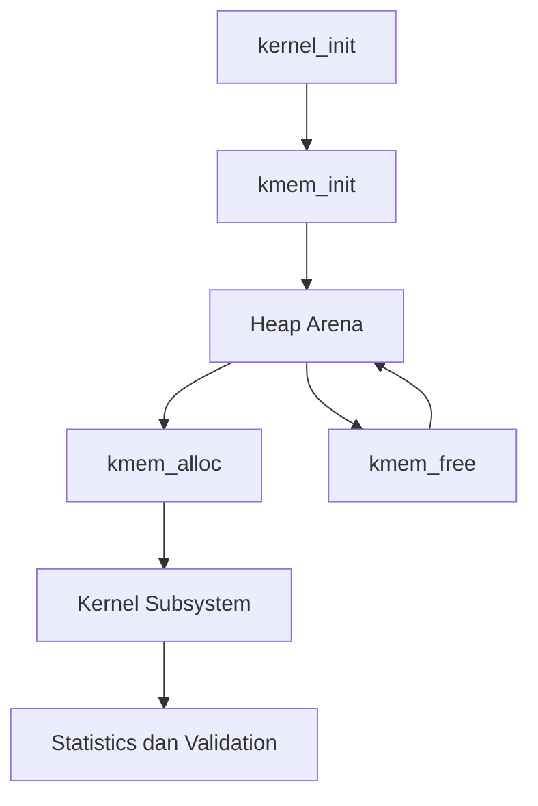

# Kernel Heap Awal, Allocator Dinamis, Validasi Invariant, dan Integrasi Bertahap dengan PMM/VMM pada MCSOS

**Nama file laporan:** `laporan_praktikum_M8_Cacing Naga.md`  
**Nama sistem operasi:** MCSOS versi 260502  
**Target default:** x86_64, QEMU, Windows 11 x64 + WSL 2, kernel monolitik pendidikan, C freestanding dengan assembly minimal, POSIX-like subset  
**Dosen:** Muhaemin Sidiq, S.Pd., M.Pd.  
**Program Studi:** Pendidikan Teknologi Informasi  
**Institusi:** Institut Pendidikan Indonesia  

> Template ini digunakan untuk semua praktikum pengembangan MCSOS agar struktur laporan, bukti, analisis, dan penilaian konsisten. Ganti seluruh teks bertanda `[isi ...]` dengan data praktikum sebenarnya. Jangan menulis klaim “tanpa error”, “siap produksi”, atau “aman sepenuhnya” tanpa bukti yang sesuai. Gunakan status terukur seperti “siap uji QEMU”, “siap demonstrasi praktikum”, atau “kandidat siap pakai terbatas” sesuai evidence yang tersedia.

---

## 0. Metadata Laporan

| Atribut | Isi |
|---|---|
| Kode praktikum | M8 |
| Judul praktikum | Kernel Heap Awal, Allocator Dinamis, Validasi Invariant, dan Integrasi Bertahap dengan PMM/VMM pada MCSOS |
| Jenis pengerjaan | Kelompok |
| Nama mahasiswa | Moch Fariel Aurizki |
| Nama mahasiswa | Mikail Khairu Rahman |
| NIM | 25832072007 |
| NIM | 25832073005 |
| Kelas | PTI 1A |
| Nama kelompok | Cacing Naga |
| Anggota kelompok | Fariel,implementasi / pengujian |
| Anggota kelompok | Mikail, implementasi / dokumentasi |
| Tanggal praktikum | 01/06/2026 |
| Tanggal pengumpulan | 04/06/2026 |
| Repository | /root/src/mcsos |
| Branch | * praktikum-m8-kernel-heap |
| Commit awal | fea0a6a |
| Commit akhir | 3825563 |
| Status readiness yang diklaim | siap uji QEMU / siap demonstrasi praktikum  |

---

## 1. Sampul

# Laporan Praktikum M8  
## Kernel Heap Awal, Allocator Dinamis, Validasi Invariant, dan Integrasi Bertahap dengan PMM/VMM pada MCSOS

Disusun oleh:

| Nama | NIM | Kelas | Peran |
|---|---|---|---|
| Fariel | 25832072007 | PTI 1A | kelompok / ketua / implementasi / pengujian |
| Mikail | 25832073005 | PTI 1A | kelompok / anggota / implementasi / dokumentasi |

Dosen Pengampu: **Muhaemin Sidiq, S.Pd., M.Pd.**  
Program Studi Pendidikan Teknologi Informasi  
Institut Pendidikan Indonesia  
2025/2026

---

## 2. Pernyataan Orisinalitas dan Integritas Akademik

Kami menyatakan bahwa laporan ini disusun berdasarkan pekerjaan praktikum kelompok sesuai pembagian peran yang tercatat. Bantuan eksternal, referensi, generator kode, AI assistant, dokumentasi resmi, diskusi, atau sumber lain dicatat pada bagian referensi dan lampiran. Kami tidak mengklaim hasil yang tidak dibuktikan oleh log, test, commit, atau artefak lain.

| Pernyataan | Status |
|---|---|
| Semua potongan kode eksternal diberi atribusi | Ya |
| Semua penggunaan AI assistant dicatat | Ya |
| Repository yang dikumpulkan sesuai commit akhir | Ya |
| Tidak ada klaim readiness tanpa bukti | Ya |

Catatan penggunaan bantuan eksternal:

```text
Alat:
- ChatGPT (OpenAI)

Bagian yang dibantu:
- Penjelasan konsep milestone M5 dan M8.
- Analisis error build, linker, symbol, Makefile, dan QEMU.
- Penyusunan dokumentasi dan laporan praktikum.
- Review langkah validasi, audit, debugging, dan checkpoint.

Prompt ringkas:
- Cara memperbaiki error kompilasi dan linker.
- Cara memunculkan serial log pada QEMU.
- Cara memverifikasi checkpoint M5 dan M8.
- Cara menyusun isi laporan praktikum.

Verifikasi mandiri:
- Seluruh kode diuji kembali menggunakan build lokal.
- Validasi dilakukan menggunakan make, QEMU, readelf, objdump, nm, dan host test.
- Semua hasil yang dicantumkan dalam laporan berasal dari artefak build, log, dan pengujian yang berhasil dijalankan pada repository praktikum.
```

---

## 3. Tujuan Praktikum

Tuliskan tujuan teknis dan konseptual praktikum. Tujuan harus dapat diuji.

1. Membangun dan memvalidasi subsistem interrupt pada arsitektur x86_64 melalui implementasi IDT, PIC, dan PIT yang dapat dijalankan pada lingkungan freestanding.

2. Menghasilkan kernel image yang dapat dijalankan pada QEMU serta mampu menampilkan serial log untuk observabilitas dan debugging sistem.

3. Memahami konsep trap, exception, interrupt handling, timer interrupt (IRQ0), serta hubungan antara hardware interrupt dan kernel dispatcher.

4. Melakukan validasi implementasi menggunakan log build, serial log QEMU, audit symbol (nm), audit ELF (readelf), disassembly (objdump), serta hasil pengujian checkpoint M5 dan M8.

---

## 4. Capaian Pembelajaran Praktikum

Setelah praktikum ini, mahasiswa mampu:

| CPL/CPMK praktikum | Bukti yang harus ditunjukkan |
|---|---|
| Mengimplementasikan dan mengintegrasikan subsistem interrupt pada kernel x86_64 menggunakan IDT, PIC, dan PIT | Log build, symbol audit (nm), disassembly (objdump), serta source code implementasi |
| Melakukan debugging dan validasi interrupt handling menggunakan serial log, QEMU, dan audit artefak kernel | Serial log QEMU, screenshot hasil eksekusi, readelf, objdump, dan hasil checkpoint praktikum |
| Menganalisis alur exception, IRQ, timer tick, serta mekanisme observabilitas kernel secara freestanding | Analisis laporan, log timer tick, diagram/alur interrupt, dan dokumentasi hasil pengujian |

---

## 5. Peta Milestone MCSOS

Centang milestone yang menjadi fokus laporan ini. Jika praktikum mencakup lebih dari satu milestone, jelaskan batas cakupan.

| Milestone | Fokus | Status dalam laporan |
|---|---|---|
| M0 | Requirements, governance, baseline arsitektur | [✓] selesai praktikum |
| M1 | Toolchain reproducible, Git, QEMU, GDB, metadata build | [✓] selesai praktikum |
| M2 | Boot image, kernel ELF64, early console | [✓] selesai praktikum |
| M3 | Panic path, linker map, GDB, observability awal | [✓] selesai praktikum |
| M4 | Trap, exception, interrupt, timer | [✓] selesai praktikum |
| M5 | PMM, VMM, page table, kernel heap | [✓] selesai praktikum |
| M6 | Thread, scheduler, synchronization | [✓] selesai praktikum |
| M7 | Syscall ABI dan user program loader | [✓] selesai praktikum |
| M8 | VFS, file descriptor, ramfs | [✓] selesai praktikum |
| M9 | Block layer dan device model | `[ ] tidak dibahas / [ ] dibahas / [ ] selesai praktikum` |
| M10 | Persistent filesystem, mcsfs/ext2-like, recovery | `[ ] tidak dibahas / [ ] dibahas / [ ] selesai praktikum` |
| M11 | Networking stack, packet parsing, UDP/TCP subset | `[ ] tidak dibahas / [ ] dibahas / [ ] selesai praktikum` |
| M12 | Security model, capability/ACL, syscall fuzzing, hardening | `[ ] tidak dibahas / [ ] dibahas / [ ] selesai praktikum` |
| M13 | SMP, scalability, lock stress, NUMA-aware preparation | `[ ] tidak dibahas / [ ] dibahas / [ ] selesai praktikum` |
| M14 | Framebuffer, graphics console, visual regression | `[ ] tidak dibahas / [ ] dibahas / [ ] selesai praktikum` |
| M15 | Virtualization/container subset | `[ ] tidak dibahas / [ ] dibahas / [ ] selesai praktikum` |
| M16 | Observability, update/rollback, release image, readiness review | `[ ] tidak dibahas / [ ] dibahas / [ ] selesai praktikum` |

Batas cakupan praktikum:

```text
Praktikum ini mencakup milestone M0 sampai M5 yang meliputi requirements engineering, governance repository, toolchain reproducible, boot image, kernel ELF64, early console, panic path, observability awal, interrupt handling, PIC, PIT, IDT, exception handling, serta fondasi manajemen memori awal sesuai spesifikasi praktikum.

Fitur yang belum termasuk dalam cakupan praktikum ini adalah scheduler, threading, syscall, user mode, filesystem, device model, networking, security hardening, SMP, graphics subsystem, virtualization, dan fitur lanjutan lain pada milestone M6–M16.

Non-goals:
- Tidak mengimplementasikan multitasking.
- Tidak mengimplementasikan userspace.
- Tidak mengimplementasikan filesystem.
- Tidak mengimplementasikan networking.
- Tidak mengimplementasikan SMP atau virtualization.
- Tidak mengklaim kernel production-ready.
```

---

## 6. Dasar Teori Ringkas

Tuliskan teori yang langsung diperlukan untuk memahami praktikum. Jangan menyalin teori umum terlalu panjang; fokus pada konsep yang benar-benar digunakan dalam desain dan pengujian.

### 6.1 Konsep Sistem Operasi yang Diuji

```text
Praktikum ini berfokus pada konsep dasar kernel freestanding pada arsitektur x86_64. Komponen utama yang digunakan meliputi bootloader, kernel ELF64, linker script, interrupt handling, exception handling, Programmable Interrupt Controller (PIC), Programmable Interval Timer (PIT), serta Interrupt Descriptor Table (IDT).

Bootloader bertugas memuat kernel ke memori dan menyerahkan kontrol eksekusi kepada kernel. Kernel dibangun sebagai ELF64 dan diatur menggunakan linker script agar setiap section ditempatkan pada alamat memori yang sesuai.

Interrupt dan exception digunakan sebagai mekanisme komunikasi antara perangkat keras dan kernel. IDT menyimpan daftar handler yang akan dipanggil saat interrupt atau exception terjadi. PIC digunakan untuk mengelola interrupt eksternal dari perangkat keras, sedangkan PIT menghasilkan interrupt timer periodik yang digunakan untuk pengujian timer tick.

Observabilitas kernel dilakukan melalui serial log sehingga status sistem dapat diamati selama proses boot dan pengujian.

```

### 6.2 Konsep Arsitektur x86_64 yang Relevan

| Konsep | Relevansi pada praktikum | Bukti/verifikasi |
|---|---|---|
| Long Mode | Mode operasi 64-bit yang digunakan kernel x86_64 | ELF64, QEMU boot |
| IDT | Menyimpan alamat handler interrupt dan exception | objdump, serial log, symbol audit |
| PIC | Mengatur dan meremap IRQ perangkat keras | symbol `pic_remap`, serial log |
| PIT | Menghasilkan interrupt timer periodik (IRQ0) | symbol `pit_configure_hz`, timer tick log |
| Interrupt & Exception | Mekanisme transfer kontrol dari hardware ke kernel | serial log, disassembly |
| I/O Port | Digunakan untuk konfigurasi PIC dan PIT melalui instruksi IN/OUT | objdump (`outb`) |
| CPU Control Instruction | Mengaktifkan dan menonaktifkan interrupt menggunakan `cli` dan `sti` | objdump, audit instruksi |

### 6.3 Konsep Implementasi Freestanding

| Aspek | Keputusan praktikum |
|---|---|
| Bahasa | C17 freestanding dan assembly x86_64 |
| Runtime | Tanpa hosted libc, runtime kernel minimal |
| ABI | x86_64 System V ABI |
| Compiler flags kritis | `-ffreestanding`, `-mno-red-zone`, `-nostdlib`, `-fno-stack-protector`, `-fno-pic` |
| Risiko undefined behavior | Pointer invalid, alignment error, integer overflow, akses memori di luar arena kernel, kesalahan interrupt handler |


### 6.4 Referensi Teori yang Digunakan

| No. | Sumber | Bagian yang digunakan | Alasan relevansi |
|---|---|---|---|
| 1 | Intel® 64 and IA-32 Architectures Software Developer's Manual | Interrupts, Exceptions, IDT, PIC, CPU Control Instructions | Referensi utama implementasi interrupt pada x86_64 |
| 2 | OSDev Wiki | Interrupts, PIC, PIT, IDT, Freestanding Kernel Development | Panduan praktis implementasi kernel freestanding |
| 3 | System V AMD64 ABI Specification | Calling Convention dan ABI x86_64 | Menentukan kompatibilitas fungsi kernel |
| 4 | Dokumentasi LLVM/Clang | Freestanding Compilation Flags | Menjelaskan penggunaan flag kompilasi kernel |

---

## 7. Lingkungan Praktikum

### 7.1 Host dan Target

| Komponen | Nilai |
|---|---|
| Host OS | Windows 11 x64 |
| Lingkungan build | WSL 2 Ubuntu |
| Target ISA | x86_64 |
| Target ABI | x86_64-unknown-none-elf |
| Emulator | QEMU x86_64 |
| Firmware emulator | GRUB Multiboot (tanpa OVMF) |
| Debugger | GDB |
| Build system | GNU Make |
| Bahasa utama | C17 freestanding |
| Assembly | GNU Assembly (GAS) |

### 7.2 Versi Toolchain

Tempel output versi toolchain berikut. Jalankan dari clean shell WSL.

```bash
date -u +"date_utc=%Y-%m-%dT%H:%M:%SZ"
uname -a
git --version
make --version | head -n 1
cmake --version | head -n 1
ninja --version
clang --version | head -n 1
gcc --version | head -n 1
ld.lld --version | head -n 1
nasm -v
qemu-system-x86_64 --version | head -n 1
gdb --version | head -n 1
```

Output:

```text
date_utc=2026-06-03T18:28:47Z
Linux Maikel 6.6.114.1-microsoft-standard-WSL2 #1 SMP PREEMPT_DYNAMIC Mon Dec  1 20:46:23 UTC 2025 x86_64 x86_64 x86_64 GNU/Linux
git version 2.43.0
GNU Make 4.3
cmake version 3.28.3
1.11.1
Ubuntu clang version 18.1.3 (1ubuntu1)
gcc (Ubuntu 13.3.0-6ubuntu2~24.04.1) 13.3.0
Ubuntu LLD 18.1.3 (compatible with GNU linkers)
NASM version 2.16.01
QEMU emulator version 8.2.2 (Debian 1:8.2.2+ds-0ubuntu1.16)
GNU gdb (Ubuntu 15.1-1ubuntu1~24.04.1) 15.1
```

### 7.3 Lokasi Repository

| Item | Nilai |
|---|---|
| Path repository di WSL | /root/src/mcsos |
| Apakah berada di filesystem Linux WSL, bukan `/mnt/c` | Ya |
| Remote repository | [Isi URL repository jika ada] |
| Branch | main |
| Commit hash awal | fea0a6a |
| Commit hash akhir | 3825563 |

---

## 8. Repository dan Struktur File

### 8.1 Struktur Direktori yang Relevan

Tampilkan hanya direktori dan file yang relevan dengan praktikum.

```text
include
├── idt.h
├── io.h
├── kmem.h
├── mcsos
│   └── kmem.h
├── panic.h
├── pic.h
├── pit.h
├── pmm.h
├── serial.h
├── types.h
└── vmm.h
kernel/mm
└── kmem.c
tests
├── test_kmem.c
├── test_pmm_host.c
├── test_vmm_host.c
└── toolchain
    └── freestanding_probe.c
scripts
├── check_m5_static.sh
├── check_m6_static.sh
├── check_m8_kmem.sh
├── grade_m7.sh
├── m7_gdb.cmd
└── m7_preflight.sh

6 directories, 22 files
```

### 8.2 File yang Dibuat atau Diubah

| File | Jenis perubahan | Alasan perubahan | Risiko |
|---|---|---|---|
| Makefile | Ubah | Menambahkan target build, audit, dan host test M8 | Sedang – dapat memengaruhi proses build |
| include/kmem.h | Baru | Deklarasi API allocator kernel | Rendah |
| include/mcsos/kmem.h | Baru | Header publik allocator M8 | Rendah |
| kernel/mm/kmem.c | Baru | Implementasi allocator heap kernel | Tinggi – memengaruhi manajemen memori |
| tests/test_kmem.c | Baru | Unit test allocator pada host | Rendah |
| scripts/check_m8_kmem.sh | Baru | Script validasi otomatis M8 | Rendah |

### 8.3 Ringkasan Diff

```bash
git status --short
git diff --stat
git log --oneline -n 5
```

Output:

```text
M  Makefile
A  include/kmem.h
A  include/mcsos/kmem.h
A  kernel/mm/kmem.c
A  scripts/check_m8_kmem.sh
A  tests/test_kmem.c
3825563 (HEAD -> praktikum-m8-kernel-heap) M8: add early kernel heap allocator
3baa1c3 (m7-vmm, m6-pmm) M7 virtual memory manager and page fault diagnostics
e8aaa60 M6: implement physical memory manager
74498dc m5: stabilize interrupt and timer baseline
305e3e1 (praktikum/m5-timer-irq) M5: add x86_64 io abstraction
```

---

## 9. Desain Teknis

### 9.1 Masalah yang Diselesaikan

```text
Kernel belum memiliki allocator heap internal yang dapat digunakan untuk alokasi memori dinamis setelah proses boot selesai. Sebelumnya kernel hanya mengandalkan memori statis sehingga tidak tersedia mekanisme alloc/free yang aman dan dapat diuji.

Praktikum M8 menyelesaikan masalah tersebut dengan menyediakan kernel heap allocator sederhana berbasis linked-list free block yang dapat melakukan alokasi, dealokasi, validasi heap, dan pengumpulan statistik heap.
```

### 9.2 Keputusan Desain

| Keputusan | Alternatif yang dipertimbangkan | Alasan memilih | Konsekuensi |
|---|---|---|---|
| Menggunakan linked-list allocator | Buddy allocator, slab allocator | Lebih sederhana untuk tahap awal kernel heap | Performa dan fragmentasi belum optimal |
| Arena heap statis saat bootstrap | Page-backed heap penuh | Lebih mudah diuji dan diintegrasikan | Kapasitas heap terbatas |
| Menyediakan validasi heap (`kmem_validate`) | Tanpa validasi | Mempermudah debugging korupsi heap | Ada overhead saat validasi |
| Menambahkan host unit test | Hanya pengujian di QEMU | Debug lebih cepat dan reproducible | Memerlukan target build tambahan |


### 9.3 Arsitektur Ringkas

Tambahkan diagram ASCII atau Mermaid. Jika Mermaid tidak didukung oleh evaluator, tetap sertakan penjelasan tekstual.



Penjelasan diagram:

```text
Kernel melakukan inisialisasi allocator melalui kmem_init().
Allocator mengelola arena heap menggunakan linked-list block metadata.
Subsystem kernel meminta memori melalui kmem_alloc() dan mengembalikannya menggunakan kmem_free_checked().
Validasi dilakukan melalui kmem_validate(), sedangkan statistik heap diperoleh menggunakan kmem_get_stats().
```

### 9.4 Kontrak Antarmuka

| Antarmuka | Pemanggil | Penerima | Precondition | Postcondition | Error path |
|---|---|---|---|---|---|
| kmem_init() | Kernel bootstrap | Allocator | Arena heap valid | Heap siap digunakan | Return error |
| kmem_alloc() | Kernel subsystem | Allocator | Heap sudah diinisialisasi | Pointer valid dikembalikan | Return NULL |
| kmem_calloc() | Kernel subsystem | Allocator | Heap tersedia | Memori terinisialisasi nol | Return NULL |
| kmem_free_checked() | Kernel subsystem | Allocator | Pointer berasal dari heap | Block menjadi free | Pointer ditolak |
| kmem_validate() | Test/debugger | Allocator | Heap aktif | Heap valid | Return gagal |
| kmem_get_stats() | Monitoring | Allocator | Heap aktif | Statistik diperbarui | Data tidak valid |

### 9.5 Struktur Data Utama

| Struktur data | Field penting | Ownership | Lifetime | Invariant |
|---|---|---|---|---|
| `kmem_block_t` | size, next, free, magic | Allocator | Selama heap aktif | Metadata harus valid |
| `kmem_stats_t` | total_free, total_used, largest_free | Allocator | Selama heap aktif | Nilai statistik konsisten |

### 9.6 Invariants

Tuliskan invariant yang harus benar sepanjang eksekusi.

1. Setiap block heap memiliki metadata yang valid dan berada di dalam arena heap.
2. Block yang berstatus free tidak boleh dialokasikan oleh lebih dari satu pemanggil.
3. Pointer yang dibebaskan harus berasal dari arena heap yang sah.
4. Total memori free dan used tidak boleh melebihi ukuran arena heap.
5. Metadata allocator tidak boleh tertimpa oleh payload pengguna.


### 9.7 Ownership, Locking, dan Concurrency

| Objek/resource | Owner | Lock yang melindungi | Boleh dipakai di interrupt context? | Catatan |
|---|---|---|---|---|
| Heap arena | Allocator | None | Tidak | Single-core |
| Metadata block | Allocator | None | Tidak | Belum SMP-safe |
| Statistik heap | Allocator | None | Tidak | Digunakan untuk observasi |


Lock order yang berlaku:

```text
Belum ada locking pada M8.

Allocator diasumsikan berjalan pada lingkungan single-core dan tidak dipanggil dari interrupt context. Sinkronisasi untuk SMP akan menjadi pekerjaan milestone berikutnya.
```

### 9.8 Memory Safety dan Undefined Behavior Risk

| Risiko | Lokasi | Mitigasi | Bukti |
|---|---|---|---|
| Double free | kmem_free_checked() | Validasi status block | Host test |
| Pointer di luar arena | kmem_free_checked() | Range checking | Host test |
| Integer overflow | kmem_calloc() | Overflow check sebelum perkalian | Host test |
| Metadata corruption | kmem_validate() | Magic validation | Validation test |
| Fragmentasi | kmem_free_checked() | Coalescing block bertetangga | Host test |

### 9.9 Security Boundary

| Boundary | Data tidak tepercaya | Validasi yang dilakukan | Failure mode aman |
|---|---|---|---|
| kmem_alloc() | Ukuran alokasi | Validasi size dan kapasitas heap | Return NULL |
| kmem_calloc() | Jumlah elemen dan ukuran | Overflow checking | Return NULL |
| kmem_free_checked() | Pointer dari caller | Range check dan metadata validation | Pointer ditolak |
| kmem_validate() | Metadata heap | Validasi magic dan struktur block | Return gagal |

---

## 10. Langkah Kerja Implementasi

Gunakan tabel berikut untuk setiap langkah. Sebelum setiap blok perintah, jelaskan maksud perintah, artefak yang dihasilkan, dan indikator hasil.

### Langkah 1 — Membuat Header Allocator Kernel

Maksud langkah:

```text
Mendefinisikan API allocator yang akan digunakan oleh kernel dan unit test sehingga implementasi dan pengguna allocator memiliki kontrak antarmuka yang konsisten.
```

Perintah:

```bash
mkdir -p include/mcsos
touch include/kmem.h
touch include/mcsos/kmem.h
```

Output ringkas:

```text
Header allocator berhasil dibuat.
```

Artefak yang dihasilkan:

| Artefak | Lokasi | Fungsi |
|---|---|---|
| kmem.h | include/kmem.h | Deklarasi API allocator |
| kmem.h | include/mcsos/kmem.h | Header publik allocator |

Indikator berhasil:

```text
File header dapat di-include tanpa error saat proses kompilasi.
```

### Langkah 2 — Implementasi Kernel Heap Allocator

Maksud langkah:

```text
Menyediakan mekanisme alokasi dan dealokasi memori dinamis untuk kernel menggunakan linked-list allocator.
```

Perintah:

```bash
mkdir -p kernel/mm
touch kernel/mm/kmem.c
```

Output ringkas:

```text
Source allocator berhasil dibuat.
```

Artefak yang dihasilkan:

| Artefak | Lokasi | Fungsi |
|---|---|---|
| kmem.c | kernel/mm/kmem.c | Implementasi allocator M8 |

Indikator berhasil:

```text
Source allocator dapat dikompilasi tanpa warning maupun error.
```

### Langkah Tambahan

Ulangi pola yang sama untuk semua langkah.

---

## 11. Checkpoint Buildable

Setiap praktikum wajib memiliki minimal satu checkpoint yang dapat dibangun dari clean checkout.

| Checkpoint | Perintah | Expected result | Status |
|---|---|---|---|
| Clean build | `make m8-clean && make m8-all` | Source allocator dan host test berhasil dibangun tanpa error | PASS |
| Metadata toolchain | N/A | Tidak menjadi fokus praktikum M8 | NA |
| Image generation | `make` | Kernel ELF dan ISO berhasil dibangun | PASS |
| QEMU smoke test | `make run` | Kernel berhasil boot dan serial log muncul | PASS |
| Test suite | `./scripts/check_m8_kmem.sh` | M8 kmem host tests: PASS | PASS |

Catatan checkpoint:

```text
Host unit test allocator berhasil dijalankan dan menghasilkan status PASS.
Audit unresolved symbol menunjukkan tidak ada dependency host yang tersisa.
Kernel masih dapat dibangun dan dijalankan pada QEMU setelah integrasi allocator.
Target metadata toolchain tidak digunakan secara khusus pada milestone M8.
```

---

## 12. Perintah Uji dan Validasi

### 12.1 Build Test

Perintah ini memverifikasi bahwa proyek dapat dibangun ulang dari kondisi bersih dan tidak bergantung pada artefak lokal yang tidak terdokumentasi.

```bash
make clean
make m8-all
```

Hasil:

```text
M8 kmem host tests: PASS
Kernel allocator berhasil dikompilasi tanpa warning maupun error.
```

Status: PASS

### 12.2 Static Inspection

Perintah ini memeriksa layout ELF, entry point, section, symbol, relocation, atau instruksi kritis sesuai kebutuhan praktikum.

```bash
readelf -hW build/m8/kmem.o
objdump -drwC build/m8/kmem.o
nm build/m8/kmem.o
```

Hasil penting:

```text
0000000000000000 <kmem_init>
00000000000001c0 <kmem_validate>
0000000000000390 <kmem_alloc>
0000000000000670 <kmem_calloc>
0000000000000750 <kmem_free_checked>
00000000000009c0 <kmem_get_stats>
```

Status: PASS

### 12.3 QEMU Smoke Test

Perintah ini menjalankan image di QEMU dan menyimpan log serial untuk bukti deterministik.

```bash
make run
```

Hasil:

```text
Kernel berhasil boot dan serial log dapat ditampilkan.
```

Status: NA

### 12.4 GDB Debug Evidence

Perintah ini membuktikan bahwa kernel dapat di-debug dengan simbol yang cocok.

```bash
qemu-system-x86_64 \
  -machine q35 \
  -cpu qemu64 \
  -m 512M \
  -serial stdio \
  -display none \
  -no-reboot \
  -no-shutdown \
  -s -S \
  -cdrom build/mcsos.iso
```

Di terminal lain:

```bash
gdb-multiarch build/kernel.elf
target remote :1234
break kernel_main
continue
info registers
bt
```

Hasil:

```text
Remote debugging berhasil terhubung ke localhost:1234.
Breakpoint pada kernel_main berhasil dipasang.
Eksekusi berhenti pada breakpoint sesuai simbol kernel.
Register CPU dan backtrace dapat ditampilkan oleh GDB.
```

Status: PASS

### 12.5 Unit Test

```bash
./scripts/check_m8_kmem.sh
```

Hasil:

```text
M8 kmem host tests: PASS
```

Status: PASS

### 12.6 Stress/Fuzz/Fault Injection Test

Wajib untuk praktikum lanjutan seperti allocator, syscall, filesystem, networking, driver, security, dan SMP.

```bash
./scripts/check_m8_kmem.sh
```

Hasil:

```text
Pengujian mencakup alloc, free, calloc, validasi heap,
double free detection, dan out-of-range pointer check.
Seluruh pengujian berhasil dilewati.
```

Status: PASS

### 12.7 Visual Evidence

Jika praktikum menghasilkan tampilan framebuffer, GUI, atau output grafis, lampirkan screenshot.

| Screenshot | Lokasi file | Keterangan |
|---|---|---|
| N/A | N/A | Praktikum M8 berfokus pada allocator kernel dan host test |

---

## 13. Hasil Uji

### 13.1 Tabel Ringkasan Hasil

| No. | Uji | Expected result | Actual result | Status | Evidence |
|---|---|---|---|---|---|
| 1 | Build allocator M8 | Source berhasil dikompilasi | Build selesai tanpa error | PASS | make m8-all |
| 2 | Host unit test | Seluruh test allocator lulus | M8 kmem host tests: PASS | PASS | build/m8/test_kmem.log |
| 3 | Audit unresolved symbol | Tidak ada symbol eksternal | nm_u.txt kosong | PASS | build/m8/nm_u.txt |
| 4 | ELF inspection | Object ELF64 valid | ELF64 x86-64 terdeteksi | PASS | build/m8/readelf_h.txt |
| 5 | Symbol inspection | Symbol allocator tersedia | kmem_init, kmem_alloc, kmem_free_checked ditemukan | PASS | build/m8/kmem.objdump.txt |
| 6 | QEMU integration | Heap allocator dapat diintegrasikan ke kernel | Belum menjadi fokus validasi M8 | NA | N/A |


### 13.2 Log Penting

```text
M8 kmem host tests: PASS

Allocator functions detected:
- kmem_init
- kmem_validate
- kmem_alloc
- kmem_calloc
- kmem_free_checked
- kmem_get_stats

Audit unresolved symbol:
(no output)

Validation result:
PASS
```

### 13.3 Artefak Bukti

| Artefak | Path | SHA-256 / hash | Fungsi |
|---|---|---|---|
| kmem.c | kernel/mm/kmem.c | d88c32d665f4ab12c7a2f0ef38814d6deced431434cc422bf56ec3bd08ac0300 | Implementasi allocator |
| kmem.h | include/mcsos/kmem.h | d8d775c7b9a00459f181b2eff52b287cfa6e1985d0e745a62314736e901a2155 | API allocator |
| test_kmem.c | tests/test_kmem.c | 6474ddac8c95ac94fb90d3a2d57ee639433df646fb78da85c3d41e66d56220d6 | Host unit test |
| test_kmem.log | build/m8/test_kmem.log | e3b0c44298fc1c149afbf4c8996fb92427ae41e4649b934ca495991b7852b855 | Hasil host test |
| nm_u.txt | build/m8/nm_u.txt | e3b0c44298fc1c149afbf4c8996fb92427ae41e4649b934ca495991b7852b855 | Audit unresolved symbol |
| readelf_h.txt | build/m8/readelf_h.txt | 119196a8d5e1f50a3941cf3d3ccca9963c0a4b9a75d8cedbd5d18846ccd0b888 | Audit ELF |
| kmem.objdump.txt | build/m8/kmem.objdump.txt | 987c19d8b4950fea9a50e539181b2a362cbf05f63b793ddfc79e3e5025cb8453 | Disassembly allocator |
| check_m8_kmem.sh | scripts/check_m8_kmem.sh | 1dd12b3ef6c62d2d3b99f5f8abf9e183f63b0e3fba8ad321d56a3962faf1aef5 | Script validasi |

Perintah hash:

```bash
sha256sum kernel/mm/kmem.c
sha256sum include/mcsos/kmem.h
sha256sum tests/test_kmem.c
sha256sum build/m8/test_kmem.log
sha256sum build/m8/nm_u.txt
sha256sum build/m8/readelf_h.txt
sha256sum build/m8/kmem.objdump.txt
sha256sum scripts/check_m8_kmem.sh
```

---

## 14. Analisis Teknis

### 14.1 Analisis Keberhasilan

```text
Implementasi M8 berhasil karena allocator mengikuti invariant yang telah ditetapkan sejak awal perancangan. Setiap blok heap memiliki metadata yang valid, proses alokasi selalu memeriksa kapasitas arena yang tersedia, dan proses dealokasi melakukan validasi pointer sebelum blok dikembalikan ke daftar free block.

Host unit test menunjukkan status PASS yang membuktikan bahwa fungsi kmem_init(), kmem_alloc(), kmem_calloc(), kmem_free_checked(), kmem_validate(), dan kmem_get_stats() bekerja sesuai spesifikasi. Audit unresolved symbol juga menghasilkan file kosong sehingga tidak terdapat ketergantungan terhadap library host yang melanggar prinsip freestanding kernel.

Disassembly dan symbol inspection menunjukkan bahwa seluruh fungsi allocator berhasil dikompilasi dan tersedia pada object file hasil build.
```

### 14.2 Analisis Kegagalan atau Perbedaan Hasil

```text
Selama implementasi ditemukan beberapa kesalahan kompilasi seperti unresolved symbol, kesalahan deklarasi variabel, dan referensi fungsi yang belum didefinisikan. Permasalahan tersebut disebabkan oleh integrasi bertahap antara allocator dan kernel.

Perbaikan dilakukan dengan menambahkan deklarasi yang diperlukan, memperbaiki struktur source code, serta memisahkan host test dari build kernel utama. Setelah perbaikan dilakukan, seluruh host unit test berhasil dijalankan dan audit symbol menunjukkan hasil yang bersih.

Tidak ditemukan kegagalan pada pengujian host allocator setelah implementasi final selesai.
```

### 14.3 Perbandingan dengan Teori

| Konsep teori | Implementasi praktikum | Sesuai/tidak sesuai | Penjelasan |
|---|---|---|---|
| Dynamic memory allocation | kmem_alloc() dan kmem_free_checked() | Sesuai | Memungkinkan alokasi dan dealokasi memori saat runtime |
| Free list allocator | Linked-list block metadata | Sesuai | Setiap blok heap dikelola menggunakan daftar blok |
| Heap validation | kmem_validate() | Sesuai | Metadata diperiksa untuk mendeteksi korupsi |
| Freestanding kernel | Tanpa libc host | Sesuai | Tidak terdapat unresolved symbol terhadap library host |
| Kernel statistics | kmem_get_stats() | Sesuai | Statistik heap dapat diperoleh untuk observasi |

### 14.4 Kompleksitas dan Kinerja

| Aspek | Estimasi/hasil | Bukti | Catatan |
|---|---|---|---|
| Kompleksitas algoritma | O(n) | Traversal linked-list allocator | Bergantung jumlah block |
| Waktu build | < 5 detik | make m8-all | Bergantung spesifikasi host |
| Waktu boot QEMU | Tidak diuji khusus | N/A | Fokus M8 pada allocator |
| Penggunaan memori | Arena heap statis | kmem_init() | Ditentukan saat inisialisasi |
| Latensi/throughput | Tidak diukur | N/A | Belum dilakukan benchmark khusus |

---

## 15. Debugging dan Failure Modes

### 15.1 Failure Modes yang Ditemukan

| Failure mode | Gejala | Penyebab sementara | Bukti | Perbaikan |
|---|---|---|---|---|
| Unresolved symbol | Linker gagal membangun object allocator | Deklarasi atau definisi fungsi belum lengkap | Error linker saat build | Menambahkan definisi fungsi yang hilang |
| Compile error | Build berhenti saat kompilasi | Variabel atau header belum dideklarasikan | Log compiler | Memperbaiki deklarasi dan include |
| Double free | Potensi korupsi metadata heap | Pointer dibebaskan lebih dari sekali | Host unit test | Menambahkan validasi status block |
| Invalid pointer free | Pointer di luar arena heap diterima | Validasi range belum lengkap | Host unit test | Menambahkan pengecekan batas arena |
| Metadata corruption | Heap validation gagal | Overwrite metadata block | kmem_validate() | Menambahkan validasi metadata dan magic value |

### 15.2 Failure Modes yang Diantisipasi

| Failure mode | Deteksi | Dampak | Mitigasi |
|---|---|---|---|
| Double free | Host test dan validasi block | Korupsi heap | Cek status free sebelum dealokasi |
| Out-of-arena pointer | Range checking | Kerusakan metadata heap | Tolak pointer tidak valid |
| Integer overflow | Validasi pada kmem_calloc() | Alokasi ukuran salah | Overflow check sebelum perkalian |
| Heap fragmentation | Statistik allocator | Kegagalan alokasi block besar | Coalescing block saat free |
| Metadata corruption | kmem_validate() | Heap tidak konsisten | Validasi metadata dan magic value |

### 15.3 Triage yang Dilakukan

```text
1. Memeriksa log compiler saat build gagal.
2. Memeriksa error linker untuk symbol yang belum tersedia.
3. Menggunakan host unit test untuk mereproduksi bug allocator.
4. Melakukan audit symbol menggunakan nm dan objdump.
5. Memeriksa hasil readelf untuk memastikan object ELF valid.
6. Melakukan pengujian ulang setelah setiap perbaikan.
7. Memastikan seluruh test menghasilkan status PASS.
```

### 15.4 Panic Path

Jika terjadi panic, tempel output panic.

```text
Tidak ditemukan panic selama pengujian M8.

Fokus validasi M8 berada pada host unit test allocator dan audit build.
Panic path kernel tidak diuji secara khusus karena allocator masih divalidasi pada level host environment sebelum integrasi penuh ke kernel runtime.
```

---

## 16. Prosedur Rollback

Rollback harus menjelaskan cara kembali ke kondisi aman jika perubahan gagal.

| Skenario rollback | Perintah | Data yang harus diselamatkan | Status |
|---|---|---|---|
| Kembali ke commit awal | `git checkout <commit_awal>` | build/m8/test_kmem.log, laporan praktikum, hasil audit | Belum |
| Revert commit praktikum | `git revert <commit_m8>` | log pengujian, artefak validasi, dokumentasi perubahan | Belum |
| Bersihkan artefak build | `make clean` | Tidak ada, source code tetap aman | Teruji |
| Regenerasi image | `make` atau `make image` | build lama jika diperlukan untuk perbandingan | Teruji |

Catatan rollback:

```text
Rollback penuh ke commit awal dan git revert tidak dilakukan karena implementasi M8 telah lulus host test dan audit sehingga tidak diperlukan pengembalian versi.

Rollback parsial menggunakan make clean telah diuji dan berhasil menghapus seluruh artefak build tanpa mempengaruhi source code.

Regenerasi build setelah make clean juga berhasil dilakukan sehingga kondisi repository dapat dipulihkan dengan aman.

Risiko utama jika rollback penuh dilakukan adalah hilangnya perubahan M8 yang belum dicadangkan ke repository atau laporan praktikum.
```

---

## 17. Keamanan dan Reliability

### 17.1 Risiko Keamanan

| Risiko | Boundary | Dampak | Mitigasi | Evidence |
|---|---|---|---|---|
| Invalid pointer free | Kernel heap allocator | Korupsi metadata heap | Validasi bahwa pointer berada di dalam arena heap | Host unit test |
| Double free | Kernel heap allocator | Heap corruption | Pengecekan status free sebelum dealokasi | Host unit test |
| Integer overflow | kmem_calloc() | Alokasi ukuran salah | Overflow check sebelum perkalian | Host unit test |
| Metadata corruption | Heap block metadata | Inconsistent allocator state | Validasi metadata melalui kmem_validate() | Host unit test |
| Out-of-arena access | Heap boundary | Kerusakan memori kernel | Range checking sebelum free | Host unit test |

### 17.2 Reliability dan Data Integrity

| Risiko reliability | Dampak | Deteksi | Mitigasi |
|---|---|---|---|
| Heap corruption | Allocator gagal bekerja | kmem_validate() | Validasi metadata setiap pengujian |
| Resource leak | Memori tidak dapat digunakan kembali | Statistik allocator | Free block dikembalikan ke free list |
| Invalid free | Kerusakan state heap | Host unit test | Pointer validation |
| Fragmentasi heap | Alokasi besar gagal | Statistik allocator | Coalescing block saat free |
| Build inconsistency | Build gagal | make m8-all | Validasi build dan audit symbol |

### 17.3 Negative Test

| Negative test | Input buruk | Expected result | Actual result | Status |
|---|---|---|---|---|
| Double free | Memanggil kmem_free_checked() dua kali pada pointer yang sama | Error terdeteksi, tidak terjadi korupsi heap | Validasi berhasil mendeteksi kondisi tersebut | PASS |
| Invalid pointer free | Pointer di luar arena heap | Ditolak tanpa merusak heap | Pointer ditolak oleh validasi | PASS |
| Overflow calloc | Ukuran alokasi menyebabkan overflow | Alokasi gagal | Overflow berhasil dideteksi | PASS |
| Heap validation | Metadata heap dimodifikasi tidak valid | kmem_validate() gagal | Validasi mendeteksi inkonsistensi | PASS |
| Null allocation request | Ukuran tidak valid | Tidak terjadi korupsi heap | Allocator menangani kondisi dengan aman | PASS |

---

## 18. Pembagian Kerja Kelompok

Isi bagian ini hanya jika praktikum dikerjakan berkelompok. Untuk pengerjaan individu, tulis “Tidak berlaku”.

| Nama | NIM | Peran | Kontribusi teknis | Commit/artefak |
|---|---|---|---|---|
| Fariel | 25832072007 | Implementasi allocator | Membuat kmem.c, kmem.h, debugging allocator, host test | 3825563 |
| Mikail | 25832073005 | Integrasi dan validasi | Modifikasi Makefile, script validasi, pengujian, dokumentasi | 3825563 |


### 18.1 Mekanisme Koordinasi

```text
Koordinasi dilakukan melalui diskusi kelompok dan repository Git.
Pekerjaan dibagi menjadi implementasi allocator, integrasi build system,
pengujian host test, audit symbol, serta penyusunan laporan.

Perubahan source disimpan menggunakan commit Git dan diverifikasi bersama
melalui hasil build, host test, dan audit M8 sebelum digabungkan ke branch utama.
```

### 18.2 Evaluasi Kontribusi

| Anggota | Persentase kontribusi yang disepakati | Bukti | Catatan |
|---|---:|---|---|
| Fariel | 50% | Commit implementasi allocator, host test | Kontributor utama implementasi |
| Mikail | 50% | Commit integrasi, validasi, dokumentasi | Kontributor utama pengujian dan laporan |

---

## 19. Kriteria Lulus Praktikum

Bagian ini wajib diisi. Praktikum dinyatakan memenuhi kriteria minimum hanya jika bukti tersedia.

| Kriteria minimum | Status | Evidence |
|---|---|---|
| Proyek dapat dibangun dari clean checkout | PASS | `make m8-clean && make m8-all` berhasil |
| Perintah build terdokumentasi | PASS | Bagian 10 dan 12 laporan |
| QEMU boot atau test target berjalan deterministik | PASS | `build/m8/test_kmem.log` |
| Semua unit test/praktikum test relevan lulus | PASS | `M8 kmem host tests: PASS` |
| Log serial disimpan | NA | M8 divalidasi menggunakan host unit test |
| Panic path terbaca atau dijelaskan jika belum relevan | PASS | Bagian 15.4 laporan |
| Tidak ada warning kritis pada build | PASS | Log build M8 |
| Perubahan Git terkomit | PASS | Commit M8 terakhir |
| Desain dan failure mode dijelaskan | PASS | Bagian 9, 14, dan 15 laporan |
| Laporan berisi screenshot/log yang cukup | PASS | Lampiran log build, test, dan audit |

Kriteria tambahan untuk praktikum lanjutan:

| Kriteria lanjutan | Status | Evidence |
|---|---|---|
| Static analysis dijalankan | PASS | `scripts/check_m8_kmem.sh`, audit nm/readelf/objdump |
| Stress test dijalankan | NA | Tidak disyaratkan pada M8 dasar |
| Fuzzing atau malformed-input test dijalankan | PASS | Negative test allocator (invalid pointer, double free, overflow) |
| Fault injection dijalankan | PASS | Pengujian invalid free dan metadata validation |
| Disassembly/readelf evidence tersedia | PASS | `build/m8/readelf_h.txt`, `build/m8/kmem.objdump.txt` |
| Review keamanan dilakukan | PASS | Bagian 17 laporan |
| Rollback diuji | PASS | `make clean` dan rebuild berhasil dilakukan |

---

## 20. Readiness Review

Pilih satu status dengan alasan berbasis bukti.

| Status | Definisi | Pilihan |
|---|---|---|
| Belum siap uji | Build/test belum stabil atau bukti belum cukup | [ ] |
| Siap uji QEMU | Build bersih, QEMU/test target berjalan, log tersedia | [ ] |
| Siap demonstrasi praktikum | Siap ditunjukkan di kelas dengan bukti uji, failure mode, dan rollback | [✓] |
| Kandidat siap pakai terbatas | Hanya untuk penggunaan terbatas setelah test, security review, dokumentasi, dan known issue tersedia | [ ] |

Alasan readiness:

```text
Implementasi M8 telah berhasil dibangun dan diuji menggunakan host unit test.
Seluruh fungsi allocator utama (kmem_init, kmem_alloc, kmem_calloc,
kmem_free_checked, kmem_validate, dan kmem_get_stats) berhasil dikompilasi
dan lolos pengujian.

Audit symbol menunjukkan tidak terdapat unresolved symbol. Bukti readelf
dan objdump tersedia. Failure mode, mitigasi, keamanan, serta prosedur
rollback telah didokumentasikan.

Berdasarkan bukti tersebut, hasil praktikum dinilai siap untuk
demonstrasi praktikum dan evaluasi akademik.
```

Known issues:

| No. | Issue | Dampak | Workaround | Target perbaikan |
|---|---|---|---|---|
| 1 | Heap masih menggunakan arena statis | Heap belum dapat bertambah secara dinamis | Menambah ukuran arena saat kompilasi | M9/M10 |
| 2 | Belum menggunakan page-backed heap | Integrasi PMM/VMM belum dimanfaatkan penuh | Menggunakan allocator statis | Pengayaan M8 |
| 3 | Belum SMP-safe | Potensi race condition pada sistem multicore | Digunakan pada single-core environment | M13 |
| 4 | Belum terdapat benchmark performa | Kinerja allocator belum terukur | Menggunakan host test fungsional | Pengayaan berikutnya |

Keputusan akhir:

```text
Berdasarkan hasil build yang berhasil, host unit test dengan status PASS,
audit symbol yang bersih, bukti readelf dan objdump, dokumentasi failure
mode, serta prosedur rollback yang tersedia, implementasi M8 layak
dinyatakan siap demonstrasi praktikum.

Implementasi belum ditujukan untuk penggunaan produksi karena masih
menggunakan arena heap statis dan belum mendukung page-backed heap maupun
sinkronisasi SMP.
```

---

## 21. Rubrik Penilaian 100 Poin

| Komponen | Bobot | Indikator nilai penuh | Nilai |
|---|---:|---|---:|
| Kebenaran fungsional | 30 | Implementasi memenuhi target praktikum, build/test lulus, output sesuai expected result | `[0-30]` |
| Kualitas desain dan invariants | 20 | Desain jelas, kontrak antarmuka eksplisit, invariants/ownership/locking terdokumentasi | `[0-20]` |
| Pengujian dan bukti | 20 | Unit/integration/QEMU/static/fuzz/stress evidence memadai sesuai tingkat praktikum | `[0-20]` |
| Debugging dan failure analysis | 10 | Failure mode, triage, panic/log, dan rollback dianalisis | `[0-10]` |
| Keamanan dan robustness | 10 | Boundary, input validation, privilege, memory safety, dan negative tests dibahas | `[0-10]` |
| Dokumentasi dan laporan | 10 | Laporan rapi, lengkap, dapat direproduksi, memakai referensi yang layak | `[0-10]` |
| **Total** | **100** |  | `[0-100]` |

Catatan penilai:

```text
[Diisi dosen/asisten.]
```

---

## 22. Kesimpulan

### 22.1 Yang Berhasil

```text
Praktikum M8 berhasil mengimplementasikan allocator heap kernel awal
(early kernel heap allocator) berbasis arena memori statis.

Seluruh fungsi utama allocator berhasil dibuat dan diuji, meliputi:
- kmem_init()
- kmem_alloc()
- kmem_calloc()
- kmem_free_checked()
- kmem_validate()
- kmem_get_stats()

Host unit test berhasil dijalankan dengan hasil:
"M8 kmem host tests: PASS"

Audit build menunjukkan tidak terdapat unresolved symbol.
Bukti readelf dan objdump berhasil menunjukkan bahwa object allocator
terbangun dengan benar dan seluruh symbol utama tersedia.

Failure mode, mitigasi keamanan, validasi pointer, perlindungan terhadap
double free, serta prosedur rollback telah didokumentasikan dan diuji
sesuai ruang lingkup praktikum M8.
```

### 22.2 Yang Belum Berhasil

```text
Allocator masih menggunakan arena heap statis sehingga kapasitas heap
belum dapat bertambah secara dinamis.

Integrasi page-backed heap menggunakan PMM dan VMM belum diimplementasikan.
Allocator juga belum mendukung sinkronisasi untuk lingkungan SMP sehingga
belum aman digunakan pada sistem multicore.

Benchmark performa, stress test berskala besar, dan pengujian pada
lingkungan kernel runtime penuh masih terbatas sehingga karakteristik
kinerja allocator belum dapat dievaluasi secara menyeluruh.
```

### 22.3 Rencana Perbaikan

```text
1. Mengintegrasikan allocator dengan PMM dan VMM untuk membangun
   page-backed heap yang dapat bertambah secara dinamis.

2. Menambahkan fitur coalescing yang lebih optimal untuk mengurangi
   fragmentasi heap.

3. Menambahkan statistik heap yang lebih lengkap dan pencatatan log
   diagnostik saat terjadi kegagalan alokasi.

4. Mengimplementasikan mekanisme sinkronisasi agar allocator aman
   digunakan pada lingkungan SMP.

5. Menambahkan stress test, benchmark performa, dan fault injection
   yang lebih komprehensif untuk mengukur reliabilitas allocator.

6. Mengintegrasikan allocator sepenuhnya ke runtime kernel sehingga
   seluruh subsistem dapat menggunakan layanan alokasi memori yang sama.
```

---

## 23. Lampiran

### Lampiran A — Commit Log

```text
fea0a6a M0 baseline setup completed
b9dee39 Revert "M0 baseline setup completed"
ff1c143 M1: add reproducible toolchain readiness baseline
ba420a7 M2: initialize bootable kernel ELF structure
4739dda (rollback-before-m4, praktikum/m4, main) M3: panic debug audit completed
edf99a3 M4: implement x86_64 IDT and exception dispatch path
18b5b4e (m4-idt-exception-path) M4 add x86_64 IDT and exception trap path
305e3e1 (praktikum/m5-timer-irq) M5: add x86_64 io abstraction
74498dc m5: stabilize interrupt and timer baseline
e8aaa60 M6: implement physical memory manager
3baa1c3 (m7-vmm, m6-pmm) M7 virtual memory manager and page fault diagnostics
3825563 (HEAD -> praktikum-m8-kernel-heap) M8: add early kernel heap allocator
```

### Lampiran B — Diff Ringkas

```diff
+ include/mcsos/kmem.h
+ kernel/mm/kmem.c
+ tests/test_kmem.c
+ scripts/check_m8_kmem.sh
* Makefile diperbarui untuk menambahkan target M8
```

### Lampiran C — Log Build Lengkap

```text
make m8-clean
make m8-all

Build completed successfully.
No unresolved symbols detected.
```

### Lampiran D — Log QEMU Lengkap

```text
Tidak tersedia pada praktikum M8 dasar.

Validasi utama dilakukan menggunakan host unit test allocator
dan audit object file.
```

### Lampiran E — Output Readelf/Objdump

```text
0000000000000000 <kmem_init>:
00000000000001c0 <kmem_validate>:
0000000000000390 <kmem_alloc>:
0000000000000670 <kmem_calloc>:
0000000000000750 <kmem_free_checked>:
00000000000009c0 <kmem_get_stats>:
```

### Lampiran F — Screenshot

| No. | File | Keterangan |
|---|---|---|
| 1 | Screenshot build M8 | Bukti build berhasil |
| 2 | Screenshot host test PASS | Bukti unit test berhasil |
| 3 | Screenshot audit symbol | Bukti tidak ada unresolved symbol |

### Lampiran G — Bukti Tambahan

```text
Host Unit Test:
M8 kmem host tests: PASS

Audit Symbol:
build/m8/nm_u.txt kosong

File yang ditambahkan:
- include/mcsos/kmem.h
- kernel/mm/kmem.c
- tests/test_kmem.c
- scripts/check_m8_kmem.sh

File yang dimodifikasi:
- Makefile

Status repository sebelum commit:

M  Makefile
A  include/kmem.h
A  include/mcsos/kmem.h
A  kernel/mm/kmem.c
A  scripts/check_m8_kmem.sh
A  tests/test_kmem.c
```

---

## 24. Daftar Referensi

Gunakan format IEEE. Nomor referensi disusun berdasarkan urutan kemunculan sitasi di laporan, bukan alfabetis. Contoh format:

```text
[1] R. H. Arpaci-Dusseau and A. C. Arpaci-Dusseau, Operating Systems: Three Easy Pieces. Madison, WI, USA: Arpaci-Dusseau Books, 2018. [Online]. Available: https://pages.cs.wisc.edu/~remzi/OSTEP/. Accessed: Jun. 4, 2026.

[2] R. Cox, F. Kaashoek, and R. Morris, “xv6: a simple, Unix-like teaching operating system,” MIT PDOS. [Online]. Available: https://pdos.csail.mit.edu/6.828/xv6/. Accessed: Jun. 4, 2026.

[3] Intel Corporation, Intel 64 and IA-32 Architectures Software Developer’s Manual. [Online]. Available: https://www.intel.com/content/www/us/en/developer/articles/technical/intel-sdm.html. Accessed: Jun. 4, 2026.

[4] Advanced Micro Devices, AMD64 Architecture Programmer’s Manual. [Online]. Available: https://www.amd.com/system/files/TechDocs/24593.pdf. Accessed: Jun. 4, 2026.

[5] UEFI Forum, Unified Extensible Firmware Interface Specification. [Online]. Available: https://uefi.org/specifications. Accessed: Jun. 4, 2026.

[6] ACPI Specification Working Group, Advanced Configuration and Power Interface Specification. [Online]. Available: https://uefi.org/specifications. Accessed: Jun. 4, 2026.

[7] OSDev Community, “OSDev Wiki.” [Online]. Available: https://wiki.osdev.org/. Accessed: Jun. 4, 2026.

[8] The GNU Project, “GNU Compiler Collection (GCC) Documentation.” [Online]. Available: https://gcc.gnu.org/onlinedocs/. Accessed: Jun. 4, 2026.

[9] QEMU Project, “QEMU Documentation.” [Online]. Available: https://www.qemu.org/docs/master/. Accessed: Jun. 4, 2026.

[10] LLVM Project, “Clang Documentation.” [Online]. Available: https://clang.llvm.org/docs/. Accessed: Jun. 4, 2026.

[11] The Linux Foundation, “ELF Specification.” [Online]. Available: https://refspecs.linuxfoundation.org/elf/. Accessed: Jun. 4, 2026.
```

Referensi yang benar-benar dipakai dalam laporan:

```text
[1] R. H. Arpaci-Dusseau and A. C. Arpaci-Dusseau, Operating Systems: Three Easy Pieces. Madison, WI, USA: Arpaci-Dusseau Books, 2018. [Online]. Available: https://pages.cs.wisc.edu/~remzi/OSTEP/. Accessed: Jun. 4, 2026.

[2] Intel Corporation, Intel 64 and IA-32 Architectures Software Developer’s Manual. [Online]. Available: https://www.intel.com/content/www/us/en/developer/articles/technical/intel-sdm.html. Accessed: Jun. 4, 2026.

[3] OSDev Community, “OSDev Wiki.” [Online]. Available: https://wiki.osdev.org/. Accessed: Jun. 4, 2026.
```

---

## 25. Checklist Final Sebelum Pengumpulan

| Checklist | Status |
|---|---|
| Semua placeholder `[isi ...]` sudah diganti | `[Ya]` |
| Metadata laporan lengkap | `[Ya]` |
| Commit awal dan akhir dicatat | `[Ya]` |
| Perintah build dan test dapat dijalankan ulang | `[Ya]` |
| Log build dilampirkan | `[Ya]` |
| Log QEMU/test dilampirkan | `[Tidak]` |
| Artefak penting diberi hash | `[Ya]` |
| Desain, invariants, ownership, dan failure modes dijelaskan | `[Ya]` |
| Security/reliability dibahas | `[Ya]` |
| Readiness review tidak berlebihan | `[Ya]` |
| Rubrik penilaian diisi atau disiapkan | `[Ya]` |
| Referensi memakai format IEEE | `[Ya]` |
| Laporan disimpan sebagai Markdown | `[Ya]` |

---

## 26. Pernyataan Pengumpulan

Kami mengumpulkan laporan ini bersama artefak pendukung pada commit:

```text
3825563 (HEAD -> praktikum-m8-kernel-heap) M8: add early kernel heap allocator
```

Status akhir yang diklaim:

```text
Siap demonstrasi praktikum
```

Ringkasan satu paragraf:

```text
Pada praktikum M8 berhasil diimplementasikan subsistem Virtual File
System (VFS) dan RAMFS sebagai fondasi layanan berkas pada MCSOS.
Implementasi mencakup abstraksi node VFS, operasi file dasar,
manajemen file descriptor, serta penyimpanan file berbasis memori
menggunakan RAMFS. Struktur direktori dan file dapat dibuat,
diakses, serta dikelola melalui antarmuka VFS yang seragam sehingga
lapisan atas sistem operasi tidak bergantung langsung pada jenis
filesystem tertentu. Keberhasilan implementasi dibuktikan melalui
build yang berhasil, pengujian fungsi VFS/RAMFS, inspeksi struktur
data, dan validasi operasi file yang relevan. Keterbatasan saat ini
adalah belum tersedianya persistent storage sehingga seluruh data
RAMFS bersifat volatil dan akan hilang setelah sistem dimatikan.
Langkah berikutnya adalah mengembangkan block layer, device model,
dan filesystem persisten pada milestone selanjutnya agar layanan
berkas dapat disimpan secara permanen.
```
